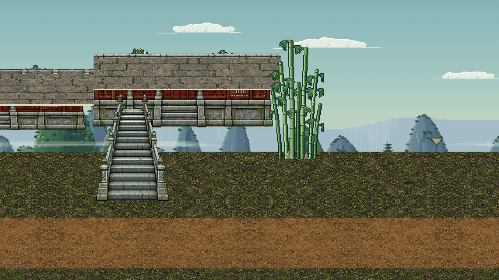
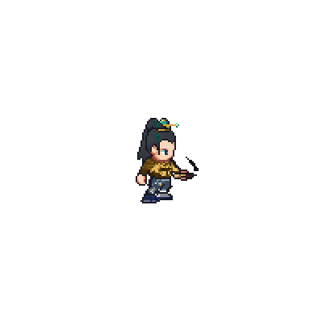

# The P3 mockup kit

`kit.css` turns the build's own UI into CSS so every P3 mockup is drawn in the fonts, colours, frames and layout that
will ship: the fonts in `art/fonts/`, the `UiKit` tokens (`scripts/ui/ui_kit.gd`), the HD nine-slice kit (`art/ui/hd/`,
`data/ui_assets_hd.json`), the HUD rings `scripts/hud.gd` draws, and the page frame of `scripts/ui/page.gd`. The kit
sheet `../src/00_kit.html` (rendered to `../00_kit.png`) shows every component and state. Mockups are approved as
drawn here, so a mockup should use only this kit, the game's art and its real data (conflicts C6 and C7 in
`docs/roadmap_master_ui.md`: serif words, pixel numbers from 20 px up, HD frames, pixel icons and sprites).

Contents: [making a page](#making-a-page) · [rendering](#rendering-and-the-review-loop) ·
[figures and world plates](#figures-and-world-plates) · [tokens](#colour-tokens) · [type](#type-scale) ·
[layout](#layout) · [the HUD](#the-hud-layout-from-01_hud_fight) · [components](#components) · [rules](#rules-the-mockups-follow) ·
[class list](#class-list)

---

## Making a page

Each mockup is `docs/mockups/src/<nn>_<name>.html`, 1280 × 720, linking the kit and the art by relative path. No
network, no scripts needed. Place everything absolutely in screen pixels (the game's own 1280 × 720 canvas).

```html
<!doctype html>
<html><head><meta charset="utf-8"><title>07 Techniques</title>
<link rel="stylesheet" href="../kit/kit.css">
<style> /* page-only styles; reuse kit classes first */ </style></head>
<body><div class="k-screen">
     <!-- the world behind the page -->
  <div class="dim-screen"></div>                                   <!-- page.gd dims it to 72% -->
  <div class="k-page">
    <div class="k-major-window"></div>
    <div class="k-page-title k-plaque"><span class="t-title">Techniques</span></div>
    <div class="k-page-close k-close"></div>
    <div class="k-page-tabs k-tabs"><div class="k-tab is-selected">Combat</div><div class="k-tab">Inner Arts</div></div>
    <div class="k-page-content has-tabs"> ... </div>              <!-- x 92..1188, y 172..664 -->
  </div>
</div></body></html>
```

Paths: from `src/`, the kit is `../kit/kit.css`, the game's art is `../../../art/...` (for example
`../../../art/icons/hud/bag.png`), and generated images are `../assets/...`.

## Rendering and the review loop

```
python3 tools/dev/render_mockups.py                  # every src/*.html -> docs/mockups/<name>.png
python3 tools/dev/render_mockups.py 07_techniques    # one page
python3 tools/dev/render_mockups.py --list           # which PNGs are missing or older than their source
```

It uses the headless Chromium shell when it is installed (full Chromium's headless mode keeps 87 px of the window for
an invisible toolbar, so its page would be 633 px tall; with `CHROME=<binary>` the script widens the window by that much
and crops). Every PNG is checked to be exactly 1280 × 720.

Review every PNG with the Read tool, and crop and enlarge the dense parts. Check: no text under 14 px; every tap target
at least 48 px on both sides; contrast on its background; nothing clipped, wrapped by accident or overlapping; frames
not smeared (a frame stretched below twice its margin shrinks its corners, which is right, but a plaque must keep its
height); pixel icons drawn at 1x or 2x only (a 32 px glyph at 48 px loses pixels unevenly).

## Figures and world plates

**Figures** are composed from the real layer sheets exactly as `scripts/avatar.gd` draws them, and creatures from their
sheets as `creature_sprite.gd` does. Every figure PNG is 384 × 384 with the feet at (192, 254), so `.k-fig` places
it by its feet:

```
python3 tools/dev/render_mockups.py figure docs/mockups/assets/fig_x.png --enemy general_kharn --action thrust_1 --frame 4 --facing -1
python3 tools/dev/render_mockups.py figure docs/mockups/assets/fig_x.png --companion lan_yue
python3 tools/dev/render_mockups.py figure docs/mockups/assets/fig_x.png --npc peddler_ning
python3 tools/dev/render_mockups.py figure docs/mockups/assets/fig_x.png --outfit '{"hair":"topknot","hat":"guan","shirt":"scholar","shirt_dye":"ochre","pants":"martial","pants_dye":"cloud","shoes":"folded","weapon":"brush"}' --action swing_1 --frame 3
python3 tools/dev/render_mockups.py creature docs/mockups/assets/fig_y.png reed_otter --action idle --frame 1
```

```html
<div class="k-shadow" style="left:472px;top:612px"></div>

```

Actions are the `parts.json` `_actions` (idle, walk, jump, meditate, attack, swing, swing_1–3, thrust_1–3, punch,
punch_1–3, bow); a weapon family's combo names its strike actions (`data/weapon_families.json`). Enemy outfits carry
their tint. Order figures by their feet (a larger `top` is drawn later, in front).

**World plates** are captures of a real room with the HUD, the labels and (optionally) the actors hidden, so figures and
labels can be placed where the design needs them. They come from a scratch copy of the game with capture switches; the
tools live in the shared scratchpad (`p3lead/`):

```
S=<the session scratchpad>/p3lead      # the brief names the scratchpad
python3 $S/prep_saves.py NAME CHECKPOINT [ROOM X Y] [nobrush]     # a copy of a valley_run checkpoint, moved, brush in hand
JR_HIDE_ACTORS=1 $S/cap.sh NAME PLATE --wait=0.3                   # -> $S/caps/PLATE-preview.png
JR_DUMP=1 $S/cap.sh NAME DUMP --wait=0.1; grep P3STATS $S/caps/DUMP.log   # the character's real numbers, and P3OUTFIT lines
```

`cap.sh` documents its switches (`JR_NO_HUD`, `JR_NO_LABELS`, `JR_HIDE_ACTORS`, `JR_PRESENCE`, `JR_DUMP`). Save a plate
into `docs/mockups/assets/plate_<room>.png` quantised to 256 colours (about 170 KB). The camera centres the player, so
set X to frame the part of the room you want. Plates made so far:

| Plate | Room | Checkpoint | Used by |
|---|---|---|---|
| `plate_kharns_pyre.png` | Kharn's Pyre, the Ashen Reach | ls6_end | 01 |
| `plate_harbor_market.png` | Harbor Market, Lanternfall Harbor (Peddler Ning at x 580) | ls5 | 02 |
| `plate_herb_terraces.png` | Herb Terraces, the Jade Sect | qu5 | 03 |
| `plate_elder_hu_peak.png` | Elder Hu's Peak (Elder Hu at x 760, the meditation circle at 650, 640) | ls4 | 04, 05 |

Checkpoints (Tester, the valley_run character; never the Max Tester) are named for the chapter section they open, and
the realm lags the name: `bf2 bf5 bf8 qk1 qk5 qu1 qu5 ht1 ht5 cs1 cs5 sa1 sa5 hg1 ae1`–`ae6 ae_end ls1`–`ls6 ls1_end`–`ls6_end`.
Checked so far: qk5 Qi Kindling 4; qu1 Qi Unfurling 1; qu5 Qi Unfurling 4 at its bottleneck (Lv 22); ht1 Qi Unfurling 9;
ht5 Heart Tempering 4 (Lv 31, 2,913 / 6,700); cs1 Heart Tempering 9; sa1 Cloud Stride 9; ae3 Sage 2; ls1 Sage
Sovereign 3; ls4 Will Manifest 3 (Lv 90); ls4_end and ls5 Sphere Lord 1 at its bottleneck (Lv 93, Stored Qi 5,633);
ls6_end Sphere Lord 3 (HP 29,431, Qi 13,312, Soul 4,945). Checkpoints are re-made when valley_run runs, so take numbers
from a `JR_DUMP` of the checkpoint you use.

## Colour tokens

CSS variables on `:root`. The first fifteen are `UiKit`'s, exactly.

| Token | Value | Use |
|---|---|---|
| `--ink` | #071015 | outlines, the darkest fill, text on paper |
| `--river-night` | #0a2027 | screen background, dark fills |
| `--deep-teal` | #0d3035 | panel fills, node fills |
| `--jade-shadow` | #15514f | Early band, low jade |
| `--jade` | #2c9e8f | progress fills, positive rims, Middle band |
| `--bright-jade` | #67d6bd | positive numbers, allies' HP, the "new" dot |
| `--bronze` | #9a6a35 | rules under headings, locks, Late band |
| `--gold` | #e5b84c | headings, bottleneck, elites, reached stops, Peak band |
| `--pale-gold` | #ffe6a1 | titles, primary button labels, selected tabs, the next stop |
| `--paper` | #e8e1cf | body text, the paper of dialogue and scrolls |
| `--mist` | #afc9d1 | secondary text, captions |
| `--red` | #e45858 | danger, the count badge, the ready seal, unmet hard requirements |
| `--qi` | #32bed1 | the Qi bar, Stored Qi |
| `--soul` | #9b78d1 | the Soul bar, Soul upkeep |
| `--hollow` | #87949a | disabled and locked text, the Hollowing meter |

Literals the HUD and pages use today, named so mockups agree: `--hp` #c2474f, `--bar-bg` #17242c, `--boss-bg` #3a1418,
`--hud-label` #d5bd85 (HP/QI/SL labels), `--ally` #8fd3ff (allied names), `--side` #8fc8ff (side quests in the tracker),
`--side-marker` #5aa7e8, `--blood` #b3202e, the ring rims `--ring-rim-*`, `--ring-lit-*`, `--ring-disc-*`, `--plate`
(nameplates) and `--dim` (the page's dim). Foe level colours (`UiKit.badge_color`): `--badge-grey`, `--badge-green`,
`--badge-white`, `--badge-orange`, `--badge-red`.

Roles (a proposal for P4's style guide; each names an existing token): `--c-text` paper, `--c-text-dim` mist,
`--c-heading` pale gold, `--c-accent` gold, `--c-positive` bright jade, `--c-negative` red, `--c-warning` orange
(#f0a040), `--c-disabled` hollow, `--c-seal` red.

Grades (`data/grades.json` `grade_colors`): `--g-plain` #b9b2a0, `--g-common` #e8e1cf, `--g-earth` #67d67a,
`--g-heaven` #6fb8f0, `--g-mystic` #b07ce8, `--g-spirit` #5ee0e8, `--g-sage` #d8c27a, `--g-sovereign` #e8a24c,
`--g-will` #f3e3a6, `--g-sphere` #8f7ae0. (`law`, `monarch` and `inner_heaven` are in the grade order but have no
colour yet: an open item for P4.) Qualities: `--q-flawed`, `--q-common`, `--q-fine`, `--q-superior`, `--q-perfect`,
`--q-relic`, and the pill qualities `--q-pill-grain`, `--q-pill-halo`, `--q-pill-soul`.

Stage bands (C3): `--band-early` jade shadow, `--band-middle` jade, `--band-late` bronze, `--band-peak` gold.

## Type scale

Sizes are final screen pixels. `UiKit` draws Cormorant Garamond Bold at 1.2× its layout size and only from 22 up;
everything else is Source Serif 4 at optical size 14 (semi-bold for words, bold for labels). Nothing is under 14 px.

| Class | Face | Size | Use |
|---|---|---|---|
| `.t-title` | Cormorant 700 | 41 (layout 34) | page titles on the plaque |
| `.t-display` | Cormorant 700 | 36 (layout 30) | a realm's name, a big caption |
| `.t-heading` / `.k-heading` | Cormorant 700 | 31 (layout 26) | section headings; `.k-heading` adds the bronze rule |
| `.t-subhead` | Cormorant 700 | 26 (layout 22) | the smallest Cormorant: group names, "Next: …" |
| `.t-xl` | Source Serif 600 | 22 | button labels |
| `.t-lg` | Source Serif 600 | 20 | page text |
| `.t-md` | Source Serif 600 | 18 | rows, HUD names, toasts |
| `.t-sm` | Source Serif 600 | 16 | HUD tracker and log, captions |
| `.t-xs` | Source Serif 600 | 14 | hints, sub-lines, tick labels (the minimum) |
| `.t-label` | Source Serif 700 | (with a size) | world labels, card titles, bar labels |
| `.t-fig` | Source Serif 700, lining tabular figures | (with a size) | every number under 20 px: bar values, counts, cooldowns |
| `.t-num` / `.t-num-lg` | Pixelify Sans | 20 / 26 | numbers of 20 px and up only; damage numbers use `.k-dmg` |
| `.t-sym` | JadeRiverSymbols | — | ✓ ➤ ◆ ▲ ▼ ★ and other marks the word fonts lack |

Colours: `.c-ink .c-paper .c-mist .c-gold .c-pale .c-jade .c-red .c-qi .c-soul .c-hollow .c-bronze .c-ally .c-side
.c-orange .c-green`. Every text class carries `UiKit.draw_text`'s two-step shadow; `.no-shadow` removes it (text on
paper has none). `.t-outline` is `UiKit.draw_outlined`: the ink outline for text over the painted world.

The numeral rule (review G2, `UiKit.PIXEL_NUMERALS_MIN = 20` in the build since commit 7b3d40d): Pixelify's 5 reads as
S and its 2 as Z at bar size, so numbers under 20 px use `.t-fig`. The kit sheet shows the before and after.

## Layout

- **Screen**: 1280 × 720. `.k-screen` is the root. `Page.SAFE` is (48, 24, 1184, 672): keep text and controls inside it.
- **Grid**: positions and sizes on multiples of 8 where the art allows (P4's rule); 4 inside dense components.
- **Touch**: every control at least 48 × 48 (`--touch`). The build gives small art a 48 px hit margin
  (`Page.MIN_TAP`), but mockups should draw controls at 48 px or more so the approved look is the shipped one.
- **A page** (`.k-page`): the frame is (64, 32, 1152, 656); the plaque 440 × 60 at (420, 42); the close button at
  (1146, 46); tabs from (96, 116), 48 px tall, 6 px apart, at least 118 px wide; the content rect is (92, 116) to
  (1188, 664), or from y 172 with tabs. Split content into panels (`.k-minor-panel`) with 16–20 px gutters.
- **A modal** (`.k-modal`): 700 × 380 at (290, 170), on a 55% dim.
- **The world behind a page**: a plate and `.dim-screen`.

## The HUD layout (from 01_hud_fight)

The HUD keeps v2 S24's zones (`scripts/hud.gd:25-42`) and fixes density. System pages drawn later over the play screen
should assume these positions (right-handed; the left-handed option mirrors x).

| Element | Position (centre) | Size | Notes |
|---|---|---|---|
| Portrait panel | (16, 16, 360, 120) | minor panel | name 18, realm 16, HP/QI/SL bars 222 px at x 138 |
| Party chips | (408 / 468 / 528, 44) | 48 | the active animal and the companions, HP arcs, names 14 px under |
| Statuses | from (20, 144) | 24 icons | the Hollowing meter sits here when it shows |
| Quest tracker | (14, 188, 342) | — | hidden in boss arenas; auto-path button 48 × 48 |
| Boss bar | (400, 130, 480, 18) | — | name above; notches at each phase; the next notch's effect under it |
| Minimap | (1032, 16, 232, 140) | frame | P1 direction chevron on the frame's edge |
| Icon row | Menu 1058, Bag 1116, Map 1174, Mail 1232 at y 188 | 52 | a seal on Menu when any hub entry has one |
| Currency pill | (1040, 222, 222) | 34 | rests in boss arenas |
| Attack / context | (1165, 605) | 132 | the context verb and target under it at y 678 |
| Ring 1 (R 132 round the attack) | jump 150° (1051, 671), techniques 180° (1033, 605), 210° (1051, 539), 240° (1099, 491), 270° (1165, 473), dodge 300° (1231, 491) | 64 / 52 | techniques only while a foe is near; at rest they fold into four beads on the attack ring |
| Ring 2 (R 214) | fan 160° (964, 678), a held toggle 182° (951, 612), healing 204° (970, 518), treasure 226° (1016, 451) | 52 | an empty slot is not drawn |
| Technique page tab | (1240, 672) | 48 | "1/2" |
| The fan, open | five toggles at R 150 from the fan: 180° (814, 678), 202° (825, 622), 224° (856, 574), 246° (903, 541), 268° (959, 528) | 52 | captions 14 px; a paper fan behind |
| Progress edge | (0, 712, 1280, 8) | — | stops at each level (33%, 66% in three-level stages); gold with a glow at the bottleneck; Stored Qi as a bright lane |

The cluster occupies x ≥ 925 and y ≥ 425 on the right; the lower middle (x 380–900) stays open for the fight.

## Components

Each snippet is the minimum; add `abs` and a `style="left:..;top:..;width:.."` to place it.

**Frames** (HD nine-slices; the element's box is the frame's rect, padding is the content inset):
```html
<div class="k-major-window abs" style="left:290px;top:170px;width:700px;height:380px"></div>
<div class="k-minor-panel abs" style="...;width:360px;height:120px">…</div>
<div class="k-tooltip abs" style="...">…</div>
<div class="k-toast abs" style="...;width:388px;height:62px"><div class="t-md c-pale">Formation Guild opened</div><div class="t-sm">…</div></div>
<div class="k-dialogue abs" style="...">text in ink</div>          <!-- paper; no text shadow inside -->
<div class="k-portrait abs" style="...;width:88px;height:88px"></div>
<div class="k-minimap abs" style="...;width:232px;height:140px"><div class="k-minimap-title">Harbor Market</div>…</div>
<div class="k-realm-badge abs t-sm c-pale">Sphere Lord 3</div>
<div class="k-plaque abs" style="--h:60px;width:440px"><span class="t-title">Menu</span></div>   <!-- scales with --h -->
<div class="k-close abs"></div>  <div class="k-close is-pressed abs"></div>
```

**Slots** (P4b, `Page.SLOT`): 76 px with the icon at 1:1 in a 6 px inset (64 px: an HD icon, or a legacy icon's 32 art
px at 2x); `.is-small` is `Page.SLOT_SMALL`, 44 px with a 32 px icon, for items named in a list row. States: `normal`,
`.is-selected` (add `.k-slot-glow` inside), `.is-disabled`, `.is-empty` (the cloud-seal motif at 35%, never a blank
hole). A quality rim is `.k-qrim` with `--q`:
```html
<div class="k-slot abs"><span class="k-count t-fig t-sm t-outline">38</span></div>
<div class="k-slot is-selected abs"><div class="k-slot-glow"></div></div>
<div class="k-slot abs"><div class="k-qrim" style="--q:var(--q-superior)"></div></div>
<div class="k-slot is-empty abs"></div>
<div class="k-slot is-small abs"></div>
```

**Buttons**: `.k-btn` (primary) and `.k-btn2` (secondary), each `normal`, `.is-pressed`, `.is-disabled`; at least 48 px
tall. A disabled button that explains itself on tap carries the lock:
```html
<div class="k-btn abs" style="width:176px;height:52px">Meditate</div>
<div class="k-btn is-disabled abs" style="width:188px;height:52px">Break Through<span class="k-lock-mini"></span></div>
```

**Tabs**: `.k-tabs` > `.k-tab` (`.is-selected`, `.is-locked` with `.k-lock-mini`), 48 px tall.

**Bars**: `.k-bar` is the kit shell with a trough; set `--v` (0–1), a colour class (`.is-jade .is-gold .is-qi .is-soul
.is-hp .is-red .is-bronze`), and reward stops as `.k-tick` at `--at` (`.is-done`, `.is-next`). Name the next reward at
the bar's end or under the next tick (`.k-tick-label`). A second lane (`.k-fill2`, `--v2`) draws Stored Qi or a
preview.
```html
<div class="k-bar is-jade abs" style="width:400px;--v:0.882">
  <div class="k-trough"><div class="k-fill"></div></div>
  <div class="k-tick is-done" style="--at:0.8333"></div><div class="k-tick is-next" style="--at:1"></div>
  <div class="k-bar-text t-fig t-outline c-paper">Adaptation · 7,026 / 12,000</div>
</div>
<div class="k-tick-label is-next" style="left:…;top:…">Original Application</div>
```
`.k-hudbar` is the HUD's thin bar (`.is-qi`, `.is-soul`, `.is-gold`, or `--fill`), with `.k-v` for its value and
`.k-tick` stops.

**HUD rings**: `.k-hud` + a size (`.k-hud-lg` 132, `.k-hud-md` 64, `.k-hud-sm` 52, `.k-hud-xs` 48) + a state
(`.is-pressed`, `.is-active`, `.is-dim`), placed by centre. Inside: a glyph (`.ic`), a cooldown sweep (`.k-cd` with
`--cd`, and `.k-cd-num`), a rim arc (`.k-arc` with `--arc`, `--arc-c`), a corner count (`.k-corner`). Captions:
`.k-hud-cap`.
```html
<div class="k-hud k-hud-lg is-active" style="left:1165px;top:605px"></div>
<div class="k-hud k-hud-md" style="left:1033px;top:605px"><div class="k-cd" style="--cd:.6"></div><span class="k-cd-num t-fig t-outline c-paper">3</span></div>
<div class="k-hud k-hud-sm is-active" style="…"><div class="k-arc" style="--arc:.79;--arc-c:var(--soul)"></div><span class="k-corner t-fig">5</span></div>
```

**Party chips**: `.k-party` (48 px, by centre) with `.k-party-art` clipping a figure or creature image, a `.k-arc` HP
ring, and `.k-party-name` under it.

**Currency**: `.k-pill` > `.ic` + `.v`.

**Badges** (three kinds, never mixed up): `.k-badge` a red count (unread letters, items waiting); `.k-seal` the
vermilion ready seal (something to claim or do now: a bottleneck reached, chests to open); `.k-new` a jade dot (new
since last looked: a candidate disciple, a new recipe). Locks: `.k-lock-mini` (the bronze padlock `page.gd` draws),
the `lock` HUD glyph, and `.k-locked` to grey a whole element.

**World labels**: `.k-nameplate` (`.n` name, `.s` title; NPCs carry it under their feet, as `npc_view.gd` does);
`.k-foe` (level and name; `.is-elite` gold with `.k-crown`; `.is-ally`); `.k-leader` for a lifted label's leader;
`.k-dmg` (`.is-crit`, `.is-qi`) for damage numbers; `.k-shadow` under a figure; `.k-fig` for a figure.

**Rows and facts**: `.k-row` (48 px min, `.is-selected`), `.k-kv` (a two-column fact grid), `.k-divider`, `.k-req`
(`.is-met` ✓ jade, `.is-hard` red, `.is-soft` orange) with a `.dot` and the text.

**Progress words**: `.k-band` (`.is-early .is-middle .is-late .is-peak`) for the four stage words (C3), and `.k-unlock`
for what the next stage opens (E5), with its icon.

**Themed surfaces**: `.k-paper` (a paper panel, ink text), `.k-scroll` (adds dark rollers left and right),
`.k-ink-wash` (a soft jade wash behind a diagram), `.k-plate` (a world plate), `.dim-screen`.

**Icons**: ``. Sizes `.ic-16 … .ic-128`; `.is-dim`,
`.is-grey`, `.is-gold` (the HUD's gold modulate). Draw an icon only at a whole-number scale of its art, as the game
does (`SpriteCache.draw_icon`): a legacy item, technique or equipment PNG (64 px) holds 32 art px, so draw it at 32 or
64; a legacy HUD glyph (32 px) holds 16, so 32, 48 or 64; a status icon (24 px) holds 12, so 24 in the HUD. An HD icon
is 1:1 at 64 and has native `<id>@48.png` (techniques, the HUD technique ring) and `<id>@32.png` (the item rings, small
slots) renders; a legacy technique shows at 64 in the technique ring (2x), never at 48.

**Utilities**: `.abs` (absolute; wins over component positions), `.flex`, `.col`, `.center`, `.nowrap`,
`.k-note` and `.k-swatch` (kit sheet only).

## Rules the mockups follow

1. Real content only: realm names, techniques, items, NPCs, rooms and numbers from `data/` and a checkpoint of the
   valley_run character. Say which checkpoint in `docs/mockups/README.md`.
2. Numbers under 20 px in `.t-fig`; Pixelify from 20 px up; shorten 10,000 and above over the world ("18.2K").
3. An empty slot is not drawn on the HUD; on a page it shows the cloud-seal motif.
4. A world label is never under a HUD control; labels that would overlap sit in rows; party members show only an HP
   line in a fight and nothing out of it (review G4).
5. Locked things stay visible, dimmed, with the padlock and one line saying what opens them.
6. Long bars carry their reward stops and name the next one (E4); a stage names what the next one opens (E5); the four
   stage words show as bands of the nine sub-levels (1–3 Early, 4–6 Middle, 7–8 Late, 9 Peak; C3). Realms with three
   stages (Heaven Glimpse to Monarch) show their three stages without the four words.
7. Badges mean one thing each (count, ready, new), and a ready seal inside the hub lights the Menu button.
8. Annotations are not drawn on a mockup, except a moment's timing strip (05), which is labelled as a note.

## Class list

`abs flex col center nowrap dim-screen k-screen k-plate` ·
`t-title t-display t-heading t-subhead t-xl t-lg t-md t-sm t-xs t-label t-fig t-num t-num-lg t-sym t-outline shadow
no-shadow k-heading` · `c-ink c-paper c-mist c-gold c-pale c-jade c-red c-qi c-soul c-hollow c-bronze c-ally c-side
c-orange c-green` ·
`k-major-window k-minor-panel k-tooltip k-toast k-dialogue k-portrait k-minimap k-minimap-title k-realm-badge k-plaque
k-close k-bar-shell` · `k-page k-page-title k-page-close k-page-tabs k-page-content has-tabs k-modal` ·
`k-slot k-slot-glow k-count k-qrim` · `k-btn k-btn2` · `k-tabs k-tab` ·
`k-bar k-trough k-fill k-fill2 k-bar-text k-tick k-tick-label k-hudbar k-v` ·
`k-hud k-hud-lg k-hud-md k-hud-sm k-hud-xs k-cd k-cd-num k-arc k-corner k-hud-cap` ·
`k-party k-party-art k-party-name` · `k-pill` · `k-badge k-seal k-new k-locked k-lock-mini` ·
`k-nameplate k-foe k-crown k-leader k-fig k-shadow k-dmg` · `k-row k-kv k-divider k-req k-unlock k-band` ·
`k-paper k-scroll k-ink-wash` · `ic ic-16 ic-24 ic-28 ic-32 ic-40 ic-48 ic-56 ic-64 ic-96 ic-128` · `k-note k-swatch`.
States: `is-selected is-disabled is-empty is-pressed is-active is-dim is-locked is-done is-next is-met is-hard is-soft
is-elite is-ally is-crit is-qi is-soul is-hp is-jade is-gold is-red is-bronze is-early is-middle is-late is-peak
is-flip is-grey`.

## Added by 07 (system pages A): the 76 px page slot

The icon study's decision (`../icon_study/README.md`): a page slot is 76 px and holds its 64 px icon at 1:1.
`.k-slot76` sizes a `.k-slot` to 76, insets its icon 6 px (the frame's 8 px border shows round it) and, empty, draws
Style A's 64 px cloud seal at 35%. The system-page mockups 06–12 use it for every slot on a page (bag, worn gear,
technique loadout, pet gear); the HUD keeps its rings. Today's item icons are 32 px art doubled to 64, so 64 is their 2x
and 32 their 1x: draw them at one of the two (the kit's 64 px slot draws them at 52, review I2).

```html
<div class="k-slot k-slot76"><div class="k-qrim" style="--q:var(--g-common)"></div><span class="k-count t-fig t-outline c-paper">4</span></div>
<div class="k-slot k-slot76 is-empty"></div>
```
