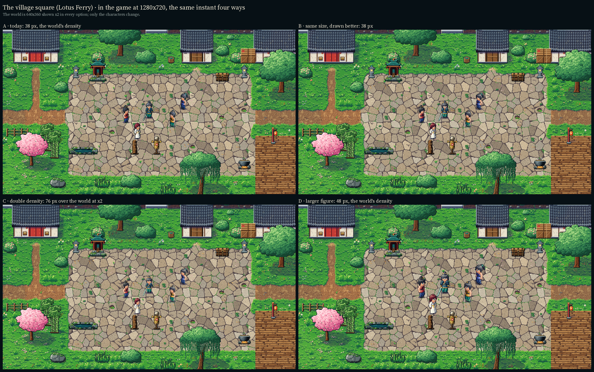
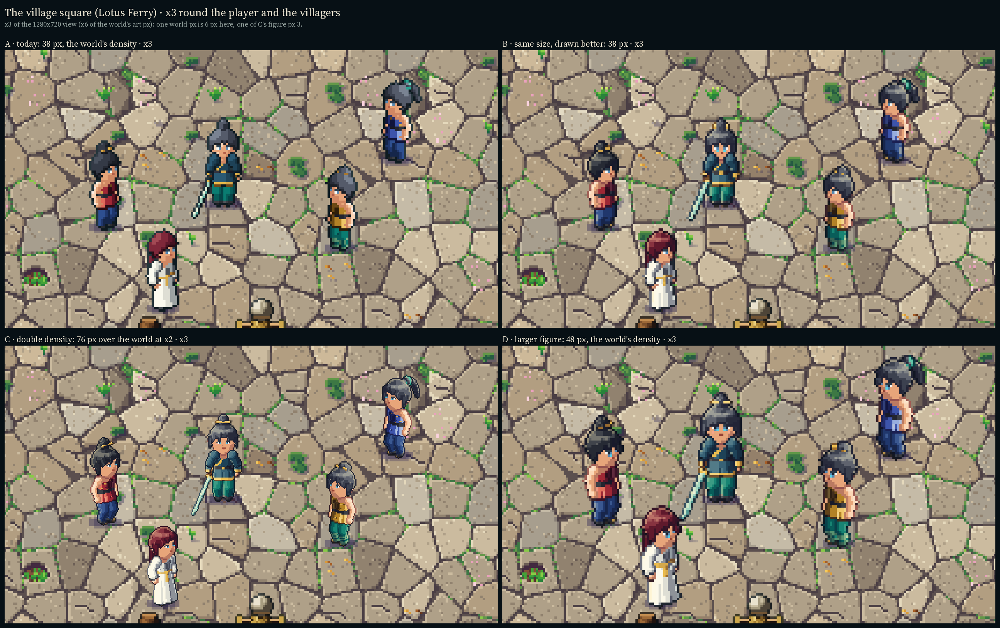
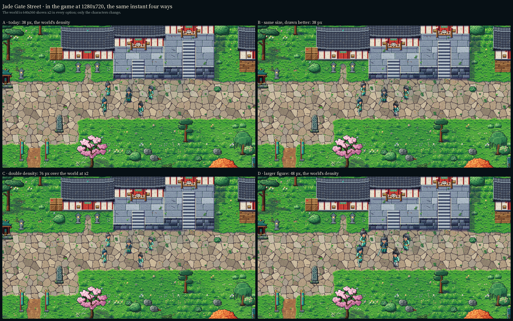
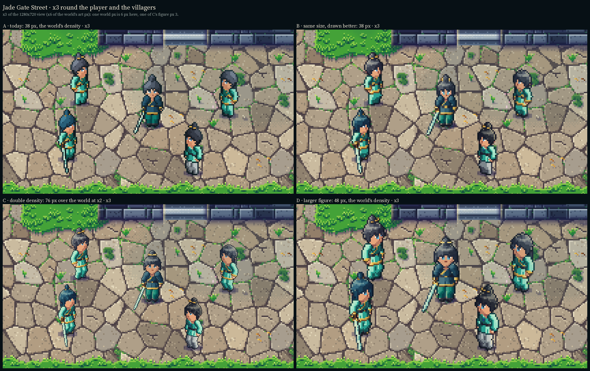
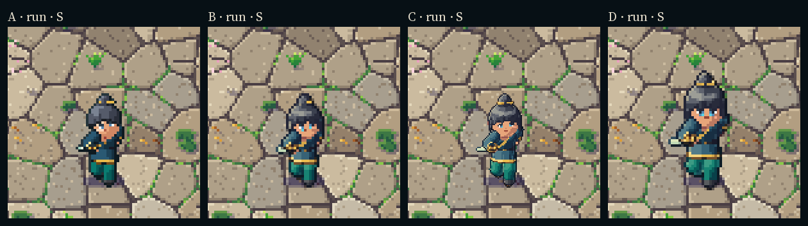
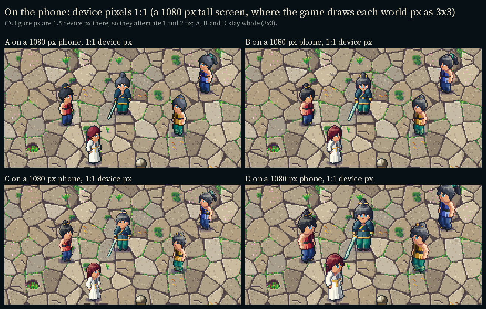
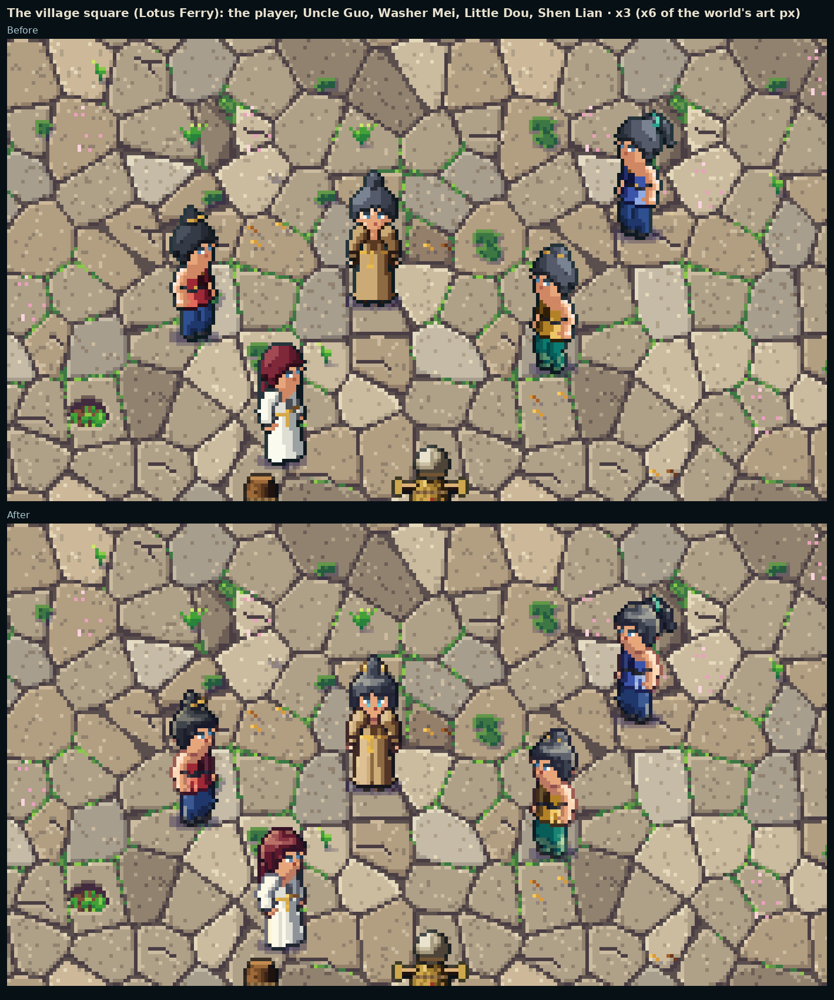
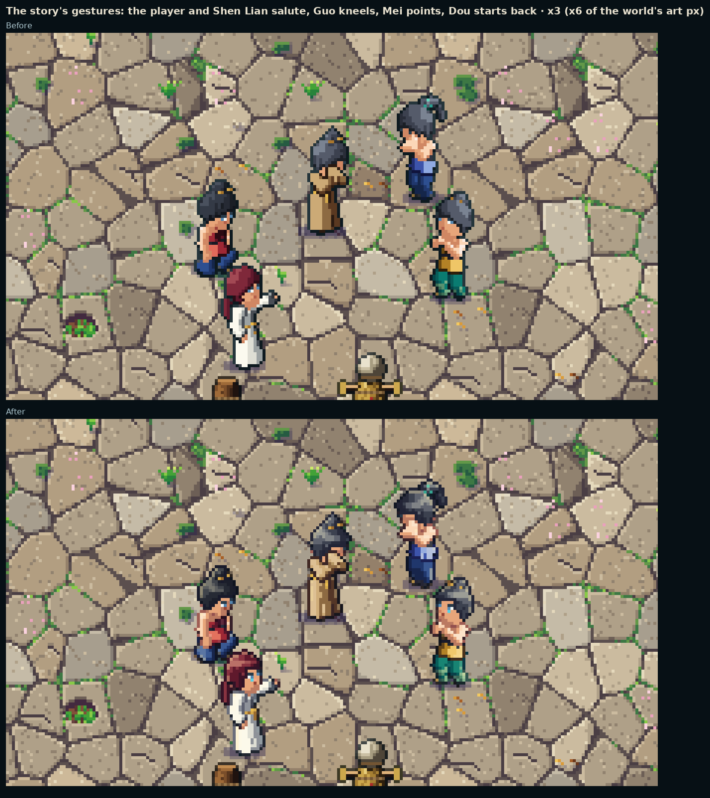
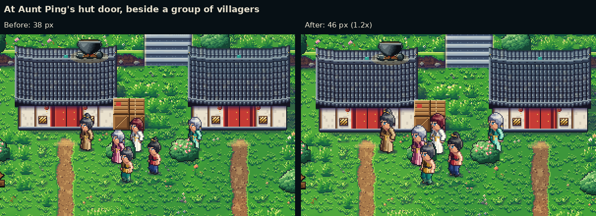

# Character quality · a study for decision 42

The user played the prototype APK (build 108) and asked: **"I want the player and the NPCs to be drawn in higher
quality."** (`docs/roadmap_master_ui.md`, decision 42). Before redrawing anything, this study shows the choice in
pictures. Nothing in the game changed. The study lives in its own files (`tools/art/topdown/study_quality/`), and the
shots were taken in the game with its own compositor.

## The options

| | What it is | Figure | Grid |
|---|---|---|---|
| **A** | Today's figure: the game's sheets, untouched | 38 art px, sole to crown | the world's (640×360, shown ×2) |
| **B** | Same size, drawn better: a new rasteriser and hand-tuned detail on the same doll, poses and colours | 38 px | the world's |
| **C** | Double density: the same drawing at twice the pixels, over the world still shown ×2 | 76 figure px (38 art px tall on screen) | 1280×720 |
| **D** | A larger figure at the world's density: B's drawing at 1.25× the size | 48 px | the world's |

All four stand at the same instant in the same scene. The game was paused, so each option is dressed onto the same
frame of the same room, light and clouds. B, C and D are drawn for a subset:

- the player's outfit: the Daoist knot, the disciple tunic, silk trousers, cloth shoes and the jian;
- the actions idle, walk, run and the jian's rising cut (`swing_1`), in S and SE (SW mirrors SE);
- eight villagers in their own outfits, idle.

The villagers wear five of the six hair styles, four of the five shirts, all five trousers and all three shoes, in
their own dyes and hair colours.

## The pictures

**The village square** (Lotus Ferry): the player, Uncle Guo, Washer Mei, Little Dou and Shen Lian.





**Jade Gate Street:** the player, Deacon Rui, Disciple Yue, Steward Wei and Disciple Hao.





**The run and the rising cut**, in the game, S and SE. Decision 42 makes sprinting the default, so the run is the
figure seen most.

- Animated at 14 fps: `character_quality/03_run_attack_s.gif`, `character_quality/03_run_attack_se.gif`.
- Laid out frame by frame at ×2: `character_quality/03_run_attack_strip_s.png`, `character_quality/03_run_attack_strip_se.png`.



**On the phone.** The game's canvas is 1280×720, stretched to the screen (`canvas_items`, aspect kept). On a phone
1080 px tall it is scaled ×1.5, so every world art px becomes 3×3 device px. The last board shows each option at that
scale, one device px to one image px.



## What each option does

### B · same size, drawn better (`hifi.py`, `looks.py`)

The doll, its poses, its generators and its colours are the game's own (`tools/art/topdown/figure/`). What changes is
how the doll becomes pixels:

- **Coverage.** Each pixel is cast at 4×4 samples, not one.
  - The pixel takes the material most of its samples hit. Thin trim, pins and the blade count extra, so gold collars,
    belts and blades hold an unbroken line.
  - Tone edges follow the mean light over the pixel, not the noise of pixel centres.
- **Seven-step ramps.** Each ramp gains a core shadow and a bright step. Its dark end leans toward the §14 shadow
  (`#241F4F`) and its light end toward the §14 sun (`#FFE9A6`), so forms turn in hue as well as value. The faces are
  lit nearly flat, since a shadowed cheek reads as a smudge at this size.
- **Light.**
  - A warm rim where a form's edge turns to the sun.
  - A cool bounce on shaded edges that face the floor.
  - A contact shade under each nearer part, and beside it: an arm against the trunk, one leg against the other.
- **Selective outlines.**
  - Outer edges are a dark tint of the material they bound, never flat ink, and a step lighter on the sunlit
    upper-left.
  - Where a part overlaps the body, the inner line is the part's own core shadow, lighter than the outer line.
  - Stair-steps are anti-aliased with half-alpha corner pixels, a few percent of a figure's pixels. There is no
    blur.
- **Faces.** The eyes are 2 px wide and 3 px tall: a lash line, the white and the iris, and the iris's lower light. The
  face also has a 1 px mouth, a nose shade in three-quarter view and a touch of blush.
- **Hair.**
  - Locks at the temples and forelocks break the helmet-like cap and frame the face.
  - Broad locks with a groove and a lit ridge.
  - A sheen ring broken lock by lock on the sunlit side.
  - A darker crown.
- **Cloth.**
  - Folds hang from the belt and widen to the hem.
  - Gathers over the belt, and creases at the elbow and behind the knee.
  - A zigzag over the ankle wraps.
  - A lit ridge beside each groove.

This is Alabaster Dawn's approach (`docs/research/alabaster_dawn_2_5d.md` §2.9): everything on the 640×360 grid,
small but crisp and rich. It is also this pipeline's ceiling at 38 px. A face is still about 12 px across, so the gain
is in hair, eyes, light and edges, not in finer detail. A hand clean-up of key frames would go further, but it is
outside what the generator can do.

### C · double density

C is the same renderer at 1.84 px a unit, with glyphs drawn for 76 px:

- 4×3 eyes with a pupil and a glint, brows, a nose, a two-row mouth and blush;
- the hair's locks and sheen and the cloth's folds resolve at twice the detail.

In the game, the world viewport renders at 1280×720 with the camera at zoom 2, so the tiles look exactly as today. The
compositor draws the figure's layers at half scale, one figure px to one screen px. That drawing is TopdownFigure's own
code at another scale (`study_figure.gd`). This is how C would really be built.

C is the finest in the stills and close-ups. It also shows the mixed pixel scales: a figure's 1 px lines stand beside
the world's 2 px lines, and next to props, foes and effects that stay coarse.

### D · a larger figure at the world's density

D is B's renderer at 1.15 px a unit (48 px, 1.25×), with 3×3 eyes. It has no mixed scales. It trades the
character-to-world scale for readable faces: a body is 3 tiles tall instead of 2.4, against doors 24–28 px tall.

## Costs

The measurements come from `stats.py`: the player's outfit over the study's 52 frames, against today's pipeline on
the same frames.

| | A | B | C | D |
|---|---|---|---|---|
| Texels packed (vs A) | 1.00 | 1.06 | 3.58 | 1.55 |
| Build time a frame (vs A) | 1 | ~10 | ~25 | ~14 |
| The player's outfit in memory (RGBA8, lossless as imported) | 5.2 MB | ~5.5 MB | ~19 MB | ~8 MB |
| The nine people of the two scenes (26 sheets) | 19 MB | ~20 MB | ~69 MB | ~30 MB |
| Draw calls a figure | one a layer | same | same | same |
| World render target | 640×360 | 640×360 | **1280×720** | 640×360 |

### Rolling out over the full set

The full set is the body, 6 hair styles in 6 colours, the garments in every dye, hats, capes, 11 weapon looks, 34
actions and 5 facings: 864 frames an item. Today a full build takes about 4 minutes a pass.

- **B.**
  - The work:
    - Move the rasteriser, the material table and the faces into `figure/`, in place of `raster.shade`, `outline`,
      `colourize` and `body.face`.
    - Keep the generators, sets, actions and index schema. The catalogue's signature does not change (same frames,
      canvas and anchor), so the game's code does not change at all: new sheets and rects only.
    - Tune per set: the hair locks (every style has its locks set in the study; five are drawn), the folds of each
      garment, the material table for hats, capes and the 11 weapon families, and the face in all 5 facings (shut
      eyes in hurt and knock-down, the side glyphs in E and NE).
  - Then review every action, facing and dye (AGENTS.md rules 1–3).
  - About three batches the size of one set batch each: the renderer and body, then hair and garments, then weapons
    and review.
  - A full build takes about 40 minutes a pass (80 with `--check`), about 20 split over four cores.
- **C.**
  - Everything in B, redone at 76 px: the glyphs and tuning in every facing.
  - Engine work:
    - TopdownFigure draws at 1/density, with a density in the index.
    - TopdownWorld renders the world at 1280×720, or splits the floor (640×360) from the sorted layer (1280×720).
    - Bounds, labels, the silhouette and the effects' anchors follow.
  - For consistency, the foes (`art/topdown/foes.png`), companions and creatures and the ground-plane effects would
    need 2× versions too. That is their own pipelines' work, several batches.
  - A full build takes about 100 minutes a pass.
  - Roughly two to three times B's cost.
- **D.**
  - Everything in B at 48 px.
  - The canvas and anchor change, so every set is rebuilt; that happens in B anyway.
  - The game follows the bigger body: label heights (`figure_top`), the silhouette's rects, the camera's framing, and
    any rules tied to drawn size.
  - A design pass: doors, levels, props and foes against a 3-tile body.
  - A full build takes about 55 minutes a pass.
  - B's cost plus a scale review.

### At runtime (phone)

- **A and B** cost the same: the same draw calls, the same texture sizes within 6%, the same fill.
- **D** holds 1.55× the texture memory. It covers 1.56× the screen per figure, which is small next to the world.
- **C** holds 3.6× the texture memory: about 70 MB for the nine people above, against 19 MB today. The larger cost is
  the world viewport at 1280×720: four times the pixels for every floor chunk, face, prop, shadow, cloud, particle,
  the night and glow layers, and the grade's full-screen pass that reads the screen. That is about four times the
  world's GPU fill each frame, the heaviest single cost on a phone. An engine split (floor at 640×360, the sorted
  layer at 1280×720) would win back most of it, at the price of more engine work.

## Risks

| | Mixels | Readability on a phone | The pipeline's generators |
|---|---|---|---|
| **B** | None | A figure is ~7 mm tall on a 6.5" 1080p phone (114 device px) and a face ~2 mm. B wins where that size shows: silhouettes, hair shapes, eyes, light. The finer rules (folds, sheen) mostly read as richness | Unchanged; only the rasteriser and the per-set tuning change. The hand rules must hold through every action (fast poses, the N facing) |
| **C** | Yes: 1 px figure lines against the world's 2 px lines, props, foes and effects | On a 1080p phone a figure px is 1.5 device px, so pixels alternate 1 and 2 device px (see the phone board). At arm's length that is at the eye's limit (~1 arcminute), so the detail reads as smoothness more than shapes. The thinner outline pops less at 7 mm | Resolution-independent, so they scale. Every glyph and tuned detail is redone at 2×, and the other character art must follow |
| **D** | None | The best of the four: faces 25% larger, eyes 3×3 | Unchanged. The risk is the world's scale: a 3-tile body against 24–28 px doors and 16 px levels, and foes and props that look smaller |

## Recommendation

**B, as the new baseline for every character, now.**

- It answers the complaint where the phone shows it: hair that reads as hair, clear eyes, light that turns the
  forms, tinted outlines.
- It costs nothing at runtime.
- It changes no game code.
- Any of the other options needs this same rasteriser anyway.

**If the people should read bigger** once B is on the phone, take D's size (1.15–1.25×, B's renderer). It is the
cleanest way to more face, with one pixel grid, but it is a world-scale decision to play-test first.

**Not C.** It is the finest still image, but most of its detail falls below what a phone at arm's length resolves:
its figure pixels land on 1.5 device pixels at 1080p. It mixes pixel scales with the foes, props and effects. And it
costs about four times the world's fill and 3.6× the character memory, and pulls the foe and effect art into a 2×
redraw.

## The choice, rolled out (B)

The user chose **B**. It is now the game's character pipeline (`tools/art/topdown/figure/raster.py`, `render.py`; the
art bible's §13 has the rules): every layer set, all 864 frames of every action in the five drawn facings, every hair
colour and dye, and the villagers with them. Moving it from the study to the pipeline:

- The rasteriser, the materials' table and the faces moved into `figure/`; the hair's locks and sheen into
  `kinds/hair.py` (each style's lock count and loose locks in `sets/hair.py` `TUNE`); the cloth folds into
  `kinds/folds.py`.
- What the full set needed beyond the study's subset:
  - a `line` coverage rule, so a part about a pixel wide (a spear's shaft, the bow's limbs and string, the flute, a
    ripple, the brush's stroke of ink seen edge on) stays one unbroken pixel wide;
  - hair and a band hat leave the eyes clear in every pose (a nod, a hurt, meditation), a row higher over shut eyes.
    Before, a fringe or a nod hid the eyes in 2,818 of 9,702 hair, hat, action and facing cases; now in 21, all lying
    face down in a knock-down;
  - the guan's jade outvotes its gold rim; bare steel and a trailing cape keep a faint rim, so they keep their colour.
- The same frames, rects and draw calls. The sheets hold 1.05 times the texels (140 MB of RGBA8 for all 168 sheets,
  from 134). A full build takes about 2.5 minutes on four cores (`build_character.py --jobs`).

**In the game, before and after** (`tools/dev/topdown_capture.tscn -- --quality --quality-tag=<before|after>`, paired
by `tools/art/topdown/study_quality/rollout.py`): the village square, Jade Gate Street, a fight with the jian, and the
story's gestures, in `character_quality/rollout/`.





## As built: the people 1.2 times bigger (decision 43)

After build 109 the user asked: "I think the player should look a little bigger." That is D's direction at a little
less than D's size: B's renderer at 1.104 px a unit (1.2 times, from 0.92), so the people are about 46 art px from sole
to crown (48 with a top knot), all on the world's one pixel grid. Every pixel is cast at that density: nothing is
scaled at runtime.

- **The pipeline** (`figure/geom.py` `WORLD_SCALE`): every layer set, all 864 frames in the five drawn facings, every
  hair colour and dye, rebuilt; the same doll, poses, weapons in the hands and outfits. The working canvas grows to
  136 x 124 (the feet at 68, 84). The face has more room: an eye is 3 px wide and 3 tall (a lash row, the white, the
  pupil and the iris, the iris and its lower light), the mouth 2 px; the hair's and hats' eye box follows the glyphs.
- **The technique pictures keep the approved 38 px figure.** The tree's cards, the reading, the HUD's buttons and the
  loadout bar were framed for it (a card from the head to the ankles at x2, a button the whole figure at x1 in 42 to
  50 px), and a 46 px figure fits neither. So the 105 poses a picture draws are cast again at `PICTURE_SCALE` (0.92)
  with decision 42's face, listed in the index's `pictures` (`build_character.py` `pictures()`, mirroring
  `TechniquePicture.top_pose`); `TopdownFigure.frame_of`, `draw` and `bounds` take `picture`. The HUD's companion chip
  draws its head from the same frames.
- **The pages** that stand the character large (the Character page, the Bag, a shop's merchant) draw it at x5, as tall
  as the 38 px figure was at x6, with more detail. The smaller dolls (the dialogue's portrait, the Cultivation page's
  seated figure, the Techniques page's caster) keep their scales and read a little larger.
- **What is sized against a person** follows the art bible's §13 scale rule (the foot box, the player's body for a blow,
  the talk reach, the marks and balloons over a head, the shadows, the camera's framing, the FX's hand height). The
  paces, the jumps, the tops, a blow's reach and the doors and ways stay.
- **Cost.** The same draw calls. 207 MB of RGBA8 for all 168 sheets (from 139; 512 px wide, the tallest 1,446 px), the
  player's outfit 8.1 MB (from 5.4), the pictures' frames about a tenth of it. A full build takes about 6 minutes on two
  cores.

Before and after, the same instants in the game, in `people_scale/` (the pairs `*_pair.png`, the
shots `before/` and `after/`; `tools/dev/topdown_capture.tscn -- --people-scale --people-tag=<before|after>`, and the
pictures and pages with `tools/dev/picture_capture.tscn -- --tag=<before|after> --dir=people_scale [--pages]`).



## Reproduce

The study's code is kept as it was drawn. The pipeline's generators now carry B's locks and folds, so the study's
pictures are reproduced from the commit before the rollout (`89db822`).

```sh
python3 tools/art/topdown/study_quality/build_study.py B C D   # sheets into study_quality/build/ (ignored by git and Godot)
xvfb-run -a -s "-screen 0 1280x720x24" godot --rendering-driver opengl3 --path . \
    res://tools/art/topdown/study_quality/study_capture.tscn    # the shots, in the game
python3 tools/art/topdown/study_quality/compose.py             # the boards, strips and GIFs here
python3 tools/art/topdown/study_quality/stats.py               # the cost figures
```

- The capture sets the study's index as TopdownFigure's manifest and puts the study's sheets into Wardrobe's texture
  cache for the shots.
- It then restores the game's own manifest.
- No shipped art, data or code path is read for output or written.
