# The prototype's QA playthrough (decision 41)

Decision 41 makes the top-down game the one a new player gets. This is a playthrough of that game as a new player
would play it:

- from the title, a new game and the character creator;
- the opening, the whole tutorial, the fair and the sect choice (one run per sect);
- chapter 2's rooms, and on to the end-of-prototype gate.

It was played on a 1280×720 screen with the HUD's own touch controls: the stick, Attack, the rings, the Bag and the
pages.

- **The player.** `tools/dev/prototype_qa.tscn` plays through the game's input path. Its touches go in through
  `Input.parse_input_event`, as a finger's do, and every page, button, prompt and way is taken by a tap. It takes a
  screenshot at every step. Each shot's note records the tracker and any world label still under a HUD control.
- **The runs.** Each sect was played from the fair's checkpoint. The findings were looked at shot by shot, fixed
  where they were ours, and the runs were played again for the "after" shots.
- **Commands.** Run it with
  `xvfb-run -a -s "-screen 0 1280x720x24" godot --rendering-driver opengl3 --resolution 1280x720 --path . res://tools/dev/prototype_qa.tscn -- --out=<dir> [--sect=cloud] [--keep=<dir> --keep-at=<step,…>] [--from=<dir> --start=<step>] [--until=<step>] [--no-assist]`.
  `--no-assist` plays every fight on the player's own HP to the end; `qa_log.json` then lists every fall (its room,
  step, Level and the damage by foe) and every spar.
- **Where things are.** The shots below are in `docs/redesign/prototype_qa/`. A "before" is from the first runs, or
  from the shot another part of the work took. Each fix has a test, listed with it.
- **The polish pass.** The findings first left for decisions were then fixed; see "The polish pass" below, with the
  runs after it.

## Fixed

### 1. Every foe carried a large plate, and a pack's plates overlapped

In the Reed Shallows every crab and rat in view had its own "Lv 1 · R1 Mudshell Crab" plate, a dozen of them over
one another.

- **Fix.** In the top-down view, as the design direction asked:
  - The full plate (level, rank, name) shows only for:
    - the target the thumb has (the soft lock, or the foe an aim snaps to);
    - a foe in a fight with the player, and three seconds after;
    - elites and bosses, always.
  - Every foe keeps a compact HP bar once it is hurt or aggroed, and the soft-locked target always shows its bar.
  - A foe well above the player's Level keeps its danger mark with no plate, and a plate keeps its level colour.
  - Plates that show never touch: a crowd takes further rows, then half a box aside.
  - NPC plates are unchanged.
- **Where.** `EnemyView.plate_shown`, `_draw_tag_topdown`, `TopdownWorld.focus_labels` and `WorldLabels.resolve`.
- **Test.** `topdown_suite` "topdown labels" (rest, target, fight, after, elite, danger mark, a crowd of seven).

| Before | After |
|---|---|
| 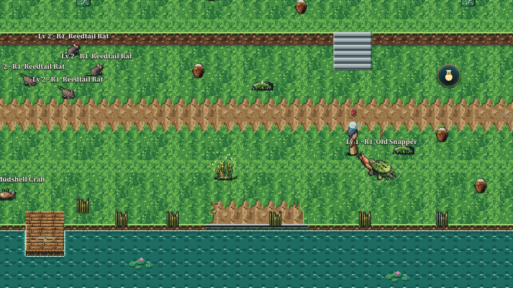 | 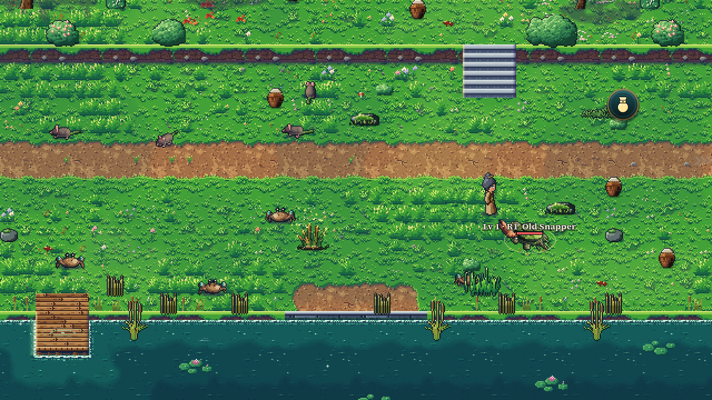 |

### 2. The hollowed eel never turned, and its plate floated high above it

- **The turn.** The eel glided by setting its position, with no velocity or aim, so its figure kept the row it rose
  in while it struck east or west. It now glides by a velocity, and on the grid it lunges along an aim at its target
  (`enemy_authority.gd` `_eel`).
- **The plate.** Plates were placed by the foe's side-view height. They now stand on the top-down figure's head: the
  foe sheet's new `top`, measured from each species' idle frame in `tools/art/topdown/creatures.py`. The hovering
  eel's plate sits on it, not a body's height above.
- **Test.** `topdown_suite` "the eel turns" and "labels on the figure's head".

| Before | After |
|---|---|
| 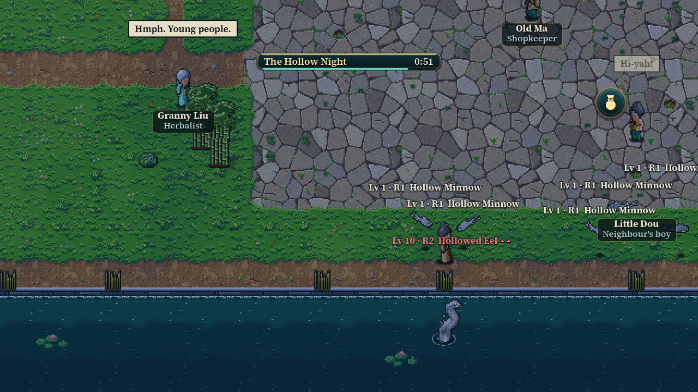 | 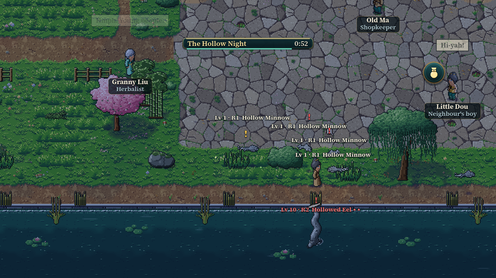 |

### 3. A late-game world event was toasted over the tutorial village

"The Drowned Shrine Surfaces · Abbot's Sanctum" showed at the top of a brand-new player's screen, and over the
Hollow Night's timer.

- **Fix.** World and calendar notices now wait until the calendar's own unlock (the world menu). They never play
  during a staged scene, and name only a place the player has been, never one past the gate (`HUD.world_news`).
  This covers event toasts and reminders, the season, the Heaven Ranking's shifts and a treasure born elsewhere.
- **The other notices.** Mail, the codex, quest toasts and the log belong to what the player just did, so they are
  unchanged.
- **Test.** `rules_tests` `prototype_suite` "world news".

| Before (the light work's shot) | After |
|---|---|
| 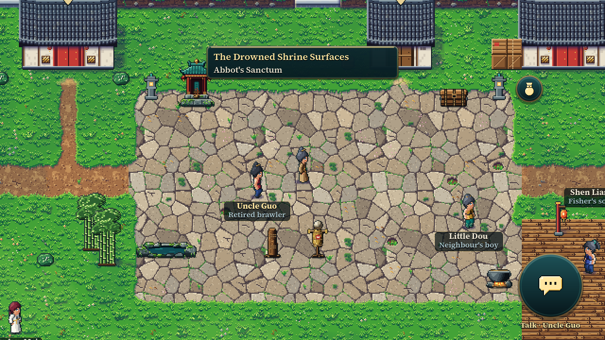 | 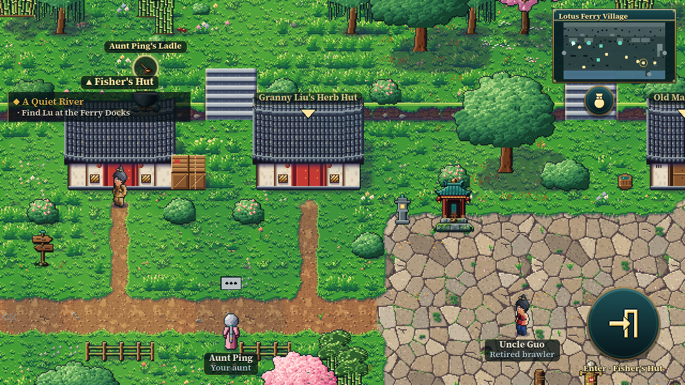 |

### 4. Mei Qing's willow moss led to herbs the player could not pick yet

The tracker sent the player to the Herb Terraces' willow moss patches. Herb gathering opens only at Bone Forging 4,
so the patch said "You don't know which leaves are worth picking yet".

- **Fix.** A collect step's places are now where the item can be had now: nodes and pickups the character may take.
  With none, they are the rooms whose foes drop it (the Marsh Edge's reed frogs) (`QuestAuthority._item_places`).
- **Test.** `topdown_tutorial` plays Mei Qing's Errand with the frogs' moss, and checks that the tracker never points
  at a locked patch.

### 5. The creator's preview wore other colours than the game

The preview showed a teal tunic; the character then woke in an earth-brown one. The preview now wears the starting
garments' own dyes (`ShellScreens.worn`).

| Before | After |
|---|---|
| 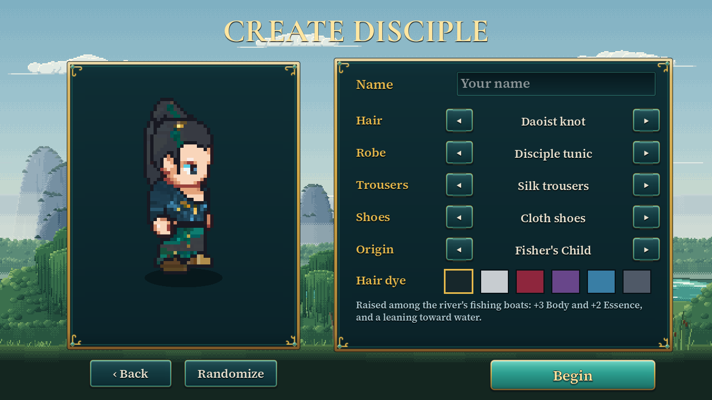 | 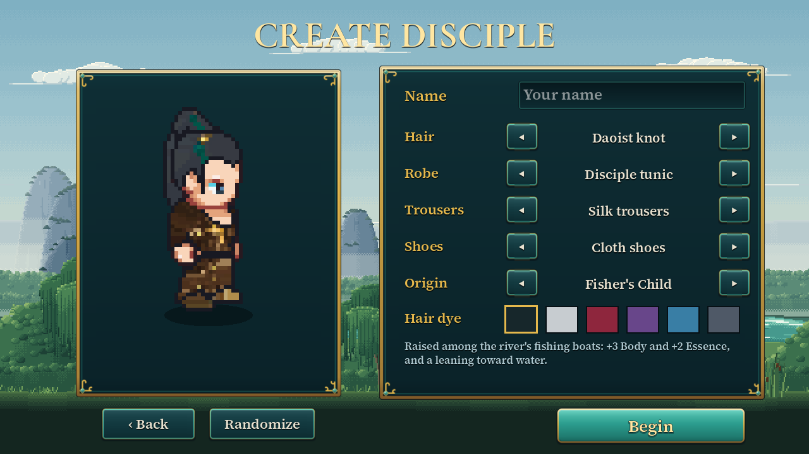 |

### 6. Log spam at every page close

Every tap that closed a page or a shell screen logged "Condition !is_inside_tree()". The page was taken out of the
tree while the tap was still being handled. It is now hidden, and freed at the frame's end (`main.gd` `_put_away`).
The QA runs' logs are clean.

### 7. The player vanished behind Uncle Guo's training dummy

A thing as tall as a body standing in front of the player hid them entirely: the dummy, or a stump. Such a thing now
counts for the silhouette, so the body shows through it (`TopdownPlaces.Figure`).

- **Test.** `topdown_suite` "behind a dummy".

| Before | After |
|---|---|
| 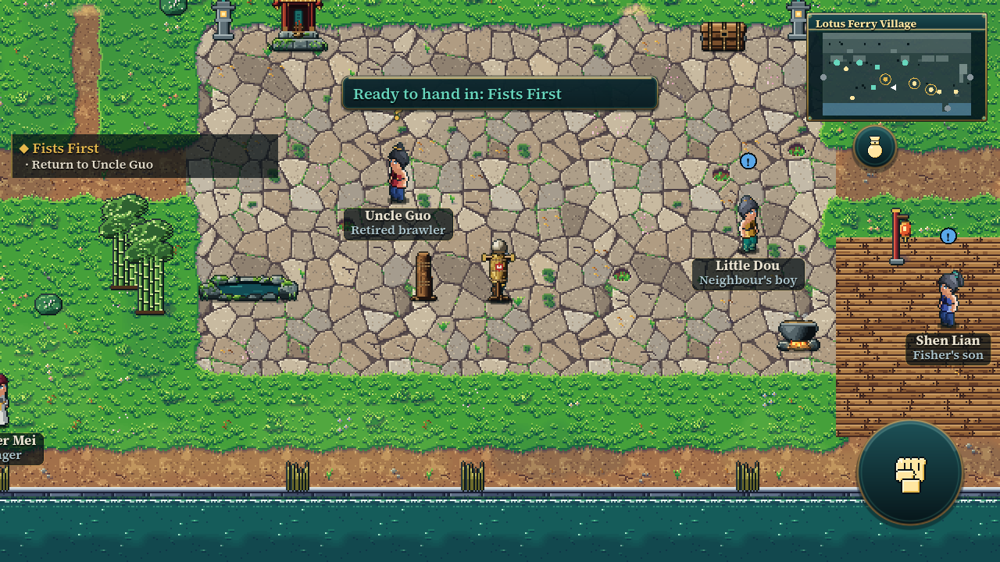 | 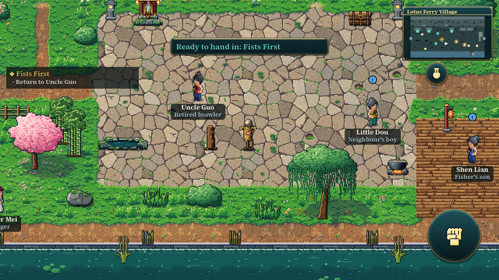 |

### 8. A villager's plate lay over the player

Uncle Guo's plate, under his feet, covered the player at his stump. The player's body is now kept clear of labels,
as the HUD's controls are (`TopdownWorld.layout_labels`).

- **Test.** `topdown_suite` "no plate over the body".

| Before | After |
|---|---|
| 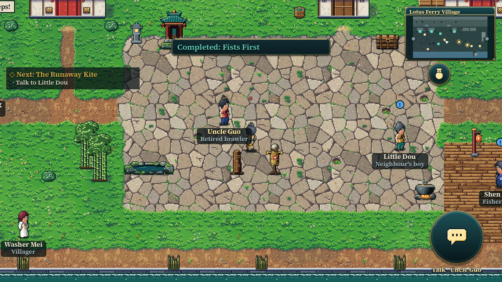 | 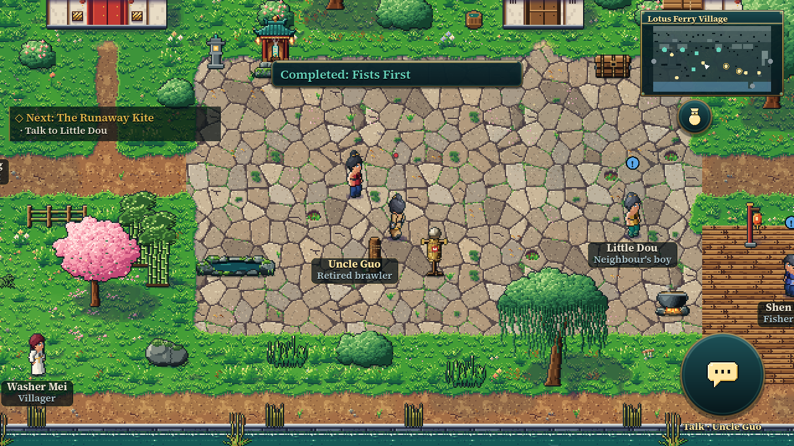 |

### 9. A hand-off's prompt ran off the screen

"Open your Bag: put Herbal Tea in Quick-…" was cut at the right edge by the Bag's button. The plate now keeps
wholly on the screen (`SceneStage.prompt_x`).

- **Test.** `story_scenes` "prompt fits".

The after shot also shows fix 14.

| Before | After |
|---|---|
| 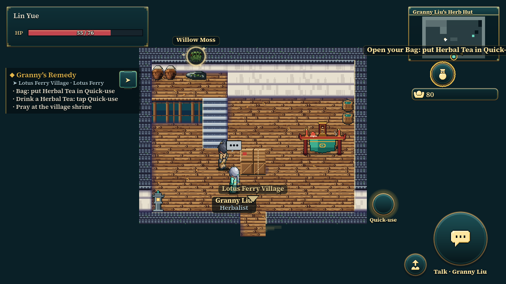 | 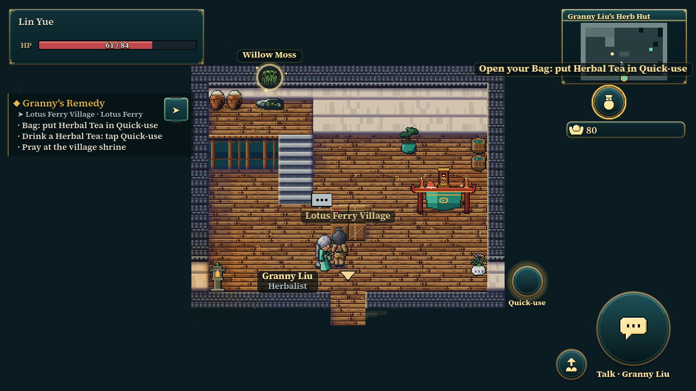 |

### 10. A speech balloon covered the HP panel, and the equip prompt cut the first weapon's name

- **The balloon.** Washer Mei's "Thank you! It dropped something…" sat over the player's HP. A balloon in live play
  now keeps clear of the HUD: beside it, or on the first clear row below (`SceneStage.clear_of_hud`).
- **The equip prompt.** It read "Training Short Bl…". A long name now steps its size down to fit
  (`EquipPrompt.name_size`).
- **Tests.** `story_scenes` "clear of the HUD", and `rules_tests` `prototype_suite` "the equip prompt names the early
  gear whole".

| Before | After |
|---|---|
| 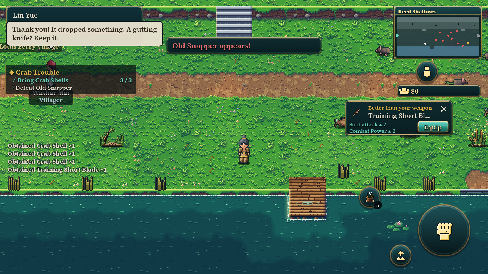 | 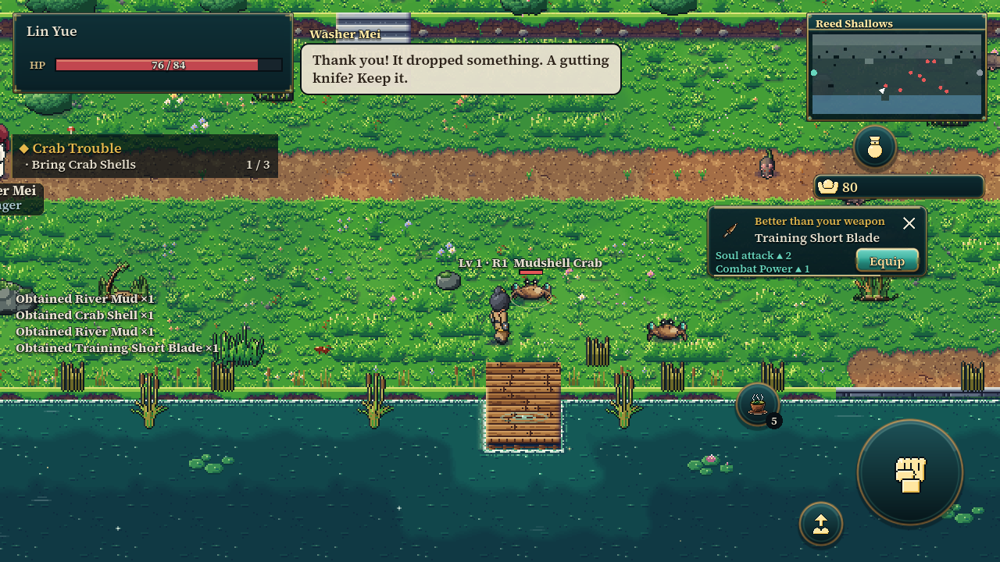 |

### 11. The Hollow Night's title, the room's name and the night's timer drew over one another

As the night began, three things were drawn in the same place:

- the room's name ("Lotus Ferry at Night");
- the event's timer plate;
- the moment's "The Hollow Night" band.

While a moment's band or strip plays in the top centre, the room's name now keeps its time and the event's plate waits
under it (`MomentView.band_on_top`).

- **Test.** `rules_tests` `prototype_suite` "a moment's band".

| Before | After |
|---|---|
| 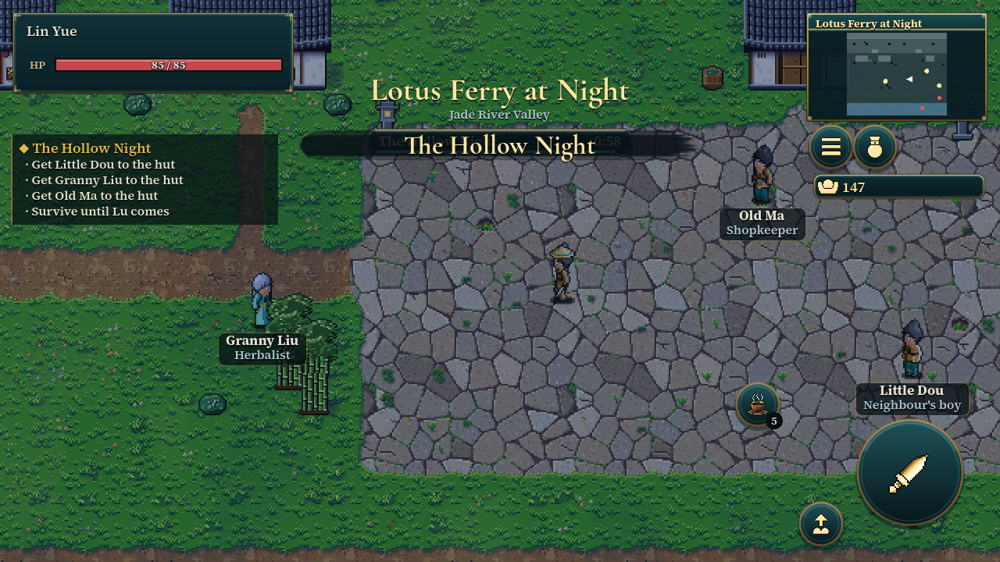 | 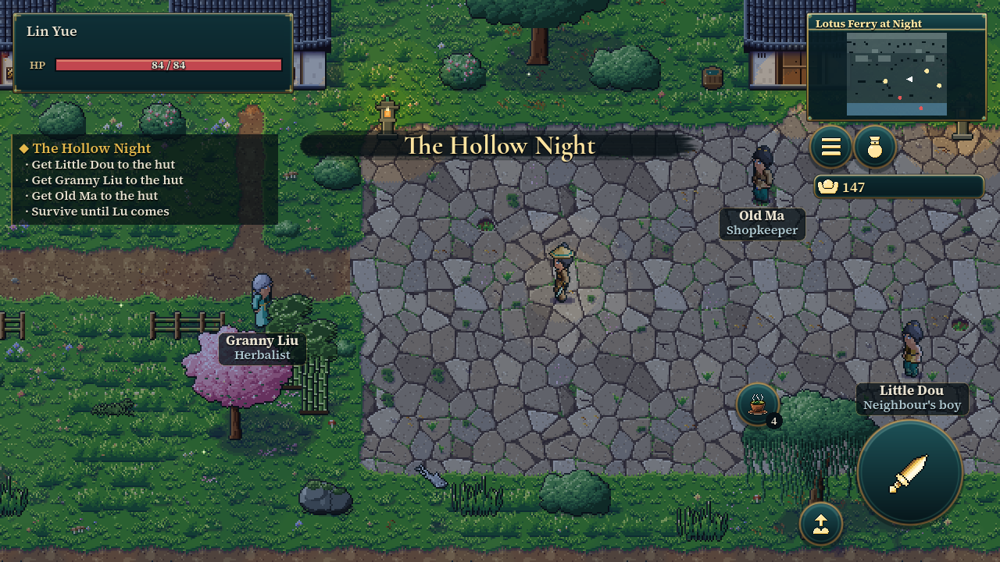 |

### 12. Granny's tea was drunk under her balloon, and its heal was not seen

The drink step handed back the controls at once, and her line and the scene's cut covered the heal's "+14 HP" and the
HP bar filling. The hand-off is now live, and waits a breath before she speaks (`tools/data/scenes.py` `granny_jar`).
The after shot shows "+14 HP" over the player, the log's "Herbal Tea: +14 HP over 5 s", and the buff with its
seconds under the panel.

- **Test.** `story_scenes` "the drink step's live hand-off".

| Before | After |
|---|---|
| 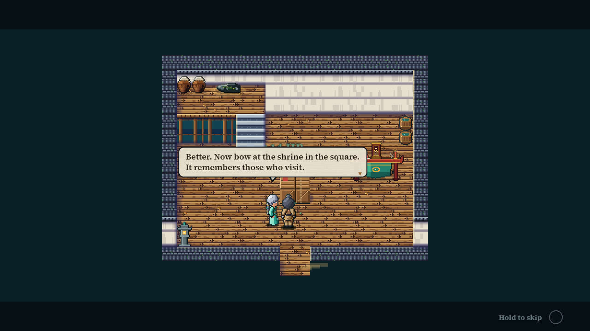 | 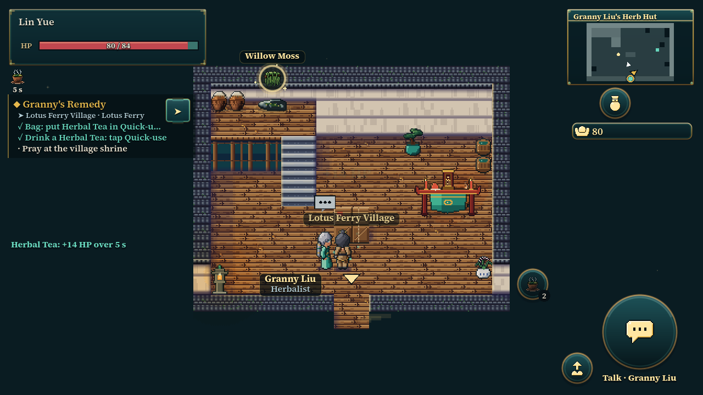 |

### 13. A crowd's plates were laid aside but drawn where they stood

The layout moved a crowd's plate half a box aside, but every view drew only the row, so the plates still overlapped.
Every label view now draws at its layout offset's x as well as its row. This covers foes, people, things and ways.

- **Test.** `topdown_suite` "a plate laid aside".

### 14. A door's arrow lay over a person's plate

The hut door's pulsing chevron covered Granny Liu's plate. The chevron is now kept clear, like the body
(`PortalView.arrow_box`). The after shot is the one under fix 9.

- **Test.** `topdown_suite` "a plate keeps off a door's chevron".

| Before |
|---|
|  |

### 15. A way's plate at the screen's edge stayed under the HUD

- The Reed Shallows' way to the village sat under the player panel.
- Willow Path West's way east read "Willow" under the minimap: no row was free of it, and half a box aside was not
  enough.

The layout now also tries just clear of the control, beside it. The purse and the status row under the player panel
(the Hollowing meter, the buffs) are now among the HUD's rects the labels keep off. A Festival Lantern's plate lay over
the Hollowing meter on the Fairground.

- **Tests.** `rules_tests` `prototype_suite` "a way's plate under the minimap" and "the purse and the status row".
- **Checked.** The QA player now reports any label left under the HUD in every shot. The last runs of both sects
  reported none.

| Before (under the panel) | After |
|---|---|
| 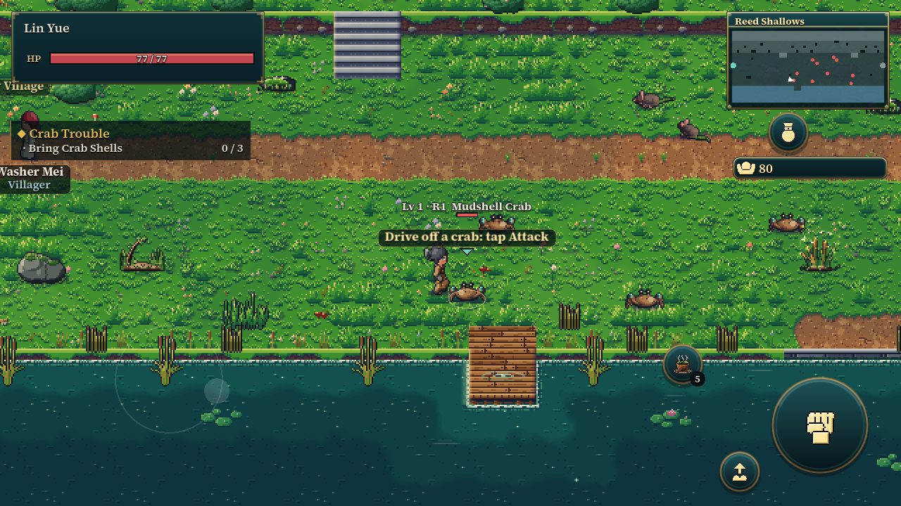 | 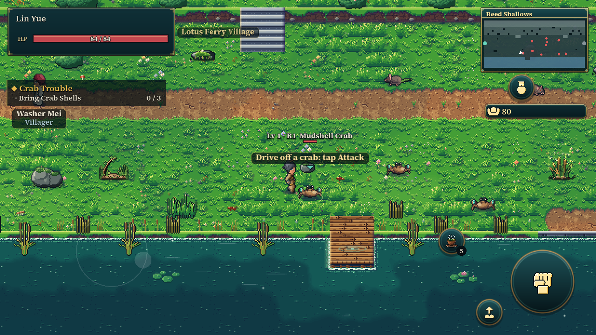 |

| Before (under the minimap: "Willow…" at the top right) |
|---|
| 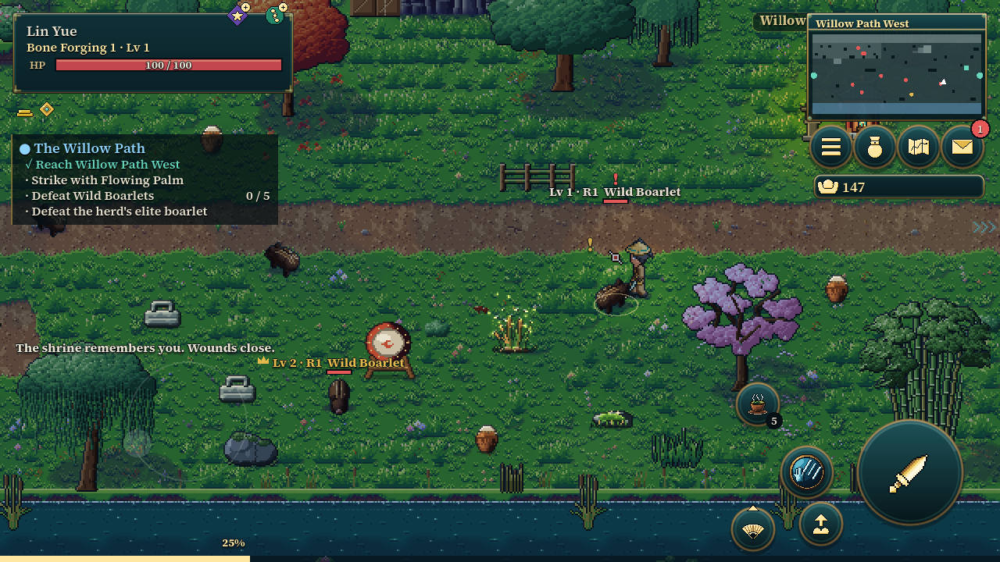 |

### 16. The tracker sent the player hunting when a breakthrough was all it took

At a bottleneck the bar at the foot said "Bottleneck reached · breakthrough ready · tap Cultivate". Meanwhile the
tracker's Next entry still said "Reach Level 3 · Hunt at Willow Path West", a walk across the valley.

- **Fix.** At a bottleneck one breakthrough short of the Level the story waits on, the entry says "Bottleneck: tap
  Cultivate to break through", with no hunting ground and no Go. A Level further off keeps its hunt, with the
  breakthrough first among its lines (`QuestAuthority._story_next`).
- **Tests.** `rules_tests` "at the bottleneck one breakthrough short of the Level", and `prologue_run`'s story guidance
  knows the entry.

| Before |
|---|
| 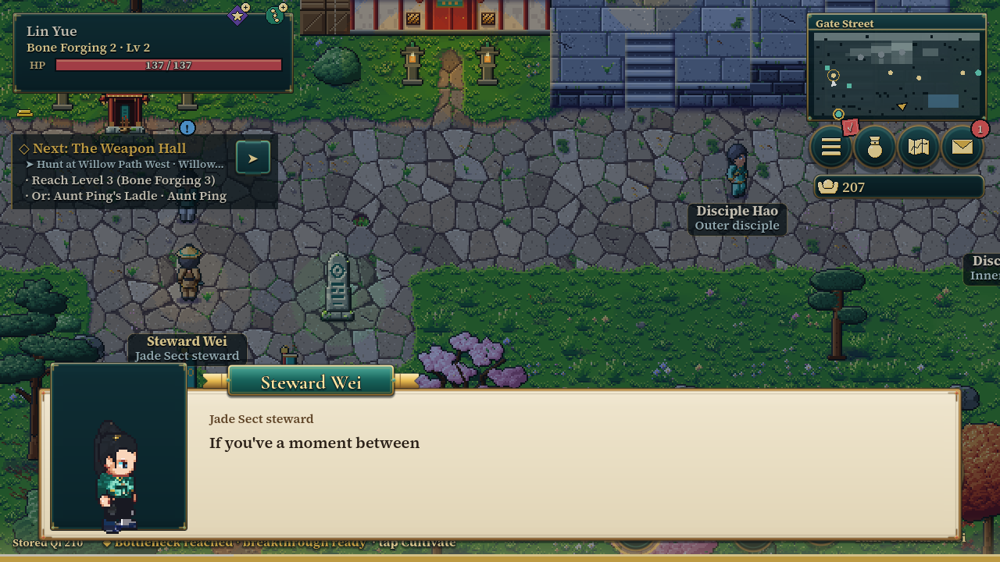 |

## The end of the prototype

Both sects' runs played on past The Humming Token to the gate. The route was:

1. Mei Qing's Errand. Her moss comes from the Marsh Edge's frogs, and the grey hides from its hollowed boarlets.
2. The road east to the Grey Pools, which is closed.
3. Grey at the Edges.
4. The First Current at the Lotus Ferry's spring.

The QA player took three shortcuts here, each noted in its log:

- the Levels up to Bone Forging 7, which are a hunt;
- the two lessons inside the prototype (Eyes for Qi and the Outer Trial), marked done as the tutorial's walk marks
  them;
- a look at the Trial Tower's door on the Fairground, the other gate.

- **The barrier.** It stands across the Marsh Edge's way east. Walked into, the way stays shut, and says "The road
  beyond is still being drawn." over the player and in the log.
- **Fix 17, from this part.** Three things went wrong when the player pushed against the barrier:
  - the log showed its line five times over;
  - the way's own plate ran off the right edge of the screen, where the way is;
  - so could the words floating over the player.

  Now:
  - a way's refusal shows once in the log, kept fresh while it repeats;
  - a way's plate stays wholly inside the room (`PortalView.label_span`);
  - a floating line stays whole on the screen (`FxLayer.on_screen`).

  Tests: `rules_tests` `prototype_suite` "the gate's line shows once", and `topdown_suite` "a way's long plate at the
  room's edge".
- **The tracker.** After The First Current its first entry is the lessons. After them it is "The Tale Rests Here · The
  road beyond is still being drawn · The prototype ends here, for now", with no mark and no Go. The Quests page's Next
  slip says the same.
- **The Trial Tower's door** has its barrier. Standing at it, the context button offers the notice board beside the
  door ("Read"), since a thing in reach takes the button before a way does. This is the world's rule, and the barrier
  says enough.

| The way east, barred | Walked into (before fix 17) | Walked into (after) |
|---|---|---|
| 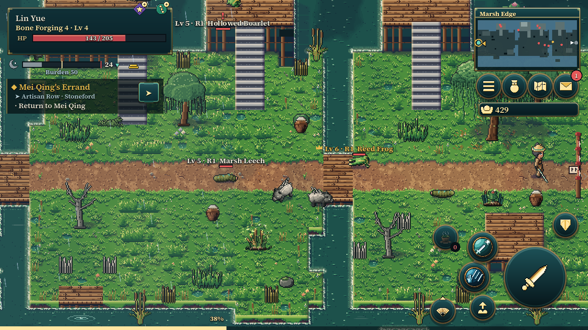 | 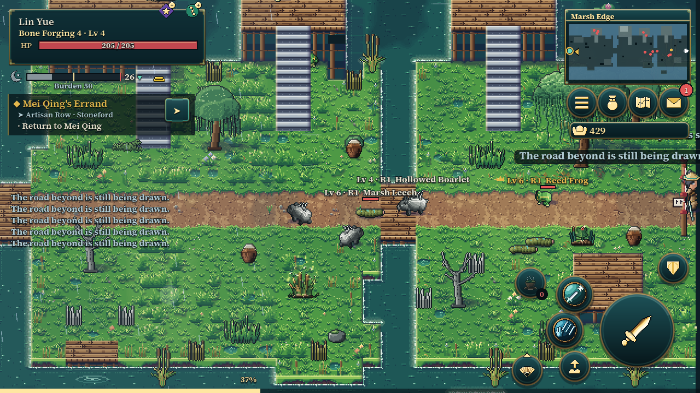 | 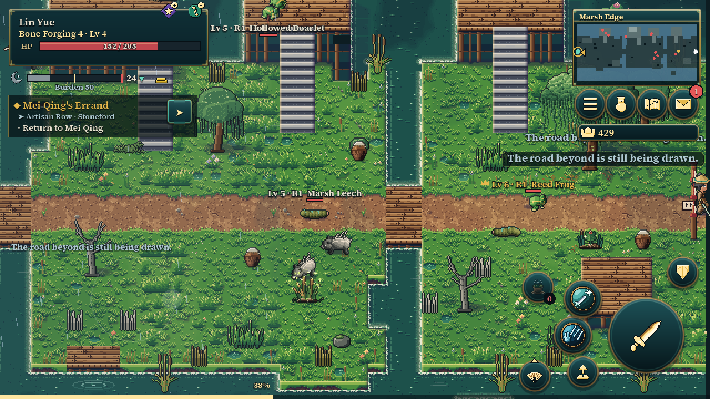 |

| The tracker's end (Jade) | The tracker's end (Cloud) | The Quests page |
|---|---|---|
| 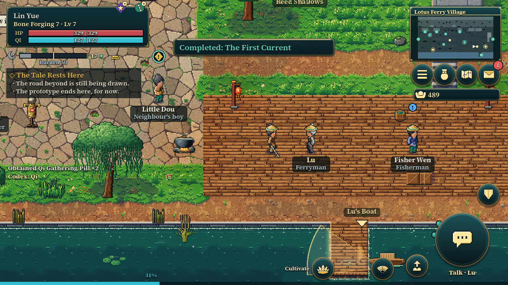 | 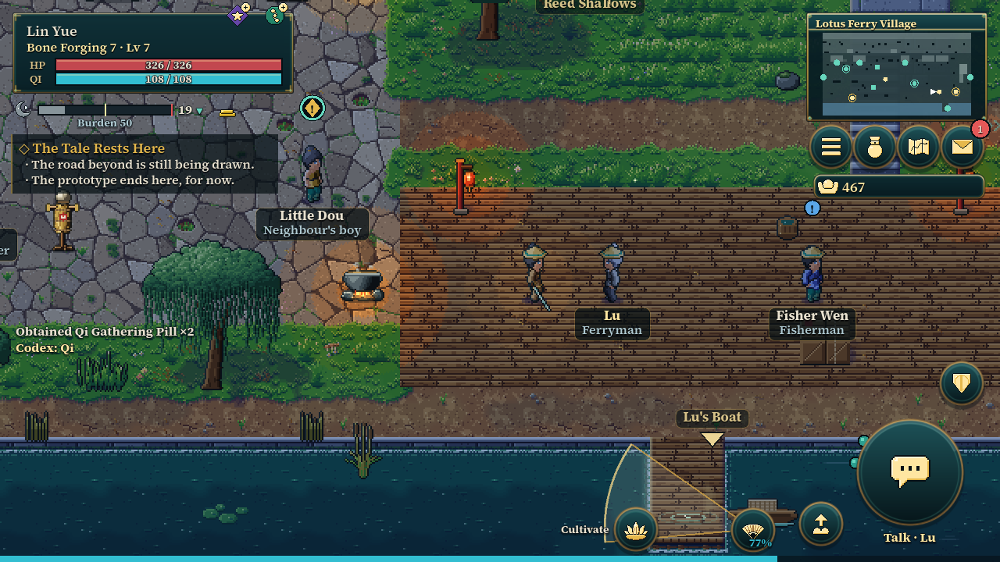 | 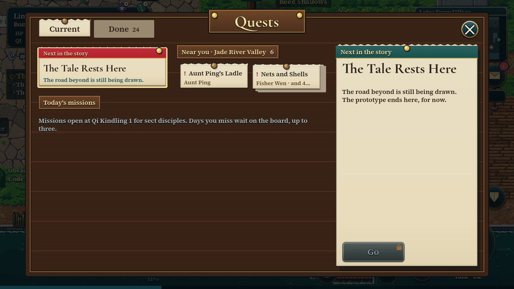 |

| The Trial Tower's door |
|---|
| 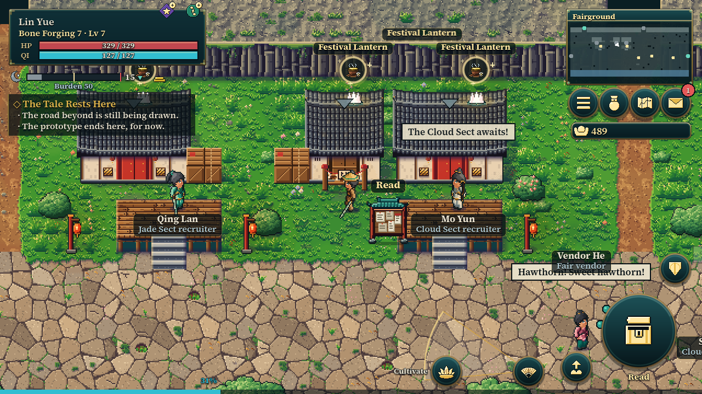 |

## Found and left, with the reason

- **The herd's elite boarlet is the tutorial's hardest fight.** In Willow Path West the QA player fell to it one to
  four times a run, and all the damage before each fall was the elite's (129 to 143 of 109 HP). The QA player takes
  one target at a time, rests before a fresh one, steps out of the lane of every wind-up, and drinks its tea at a
  third of its HP.
  - Why it is left: the fall costs nothing before Bone Forging 5, and the revival is at the room's own shrine. The
    tutorial's walks pass the fight with a careful player's step out of the lane.
  - For the user: whether the elite should hit softer in the tutorial, or whether the Willow Path should teach the
    step aside as the Snapper lesson does.
- **The Marsh Edge outclasses the player the story sends there.** Just out of the Weapon Hall a Bone Forging 3 player
  is Level 3. The marsh's reed frogs are Level 4 to 6, charging jump kicks, and Strange Tracks and Mei Qing's Errand
  hunt them. The Humming Token's hollowed boarlets are Level 7 to 12.
  - What happened: in both sects' runs the QA player fell to the frogs before its first kill (171 to 185 damage), and
    it needed its assist (below) to finish chapter 2.
  - Why it is left: as with the elite boarlet, falls cost nothing yet, and the tutorial's walks pass with a careful
    player. The levels are the world's balance, for the user.
- **Shen Lian's spar went badly in the Cloud run.** His spar double stood at Level 4 against a Level 2 player and won
  the first spar; the Jade run won its first. Also, the person Shen Lian stays in the square while his spar double
  fights you, so there are two Shen Lians on the screen.
  - Why it is left: the spar's levels are balance, and hiding the person during his spar is a small change for the
    people's owner. Shot: `22_two_shen_lians.png`.
- **Crab Trouble pays Straw Sandals the character already wears.** The weaponless start's garments include Straw
  Sandals, and Old Ma's storeroom loft holds a pair too, so a new player ends with two or three.
  - Why it is left: this is a content choice. For example, the reward could be Cloth Shoes, or only the hat and the
    taels.
  - Shot: `20_sandals_twice.png` (the pair worn, and a spare in the Bag).
  - The Weapon Hall's rack likewise gives a second pair of Training Gauntlets to a player who kept Uncle Guo's.
- **Locked resource nodes offer their button in the tutorial rooms, and say why they are locked:**
  - the Reed Shallows' insect swarm: "You have no net, and they are too quick for bare hands";
  - the herb patches: "You don't know which leaves are worth picking yet";
  - Willow Path West's Temper drum: "Body level 18 before you strike it".

  In a fight the offer moves to ring 2's context slot and Attack still attacks. Why it is left: the world's teasers are
  by design. Shot: `21_locked_node_line.png` (the herb's line beside Old Snapper).
- **Leaving the Fisher's Hut without opening the Bag.** This was reported before, when the door was held until the Bag
  was opened.
  - Why it is left: the user's later cut ("Nine early quests cut, merged or rewritten": "no teas to hunt, no Bag to
    open first") opened the door from waking.
  - How the Bag is taught now: Aunt Ping's gift and a prompt that ends by itself. It is opened for real at Granny's
    Remedy, whose step holds until the tea is in Quick-use.
  - This is not a regression. It is noted because it was reported.
- **The Bag hand-off's prompt at Granny's covers the minimap's foot while it shows** (fix 9's after). Why it is left:
  it points at the Bag, and the map is not needed then.
- **A person's or foe's plate at the very edge of the screen is cut by it** ("…Crab" at the Reed Shallows' left edge in
  `21_locked_node_line.png`). Why it is left: the layout never pushes a plate further off, but does not pull one in
  either, since it names a figure that is itself half off. A way's plate is pulled in (fix 17).
- **The refusal floating over the player can pass under the purse** when the player stands at the room's top right
  (fix 17's after). Why it is left: it is a moment's echo of the way's own plate and the log's line, both whole.
- **Log lines longer than the log end in "…"** ("A drop of blood on Plain Straw Hat: it knows…"). Why it is left: the
  log's width is the HUD's P5a layout.
- **Old Snapper's plate and bar sit over its raised claw when it strikes.** Why it is left: the plate stands on the
  idle figure's head, and the strike pose reaches higher for a moment.
- **The creator's preview is the side-view figure.** Why it is left: it belongs to the character work, not this QA.
- **Granny's Remedy's tracker entry leads to the village while its Bag steps are current.** Why it is left: the Bag
  steps can be done anywhere, and the entry's place is its next step with one (the shrine).
- **The QA player's own limits.** These are not the game's faults:
  - the village tower's long stair is climbed from its foot;
  - the kite on the hall's roof takes a running jump;
  - a thing beside a teleport stone is stood on, not beside;
  - a breakthrough is taken when the HUD says it is ready.

  The QA player's straight walks and first fights missed these, and it was taught them.

  It is no fighter, either. After three falls in a run it keeps its HP up in fights, says so in its log, and goes on
  to the screens it is for. The falls before that are the findings above.

## The reported bugs, checked again

The user reported these earlier in the project. Each was looked for in these runs.

- **Monster HP bars.** Every foe in a fight shows its bar, and the soft-locked target always does (fixes 1 and 10).
- **The unlock order.**
  - The HUD's controls come with their lessons: Attack at Fists First, the Quick-use slot at Granny's Remedy, Jump
    after the kite, Cultivate on the boat, the technique ring with Flowing Palm.
  - The world's notices wait for their systems (fix 3).
  - Nothing locked is offered as open.
- **A door with no visible entrance.** Every way has its mark on the floor and its plate, and every door its lit
  threshold and chevron. Every closed way past the prototype has its barrier (see "The end of the prototype").
- **The tracker pointing at the wrong room.** Each shot's note records the tracker. None pointed at a room the step
  was not in, at a closed road, or at a thing the player could not use (fix 4).
- **The Quick-use slot not shown.** It is drawn glowing, named "Quick-use", while Granny's step asks for it (fix 9's
  after).
- **Leaving the first building without opening the Bag.** See above: it is by the user's later cut.
- **Resources taking the Attack button.** In the Reed Shallows' and Willow Path West's fights the swarm, the herbs and
  the drum moved to ring 2's context slot, and Attack attacked (`21_locked_node_line.png`: "Gather" on ring 2 for the
  herb beside Old Snapper, the sword on Attack). Since the polish pass a node not open yet offers nothing at all
  (fix 23); one that is open still waits on ring 2 in a fight.
- **Tea effects not shown.** Fix 12: the heal's number, the log line, and the buff with its seconds.
- **Script errors and warning spam.** None in the last runs' logs. The only engine lines left are the container's own:
  no audio device and no V-Sync.

## The starting kit and the first gear

- **The start.**
  - The hemp robe, hemp trousers and Straw Sandals are worn, in the creator's chosen look and dyes (fix 5).
  - Aunt Ping's Herbal Tea is in the Bag from the opening (`30_start_tea_in_bag.png`), and the second cup is on the
    hut's table.
- **Fists First.** Uncle Guo's Training Gauntlets are worn at the hand-in and drawn on the fists
  (`31_gauntlets.png`).
- **The first crab.**
  - The Training Short Blade drops, and the equip prompt names it whole.
  - One tap wears it, and the figure holds it (fix 10's after, and `32_first_gear.png`).
- **Crab Trouble.** The Plain Straw Hat is worn and drawn, and Aunt Ping's Boar Bone Broth drunk from the Bag: the
  body level went from 1 to 3 (fix 21). No second pair of Straw Sandals.

| The tea | The gauntlets | The first gear |
|---|---|---|
| 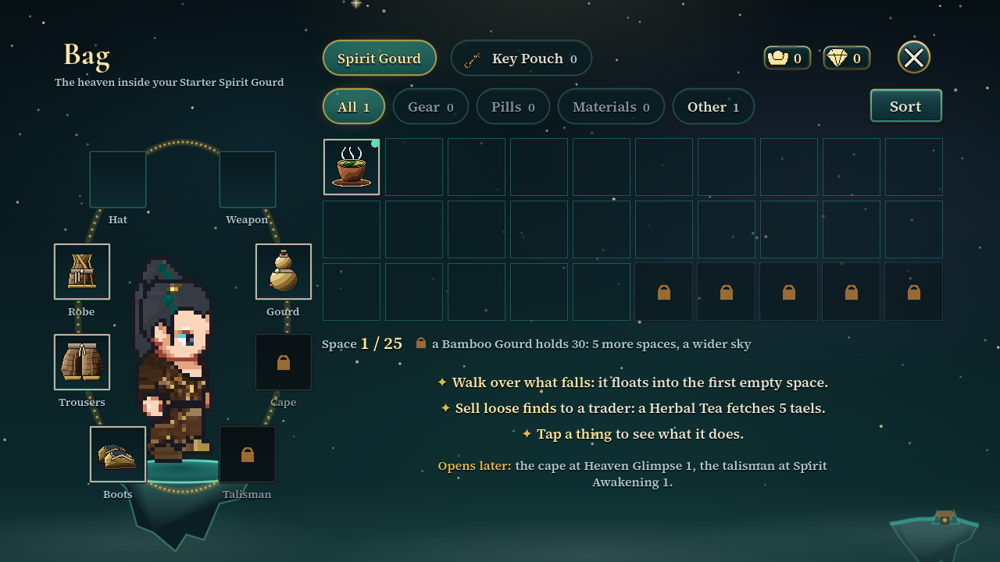 | 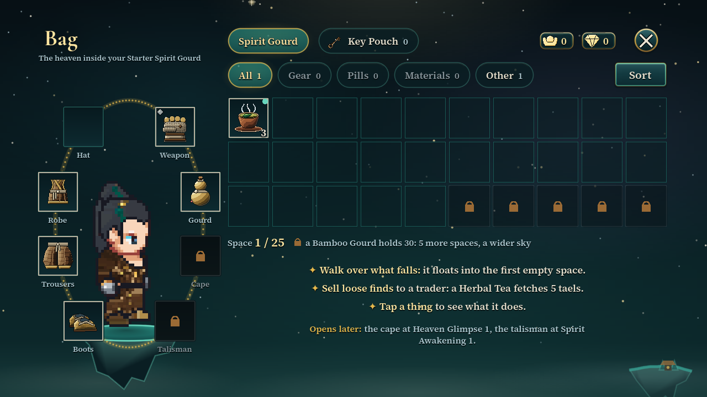 | 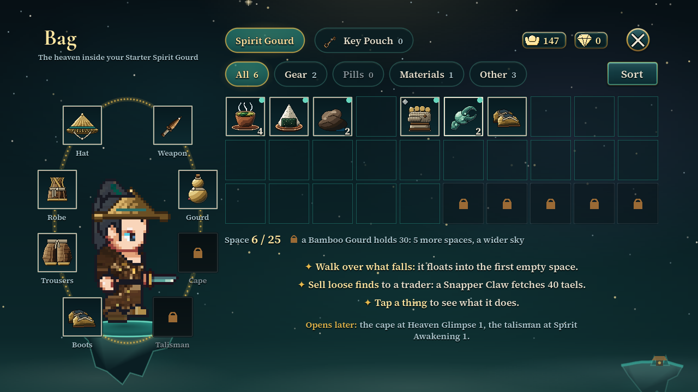 |
