# Item Wiki

Generated by `tools/dev/wiki.py` from `data/` (never edit by hand: `python3 tools/data/build_data.py` rewrites it).

697 items: 484 in `data/items.json` and 213 pieces of equipment in `data/artifacts.json`. 691 have a source in the data, 6 carry an explicit source mark, 0 have neither.

Rates are per kill, per open or per catch at the base Drop Rate (Drop Rate raises group, rare and equipment rolls). A group rolls once and then picks one row by weight, so a row's rate is the group chance times its weight share. Quest-only items drop only while their quest still needs them. An elite of a normal kind rolls its table twice, and every species' first kill rolls it once more. Marks: `later`: belongs to a zone not built yet; nothing hands it out in this build; `story`: given by a scripted story beat or start; the data does not name it there; `system`: made by a game system whose own rule names the item (see the description).

## Contents

- [Equipment · Boots](#group-equipment-boots) (13)
- [Equipment · Cape](#group-equipment-cape) (1)
- [Equipment · Gourd](#group-equipment-gourd) (9)
- [Equipment · Hat](#group-equipment-hat) (12)
- [Equipment · Pet collar](#group-equipment-pet-collar) (8)
- [Equipment · Pet saddle](#group-equipment-pet-saddle) (8)
- [Equipment · Pet talisman](#group-equipment-pet-talisman) (8)
- [Equipment · Robe](#group-equipment-robe) (14)
- [Equipment · Talisman](#group-equipment-talisman) (1)
- [Equipment · Tool furnace](#group-equipment-tool-furnace) (9)
- [Equipment · Trousers](#group-equipment-trousers) (12)
- [Equipment · Weapon](#group-equipment-weapon) (118)
- [Bath](#group-bath) (4)
- [Beast part](#group-beast-part) (51)
- [Core](#group-core) (44)
- [Critter](#group-critter) (8)
- [Curio](#group-curio) (2)
- [Currency item](#group-currency-item) (3)
- [Draught](#group-draught) (1)
- [Egg](#group-egg) (4)
- [Fish](#group-fish) (7)
- [Food](#group-food) (16)
- [Formation](#group-formation) (3)
- [Herb](#group-herb) (16)
- [Hollow](#group-hollow) (4)
- [Insect](#group-insect) (8)
- [Jade](#group-jade) (5)
- [Key](#group-key) (21)
- [Legend piece](#group-legend-piece) (27)
- [Material](#group-material) (54)
- [Oil](#group-oil) (2)
- [Ore](#group-ore) (9)
- [Other](#group-other) (14)
- [Pet book](#group-pet-book) (6)
- [Pill](#group-pill) (32)
- [Relic shard](#group-relic-shard) (1)
- [Scroll](#group-scroll) (24)
- [Seed](#group-seed) (6)
- [Talisman](#group-talisman) (11)
- [Taming](#group-taming) (5)
- [Throwable](#group-throwable) (4)
- [Tool](#group-tool) (58)
- [Treasure](#group-treasure) (14)
- [Treasure art](#group-treasure-art) (10)
- [Valuable](#group-valuable) (5)
- [Vessel](#group-vessel) (4)
- [Wisp](#group-wisp) (1)
- [Sets](#sets)
- [Banded equipment drops](#banded-equipment-drops)

## Equipment · Boots (13)

###  Straw Sandals

`straw_sandals` · Equipment, boots · Plain · iLv 5 · stack 1

- **Stats**: Physical Defense 1.9 at iLv 5, Common quality (armour_defence × boots slot share); Appearance slippers
- **Sources**:
  - Drop: banded equipment roll, grade Plain: see [Banded equipment drops](#banded-plain)

###  Cloth Boots

`cloth_boots` · Equipment, boots · Common · iLv 14 · stack 1

- **Stats**: Physical Defense 5.2 at iLv 14, Common quality (armour_defence × boots slot share); Energy type primal_qi; Appearance boots
- **Sources**:
  - Drop: banded equipment roll, grade Common: see [Banded equipment drops](#banded-common)
  - Crafting: Recipe `bp_cloth_boots` (Smithing, Common): Copper ×3, Boar Hide ×4
  - Shop: Stoneford Smith (Smith Bao in Artisan Row (Stoneford)) · at list price in Silver Taels

###  Cloudpiercing Boots

`cloudpiercing_boots` · Equipment, boots · Earth · iLv 27 · stack 1

- **Stats**: Physical Defense 12.1 at iLv 27, Common quality (armour_defence × boots slot share); Energy type primal_qi; Sockets 1; Appearance boots; set [Cloudpiercing](#set-cloudpiercing)
- **Sources**:
  - Shop: Cloud Sect Mission Hall (Deacon Heng in Cliff Stair (Cloud Sect Monastery)) · at list price in Contribution; needs sect rank Inner disciple

###  Jade Current Boots

`jade_current_boots` · Equipment, boots · Earth · iLv 27 · stack 1

- **Stats**: Physical Defense 12.1 at iLv 27, Common quality (armour_defence × boots slot share); Energy type primal_qi; Sockets 1; Appearance folded; set [Jade current](#set-jade_current)
- **Sources**:
  - Shop: Jade Sect Mission Hall (Deacon Rui in Gate Street (Jade Sect Academy)) · at list price in Contribution; needs sect rank Inner disciple

###  Jadeiron Greaves

`jadeiron_boots` · Equipment, boots · Earth · iLv 27 · stack 1

- **Stats**: Physical Defense 12.1 at iLv 27, Common quality (armour_defence × boots slot share); Energy type primal_qi; Sockets 1; Appearance folded
- **Sources**:
  - Drop: banded equipment roll, grade Earth: see [Banded equipment drops](#banded-earth)
  - Crafting: Recipe `bp_jadeiron_boots` (Smithing, Earth): Jadeiron ×3, Jade Scale ×4

###  Drowned Abbot Boots

`drowned_boots` · Equipment, boots · Earth · iLv 30 · stack 1

- **Stats**: Physical Defense 14.1 at iLv 30, Common quality (armour_defence × boots slot share); Energy type primal_qi; Sockets 1; Appearance slippers; set [Drowned abbot](#set-drowned_abbot)
- **Sources**:
  - Drop: [Drowned Abbot](monsters.md#enemy-drowned_abbot) (Lv 27) · 8% (named)

###  Cloudsilk Boots

`cloudsilk_boots` · Equipment, boots · Heaven · iLv 45 · stack 1

- **Stats**: Physical Defense 25.9 at iLv 45, Common quality (armour_defence × boots slot share); Energy type true_qi; Sockets 1; Appearance boots
- **Sources**:
  - Drop: banded equipment roll, grade Heaven: see [Banded equipment drops](#banded-heaven)
  - Crafting: Recipe `bp_cloudsilk_boots` (Smithing, Heaven): Cloudsteel Ore ×3, Cloud Feather ×4

###  Crane Boots

`crane_boots` · Equipment, boots · Heaven · iLv 45 · stack 1

- **Stats**: Physical Defense 25.9 at iLv 45, Common quality (armour_defence × boots slot share); Energy type true_qi; Sockets 1; Appearance boots; set [Crane](#set-crane)
- **Sources**:
  - Reward: Achievements: Cloud Stepper, reward

###  Mistjade Boots

`mistjade_boots` · Equipment, boots · Mystic · iLv 59 · stack 1

- **Stats**: Physical Defense 40 at iLv 59, Common quality (armour_defence × boots slot share); Energy type true_qi; Sockets 2; Appearance folded
- **Sources**:
  - Drop: banded equipment roll, grade Mystic: see [Banded equipment drops](#banded-mystic)
  - Crafting: Recipe `bp_mistjade_boots` (Smithing, Mystic): Mystic Ore ×3, Roc Feather ×4

###  Stormsilk Boots

`stormsilk_boots` · Equipment, boots · Spirit · iLv 68 · stack 1

- **Stats**: Physical Defense 50.6 at iLv 68, Common quality (armour_defence × boots slot share); Energy type sage_qi; Sockets 2; Appearance boots
- **Sources**:
  - Drop: banded equipment roll, grade Spirit: see [Banded equipment drops](#banded-spirit)
  - Crafting: Recipe `bp_stormsilk_boots` (Smithing, Spirit): Stormsteel Ore ×3, Spark Pelt ×4
  - Shop: Alliance Factor's Hall (Factor Ruan in Port Market (Cloudgate Port)) · at list price in Spirit Stones
  - Shop: Ironroot Clan Forge (Smith Gang in Clan Hearth (Ironroot Clan Hold)) · at list price in Spirit Stones

###  Sunsilk Boots

`sunsilk_boots` · Equipment, boots · Sage · iLv 77 · stack 1

- **Stats**: Physical Defense 62.4 at iLv 77, Common quality (armour_defence × boots slot share); Energy type sage_qi; Sockets 3; Appearance folded
- **Sources**:
  - Drop: banded equipment roll, grade Sage: see [Banded equipment drops](#banded-sage)
  - Crafting: Recipe `bp_sunsilk_boots` (Smithing, Sage): Sunglass ×3, Scorpion Stinger ×4
  - Shop: Ironroot Clan Forge (Smith Gang in Clan Hearth (Ironroot Clan Hold)) · at list price in Spirit Stones; needs Flag set (flag clan_ironroot) and Sage Sovereign 1

###  Starsilk Slippers

`starsilk_boots` · Equipment, boots · Sovereign · iLv 86 · stack 1

- **Stats**: Physical Defense 75.4 at iLv 86, Common quality (armour_defence × boots slot share); Energy type sage_qi; Sockets 3; Appearance slippers
- **Sources**:
  - Drop: banded equipment roll, grade Sovereign: see [Banded equipment drops](#banded-sovereign)
  - Crafting: Recipe `bp_starsilk_boots` (Smithing, Sovereign): Driftglass ×3, Jelly Silk ×4; known by default
  - Shop: Tidebreak Armoury (Quartermaster Bai in Tidebreak Bastion (Tidebreak Front)) · at list price in Sage Crystals; needs Will Manifest 1

###  Lanternsilk Boots

`lanternsilk_boots` · Equipment, boots · Will · iLv 95 · stack 1

- **Stats**: Physical Defense 89.7 at iLv 95, Common quality (armour_defence × boots slot share); Energy type sage_qi; Sockets 3; Appearance boots
- **Sources**:
  - Drop: banded equipment roll, grade Will: see [Banded equipment drops](#banded-will)
  - Crafting: Recipe `bp_lanternsilk_boots` (Smithing, Will): Drone Shell ×3, Cinder Ash ×4; known by default
  - Shop: Lanternwright Han's Shelf (Lanternwright Han in Star Chandlery (Lanternfall Harbor)) · at list price in Sage Crystals; needs Sphere Lord 2

## Equipment · Cape (1)

###  Mistjade Cape

`mistjade_cape` · Equipment, cape · Mystic · iLv 59 · stack 1

- **Stats**: Energy type true_qi; Sockets 2; Appearance solid; named: General, Valley; resists water, wind
- **Sources**:
  - Reward: Quest A Wider Sky (main, from Elder Hu), reward

## Equipment · Gourd (9)

###  Starter Spirit Gourd

`starter_gourd` · Equipment, gourd · Plain · iLv 1 · stack 1

- **Stats**: Gourd: {"bag": 25, "quick": 5}
- **Source mark**: `story` (given by a scripted story beat or start; the data does not name it there)

###  Bamboo Gourd

`bamboo_gourd` · Equipment, gourd · Common · iLv 14 · stack 1

- **Stats**: Energy type primal_qi; Gourd: {"bag": 30, "quick": 8}
- **Sources**:
  - Shop: Stoneford General Store (Proprietor Fang in Market Street (Stoneford)) · at list price in Silver Taels

###  Jadeiron Gourd

`jadeiron_gourd` · Equipment, gourd · Earth · iLv 27 · stack 1

- **Stats**: Energy type primal_qi; Sockets 1; Gourd: {"bag": 35, "quick": 10}
- **Sources**:
  - Shop: Stoneford Smith (Smith Bao in Artisan Row (Stoneford)) · daily rotation (1 of 9)
  - Shop: Trade House (Elder Gu in Artisan Row (Stoneford); Madam Hua in Artisan Row (Stoneford)) · daily rotation (1 of 3)

###  Cloud Gourd

`cloud_gourd` · Equipment, gourd · Heaven · iLv 45 · stack 1

- **Stats**: Energy type true_qi; Sockets 1; Gourd: {"bag": 40, "quick": 12}
- **Sources**:
  - Shop: Stoneford Smith (Smith Bao in Artisan Row (Stoneford)) · at list price in Silver Taels; needs Cloud Stride 1

###  Mistjade Gourd

`mistjade_gourd` · Equipment, gourd · Mystic · iLv 59 · stack 1

- **Stats**: Energy type true_qi; Sockets 2; Gourd: {"bag": 45, "quick": 15}
- **Sources**:
  - Shop: Peddler Gou's Packs (Peddler Gou in Port Market (Cloudgate Port)) · at list price in Spirit Stones
  - Shop: Stoneford Smith (Smith Bao in Artisan Row (Stoneford)) · at list price in Silver Taels; needs Heaven Glimpse 1

###  Stormsteel Gourd

`stormsteel_gourd` · Equipment, gourd · Spirit · iLv 68 · stack 1

- **Stats**: Energy type sage_qi; Sockets 2; Gourd: {"bag": 50, "quick": 16}
- **Sources**:
  - Shop: Alliance Factor's Hall (Factor Ruan in Port Market (Cloudgate Port)) · at list price in Spirit Stones; needs Sage 1

###  Sunsteel Gourd

`sunsteel_gourd` · Equipment, gourd · Sage · iLv 77 · stack 1

- **Stats**: Energy type sage_qi; Sockets 3; Gourd: {"bag": 55, "quick": 18}
- **Sources**:
  - Shop: Ironroot Clan Forge (Smith Gang in Clan Hearth (Ironroot Clan Hold)) · at list price in Spirit Stones; needs Flag set (flag clan_ironroot) and Sage Sovereign 1

###  Driftglass Gourd

`driftglass_gourd` · Equipment, gourd · Sovereign · iLv 86 · stack 1

- **Stats**: Energy type sage_qi; Sockets 3; Gourd: {"bag": 60, "quick": 19}
- **Sources**:
  - Shop: Tidebreak Armoury (Quartermaster Bai in Tidebreak Bastion (Tidebreak Front)) · at list price in Sage Crystals; needs Will Manifest 1

###  Lantern Gourd

`lantern_gourd` · Equipment, gourd · Will · iLv 95 · stack 1

- **Stats**: Energy type sage_qi; Sockets 3; Gourd: {"bag": 65, "quick": 20}
- **Sources**:
  - Shop: Lanternwright Han's Shelf (Lanternwright Han in Star Chandlery (Lanternfall Harbor)) · at list price in Sage Crystals; needs Sphere Lord 2

## Equipment · Hat (12)

###  Plain Straw Hat

`plain_straw_hat` · Equipment, hat · Plain · iLv 1 · stack 1

- **Stats**: Physical Defense 0.8 at iLv 1, Common quality (armour_defence × hat slot share); Appearance straw
- **Sources**:
  - Drop: banded equipment roll, grade Plain: see [Banded equipment drops](#banded-plain)
  - Reward: Quest Crab Trouble (prologue, from Uncle Guo), reward
  - Reward: Skip-the-Prologue start

###  Bamboo Hat

`bamboo_hat` · Equipment, hat · Common · iLv 14 · stack 1

- **Stats**: Physical Defense 5.2 at iLv 14, Common quality (armour_defence × hat slot share); Energy type primal_qi; Appearance straw
- **Sources**:
  - Drop: banded equipment roll, grade Common: see [Banded equipment drops](#banded-common)
  - Crafting: Recipe `bp_bamboo_hat` (Smithing, Common): Copper ×3, Boar Hide ×4
  - Shop: Stoneford Smith (Smith Bao in Artisan Row (Stoneford)) · at list price in Silver Taels

###  Cloudpiercing Hat

`cloudpiercing_hat` · Equipment, hat · Earth · iLv 27 · stack 1

- **Stats**: Physical Defense 12.1 at iLv 27, Common quality (armour_defence × hat slot share); Energy type primal_qi; Sockets 1; Appearance tied; set [Cloudpiercing](#set-cloudpiercing)
- **Sources**:
  - Shop: Cloud Sect Mission Hall (Deacon Heng in Cliff Stair (Cloud Sect Monastery)) · at list price in Contribution; needs sect rank Inner disciple

###  Jade Current Hat

`jade_current_hat` · Equipment, hat · Earth · iLv 27 · stack 1

- **Stats**: Physical Defense 12.1 at iLv 27, Common quality (armour_defence × hat slot share); Energy type primal_qi; Sockets 1; Appearance headband; set [Jade current](#set-jade_current)
- **Sources**:
  - Shop: Jade Sect Mission Hall (Deacon Rui in Gate Street (Jade Sect Academy)) · at list price in Contribution; needs sect rank Inner disciple

###  Jadeiron Circlet

`jadeiron_hat` · Equipment, hat · Earth · iLv 27 · stack 1

- **Stats**: Physical Defense 12.1 at iLv 27, Common quality (armour_defence × hat slot share); Energy type primal_qi; Sockets 1; Appearance headband
- **Sources**:
  - Drop: banded equipment roll, grade Earth: see [Banded equipment drops](#banded-earth)
  - Crafting: Recipe `bp_jadeiron_hat` (Smithing, Earth): Jadeiron ×3, Jade Scale ×4
  - Shop: Trade House (Elder Gu in Artisan Row (Stoneford); Madam Hua in Artisan Row (Stoneford)) · daily rotation (1 of 3)

###  Drowned Abbot Hat

`drowned_hat` · Equipment, hat · Earth · iLv 30 · stack 1

- **Stats**: Physical Defense 14.1 at iLv 30, Common quality (armour_defence × hat slot share); Energy type primal_qi; Sockets 1; Appearance tied; set [Drowned abbot](#set-drowned_abbot)
- **Sources**:
  - Drop: [Drowned Abbot](monsters.md#enemy-drowned_abbot) (Lv 27) · 8% (named)

###  Cloudsilk Band

`cloudsilk_hat` · Equipment, hat · Heaven · iLv 45 · stack 1

- **Stats**: Physical Defense 25.9 at iLv 45, Common quality (armour_defence × hat slot share); Energy type true_qi; Sockets 1; Appearance tied
- **Sources**:
  - Drop: banded equipment roll, grade Heaven: see [Banded equipment drops](#banded-heaven)
  - Crafting: Recipe `bp_cloudsilk_hat` (Smithing, Heaven): Cloudsteel Ore ×3, Cloud Feather ×4

###  Mistjade Circlet

`mistjade_hat` · Equipment, hat · Mystic · iLv 59 · stack 1

- **Stats**: Physical Defense 40 at iLv 59, Common quality (armour_defence × hat slot share); Energy type true_qi; Sockets 2; Appearance headband
- **Sources**:
  - Drop: banded equipment roll, grade Mystic: see [Banded equipment drops](#banded-mystic)
  - Crafting: Recipe `bp_mistjade_hat` (Smithing, Mystic): Mystic Ore ×3, Roc Feather ×4

###  Stormsilk Crown

`stormsilk_hat` · Equipment, hat · Spirit · iLv 68 · stack 1

- **Stats**: Physical Defense 50.6 at iLv 68, Common quality (armour_defence × hat slot share); Energy type sage_qi; Sockets 2; Appearance guan
- **Sources**:
  - Drop: banded equipment roll, grade Spirit: see [Banded equipment drops](#banded-spirit)
  - Crafting: Recipe `bp_stormsilk_hat` (Smithing, Spirit): Stormsteel Ore ×3, Spark Pelt ×4
  - Shop: Alliance Factor's Hall (Factor Ruan in Port Market (Cloudgate Port)) · at list price in Spirit Stones

###  Sunsilk Veil

`sunsilk_hat` · Equipment, hat · Sage · iLv 77 · stack 1

- **Stats**: Physical Defense 62.4 at iLv 77, Common quality (armour_defence × hat slot share); Energy type sage_qi; Sockets 3; Appearance weimao
- **Sources**:
  - Drop: banded equipment roll, grade Sage: see [Banded equipment drops](#banded-sage)
  - Crafting: Recipe `bp_sunsilk_hat` (Smithing, Sage): Sunglass ×3, Scorpion Stinger ×4

###  Starsilk Band

`starsilk_hat` · Equipment, hat · Sovereign · iLv 86 · stack 1

- **Stats**: Physical Defense 75.4 at iLv 86, Common quality (armour_defence × hat slot share); Energy type sage_qi; Sockets 3; Appearance tied
- **Sources**:
  - Drop: banded equipment roll, grade Sovereign: see [Banded equipment drops](#banded-sovereign)
  - Crafting: Recipe `bp_starsilk_hat` (Smithing, Sovereign): Driftglass ×3, Jelly Silk ×4; known by default
  - Shop: Tidebreak Armoury (Quartermaster Bai in Tidebreak Bastion (Tidebreak Front)) · at list price in Sage Crystals; needs Will Manifest 1

###  Lanternsilk Crown

`lanternsilk_hat` · Equipment, hat · Will · iLv 95 · stack 1

- **Stats**: Physical Defense 89.7 at iLv 95, Common quality (armour_defence × hat slot share); Energy type sage_qi; Sockets 3; Appearance guan
- **Sources**:
  - Drop: banded equipment roll, grade Will: see [Banded equipment drops](#banded-will)
  - Crafting: Recipe `bp_lanternsilk_hat` (Smithing, Will): Drone Shell ×3, Cinder Ash ×4; known by default
  - Shop: Lanternwright Han's Shelf (Lanternwright Han in Star Chandlery (Lanternfall Harbor)) · at list price in Sage Crystals; needs Sphere Lord 2

## Equipment · Pet collar (8)

###  Bone Collar

`bone_collar` · Equipment, pet_collar · Common · iLv 14 · stack 1

> Boar hide and mole claws. +10% HP for the animal that wears it.

- **Stats**: named: Beast, Valley; Pet gear: {"hp": 0.1}
- **Sources**:
  - Crafting: Recipe `bone_collar` (Smithing, Common): Boar Hide ×2, Mole Claw ×2; known by default

###  Jadeiron Collar

`jadeiron_collar` · Equipment, pet_collar · Earth · iLv 27 · stack 1

> +11% HP for the animal that wears it.

- **Stats**: Pet gear: {"hp": 0.11}
- **Sources**:
  - Crafting: Recipe `jadeiron_collar` (Smithing, Earth): Jadeiron ×2, Serpent Scale ×2; known by default

###  Cloudsteel Collar

`cloudsteel_collar` · Equipment, pet_collar · Heaven · iLv 45 · stack 1

> +12% HP for the animal that wears it.

- **Stats**: Pet gear: {"hp": 0.12}
- **Sources**:
  - Crafting: Recipe `cloudsteel_collar` (Smithing, Heaven): Cloudsteel Ore ×2, Ape Fur ×2; known by default

###  Mistjade Collar

`mistjade_collar` · Equipment, pet_collar · Mystic · iLv 59 · stack 1

> +13% HP for the animal that wears it.

- **Stats**: Pet gear: {"hp": 0.13}
- **Sources**:
  - Crafting: Recipe `mistjade_collar` (Smithing, Mystic): Mystic Ore ×2, Roc Feather ×2; known by default

###  Stormsteel Collar

`stormsteel_collar` · Equipment, pet_collar · Spirit · iLv 68 · stack 1

> +14% HP for the animal that wears it.

- **Stats**: Pet gear: {"hp": 0.14}
- **Sources**:
  - Crafting: Recipe `stormsteel_collar` (Smithing, Spirit): Stormsteel Ore ×2, Snow Ape Hide ×2; known by default

###  Sunsteel Collar

`sunsteel_collar` · Equipment, pet_collar · Sage · iLv 77 · stack 1

> +15% HP for the animal that wears it.

- **Stats**: Pet gear: {"hp": 0.15}
- **Sources**:
  - Crafting: Recipe `sunsteel_collar` (Smithing, Sage): Sunglass ×2, Harpy Plume ×2; known by default

###  Driftsteel Collar

`driftsteel_collar` · Equipment, pet_collar · Sovereign · iLv 86 · stack 1

> +16% HP for the animal that wears it.

- **Stats**: Pet gear: {"hp": 0.16}
- **Sources**:
  - Crafting: Recipe `driftsteel_collar` (Smithing, Sovereign): Driftglass ×2, Guardian Scale ×2; known by default

###  Lanternsteel Collar

`lanternsteel_collar` · Equipment, pet_collar · Will · iLv 95 · stack 1

> +17% HP for the animal that wears it.

- **Stats**: Pet gear: {"hp": 0.17}
- **Sources**:
  - Crafting: Recipe `lanternsteel_collar` (Smithing, Will): Drone Shell ×2, Wyrm Ash ×2; known by default

## Equipment · Pet saddle (8)

###  Reed Saddle

`reed_saddle` · Equipment, pet_saddle · Common · iLv 14 · stack 1

> Woven reed on boar hide. A mount wearing it carries you 10% faster.

- **Stats**: named: Beast, Valley; Pet gear: {"mount_speed": 0.1}
- **Sources**:
  - Crafting: Recipe `reed_saddle` (Smithing, Common): Cloth ×3, Boar Hide ×2; known by default

###  Jadeiron Saddle

`jadeiron_saddle` · Equipment, pet_saddle · Earth · iLv 27 · stack 1

> A mount wearing it carries you 11% faster.

- **Stats**: Pet gear: {"mount_speed": 0.11}
- **Sources**:
  - Crafting: Recipe `jadeiron_saddle` (Smithing, Earth): Jadeiron ×2, Serpent Scale ×2; known by default

###  Cloudsteel Saddle

`cloudsteel_saddle` · Equipment, pet_saddle · Heaven · iLv 45 · stack 1

> A mount wearing it carries you 12% faster.

- **Stats**: Pet gear: {"mount_speed": 0.12}
- **Sources**:
  - Crafting: Recipe `cloudsteel_saddle` (Smithing, Heaven): Cloudsteel Ore ×2, Ape Fur ×2; known by default

###  Mistjade Saddle

`mistjade_saddle` · Equipment, pet_saddle · Mystic · iLv 59 · stack 1

> A mount wearing it carries you 13% faster.

- **Stats**: Pet gear: {"mount_speed": 0.13}
- **Sources**:
  - Crafting: Recipe `mistjade_saddle` (Smithing, Mystic): Mystic Ore ×2, Roc Feather ×2; known by default

###  Stormsteel Saddle

`stormsteel_saddle` · Equipment, pet_saddle · Spirit · iLv 68 · stack 1

> A mount wearing it carries you 14% faster.

- **Stats**: Pet gear: {"mount_speed": 0.14}
- **Sources**:
  - Crafting: Recipe `stormsteel_saddle` (Smithing, Spirit): Stormsteel Ore ×2, Snow Ape Hide ×2; known by default

###  Sunsteel Saddle

`sunsteel_saddle` · Equipment, pet_saddle · Sage · iLv 77 · stack 1

> A mount wearing it carries you 15% faster.

- **Stats**: Pet gear: {"mount_speed": 0.15}
- **Sources**:
  - Crafting: Recipe `sunsteel_saddle` (Smithing, Sage): Sunglass ×2, Harpy Plume ×2; known by default

###  Driftsteel Saddle

`driftsteel_saddle` · Equipment, pet_saddle · Sovereign · iLv 86 · stack 1

> A mount wearing it carries you 16% faster.

- **Stats**: Pet gear: {"mount_speed": 0.16}
- **Sources**:
  - Crafting: Recipe `driftsteel_saddle` (Smithing, Sovereign): Driftglass ×2, Guardian Scale ×2; known by default

###  Lanternsteel Saddle

`lanternsteel_saddle` · Equipment, pet_saddle · Will · iLv 95 · stack 1

> A mount wearing it carries you 17% faster.

- **Stats**: Pet gear: {"mount_speed": 0.17}
- **Sources**:
  - Crafting: Recipe `lanternsteel_saddle` (Smithing, Will): Drone Shell ×2, Wyrm Ash ×2; known by default

## Equipment · Pet talisman (8)

###  Iron Beast Talisman

`iron_beast_talisman` · Equipment, pet_talisman · Common · iLv 14 · stack 1

> +9% attack and +4.5% defence for the animal that wears it.

- **Stats**: Pet gear: {"attack": 0.09, "defence": 0.045}
- **Sources**:
  - Crafting: Recipe `iron_beast_talisman` (Smithing, Common): Copper ×2, Hound Fang ×2; known by default

###  Scale Talisman

`scale_talisman` · Equipment, pet_talisman · Earth · iLv 27 · stack 1

> Serpent and jade scales on a cord. +10% attack and +5% defence for the animal that wears it.

- **Stats**: named: Beast, Valley; Pet gear: {"attack": 0.1, "defence": 0.05}
- **Sources**:
  - Crafting: Recipe `scale_talisman` (Smithing, Earth): Serpent Scale ×2, Jade Scale ×2; known by default

###  Cloudsteel Beast Talisman

`cloudsteel_beast_talisman` · Equipment, pet_talisman · Heaven · iLv 45 · stack 1

> +11% attack and +5.5% defence for the animal that wears it.

- **Stats**: Pet gear: {"attack": 0.11, "defence": 0.055}
- **Sources**:
  - Crafting: Recipe `cloudsteel_beast_talisman` (Smithing, Heaven): Cloudsteel Ore ×2, Ape Fur ×2; known by default

###  Mistjade Beast Talisman

`mistjade_beast_talisman` · Equipment, pet_talisman · Mystic · iLv 59 · stack 1

> +12% attack and +6% defence for the animal that wears it.

- **Stats**: Pet gear: {"attack": 0.12, "defence": 0.06}
- **Sources**:
  - Crafting: Recipe `mistjade_beast_talisman` (Smithing, Mystic): Mystic Ore ×2, Roc Feather ×2; known by default

###  Stormsteel Beast Talisman

`stormsteel_beast_talisman` · Equipment, pet_talisman · Spirit · iLv 68 · stack 1

> +13% attack and +6.5% defence for the animal that wears it.

- **Stats**: Pet gear: {"attack": 0.13, "defence": 0.065}
- **Sources**:
  - Crafting: Recipe `stormsteel_beast_talisman` (Smithing, Spirit): Stormsteel Ore ×2, Snow Ape Hide ×2; known by default

###  Sunsteel Beast Talisman

`sunsteel_beast_talisman` · Equipment, pet_talisman · Sage · iLv 77 · stack 1

> +14% attack and +7% defence for the animal that wears it.

- **Stats**: Pet gear: {"attack": 0.14, "defence": 0.07}
- **Sources**:
  - Crafting: Recipe `sunsteel_beast_talisman` (Smithing, Sage): Sunglass ×2, Harpy Plume ×2; known by default

###  Driftsteel Beast Talisman

`driftsteel_beast_talisman` · Equipment, pet_talisman · Sovereign · iLv 86 · stack 1

> +15% attack and +7.5% defence for the animal that wears it.

- **Stats**: Pet gear: {"attack": 0.15, "defence": 0.075}
- **Sources**:
  - Crafting: Recipe `driftsteel_beast_talisman` (Smithing, Sovereign): Driftglass ×2, Guardian Scale ×2; known by default

###  Lanternsteel Beast Talisman

`lanternsteel_beast_talisman` · Equipment, pet_talisman · Will · iLv 95 · stack 1

> +16% attack and +8% defence for the animal that wears it.

- **Stats**: Pet gear: {"attack": 0.16, "defence": 0.08}
- **Sources**:
  - Crafting: Recipe `lanternsteel_beast_talisman` (Smithing, Will): Drone Shell ×2, Wyrm Ash ×2; known by default

## Equipment · Robe (14)

###  Hemp Robe

`hemp_robe` · Equipment, robe · Plain · iLv 5 · stack 1

- **Stats**: Physical Defense 5.1 at iLv 5, Common quality (armour_defence × robe slot share); Appearance sleeveless; Dye earth
- **Sources**:
  - Drop: banded equipment roll, grade Plain: see [Banded equipment drops](#banded-plain)

###  Cotton Robe

`cotton_robe` · Equipment, robe · Common · iLv 14 · stack 1

- **Stats**: Physical Defense 13.9 at iLv 14, Common quality (armour_defence × robe slot share); Energy type primal_qi; Appearance disciple; Dye grey
- **Sources**:
  - Drop: banded equipment roll, grade Common: see [Banded equipment drops](#banded-common)
  - Crafting: Recipe `bp_cotton_robe` (Smithing, Common): Copper ×3, Boar Hide ×4
  - Shop: Stoneford Smith (Smith Bao in Artisan Row (Stoneford)) · at list price in Silver Taels

###  Mudwater Robe

`mudwater_robe` · Equipment, robe · Common · iLv 18 · stack 1

- **Stats**: Physical Defense 18.9 at iLv 18, Common quality (armour_defence × robe slot share); Energy type primal_qi; Appearance sleeveless; Dye earth; set [Mudwater](#set-mudwater)
- **Sources**:
  - Drop: [Big Toad Tan](monsters.md#enemy-big_toad_tan) (Lv 18) · 8% (named)

###  Cloudpiercing Robe

`cloudpiercing_robe` · Equipment, robe · Earth · iLv 27 · stack 1

- **Stats**: Physical Defense 32.4 at iLv 27, Common quality (armour_defence × robe slot share); Energy type primal_qi; Sockets 1; Appearance vneck; Dye cloud; set [Cloudpiercing](#set-cloudpiercing)
- **Sources**:
  - Shop: Cloud Sect Mission Hall (Deacon Heng in Cliff Stair (Cloud Sect Monastery)) · at list price in Contribution; needs sect rank Inner disciple

###  Jade Current Robe

`jade_current_robe` · Equipment, robe · Earth · iLv 27 · stack 1

- **Stats**: Physical Defense 32.4 at iLv 27, Common quality (armour_defence × robe slot share); Energy type primal_qi; Sockets 1; Appearance cardigan; Dye jade; set [Jade current](#set-jade_current)
- **Sources**:
  - Shop: Jade Sect Mission Hall (Deacon Rui in Gate Street (Jade Sect Academy)) · at list price in Contribution; needs sect rank Inner disciple

###  Jadeiron-Trimmed Robe

`jadeiron_robe` · Equipment, robe · Earth · iLv 27 · stack 1

- **Stats**: Physical Defense 32.4 at iLv 27, Common quality (armour_defence × robe slot share); Energy type primal_qi; Sockets 1; Appearance cardigan; Dye indigo
- **Sources**:
  - Drop: banded equipment roll, grade Earth: see [Banded equipment drops](#banded-earth)
  - Crafting: Recipe `bp_jadeiron_robe` (Smithing, Earth): Jadeiron ×3, Jade Scale ×4
  - Shop: Stoneford Smith (Smith Bao in Artisan Row (Stoneford)) · daily rotation (1 of 9)

###  Drowned Abbot Robe

`drowned_robe` · Equipment, robe · Earth · iLv 30 · stack 1

- **Stats**: Physical Defense 37.6 at iLv 30, Common quality (armour_defence × robe slot share); Energy type primal_qi; Sockets 1; Appearance scholar; Dye ink; set [Drowned abbot](#set-drowned_abbot)
- **Sources**:
  - Drop: [Drowned Abbot](monsters.md#enemy-drowned_abbot) (Lv 27) · first defeat, once

###  Cloudsilk Robe

`cloudsilk_robe` · Equipment, robe · Heaven · iLv 45 · stack 1

- **Stats**: Physical Defense 69.1 at iLv 45, Common quality (armour_defence × robe slot share); Energy type true_qi; Sockets 1; Appearance vneck; Dye cloud
- **Sources**:
  - Drop: banded equipment roll, grade Heaven: see [Banded equipment drops](#banded-heaven)
  - Crafting: Recipe `bp_cloudsilk_robe` (Smithing, Heaven): Cloudsteel Ore ×3, Cloud Feather ×4
  - Shop: Trade House (Elder Gu in Artisan Row (Stoneford); Madam Hua in Artisan Row (Stoneford)) · daily rotation (1 of 3)

###  Crane Robe

`crane_robe` · Equipment, robe · Heaven · iLv 45 · stack 1

- **Stats**: Physical Defense 69.1 at iLv 45, Common quality (armour_defence × robe slot share); Energy type true_qi; Sockets 1; Appearance vneck; Dye white; set [Crane](#set-crane)
- **Sources**:
  - Reward: Quest Crane Falls at Dawn (side, from Qiu Feng), reward

###  Mistjade Robe

`mistjade_robe` · Equipment, robe · Mystic · iLv 59 · stack 1

- **Stats**: Physical Defense 106.6 at iLv 59, Common quality (armour_defence × robe slot share); Energy type true_qi; Sockets 2; Appearance scholar; Dye white
- **Sources**:
  - Drop: [Hollow Behemoth](monsters.md#enemy-hollow_behemoth) (Lv 58) · 100% (guaranteed)
  - Drop: banded equipment roll, grade Mystic: see [Banded equipment drops](#banded-mystic)
  - Crafting: Recipe `bp_mistjade_robe` (Smithing, Mystic): Mystic Ore ×3, Roc Feather ×4

###  Stormsilk Robe

`stormsilk_robe` · Equipment, robe · Spirit · iLv 68 · stack 1

- **Stats**: Physical Defense 134.9 at iLv 68, Common quality (armour_defence × robe slot share); Energy type sage_qi; Sockets 2; Appearance vneck; Dye indigo
- **Sources**:
  - Drop: banded equipment roll, grade Spirit: see [Banded equipment drops](#banded-spirit)
  - Crafting: Recipe `bp_stormsilk_robe` (Smithing, Spirit): Stormsteel Ore ×3, Spark Pelt ×4
  - Shop: Alliance Factor's Hall (Factor Ruan in Port Market (Cloudgate Port)) · at list price in Spirit Stones
  - Shop: Ironroot Clan Forge (Smith Gang in Clan Hearth (Ironroot Clan Hold)) · at list price in Spirit Stones

###  Sunsilk Robe

`sunsilk_robe` · Equipment, robe · Sage · iLv 77 · stack 1

- **Stats**: Physical Defense 166.4 at iLv 77, Common quality (armour_defence × robe slot share); Energy type sage_qi; Sockets 3; Appearance scholar; Dye ochre
- **Sources**:
  - Drop: banded equipment roll, grade Sage: see [Banded equipment drops](#banded-sage)
  - Crafting: Recipe `bp_sunsilk_robe` (Smithing, Sage): Sunglass ×3, Scorpion Stinger ×4
  - Shop: Ironroot Clan Forge (Smith Gang in Clan Hearth (Ironroot Clan Hold)) · at list price in Spirit Stones; needs Flag set (flag clan_ironroot) and Sage Sovereign 1

###  Starsilk Robe

`starsilk_robe` · Equipment, robe · Sovereign · iLv 86 · stack 1

- **Stats**: Physical Defense 201.1 at iLv 86, Common quality (armour_defence × robe slot share); Energy type sage_qi; Sockets 3; Appearance disciple; Dye rose
- **Sources**:
  - Drop: banded equipment roll, grade Sovereign: see [Banded equipment drops](#banded-sovereign)
  - Crafting: Recipe `bp_starsilk_robe` (Smithing, Sovereign): Driftglass ×3, Jelly Silk ×4; known by default
  - Shop: Tidebreak Armoury (Quartermaster Bai in Tidebreak Bastion (Tidebreak Front)) · at list price in Sage Crystals; needs Will Manifest 1

###  Lanternsilk Robe

`lanternsilk_robe` · Equipment, robe · Will · iLv 95 · stack 1

- **Stats**: Physical Defense 239.1 at iLv 95, Common quality (armour_defence × robe slot share); Energy type sage_qi; Sockets 3; Appearance cardigan; Dye white
- **Sources**:
  - Drop: banded equipment roll, grade Will: see [Banded equipment drops](#banded-will)
  - Crafting: Recipe `bp_lanternsilk_robe` (Smithing, Will): Drone Shell ×3, Cinder Ash ×4; known by default
  - Shop: Lanternwright Han's Shelf (Lanternwright Han in Star Chandlery (Lanternfall Harbor)) · at list price in Sage Crystals; needs Sphere Lord 2

## Equipment · Talisman (1)

###  Cloud Talisman

`cloud_talisman` · Equipment, talisman · Heaven · iLv 45 · stack 1

- **Stats**: Energy type true_qi; Sockets 1; named: General, Valley
- **Sources**:
  - Reward: Quest A Lake Inside (guided, from Elder Hu), reward

## Equipment · Tool furnace (9)

###  Bronze Furnace

`bronze_furnace` · Equipment, tool_furnace · Plain · iLv 1 · stack 1

> Mei Qing's old bronze furnace. Three pills to a batch; it holds heat well enough.

- **Stats**: named: Alchemist, Valley; Furnace: {"band": 0.0, "batch": 3, "filter": 0.0, "yield": 0.0}
- **Sources**:
  - Reward: Unlock: Alchemy

###  Jadeiron Furnace

`jadeiron_furnace` · Equipment, tool_furnace · Earth · iLv 27 · stack 1

> Jadeiron walls a hand thick. Five pills to a batch, a steadier heat, and it strains a tenth of the impurities out.

- **Stats**: named: Alchemist, Valley; Furnace: {"band": 0.05, "batch": 5, "filter": 0.1, "yield": 0.05}
- **Sources**:
  - Crafting: Recipe `jadeiron_furnace` (Smithing, Earth): Jadeiron ×8, Riverstone ×6, Crab Shell ×4

###  Cloudsteel Furnace

`cloudsteel_furnace` · Equipment, tool_furnace · Heaven · iLv 45 · stack 1

> Cloudsteel etched with drifting clouds. Eight pills to a batch; a fifth of the impurities slide off its walls.

- **Stats**: named: Alchemist, Valley; Furnace: {"band": 0.08, "batch": 8, "filter": 0.2, "yield": 0.1}
- **Sources**:
  - Crafting: Recipe `cloudsteel_furnace` (Smithing, Heaven): Cloudsteel Ore ×8, Cloud Feather ×4, Serpent Scale ×4; known by default

###  Nine-Dragon Cauldron

`nine_dragon_cauldron` · Equipment, tool_furnace · Heaven · iLv 45 · stack 1

> Nine bronze dragons coil round it and drink the heat. A named furnace: on any fire a perfect run can reach Grain, Halo and Soul. Eight pills to a batch; water pills come easier in it.

- **Stats**: named: Alchemist, Valley; Furnace: {"band": 0.12, "batch": 8, "element": "water", "filter": 0.2, "named": true, "yield": 0.1}
- **Notes**: cannot be sold
- **Sources**:
  - Container: Chest in Abbot's Sanctum (Drowned Shrine) (Lv 27) · 100% (guaranteed)

###  Mistjade Furnace

`mistjade_furnace` · Equipment, tool_furnace · Mystic · iLv 59 · stack 1

> A three-legged furnace of mistjade that hums over the fire. Ten pills to a batch, and it keeps almost a third of the impurities out.

- **Stats**: named: Alchemist, Valley; Furnace: {"band": 0.1, "batch": 10, "filter": 0.3, "yield": 0.15}
- **Sources**:
  - Crafting: Recipe `mistjade_furnace` (Smithing, Mystic): Mystic Ore ×6, Roc Feather ×4, Vulture Plume ×4; known by default

###  Stormsteel Furnace

`stormsteel_furnace` · Equipment, tool_furnace · Spirit · iLv 68 · stack 1

> Blue-black stormsteel that drinks the lightning's heat. Ten pills to a batch.

- **Stats**: Furnace: {"band": 0.11, "batch": 10, "filter": 0.33, "yield": 0.16}
- **Sources**:
  - Crafting: Recipe `stormsteel_furnace` (Smithing, Spirit): Stormsteel Ore ×8, Thunder Horn ×4, Snow Ape Hide ×4; known by default

###  Sunsteel Furnace

`sunsteel_furnace` · Equipment, tool_furnace · Sage · iLv 77 · stack 1

> Sunsteel set with desert glass that holds the fire's glow. Eleven pills to a batch.

- **Stats**: Furnace: {"band": 0.12, "batch": 11, "filter": 0.36, "yield": 0.17}
- **Sources**:
  - Crafting: Recipe `sunsteel_furnace` (Smithing, Sage): Sunglass ×8, Scorpion Stinger ×4, Worm Glass Tooth ×2; known by default

###  Driftsteel Furnace

`driftsteel_furnace` · Equipment, tool_furnace · Sovereign · iLv 86 · stack 1

> Driftsteel walls lined with ground driftglass. Eleven pills to a batch, and little ash gets through.

- **Stats**: Furnace: {"band": 0.13, "batch": 11, "filter": 0.39, "yield": 0.18}
- **Sources**:
  - Crafting: Recipe `driftsteel_furnace` (Smithing, Sovereign): Driftglass ×8, Guardian Scale ×4, Star Powder ×4; known by default

###  Lanternsteel Furnace

`lanternsteel_furnace` · Equipment, tool_furnace · Will · iLv 95 · stack 1

> Cast from a lantern cage's metal; the fire in it never quite goes out. Twelve pills to a batch.

- **Stats**: Furnace: {"band": 0.14, "batch": 12, "filter": 0.42, "yield": 0.2}
- **Sources**:
  - Crafting: Recipe `lanternsteel_furnace` (Smithing, Will): Drone Shell ×8, Pyre Ember ×2, Cinder Ash ×4; known by default

## Equipment · Trousers (12)

###  Hemp Trousers

`hemp_trousers` · Equipment, trousers · Plain · iLv 5 · stack 1

- **Stats**: Physical Defense 3.8 at iLv 5, Common quality (armour_defence × trousers slot share); Appearance loose; Dye earth
- **Sources**:
  - Drop: banded equipment roll, grade Plain: see [Banded equipment drops](#banded-plain)

### 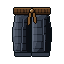 Cotton Trousers

`cotton_trousers` · Equipment, trousers · Common · iLv 14 · stack 1

- **Stats**: Physical Defense 10.4 at iLv 14, Common quality (armour_defence × trousers slot share); Energy type primal_qi; Appearance straight; Dye ink
- **Sources**:
  - Drop: banded equipment roll, grade Common: see [Banded equipment drops](#banded-common)
  - Crafting: Recipe `bp_cotton_trousers` (Smithing, Common): Copper ×3, Boar Hide ×4
  - Shop: Stoneford Smith (Smith Bao in Artisan Row (Stoneford)) · at list price in Silver Taels

###  Cloudpiercing Trousers

`cloudpiercing_trousers` · Equipment, trousers · Earth · iLv 27 · stack 1

- **Stats**: Physical Defense 24.3 at iLv 27, Common quality (armour_defence × trousers slot share); Energy type primal_qi; Sockets 1; Appearance cuffed; Dye indigo; set [Cloudpiercing](#set-cloudpiercing)
- **Sources**:
  - Shop: Cloud Sect Mission Hall (Deacon Heng in Cliff Stair (Cloud Sect Monastery)) · at list price in Contribution; needs sect rank Core disciple

###  Jade Current Trousers

`jade_current_trousers` · Equipment, trousers · Earth · iLv 27 · stack 1

- **Stats**: Physical Defense 24.3 at iLv 27, Common quality (armour_defence × trousers slot share); Energy type primal_qi; Sockets 1; Appearance martial; Dye ink; set [Jade current](#set-jade_current)
- **Sources**:
  - Shop: Jade Sect Mission Hall (Deacon Rui in Gate Street (Jade Sect Academy)) · at list price in Contribution; needs sect rank Core disciple

###  Jadeiron-Trimmed Trousers

`jadeiron_trousers` · Equipment, trousers · Earth · iLv 27 · stack 1

- **Stats**: Physical Defense 24.3 at iLv 27, Common quality (armour_defence × trousers slot share); Energy type primal_qi; Sockets 1; Appearance martial; Dye ink
- **Sources**:
  - Drop: banded equipment roll, grade Earth: see [Banded equipment drops](#banded-earth)
  - Crafting: Recipe `bp_jadeiron_trousers` (Smithing, Earth): Jadeiron ×3, Jade Scale ×4

###  Cloudsilk Trousers

`cloudsilk_trousers` · Equipment, trousers · Heaven · iLv 45 · stack 1

- **Stats**: Physical Defense 51.8 at iLv 45, Common quality (armour_defence × trousers slot share); Energy type true_qi; Sockets 1; Appearance cuffed; Dye grey
- **Sources**:
  - Drop: banded equipment roll, grade Heaven: see [Banded equipment drops](#banded-heaven)
  - Crafting: Recipe `bp_cloudsilk_trousers` (Smithing, Heaven): Cloudsteel Ore ×3, Cloud Feather ×4

###  Crane Trousers

`crane_trousers` · Equipment, trousers · Heaven · iLv 45 · stack 1

- **Stats**: Physical Defense 51.8 at iLv 45, Common quality (armour_defence × trousers slot share); Energy type true_qi; Sockets 1; Appearance cuffed; Dye cloud; set [Crane](#set-crane)
- **Sources**:
  - Drop: [Cloudpeak Roc](monsters.md#enemy-cloudpeak_roc) (Lv 58–63) · 0.2% (named)

###  Mistjade Trousers

`mistjade_trousers` · Equipment, trousers · Mystic · iLv 59 · stack 1

- **Stats**: Physical Defense 80 at iLv 59, Common quality (armour_defence × trousers slot share); Energy type true_qi; Sockets 2; Appearance scholar; Dye jade
- **Sources**:
  - Drop: banded equipment roll, grade Mystic: see [Banded equipment drops](#banded-mystic)
  - Crafting: Recipe `bp_mistjade_trousers` (Smithing, Mystic): Mystic Ore ×3, Roc Feather ×4

###  Stormsilk Trousers

`stormsilk_trousers` · Equipment, trousers · Spirit · iLv 68 · stack 1

- **Stats**: Physical Defense 101.2 at iLv 68, Common quality (armour_defence × trousers slot share); Energy type sage_qi; Sockets 2; Appearance martial; Dye cloud
- **Sources**:
  - Drop: banded equipment roll, grade Spirit: see [Banded equipment drops](#banded-spirit)
  - Crafting: Recipe `bp_stormsilk_trousers` (Smithing, Spirit): Stormsteel Ore ×3, Spark Pelt ×4
  - Shop: Alliance Factor's Hall (Factor Ruan in Port Market (Cloudgate Port)) · at list price in Spirit Stones

###  Sunsilk Trousers

`sunsilk_trousers` · Equipment, trousers · Sage · iLv 77 · stack 1

- **Stats**: Physical Defense 124.8 at iLv 77, Common quality (armour_defence × trousers slot share); Energy type sage_qi; Sockets 3; Appearance cuffed; Dye crimson
- **Sources**:
  - Drop: banded equipment roll, grade Sage: see [Banded equipment drops](#banded-sage)
  - Crafting: Recipe `bp_sunsilk_trousers` (Smithing, Sage): Sunglass ×3, Scorpion Stinger ×4

###  Starsilk Trousers

`starsilk_trousers` · Equipment, trousers · Sovereign · iLv 86 · stack 1

- **Stats**: Physical Defense 150.8 at iLv 86, Common quality (armour_defence × trousers slot share); Energy type sage_qi; Sockets 3; Appearance straight; Dye indigo
- **Sources**:
  - Drop: banded equipment roll, grade Sovereign: see [Banded equipment drops](#banded-sovereign)
  - Crafting: Recipe `bp_starsilk_trousers` (Smithing, Sovereign): Driftglass ×3, Jelly Silk ×4; known by default
  - Shop: Tidebreak Armoury (Quartermaster Bai in Tidebreak Bastion (Tidebreak Front)) · at list price in Sage Crystals; needs Will Manifest 1

###  Lanternsilk Trousers

`lanternsilk_trousers` · Equipment, trousers · Will · iLv 95 · stack 1

- **Stats**: Physical Defense 179.3 at iLv 95, Common quality (armour_defence × trousers slot share); Energy type sage_qi; Sockets 3; Appearance martial; Dye ink
- **Sources**:
  - Drop: banded equipment roll, grade Will: see [Banded equipment drops](#banded-will)
  - Crafting: Recipe `bp_lanternsilk_trousers` (Smithing, Will): Drone Shell ×3, Cinder Ash ×4; known by default
  - Shop: Lanternwright Han's Shelf (Lanternwright Han in Star Chandlery (Lanternfall Harbor)) · at list price in Sage Crystals; needs Sphere Lord 2

## Equipment · Weapon (118)

###  Training Bell

`training_bell` · Equipment, weapon · Plain · iLv 5 · stack 1

- **Stats**: Weapon Attack 26 at iLv 5, Common quality (`stats.json` equipment.weapon_attack); Family bell; Appearance bell
- **Requires**: Essence 8
- **Sources**:
  - Drop: banded equipment roll, grade Plain: see [Banded equipment drops](#banded-plain)
  - Shop: Stoneford Smith (Smith Bao in Artisan Row (Stoneford)) · at list price in Silver Taels

###  Training Bow

`training_bow` · Equipment, weapon · Plain · iLv 5 · stack 1

- **Stats**: Weapon Attack 26 at iLv 5, Common quality (`stats.json` equipment.weapon_attack); Family bow; Appearance bow
- **Requires**: Agility 8
- **Sources**:
  - Drop: banded equipment roll, grade Plain: see [Banded equipment drops](#banded-plain)
  - Shop: Stoneford Smith (Smith Bao in Artisan Row (Stoneford)) · at list price in Silver Taels

###  Training Brush

`training_brush` · Equipment, weapon · Plain · iLv 5 · stack 1

- **Stats**: Weapon Attack 26 at iLv 5, Common quality (`stats.json` equipment.weapon_attack); Family brush; Appearance brush
- **Requires**: Insight 8
- **Sources**:
  - Drop: banded equipment roll, grade Plain: see [Banded equipment drops](#banded-plain)
  - Shop: Stoneford Smith (Smith Bao in Artisan Row (Stoneford)) · at list price in Silver Taels

### 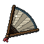 Training Fan

`training_fan` · Equipment, weapon · Plain · iLv 5 · stack 1

- **Stats**: Weapon Attack 26 at iLv 5, Common quality (`stats.json` equipment.weapon_attack); Family fan; Appearance fan
- **Sources**:
  - Drop: banded equipment roll, grade Plain: see [Banded equipment drops](#banded-plain)
  - Shop: Stoneford Smith (Smith Bao in Artisan Row (Stoneford)) · at list price in Silver Taels

###  Training Flute

`training_flute` · Equipment, weapon · Plain · iLv 5 · stack 1

- **Stats**: Weapon Attack 26 at iLv 5, Common quality (`stats.json` equipment.weapon_attack); Family flute; Appearance flute
- **Requires**: Insight 8
- **Sources**:
  - Drop: banded equipment roll, grade Plain: see [Banded equipment drops](#banded-plain)
  - Shop: Stoneford Smith (Smith Bao in Artisan Row (Stoneford)) · at list price in Silver Taels

###  Training Gauntlets

`training_gauntlets` · Equipment, weapon · Plain · iLv 5 · stack 1

- **Stats**: Weapon Attack 26 at iLv 5, Common quality (`stats.json` equipment.weapon_attack); Family gauntlets; Appearance gauntlets
- **Sources**:
  - Drop: banded equipment roll, grade Plain: see [Banded equipment drops](#banded-plain)
  - Shop: Stoneford Smith (Smith Bao in Artisan Row (Stoneford)) · at list price in Silver Taels
  - Reward: Quest Fists First (prologue, from Uncle Guo), reward (iLv 1, flawed)

### 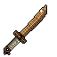 Training Heavy Sabre

`training_heavy_sabre` · Equipment, weapon · Plain · iLv 5 · stack 1

- **Stats**: Weapon Attack 26 at iLv 5, Common quality (`stats.json` equipment.weapon_attack); Family heavy_sabre; Appearance sabre
- **Requires**: Body 8
- **Sources**:
  - Drop: banded equipment roll, grade Plain: see [Banded equipment drops](#banded-plain)
  - Shop: Stoneford Smith (Smith Bao in Artisan Row (Stoneford)) · at list price in Silver Taels

###  Training Jian

`training_jian` · Equipment, weapon · Plain · iLv 5 · stack 1

- **Stats**: Weapon Attack 26 at iLv 5, Common quality (`stats.json` equipment.weapon_attack); Family jian; Appearance sword
- **Sources**:
  - Drop: banded equipment roll, grade Plain: see [Banded equipment drops](#banded-plain)
  - Shop: Stoneford Smith (Smith Bao in Artisan Row (Stoneford)) · at list price in Silver Taels
  - Reward: Quest The Weapon Hall (guided, from Master Kong), on accept

###  Training Short Blade

`training_short_blade` · Equipment, weapon · Plain · iLv 5 · stack 1

- **Stats**: Weapon Attack 26 at iLv 5, Common quality (`stats.json` equipment.weapon_attack); Family short_blade; Appearance dagger
- **Sources**:
  - Drop: banded equipment roll, grade Plain: see [Banded equipment drops](#banded-plain)
  - Shop: Stoneford Smith (Smith Bao in Artisan Row (Stoneford)) · at list price in Silver Taels

###  Training Spear

`training_spear` · Equipment, weapon · Plain · iLv 5 · stack 1

- **Stats**: Weapon Attack 26 at iLv 5, Common quality (`stats.json` equipment.weapon_attack); Family spear; Appearance spear
- **Sources**:
  - Drop: banded equipment roll, grade Plain: see [Banded equipment drops](#banded-plain)
  - Shop: Stoneford Smith (Smith Bao in Artisan Row (Stoneford)) · at list price in Silver Taels
  - Reward: Quest The Weapon Hall (guided, from Master Kong), on accept

###  Training Staff

`training_staff` · Equipment, weapon · Plain · iLv 5 · stack 1

- **Stats**: Weapon Attack 26 at iLv 5, Common quality (`stats.json` equipment.weapon_attack); Family staff; Appearance staff
- **Requires**: Body 8
- **Sources**:
  - Drop: banded equipment roll, grade Plain: see [Banded equipment drops](#banded-plain)
  - Shop: Stoneford Smith (Smith Bao in Artisan Row (Stoneford)) · at list price in Silver Taels
  - Reward: Quest The Weapon Hall (guided, from Master Kong), on accept

###  Iron Bell

`iron_bell` · Equipment, weapon · Common · iLv 14 · stack 1

- **Stats**: Weapon Attack 73.5 at iLv 14, Common quality (`stats.json` equipment.weapon_attack); Family bell; Energy type primal_qi; Appearance bell
- **Requires**: Essence 18
- **Sources**:
  - Drop: banded equipment roll, grade Common: see [Banded equipment drops](#banded-common)
  - Crafting: Recipe `iron_bell` (Smithing, Common): Copper ×6, Riverstone ×3, Boar Hide ×2
  - Shop: Stoneford Smith (Smith Bao in Artisan Row (Stoneford)) · at list price in Silver Taels; needs Qi Kindling 1

###  Iron Bow

`iron_bow` · Equipment, weapon · Common · iLv 14 · stack 1

- **Stats**: Weapon Attack 73.5 at iLv 14, Common quality (`stats.json` equipment.weapon_attack); Family bow; Energy type primal_qi; Appearance bow
- **Requires**: Agility 18
- **Sources**:
  - Drop: banded equipment roll, grade Common: see [Banded equipment drops](#banded-common)
  - Crafting: Recipe `iron_bow` (Smithing, Common): Copper ×6, Riverstone ×3, Boar Hide ×2
  - Shop: Stoneford Smith (Smith Bao in Artisan Row (Stoneford)) · at list price in Silver Taels; needs Qi Kindling 1

###  Iron Brush

`iron_brush` · Equipment, weapon · Common · iLv 14 · stack 1

- **Stats**: Weapon Attack 73.5 at iLv 14, Common quality (`stats.json` equipment.weapon_attack); Family brush; Energy type primal_qi; Appearance brush
- **Requires**: Insight 18
- **Sources**:
  - Drop: banded equipment roll, grade Common: see [Banded equipment drops](#banded-common)
  - Crafting: Recipe `iron_brush` (Smithing, Common): Copper ×6, Riverstone ×3, Boar Hide ×2
  - Shop: Stoneford Smith (Smith Bao in Artisan Row (Stoneford)) · at list price in Silver Taels; needs Qi Kindling 1

### 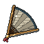 Iron Fan

`iron_fan` · Equipment, weapon · Common · iLv 14 · stack 1

- **Stats**: Weapon Attack 73.5 at iLv 14, Common quality (`stats.json` equipment.weapon_attack); Family fan; Energy type primal_qi; Appearance fan
- **Sources**:
  - Drop: banded equipment roll, grade Common: see [Banded equipment drops](#banded-common)
  - Crafting: Recipe `iron_fan` (Smithing, Common): Copper ×6, Riverstone ×3, Boar Hide ×2
  - Shop: Stoneford Smith (Smith Bao in Artisan Row (Stoneford)) · at list price in Silver Taels; needs Qi Kindling 1

###  Iron Flute

`iron_flute` · Equipment, weapon · Common · iLv 14 · stack 1

- **Stats**: Weapon Attack 73.5 at iLv 14, Common quality (`stats.json` equipment.weapon_attack); Family flute; Energy type primal_qi; Appearance flute
- **Requires**: Insight 18
- **Sources**:
  - Drop: banded equipment roll, grade Common: see [Banded equipment drops](#banded-common)
  - Crafting: Recipe `iron_flute` (Smithing, Common): Copper ×6, Riverstone ×3, Boar Hide ×2
  - Shop: Stoneford Smith (Smith Bao in Artisan Row (Stoneford)) · at list price in Silver Taels; needs Qi Kindling 1

###  Iron Gauntlets

`iron_gauntlets` · Equipment, weapon · Common · iLv 14 · stack 1

- **Stats**: Weapon Attack 73.5 at iLv 14, Common quality (`stats.json` equipment.weapon_attack); Family gauntlets; Energy type primal_qi; Appearance gauntlets
- **Sources**:
  - Drop: banded equipment roll, grade Common: see [Banded equipment drops](#banded-common)
  - Crafting: Recipe `iron_gauntlets` (Smithing, Common): Copper ×6, Riverstone ×3, Boar Hide ×2
  - Shop: Stoneford Smith (Smith Bao in Artisan Row (Stoneford)) · at list price in Silver Taels; needs Qi Kindling 1

### 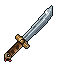 Iron Heavy Sabre

`iron_heavy_sabre` · Equipment, weapon · Common · iLv 14 · stack 1

- **Stats**: Weapon Attack 73.5 at iLv 14, Common quality (`stats.json` equipment.weapon_attack); Family heavy_sabre; Energy type primal_qi; Appearance sabre
- **Requires**: Body 18
- **Sources**:
  - Drop: banded equipment roll, grade Common: see [Banded equipment drops](#banded-common)
  - Crafting: Recipe `iron_heavy_sabre` (Smithing, Common): Copper ×6, Riverstone ×3, Boar Hide ×2
  - Shop: Stoneford Smith (Smith Bao in Artisan Row (Stoneford)) · at list price in Silver Taels; needs Qi Kindling 1

###  Iron Jian

`iron_jian` · Equipment, weapon · Common · iLv 14 · stack 1

- **Stats**: Weapon Attack 73.5 at iLv 14, Common quality (`stats.json` equipment.weapon_attack); Family jian; Energy type primal_qi; Appearance sword
- **Sources**:
  - Drop: banded equipment roll, grade Common: see [Banded equipment drops](#banded-common)
  - Crafting: Recipe `iron_jian` (Smithing, Common): Copper ×6, Riverstone ×3, Boar Hide ×2
  - Shop: Stoneford Smith (Smith Bao in Artisan Row (Stoneford)) · at list price in Silver Taels; needs Qi Kindling 1

###  Iron Short Blade

`iron_short_blade` · Equipment, weapon · Common · iLv 14 · stack 1

- **Stats**: Weapon Attack 73.5 at iLv 14, Common quality (`stats.json` equipment.weapon_attack); Family short_blade; Energy type primal_qi; Appearance dagger
- **Sources**:
  - Drop: banded equipment roll, grade Common: see [Banded equipment drops](#banded-common)
  - Crafting: Recipe `iron_short_blade` (Smithing, Common): Copper ×6, Riverstone ×3, Boar Hide ×2
  - Shop: Stoneford Smith (Smith Bao in Artisan Row (Stoneford)) · at list price in Silver Taels; needs Qi Kindling 1

###  Iron Spear

`iron_spear` · Equipment, weapon · Common · iLv 14 · stack 1

- **Stats**: Weapon Attack 73.5 at iLv 14, Common quality (`stats.json` equipment.weapon_attack); Family spear; Energy type primal_qi; Appearance spear
- **Sources**:
  - Drop: banded equipment roll, grade Common: see [Banded equipment drops](#banded-common)
  - Crafting: Recipe `iron_spear` (Smithing, Common): Copper ×6, Riverstone ×3, Boar Hide ×2
  - Shop: Stoneford Smith (Smith Bao in Artisan Row (Stoneford)) · at list price in Silver Taels; needs Qi Kindling 1

###  Iron Staff

`iron_staff` · Equipment, weapon · Common · iLv 14 · stack 1

- **Stats**: Weapon Attack 73.5 at iLv 14, Common quality (`stats.json` equipment.weapon_attack); Family staff; Energy type primal_qi; Appearance staff
- **Requires**: Body 18
- **Sources**:
  - Drop: banded equipment roll, grade Common: see [Banded equipment drops](#banded-common)
  - Crafting: Recipe `iron_staff` (Smithing, Common): Copper ×6, Riverstone ×3, Boar Hide ×2
  - Shop: Stoneford Smith (Smith Bao in Artisan Row (Stoneford)) · at list price in Silver Taels; needs Qi Kindling 1

###  Mudwater Cleaver

`mudwater_cleaver` · Equipment, weapon · Common · iLv 18 · stack 1

- **Stats**: Weapon Attack 100.9 at iLv 18, Common quality (`stats.json` equipment.weapon_attack); Family jian; Energy type primal_qi; Appearance sword; set [Mudwater](#set-mudwater); named: Sword, Valley
- **Sources**:
  - Drop: [Big Toad Tan](monsters.md#enemy-big_toad_tan) (Lv 18) · first defeat, once

###  Jadeiron Bell

`jadeiron_bell` · Equipment, weapon · Earth · iLv 27 · stack 1

- **Stats**: Weapon Attack 176.5 at iLv 27, Common quality (`stats.json` equipment.weapon_attack); Family bell; Energy type primal_qi; Sockets 1; Appearance bell
- **Requires**: Essence 30
- **Sources**:
  - Drop: banded equipment roll, grade Earth: see [Banded equipment drops](#banded-earth)
  - Crafting: Recipe `jadeiron_bell` (Smithing, Earth): Jadeiron ×6, Riverstone ×4, Jade Scale ×2
  - Shop: Stoneford Smith (Smith Bao in Artisan Row (Stoneford)) · daily rotation (1 of 9)

###  Jadeiron Bow

`jadeiron_bow` · Equipment, weapon · Earth · iLv 27 · stack 1

- **Stats**: Weapon Attack 176.5 at iLv 27, Common quality (`stats.json` equipment.weapon_attack); Family bow; Energy type primal_qi; Sockets 1; Appearance bow
- **Requires**: Agility 30
- **Sources**:
  - Drop: banded equipment roll, grade Earth: see [Banded equipment drops](#banded-earth)
  - Crafting: Recipe `jadeiron_bow` (Smithing, Earth): Jadeiron ×6, Riverstone ×4, Jade Scale ×2

###  Jadeiron Brush

`jadeiron_brush` · Equipment, weapon · Earth · iLv 27 · stack 1

- **Stats**: Weapon Attack 176.5 at iLv 27, Common quality (`stats.json` equipment.weapon_attack); Family brush; Energy type primal_qi; Sockets 1; Appearance brush
- **Requires**: Insight 30
- **Sources**:
  - Drop: banded equipment roll, grade Earth: see [Banded equipment drops](#banded-earth)
  - Crafting: Recipe `jadeiron_brush` (Smithing, Earth): Jadeiron ×6, Riverstone ×4, Jade Scale ×2
  - Shop: Stoneford Smith (Smith Bao in Artisan Row (Stoneford)) · daily rotation (1 of 9)

###  Jadeiron Fan

`jadeiron_fan` · Equipment, weapon · Earth · iLv 27 · stack 1

- **Stats**: Weapon Attack 176.5 at iLv 27, Common quality (`stats.json` equipment.weapon_attack); Family fan; Energy type primal_qi; Sockets 1; Appearance fan
- **Sources**:
  - Drop: banded equipment roll, grade Earth: see [Banded equipment drops](#banded-earth)
  - Crafting: Recipe `jadeiron_fan` (Smithing, Earth): Jadeiron ×6, Riverstone ×4, Jade Scale ×2
  - Shop: Stoneford Smith (Smith Bao in Artisan Row (Stoneford)) · daily rotation (1 of 9)

###  Jadeiron Flute

`jadeiron_flute` · Equipment, weapon · Earth · iLv 27 · stack 1

- **Stats**: Weapon Attack 176.5 at iLv 27, Common quality (`stats.json` equipment.weapon_attack); Family flute; Energy type primal_qi; Sockets 1; Appearance flute
- **Requires**: Insight 30
- **Sources**:
  - Drop: banded equipment roll, grade Earth: see [Banded equipment drops](#banded-earth)
  - Crafting: Recipe `jadeiron_flute` (Smithing, Earth): Jadeiron ×6, Riverstone ×4, Jade Scale ×2
  - Shop: Stoneford Smith (Smith Bao in Artisan Row (Stoneford)) · daily rotation (1 of 9)

###  Jadeiron Gauntlets

`jadeiron_gauntlets` · Equipment, weapon · Earth · iLv 27 · stack 1

- **Stats**: Weapon Attack 176.5 at iLv 27, Common quality (`stats.json` equipment.weapon_attack); Family gauntlets; Energy type primal_qi; Sockets 1; Appearance gauntlets
- **Sources**:
  - Drop: banded equipment roll, grade Earth: see [Banded equipment drops](#banded-earth)
  - Crafting: Recipe `jadeiron_gauntlets` (Smithing, Earth): Jadeiron ×6, Riverstone ×4, Jade Scale ×2

###  Jadeiron Heavy Sabre

`jadeiron_heavy_sabre` · Equipment, weapon · Earth · iLv 27 · stack 1

- **Stats**: Weapon Attack 176.5 at iLv 27, Common quality (`stats.json` equipment.weapon_attack); Family heavy_sabre; Energy type primal_qi; Sockets 1; Appearance sabre
- **Requires**: Body 30
- **Sources**:
  - Drop: banded equipment roll, grade Earth: see [Banded equipment drops](#banded-earth)
  - Crafting: Recipe `jadeiron_heavy_sabre` (Smithing, Earth): Jadeiron ×6, Riverstone ×4, Jade Scale ×2
  - Shop: Stoneford Smith (Smith Bao in Artisan Row (Stoneford)) · daily rotation (1 of 9)

###  Jadeiron Jian

`jadeiron_jian` · Equipment, weapon · Earth · iLv 27 · stack 1

- **Stats**: Weapon Attack 176.5 at iLv 27, Common quality (`stats.json` equipment.weapon_attack); Family jian; Energy type primal_qi; Sockets 1; Appearance sword
- **Sources**:
  - Drop: banded equipment roll, grade Earth: see [Banded equipment drops](#banded-earth)
  - Crafting: Recipe `jadeiron_jian` (Smithing, Earth): Jadeiron ×6, Riverstone ×4, Jade Scale ×2
  - Shop: Stoneford Smith (Smith Bao in Artisan Row (Stoneford)) · daily rotation (1 of 9)

###  Jadeiron Short Blade

`jadeiron_short_blade` · Equipment, weapon · Earth · iLv 27 · stack 1

- **Stats**: Weapon Attack 176.5 at iLv 27, Common quality (`stats.json` equipment.weapon_attack); Family short_blade; Energy type primal_qi; Sockets 1; Appearance dagger
- **Sources**:
  - Drop: banded equipment roll, grade Earth: see [Banded equipment drops](#banded-earth)
  - Crafting: Recipe `jadeiron_short_blade` (Smithing, Earth): Jadeiron ×6, Riverstone ×4, Jade Scale ×2

###  Jadeiron Spear

`jadeiron_spear` · Equipment, weapon · Earth · iLv 27 · stack 1

- **Stats**: Weapon Attack 176.5 at iLv 27, Common quality (`stats.json` equipment.weapon_attack); Family spear; Energy type primal_qi; Sockets 1; Appearance spear
- **Sources**:
  - Drop: banded equipment roll, grade Earth: see [Banded equipment drops](#banded-earth)
  - Crafting: Recipe `jadeiron_spear` (Smithing, Earth): Jadeiron ×6, Riverstone ×4, Jade Scale ×2
  - Shop: Stoneford Smith (Smith Bao in Artisan Row (Stoneford)) · daily rotation (1 of 9)

### 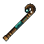 Jadeiron Staff

`jadeiron_staff` · Equipment, weapon · Earth · iLv 27 · stack 1

- **Stats**: Weapon Attack 176.5 at iLv 27, Common quality (`stats.json` equipment.weapon_attack); Family staff; Energy type primal_qi; Sockets 1; Appearance staff
- **Requires**: Body 30
- **Sources**:
  - Drop: banded equipment roll, grade Earth: see [Banded equipment drops](#banded-earth)
  - Crafting: Recipe `jadeiron_staff` (Smithing, Earth): Jadeiron ×6, Riverstone ×4, Jade Scale ×2

###  Serpent-Tongue Jian

`serpent_tongue_jian` · Equipment, weapon · Earth · iLv 30 · stack 1

> A rogue cultivator's jian, its blade forked at the tip. Whoever it belonged to, it is yours now.

- **Stats**: Weapon Attack 206 at iLv 30, Common quality (`stats.json` equipment.weapon_attack); Family jian; Energy type primal_qi; Sockets 1; Appearance sword; named: Sword, Valley, element Metal (+2% metal power), path Sword dao, fixed Penetration +4.5%
- **Sources**:
  - Drop: [Rogue Cultivator](monsters.md#enemy-rogue_cultivator) (Lv 24–26) · 100% (guaranteed)

###  Cloudsteel Bell

`cloudsteel_bell` · Equipment, weapon · Heaven · iLv 45 · stack 1

- **Stats**: Weapon Attack 386 at iLv 45, Common quality (`stats.json` equipment.weapon_attack); Family bell; Energy type true_qi; Sockets 1; Appearance bell
- **Requires**: Essence 50
- **Sources**:
  - Drop: banded equipment roll, grade Heaven: see [Banded equipment drops](#banded-heaven)
  - Crafting: Recipe `cloudsteel_bell` (Smithing, Heaven): Cloudsteel Ore ×6, Jadeiron ×4, Cloud Feather ×2

###  Cloudsteel Bow

`cloudsteel_bow` · Equipment, weapon · Heaven · iLv 45 · stack 1

- **Stats**: Weapon Attack 386 at iLv 45, Common quality (`stats.json` equipment.weapon_attack); Family bow; Energy type true_qi; Sockets 1; Appearance bow
- **Requires**: Agility 50
- **Sources**:
  - Drop: banded equipment roll, grade Heaven: see [Banded equipment drops](#banded-heaven)
  - Crafting: Recipe `cloudsteel_bow` (Smithing, Heaven): Cloudsteel Ore ×6, Jadeiron ×4, Cloud Feather ×2

###  Cloudsteel Brush

`cloudsteel_brush` · Equipment, weapon · Heaven · iLv 45 · stack 1

- **Stats**: Weapon Attack 386 at iLv 45, Common quality (`stats.json` equipment.weapon_attack); Family brush; Energy type true_qi; Sockets 1; Appearance brush
- **Requires**: Insight 50
- **Sources**:
  - Drop: banded equipment roll, grade Heaven: see [Banded equipment drops](#banded-heaven)
  - Crafting: Recipe `cloudsteel_brush` (Smithing, Heaven): Cloudsteel Ore ×6, Jadeiron ×4, Cloud Feather ×2

###  Cloudsteel Fan

`cloudsteel_fan` · Equipment, weapon · Heaven · iLv 45 · stack 1

- **Stats**: Weapon Attack 386 at iLv 45, Common quality (`stats.json` equipment.weapon_attack); Family fan; Energy type true_qi; Sockets 1; Appearance fan
- **Sources**:
  - Drop: banded equipment roll, grade Heaven: see [Banded equipment drops](#banded-heaven)
  - Crafting: Recipe `cloudsteel_fan` (Smithing, Heaven): Cloudsteel Ore ×6, Jadeiron ×4, Cloud Feather ×2

###  Cloudsteel Flute

`cloudsteel_flute` · Equipment, weapon · Heaven · iLv 45 · stack 1

- **Stats**: Weapon Attack 386 at iLv 45, Common quality (`stats.json` equipment.weapon_attack); Family flute; Energy type true_qi; Sockets 1; Appearance flute
- **Requires**: Insight 50
- **Sources**:
  - Drop: banded equipment roll, grade Heaven: see [Banded equipment drops](#banded-heaven)
  - Crafting: Recipe `cloudsteel_flute` (Smithing, Heaven): Cloudsteel Ore ×6, Jadeiron ×4, Cloud Feather ×2

###  Cloudsteel Gauntlets

`cloudsteel_gauntlets` · Equipment, weapon · Heaven · iLv 45 · stack 1

- **Stats**: Weapon Attack 386 at iLv 45, Common quality (`stats.json` equipment.weapon_attack); Family gauntlets; Energy type true_qi; Sockets 1; Appearance gauntlets
- **Sources**:
  - Drop: banded equipment roll, grade Heaven: see [Banded equipment drops](#banded-heaven)
  - Crafting: Recipe `cloudsteel_gauntlets` (Smithing, Heaven): Cloudsteel Ore ×6, Jadeiron ×4, Cloud Feather ×2

###  Cloudsteel Heavy Sabre

`cloudsteel_heavy_sabre` · Equipment, weapon · Heaven · iLv 45 · stack 1

- **Stats**: Weapon Attack 386 at iLv 45, Common quality (`stats.json` equipment.weapon_attack); Family heavy_sabre; Energy type true_qi; Sockets 1; Appearance sabre
- **Requires**: Body 50
- **Sources**:
  - Drop: banded equipment roll, grade Heaven: see [Banded equipment drops](#banded-heaven)
  - Crafting: Recipe `cloudsteel_heavy_sabre` (Smithing, Heaven): Cloudsteel Ore ×6, Jadeiron ×4, Cloud Feather ×2

###  Cloudsteel Jian

`cloudsteel_jian` · Equipment, weapon · Heaven · iLv 45 · stack 1

- **Stats**: Weapon Attack 386 at iLv 45, Common quality (`stats.json` equipment.weapon_attack); Family jian; Energy type true_qi; Sockets 1; Appearance sword
- **Sources**:
  - Drop: banded equipment roll, grade Heaven: see [Banded equipment drops](#banded-heaven)
  - Crafting: Recipe `cloudsteel_jian` (Smithing, Heaven): Cloudsteel Ore ×6, Jadeiron ×4, Cloud Feather ×2

###  Cloudsteel Short Blade

`cloudsteel_short_blade` · Equipment, weapon · Heaven · iLv 45 · stack 1

- **Stats**: Weapon Attack 386 at iLv 45, Common quality (`stats.json` equipment.weapon_attack); Family short_blade; Energy type true_qi; Sockets 1; Appearance dagger
- **Sources**:
  - Drop: banded equipment roll, grade Heaven: see [Banded equipment drops](#banded-heaven)
  - Crafting: Recipe `cloudsteel_short_blade` (Smithing, Heaven): Cloudsteel Ore ×6, Jadeiron ×4, Cloud Feather ×2

###  Cloudsteel Spear

`cloudsteel_spear` · Equipment, weapon · Heaven · iLv 45 · stack 1

- **Stats**: Weapon Attack 386 at iLv 45, Common quality (`stats.json` equipment.weapon_attack); Family spear; Energy type true_qi; Sockets 1; Appearance spear
- **Sources**:
  - Drop: banded equipment roll, grade Heaven: see [Banded equipment drops](#banded-heaven)
  - Crafting: Recipe `cloudsteel_spear` (Smithing, Heaven): Cloudsteel Ore ×6, Jadeiron ×4, Cloud Feather ×2

###  Cloudsteel Staff

`cloudsteel_staff` · Equipment, weapon · Heaven · iLv 45 · stack 1

- **Stats**: Weapon Attack 386 at iLv 45, Common quality (`stats.json` equipment.weapon_attack); Family staff; Energy type true_qi; Sockets 1; Appearance staff
- **Requires**: Body 50
- **Sources**:
  - Drop: banded equipment roll, grade Heaven: see [Banded equipment drops](#banded-heaven)
  - Crafting: Recipe `cloudsteel_staff` (Smithing, Heaven): Cloudsteel Ore ×6, Jadeiron ×4, Cloud Feather ×2

###  Drowsing Edge

`drowsing_edge` · Equipment, weapon · Heaven · iLv 48 · stack 1

> A forge copy of the Sleeping Blade. It keeps six parts in ten of the original's gift, and no spirit.

- **Stats**: Weapon Attack 428.5 at iLv 48, Common quality (`stats.json` equipment.weapon_attack); Family jian; Energy type true_qi; Sockets 1; Appearance sword; named: Sword, Valley; Imitation: {"effect": {"op": "flat", "stat": "crit_damage", "value": 0.06}, "of": "sleeping_blade", "share": 0.6}
- **Sources**:
  - Crafting: Recipe `drowsing_edge` (Smithing, Heaven): Cloudsteel Ore ×8, Refining Essence ×4, Stormsteel Ore ×2

###  Moonshadow Jian

`moonshadow_jian` · Equipment, weapon · Heaven · iLv 48 · stack 1

> A forge copy of the Moonlit Blade. It keeps six parts in ten of the original's gift, and no spirit.

- **Stats**: Weapon Attack 428.5 at iLv 48, Common quality (`stats.json` equipment.weapon_attack); Family jian; Energy type true_qi; Sockets 1; Appearance sword; named: Sword, Valley; Imitation: {"effect": {"op": "pct_add", "stat": "qi_attack", "value": 0.048}, "of": "moonlit_blade", "share": 0.6}
- **Sources**:
  - Crafting: Recipe `moonshadow_jian` (Smithing, Heaven): Cloudsteel Ore ×8, Refining Essence ×4, Mist Lotus ×2

###  The Moonlit Blade

`moonlit_blade` · Equipment, weapon · Heaven · iLv 50 · stack 1

- **Stats**: Weapon Attack 458 at iLv 50, Common quality (`stats.json` equipment.weapon_attack); Family jian; Energy type true_qi; Sockets 1; Appearance sword; named: Sword, Valley; Spirit: {"control": 60, "effect": {"op": "pct_add", "stat": "qi_attack", "value": 0.08}, "favourite": "mist_lotus", "name": "Moon Spirit", "skill": {"art": "moon_crescent", "damage_type": "qi", "element": "water", "every_hits": 8, "mult": 1.6, "name": "Moonlit Crescent", "reach": 300}, "strength": 26, "wake_room": "ml_lake_shrine"}; unique
- **Sources**:
  - Crafting: restoring a [Shattered Moon Blade](#item-shattered_moon_blade) at the forge

###  The Sleeping Blade

`sleeping_blade` · Equipment, weapon · Heaven · iLv 52 · stack 1

- **Stats**: Weapon Attack 488.5 at iLv 52, Common quality (`stats.json` equipment.weapon_attack); Family jian; Energy type true_qi; Sockets 1; Appearance sword; named: Sword, Valley; Spirit: {"control": 80, "effect": {"op": "flat", "stat": "crit_damage", "value": 0.1}, "favourite": "refining_essence", "name": "Blade Spirit", "skill": {"art": "flying_sword", "damage_type": "physical", "element": "metal", "every_hits": 10, "mult": 2.2, "name": "Waking Edge", "reach": 220}, "strength": 30, "wake_room": "ds_abbots_sanctum"}; unique
- **Sources**:
  - Gathering: Pickup in Abbot's Sanctum (Drowned Shrine)

###  Mistjade Bell

`mistjade_bell` · Equipment, weapon · Mystic · iLv 59 · stack 1

- **Stats**: Weapon Attack 602.7 at iLv 59, Common quality (`stats.json` equipment.weapon_attack); Family bell; Energy type true_qi; Sockets 2; Appearance bell
- **Requires**: Essence 65
- **Sources**:
  - Drop: banded equipment roll, grade Mystic: see [Banded equipment drops](#banded-mystic)
  - Crafting: Recipe `mistjade_bell` (Smithing, Mystic): Mystic Ore ×6, Cloudsteel Ore ×4, Roc Feather ×2

###  Mistjade Bow

`mistjade_bow` · Equipment, weapon · Mystic · iLv 59 · stack 1

- **Stats**: Weapon Attack 602.7 at iLv 59, Common quality (`stats.json` equipment.weapon_attack); Family bow; Energy type true_qi; Sockets 2; Appearance bow
- **Requires**: Agility 65
- **Sources**:
  - Drop: banded equipment roll, grade Mystic: see [Banded equipment drops](#banded-mystic)
  - Crafting: Recipe `mistjade_bow` (Smithing, Mystic): Mystic Ore ×6, Cloudsteel Ore ×4, Roc Feather ×2

###  Mistjade Brush

`mistjade_brush` · Equipment, weapon · Mystic · iLv 59 · stack 1

- **Stats**: Weapon Attack 602.7 at iLv 59, Common quality (`stats.json` equipment.weapon_attack); Family brush; Energy type true_qi; Sockets 2; Appearance brush
- **Requires**: Insight 65
- **Sources**:
  - Drop: banded equipment roll, grade Mystic: see [Banded equipment drops](#banded-mystic)
  - Crafting: Recipe `mistjade_brush` (Smithing, Mystic): Mystic Ore ×6, Cloudsteel Ore ×4, Roc Feather ×2

###  Mistjade Fan

`mistjade_fan` · Equipment, weapon · Mystic · iLv 59 · stack 1

- **Stats**: Weapon Attack 602.7 at iLv 59, Common quality (`stats.json` equipment.weapon_attack); Family fan; Energy type true_qi; Sockets 2; Appearance fan
- **Sources**:
  - Drop: banded equipment roll, grade Mystic: see [Banded equipment drops](#banded-mystic)
  - Crafting: Recipe `mistjade_fan` (Smithing, Mystic): Mystic Ore ×6, Cloudsteel Ore ×4, Roc Feather ×2

###  Mistjade Flute

`mistjade_flute` · Equipment, weapon · Mystic · iLv 59 · stack 1

- **Stats**: Weapon Attack 602.7 at iLv 59, Common quality (`stats.json` equipment.weapon_attack); Family flute; Energy type true_qi; Sockets 2; Appearance flute
- **Requires**: Insight 65
- **Sources**:
  - Drop: banded equipment roll, grade Mystic: see [Banded equipment drops](#banded-mystic)
  - Crafting: Recipe `mistjade_flute` (Smithing, Mystic): Mystic Ore ×6, Cloudsteel Ore ×4, Roc Feather ×2

###  Mistjade Gauntlets

`mistjade_gauntlets` · Equipment, weapon · Mystic · iLv 59 · stack 1

- **Stats**: Weapon Attack 602.7 at iLv 59, Common quality (`stats.json` equipment.weapon_attack); Family gauntlets; Energy type true_qi; Sockets 2; Appearance gauntlets
- **Sources**:
  - Drop: banded equipment roll, grade Mystic: see [Banded equipment drops](#banded-mystic)
  - Crafting: Recipe `mistjade_gauntlets` (Smithing, Mystic): Mystic Ore ×6, Cloudsteel Ore ×4, Roc Feather ×2

###  Mistjade Heavy Sabre

`mistjade_heavy_sabre` · Equipment, weapon · Mystic · iLv 59 · stack 1

- **Stats**: Weapon Attack 602.7 at iLv 59, Common quality (`stats.json` equipment.weapon_attack); Family heavy_sabre; Energy type true_qi; Sockets 2; Appearance sabre
- **Requires**: Body 65
- **Sources**:
  - Drop: banded equipment roll, grade Mystic: see [Banded equipment drops](#banded-mystic)
  - Crafting: Recipe `mistjade_heavy_sabre` (Smithing, Mystic): Mystic Ore ×6, Cloudsteel Ore ×4, Roc Feather ×2

###  Mistjade Jian

`mistjade_jian` · Equipment, weapon · Mystic · iLv 59 · stack 1

- **Stats**: Weapon Attack 602.7 at iLv 59, Common quality (`stats.json` equipment.weapon_attack); Family jian; Energy type true_qi; Sockets 2; Appearance sword
- **Sources**:
  - Drop: banded equipment roll, grade Mystic: see [Banded equipment drops](#banded-mystic)
  - Crafting: Recipe `mistjade_jian` (Smithing, Mystic): Mystic Ore ×6, Cloudsteel Ore ×4, Roc Feather ×2

###  Mistjade Short Blade

`mistjade_short_blade` · Equipment, weapon · Mystic · iLv 59 · stack 1

- **Stats**: Weapon Attack 602.7 at iLv 59, Common quality (`stats.json` equipment.weapon_attack); Family short_blade; Energy type true_qi; Sockets 2; Appearance dagger
- **Sources**:
  - Drop: banded equipment roll, grade Mystic: see [Banded equipment drops](#banded-mystic)
  - Crafting: Recipe `mistjade_short_blade` (Smithing, Mystic): Mystic Ore ×6, Cloudsteel Ore ×4, Roc Feather ×2

###  Mistjade Spear

`mistjade_spear` · Equipment, weapon · Mystic · iLv 59 · stack 1

- **Stats**: Weapon Attack 602.7 at iLv 59, Common quality (`stats.json` equipment.weapon_attack); Family spear; Energy type true_qi; Sockets 2; Appearance spear
- **Sources**:
  - Drop: banded equipment roll, grade Mystic: see [Banded equipment drops](#banded-mystic)
  - Crafting: Recipe `mistjade_spear` (Smithing, Mystic): Mystic Ore ×6, Cloudsteel Ore ×4, Roc Feather ×2

###  Mistjade Staff

`mistjade_staff` · Equipment, weapon · Mystic · iLv 59 · stack 1

- **Stats**: Weapon Attack 602.7 at iLv 59, Common quality (`stats.json` equipment.weapon_attack); Family staff; Energy type true_qi; Sockets 2; Appearance staff
- **Requires**: Body 65
- **Sources**:
  - Drop: banded equipment roll, grade Mystic: see [Banded equipment drops](#banded-mystic)
  - Crafting: Recipe `mistjade_staff` (Smithing, Mystic): Mystic Ore ×6, Cloudsteel Ore ×4, Roc Feather ×2

###  Crane Mourning Flute

`crane_mourning_flute` · Equipment, weapon · Mystic · iLv 64 · stack 1

> Carved from the wing bone of a crane that outlived its mate. Every tune it plays is a little sad.

- **Stats**: Weapon Attack 691.5 at iLv 64, Common quality (`stats.json` equipment.weapon_attack); Family flute; Energy type true_qi; Sockets 2; Appearance flute; named: Musician, Expanse; Legend: {"chain": "crane_mourning", "effect": {"op": "pct_add", "stat": "soul_attack", "value": 0.08}, "skill": {"art": "note", "damage_type": "soul", "element": "none", "every_hits": 10, "mult": 2.0, "name": "Crane's Lament", "reach": 340}}
- **Notes**: cannot be sold
- **Sources**:
  - Crafting: Recipe `crane_mourning_flute` (Smithing, Mystic): Crane Bone Mouthpiece ×1, Crane Jade Body ×1, Crane Tassel ×1, Mystic Ore ×4, Refining Essence ×8
  - Crafting: legendary chain Crane Mourning Flute: its pieces ([Crane Bone Mouthpiece](#item-crane_mouthpiece), [Crane Jade Body](#item-crane_jade_body), [Crane Tassel](#item-crane_tassel)) made whole by an Expert smith

###  Dragonfly Bow

`dragonfly_bow` · Equipment, weapon · Mystic · iLv 64 · stack 1

> Light as a dragonfly's wing, and its arrows turn in the air the way a dragonfly does.

- **Stats**: Weapon Attack 691.5 at iLv 64, Common quality (`stats.json` equipment.weapon_attack); Family bow; Energy type true_qi; Sockets 2; Appearance bow; named: Beast, Expanse; Legend: {"chain": "dragonfly", "effect": {"op": "flat", "stat": "crit_damage", "value": 0.12}, "skill": {"art": "arrow", "count": 3, "damage_type": "physical", "element": "wind", "every_hits": 8, "mult": 1.6, "name": "Dragonfly Volley", "reach": 420}}
- **Notes**: cannot be sold
- **Sources**:
  - Crafting: Recipe `dragonfly_bow` (Smithing, Mystic): Dragonfly Limb ×1, Dragonfly String ×1, Dragonfly Sight ×1, Mystic Ore ×4, Refining Essence ×8
  - Crafting: legendary chain Dragonfly Bow: its pieces ([Dragonfly Limb](#item-dragonfly_limb), [Dragonfly String](#item-dragonfly_string), [Dragonfly Sight](#item-dragonfly_sight)) made whole by an Expert smith

###  Heron's Reach

`heron_reach_spear` · Equipment, weapon · Mystic · iLv 64 · stack 1

> Its bearer stood in the reeds so still that herons landed on the shaft.

- **Stats**: Weapon Attack 691.5 at iLv 64, Common quality (`stats.json` equipment.weapon_attack); Family spear; Energy type true_qi; Sockets 2; Appearance spear; named: Body, Expanse; Legend: {"chain": "heron_reach", "effect": {"op": "flat", "stat": "crit_chance", "value": 0.04}, "skill": {"art": "flying_sword", "damage_type": "physical", "element": "metal", "every_hits": 10, "mult": 2.6, "name": "Heron Strike", "reach": 380}}
- **Notes**: cannot be sold
- **Sources**:
  - Crafting: Recipe `heron_reach_spear` (Smithing, Mystic): Heron Spearhead ×1, Heron Shaft ×1, Heron Tassel ×1, Mystic Ore ×4, Refining Essence ×8
  - Crafting: legendary chain Heron's Reach: its pieces ([Heron Spearhead](#item-heron_spearhead), [Heron Shaft](#item-heron_shaft), [Heron Tassel](#item-heron_tassel)) made whole by an Expert smith

###  Mountainsplit Sabre

`mountainsplit_sabre` · Equipment, weapon · Mystic · iLv 64 · stack 1

> They say it split a hill in two. The hill, they add, had it coming.

- **Stats**: Weapon Attack 691.5 at iLv 64, Common quality (`stats.json` equipment.weapon_attack); Family heavy_sabre; Energy type true_qi; Sockets 2; Appearance sabre; named: Body, Expanse; Legend: {"chain": "mountainsplit", "effect": {"op": "pct_add", "stat": "physical_attack", "value": 0.06}, "skill": {"damage_type": "physical", "element": "earth", "every_hits": 12, "mult": 3.0, "name": "Split the Mountain", "reach": 150, "shape": "ring"}}
- **Notes**: cannot be sold
- **Sources**:
  - Crafting: Recipe `mountainsplit_sabre` (Smithing, Mystic): Mountainsplit Spine ×1, Mountainsplit Edge ×1, Mountainsplit Guard ×1, Mystic Ore ×4, Refining Essence ×8
  - Crafting: legendary chain Mountainsplit Sabre: its pieces ([Mountainsplit Spine](#item-mountainsplit_spine), [Mountainsplit Edge](#item-mountainsplit_edge), [Mountainsplit Guard](#item-mountainsplit_guard)) made whole by an Expert smith

###  Reedwhisper Dagger

`reedwhisper_dagger` · Equipment, weapon · Mystic · iLv 64 · stack 1

> It makes no more sound than wind in the reeds. Its last owner was never heard coming.

- **Stats**: Weapon Attack 691.5 at iLv 64, Common quality (`stats.json` equipment.weapon_attack); Family short_blade; Energy type true_qi; Sockets 2; Appearance dagger; named: Alchemist, Expanse; Legend: {"chain": "reedwhisper", "effect": {"op": "pct_add", "stat": "evasion", "value": 0.08}, "skill": {"art": "flying_sword", "damage_type": "physical", "element": "wood", "every_hits": 8, "mult": 1.8, "name": "Whisper Through Reeds", "reach": 300}}
- **Notes**: cannot be sold
- **Sources**:
  - Crafting: Recipe `reedwhisper_dagger` (Smithing, Mystic): Reedwhisper Edge ×1, Reedwhisper Grip ×1, Reedwhisper Sheath ×1, Mystic Ore ×4, Refining Essence ×8
  - Crafting: legendary chain Reedwhisper Dagger: its pieces ([Reedwhisper Edge](#item-reedwhisper_edge), [Reedwhisper Grip](#item-reedwhisper_grip), [Reedwhisper Sheath](#item-reedwhisper_sheath)) made whole by an Expert smith

###  Riverlight Jian

`riverlight_jian` · Equipment, weapon · Mystic · iLv 64 · stack 1

> Forged in the shallows at dawn, so the saying goes, and quenched in the river's first light.

- **Stats**: Weapon Attack 691.5 at iLv 64, Common quality (`stats.json` equipment.weapon_attack); Family jian; Energy type true_qi; Sockets 2; Appearance sword; named: Sword, Expanse; Legend: {"chain": "riverlight", "effect": {"op": "pct_add", "stat": "qi_attack", "value": 0.08}, "skill": {"art": "moon_crescent", "damage_type": "qi", "element": "water", "every_hits": 10, "mult": 2.4, "name": "Riverlight Cut", "reach": 320}}
- **Notes**: cannot be sold
- **Sources**:
  - Crafting: Recipe `riverlight_jian` (Smithing, Mystic): Riverlight Hilt ×1, Riverlight Blade ×1, Riverlight Soul Bead ×1, Mystic Ore ×4, Refining Essence ×8
  - Crafting: legendary chain Riverlight Jian: its pieces ([Riverlight Hilt](#item-riverlight_hilt), [Riverlight Blade](#item-riverlight_blade), [Riverlight Soul Bead](#item-riverlight_soul)) made whole by an Expert smith

###  Seven Winds Fan

`seven_winds_fan` · Equipment, weapon · Mystic · iLv 64 · stack 1

> Six winds answer anyone who waves it. The seventh answers only a friend.

- **Stats**: Weapon Attack 691.5 at iLv 64, Common quality (`stats.json` equipment.weapon_attack); Family fan; Energy type true_qi; Sockets 2; Appearance fan; named: Formation, Expanse; Legend: {"chain": "seven_winds", "effect": {"op": "pct_add", "stat": "qi_attack", "value": 0.06}, "skill": {"art": "sand_crescent", "damage_type": "qi", "element": "wind", "every_hits": 10, "mult": 2.2, "name": "The Seventh Wind", "reach": 340}}
- **Notes**: cannot be sold
- **Sources**:
  - Crafting: Recipe `seven_winds_fan` (Smithing, Mystic): Seven Winds Rib ×1, Seven Winds Silk ×1, Seven Winds Pin ×1, Mystic Ore ×4, Refining Essence ×8
  - Crafting: legendary chain Seven Winds Fan: its pieces ([Seven Winds Rib](#item-seven_winds_rib), [Seven Winds Silk](#item-seven_winds_silk), [Seven Winds Pin](#item-seven_winds_pin)) made whole by an Expert smith

###  Stone Drum Gauntlets

`stone_drum_gauntlets` · Equipment, weapon · Mystic · iLv 64 · stack 1

> A monk of the old river temple beat these like a drum, and the mountain answered.

- **Stats**: Weapon Attack 691.5 at iLv 64, Common quality (`stats.json` equipment.weapon_attack); Family gauntlets; Energy type true_qi; Sockets 2; Appearance gauntlets; named: Body, Expanse; Legend: {"chain": "stone_drum", "effect": {"op": "pct_add", "stat": "physical_defense", "value": 0.08}, "skill": {"damage_type": "physical", "element": "earth", "every_hits": 10, "mult": 2.4, "name": "Mountain Drum", "reach": 170, "shape": "ring"}}
- **Notes**: cannot be sold
- **Sources**:
  - Crafting: Recipe `stone_drum_gauntlets` (Smithing, Mystic): Stone Drum Knuckle ×1, Stone Drum Cuff ×1, Stone Drum Heart ×1, Mystic Ore ×4, Refining Essence ×8
  - Crafting: legendary chain Stone Drum Gauntlets: its pieces ([Stone Drum Knuckle](#item-stone_drum_knuckle), [Stone Drum Cuff](#item-stone_drum_cuff), [Stone Drum Heart](#item-stone_drum_heart)) made whole by an Expert smith

###  The Ferryman's Pole

`ferrymans_pole` · Equipment, weapon · Mystic · iLv 64 · stack 1

> A ferryman poled the dead across the river with it for three hundred years, and never once lost his footing.

- **Stats**: Weapon Attack 691.5 at iLv 64, Common quality (`stats.json` equipment.weapon_attack); Family staff; Energy type true_qi; Sockets 2; Appearance staff; named: Body, Expanse; Legend: {"chain": "ferryman", "effect": {"op": "pct_add", "stat": "max_hp", "value": 0.06}, "skill": {"damage_type": "physical", "element": "water", "every_hits": 10, "mult": 2.2, "name": "Pole the Current", "reach": 190, "shape": "ring"}}
- **Notes**: cannot be sold
- **Sources**:
  - Crafting: Recipe `ferrymans_pole` (Smithing, Mystic): Ferryman's Iron Cap ×1, Ferryman's Oak Shaft ×1, Ferryman's Knot ×1, Mystic Ore ×4, Refining Essence ×8
  - Crafting: legendary chain The Ferryman's Pole: its pieces ([Ferryman's Iron Cap](#item-ferryman_iron_cap), [Ferryman's Oak Shaft](#item-ferryman_oak_shaft), [Ferryman's Knot](#item-ferryman_knot)) made whole by an Expert smith

###  Stormsteel Bell

`stormsteel_bell` · Equipment, weapon · Spirit · iLv 68 · stack 1

- **Stats**: Weapon Attack 766.9 at iLv 68, Common quality (`stats.json` equipment.weapon_attack); Family bell; Energy type sage_qi; Sockets 2; Appearance bell
- **Requires**: Essence 80
- **Sources**:
  - Drop: banded equipment roll, grade Spirit: see [Banded equipment drops](#banded-spirit)
  - Crafting: Recipe `stormsteel_bell` (Smithing, Spirit): Stormsteel Ore ×6, Mystic Ore ×4, Spark Pelt ×2

###  Stormsteel Bow

`stormsteel_bow` · Equipment, weapon · Spirit · iLv 68 · stack 1

- **Stats**: Weapon Attack 766.9 at iLv 68, Common quality (`stats.json` equipment.weapon_attack); Family bow; Energy type sage_qi; Sockets 2; Appearance bow
- **Requires**: Agility 80
- **Sources**:
  - Drop: banded equipment roll, grade Spirit: see [Banded equipment drops](#banded-spirit)
  - Crafting: Recipe `stormsteel_bow` (Smithing, Spirit): Stormsteel Ore ×6, Mystic Ore ×4, Spark Pelt ×2
  - Shop: Alliance Factor's Hall (Factor Ruan in Port Market (Cloudgate Port)) · at list price in Spirit Stones

###  Stormsteel Brush

`stormsteel_brush` · Equipment, weapon · Spirit · iLv 68 · stack 1

- **Stats**: Weapon Attack 766.9 at iLv 68, Common quality (`stats.json` equipment.weapon_attack); Family brush; Energy type sage_qi; Sockets 2; Appearance brush
- **Requires**: Insight 80
- **Sources**:
  - Drop: banded equipment roll, grade Spirit: see [Banded equipment drops](#banded-spirit)
  - Crafting: Recipe `stormsteel_brush` (Smithing, Spirit): Stormsteel Ore ×6, Mystic Ore ×4, Spark Pelt ×2

###  Stormsteel Fan

`stormsteel_fan` · Equipment, weapon · Spirit · iLv 68 · stack 1

- **Stats**: Weapon Attack 766.9 at iLv 68, Common quality (`stats.json` equipment.weapon_attack); Family fan; Energy type sage_qi; Sockets 2; Appearance fan
- **Sources**:
  - Drop: banded equipment roll, grade Spirit: see [Banded equipment drops](#banded-spirit)
  - Crafting: Recipe `stormsteel_fan` (Smithing, Spirit): Stormsteel Ore ×6, Mystic Ore ×4, Spark Pelt ×2

###  Stormsteel Flute

`stormsteel_flute` · Equipment, weapon · Spirit · iLv 68 · stack 1

- **Stats**: Weapon Attack 766.9 at iLv 68, Common quality (`stats.json` equipment.weapon_attack); Family flute; Energy type sage_qi; Sockets 2; Appearance flute
- **Requires**: Insight 80
- **Sources**:
  - Drop: banded equipment roll, grade Spirit: see [Banded equipment drops](#banded-spirit)
  - Crafting: Recipe `stormsteel_flute` (Smithing, Spirit): Stormsteel Ore ×6, Mystic Ore ×4, Spark Pelt ×2

###  Stormsteel Gauntlets

`stormsteel_gauntlets` · Equipment, weapon · Spirit · iLv 68 · stack 1

- **Stats**: Weapon Attack 766.9 at iLv 68, Common quality (`stats.json` equipment.weapon_attack); Family gauntlets; Energy type sage_qi; Sockets 2; Appearance gauntlets
- **Sources**:
  - Drop: banded equipment roll, grade Spirit: see [Banded equipment drops](#banded-spirit)
  - Crafting: Recipe `stormsteel_gauntlets` (Smithing, Spirit): Stormsteel Ore ×6, Mystic Ore ×4, Spark Pelt ×2
  - Shop: Alliance Factor's Hall (Factor Ruan in Port Market (Cloudgate Port)) · at list price in Spirit Stones
  - Shop: Ironroot Clan Forge (Smith Gang in Clan Hearth (Ironroot Clan Hold)) · at list price in Spirit Stones

###  Stormsteel Heavy Sabre

`stormsteel_heavy_sabre` · Equipment, weapon · Spirit · iLv 68 · stack 1

- **Stats**: Weapon Attack 766.9 at iLv 68, Common quality (`stats.json` equipment.weapon_attack); Family heavy_sabre; Energy type sage_qi; Sockets 2; Appearance sabre
- **Requires**: Body 80
- **Sources**:
  - Drop: banded equipment roll, grade Spirit: see [Banded equipment drops](#banded-spirit)
  - Crafting: Recipe `stormsteel_heavy_sabre` (Smithing, Spirit): Stormsteel Ore ×6, Mystic Ore ×4, Spark Pelt ×2

###  Stormsteel Jian

`stormsteel_jian` · Equipment, weapon · Spirit · iLv 68 · stack 1

- **Stats**: Weapon Attack 766.9 at iLv 68, Common quality (`stats.json` equipment.weapon_attack); Family jian; Energy type sage_qi; Sockets 2; Appearance sword
- **Sources**:
  - Drop: banded equipment roll, grade Spirit: see [Banded equipment drops](#banded-spirit)
  - Crafting: Recipe `stormsteel_jian` (Smithing, Spirit): Stormsteel Ore ×6, Mystic Ore ×4, Spark Pelt ×2
  - Shop: Alliance Factor's Hall (Factor Ruan in Port Market (Cloudgate Port)) · at list price in Spirit Stones
  - Shop: Ironroot Clan Forge (Smith Gang in Clan Hearth (Ironroot Clan Hold)) · at list price in Spirit Stones

###  Stormsteel Short Blade

`stormsteel_short_blade` · Equipment, weapon · Spirit · iLv 68 · stack 1

- **Stats**: Weapon Attack 766.9 at iLv 68, Common quality (`stats.json` equipment.weapon_attack); Family short_blade; Energy type sage_qi; Sockets 2; Appearance dagger
- **Sources**:
  - Drop: banded equipment roll, grade Spirit: see [Banded equipment drops](#banded-spirit)
  - Crafting: Recipe `stormsteel_short_blade` (Smithing, Spirit): Stormsteel Ore ×6, Mystic Ore ×4, Spark Pelt ×2
  - Shop: Alliance Factor's Hall (Factor Ruan in Port Market (Cloudgate Port)) · at list price in Spirit Stones

###  Stormsteel Spear

`stormsteel_spear` · Equipment, weapon · Spirit · iLv 68 · stack 1

- **Stats**: Weapon Attack 766.9 at iLv 68, Common quality (`stats.json` equipment.weapon_attack); Family spear; Energy type sage_qi; Sockets 2; Appearance spear
- **Sources**:
  - Drop: banded equipment roll, grade Spirit: see [Banded equipment drops](#banded-spirit)
  - Crafting: Recipe `stormsteel_spear` (Smithing, Spirit): Stormsteel Ore ×6, Mystic Ore ×4, Spark Pelt ×2
  - Shop: Alliance Factor's Hall (Factor Ruan in Port Market (Cloudgate Port)) · at list price in Spirit Stones
  - Shop: Ironroot Clan Forge (Smith Gang in Clan Hearth (Ironroot Clan Hold)) · at list price in Spirit Stones

###  Stormsteel Staff

`stormsteel_staff` · Equipment, weapon · Spirit · iLv 68 · stack 1

- **Stats**: Weapon Attack 766.9 at iLv 68, Common quality (`stats.json` equipment.weapon_attack); Family staff; Energy type sage_qi; Sockets 2; Appearance staff
- **Requires**: Body 80
- **Sources**:
  - Drop: banded equipment roll, grade Spirit: see [Banded equipment drops](#banded-spirit)
  - Crafting: Recipe `stormsteel_staff` (Smithing, Spirit): Stormsteel Ore ×6, Mystic Ore ×4, Spark Pelt ×2
  - Shop: Alliance Factor's Hall (Factor Ruan in Port Market (Cloudgate Port)) · at list price in Spirit Stones
  - Shop: Ironroot Clan Forge (Smith Gang in Clan Hearth (Ironroot Clan Hold)) · at list price in Spirit Stones

###  Ink-Warden's Brush

`ink_warden_brush` · Equipment, weapon · Sage · iLv 77 · stack 1

> A Warden scribe's brush, its hairs set in black lacquer. Every technique written with it leaves a talisman on the foe.

- **Stats**: Weapon Attack 950.5 at iLv 77, Common quality (`stats.json` equipment.weapon_attack); Family brush; Energy type sage_qi; Sockets 3; Appearance brush; named: Formation, Lantern, element Space (+2% space power), path Confucian, fixed Qi attack +7.2%
- **Requires**: Insight 92
- **Sources**:
  - Shop: Tidebreak Armoury (Quartermaster Bai in Tidebreak Bastion (Tidebreak Front)) · 120 Sage Crystals

###  Sunsteel Bell

`sunsteel_bell` · Equipment, weapon · Sage · iLv 77 · stack 1

- **Stats**: Weapon Attack 950.5 at iLv 77, Common quality (`stats.json` equipment.weapon_attack); Family bell; Energy type sage_qi; Sockets 3; Appearance bell
- **Requires**: Essence 92
- **Sources**:
  - Drop: banded equipment roll, grade Sage: see [Banded equipment drops](#banded-sage)
  - Crafting: Recipe `sunsteel_bell` (Smithing, Sage): Sunglass ×6, Stormsteel Ore ×4, Scorpion Stinger ×2

###  Sunsteel Bow

`sunsteel_bow` · Equipment, weapon · Sage · iLv 77 · stack 1

- **Stats**: Weapon Attack 950.5 at iLv 77, Common quality (`stats.json` equipment.weapon_attack); Family bow; Energy type sage_qi; Sockets 3; Appearance bow
- **Requires**: Agility 92
- **Sources**:
  - Drop: banded equipment roll, grade Sage: see [Banded equipment drops](#banded-sage)
  - Crafting: Recipe `sunsteel_bow` (Smithing, Sage): Sunglass ×6, Stormsteel Ore ×4, Scorpion Stinger ×2

###  Sunsteel Brush

`sunsteel_brush` · Equipment, weapon · Sage · iLv 77 · stack 1

- **Stats**: Weapon Attack 950.5 at iLv 77, Common quality (`stats.json` equipment.weapon_attack); Family brush; Energy type sage_qi; Sockets 3; Appearance brush
- **Requires**: Insight 92
- **Sources**:
  - Drop: banded equipment roll, grade Sage: see [Banded equipment drops](#banded-sage)
  - Crafting: Recipe `sunsteel_brush` (Smithing, Sage): Sunglass ×6, Stormsteel Ore ×4, Scorpion Stinger ×2

###  Sunsteel Fan

`sunsteel_fan` · Equipment, weapon · Sage · iLv 77 · stack 1

- **Stats**: Weapon Attack 950.5 at iLv 77, Common quality (`stats.json` equipment.weapon_attack); Family fan; Energy type sage_qi; Sockets 3; Appearance fan
- **Sources**:
  - Drop: banded equipment roll, grade Sage: see [Banded equipment drops](#banded-sage)
  - Crafting: Recipe `sunsteel_fan` (Smithing, Sage): Sunglass ×6, Stormsteel Ore ×4, Scorpion Stinger ×2

###  Sunsteel Flute

`sunsteel_flute` · Equipment, weapon · Sage · iLv 77 · stack 1

- **Stats**: Weapon Attack 950.5 at iLv 77, Common quality (`stats.json` equipment.weapon_attack); Family flute; Energy type sage_qi; Sockets 3; Appearance flute
- **Requires**: Insight 92
- **Sources**:
  - Drop: banded equipment roll, grade Sage: see [Banded equipment drops](#banded-sage)
  - Crafting: Recipe `sunsteel_flute` (Smithing, Sage): Sunglass ×6, Stormsteel Ore ×4, Scorpion Stinger ×2

###  Sunsteel Gauntlets

`sunsteel_gauntlets` · Equipment, weapon · Sage · iLv 77 · stack 1

- **Stats**: Weapon Attack 950.5 at iLv 77, Common quality (`stats.json` equipment.weapon_attack); Family gauntlets; Energy type sage_qi; Sockets 3; Appearance gauntlets
- **Sources**:
  - Drop: banded equipment roll, grade Sage: see [Banded equipment drops](#banded-sage)
  - Crafting: Recipe `sunsteel_gauntlets` (Smithing, Sage): Sunglass ×6, Stormsteel Ore ×4, Scorpion Stinger ×2
  - Shop: Ironroot Clan Forge (Smith Gang in Clan Hearth (Ironroot Clan Hold)) · at list price in Spirit Stones; needs Flag set (flag clan_ironroot) and Sage Sovereign 1

###  Sunsteel Heavy Sabre

`sunsteel_heavy_sabre` · Equipment, weapon · Sage · iLv 77 · stack 1

- **Stats**: Weapon Attack 950.5 at iLv 77, Common quality (`stats.json` equipment.weapon_attack); Family heavy_sabre; Energy type sage_qi; Sockets 3; Appearance sabre
- **Requires**: Body 92
- **Sources**:
  - Drop: banded equipment roll, grade Sage: see [Banded equipment drops](#banded-sage)
  - Crafting: Recipe `sunsteel_heavy_sabre` (Smithing, Sage): Sunglass ×6, Stormsteel Ore ×4, Scorpion Stinger ×2

###  Sunsteel Jian

`sunsteel_jian` · Equipment, weapon · Sage · iLv 77 · stack 1

- **Stats**: Weapon Attack 950.5 at iLv 77, Common quality (`stats.json` equipment.weapon_attack); Family jian; Energy type sage_qi; Sockets 3; Appearance sword
- **Sources**:
  - Drop: banded equipment roll, grade Sage: see [Banded equipment drops](#banded-sage)
  - Crafting: Recipe `sunsteel_jian` (Smithing, Sage): Sunglass ×6, Stormsteel Ore ×4, Scorpion Stinger ×2
  - Shop: Ironroot Clan Forge (Smith Gang in Clan Hearth (Ironroot Clan Hold)) · at list price in Spirit Stones; needs Flag set (flag clan_ironroot) and Sage Sovereign 1

###  Sunsteel Short Blade

`sunsteel_short_blade` · Equipment, weapon · Sage · iLv 77 · stack 1

- **Stats**: Weapon Attack 950.5 at iLv 77, Common quality (`stats.json` equipment.weapon_attack); Family short_blade; Energy type sage_qi; Sockets 3; Appearance dagger
- **Sources**:
  - Drop: banded equipment roll, grade Sage: see [Banded equipment drops](#banded-sage)
  - Crafting: Recipe `sunsteel_short_blade` (Smithing, Sage): Sunglass ×6, Stormsteel Ore ×4, Scorpion Stinger ×2

###  Sunsteel Spear

`sunsteel_spear` · Equipment, weapon · Sage · iLv 77 · stack 1

- **Stats**: Weapon Attack 950.5 at iLv 77, Common quality (`stats.json` equipment.weapon_attack); Family spear; Energy type sage_qi; Sockets 3; Appearance spear
- **Sources**:
  - Drop: banded equipment roll, grade Sage: see [Banded equipment drops](#banded-sage)
  - Crafting: Recipe `sunsteel_spear` (Smithing, Sage): Sunglass ×6, Stormsteel Ore ×4, Scorpion Stinger ×2
  - Shop: Ironroot Clan Forge (Smith Gang in Clan Hearth (Ironroot Clan Hold)) · at list price in Spirit Stones; needs Flag set (flag clan_ironroot) and Sage Sovereign 1

###  Sunsteel Staff

`sunsteel_staff` · Equipment, weapon · Sage · iLv 77 · stack 1

- **Stats**: Weapon Attack 950.5 at iLv 77, Common quality (`stats.json` equipment.weapon_attack); Family staff; Energy type sage_qi; Sockets 3; Appearance staff
- **Requires**: Body 92
- **Sources**:
  - Drop: banded equipment roll, grade Sage: see [Banded equipment drops](#banded-sage)
  - Crafting: Recipe `sunsteel_staff` (Smithing, Sage): Sunglass ×6, Stormsteel Ore ×4, Scorpion Stinger ×2
  - Shop: Ironroot Clan Forge (Smith Gang in Clan Hearth (Ironroot Clan Hold)) · at list price in Spirit Stones; needs Flag set (flag clan_ironroot) and Sage Sovereign 1

###  Warden's Hand-bell

`wardens_handbell` · Equipment, weapon · Sage · iLv 77 · stack 1

> A bronze bell rung on the Tidebreak walls at every change of watch. Its strikes ring out on both sides.

- **Stats**: Weapon Attack 950.5 at iLv 77, Common quality (`stats.json` equipment.weapon_attack); Family bell; Energy type sage_qi; Sockets 3; Appearance bell; named: Musician, Lantern, element Metal (+2% metal power), path Buddhist, fixed Melody power +10.8%
- **Requires**: Essence 92
- **Sources**:
  - Shop: Tidebreak Armoury (Quartermaster Bai in Tidebreak Bastion (Tidebreak Front)) · 120 Sage Crystals

###  Driftsteel Bell

`driftsteel_bell` · Equipment, weapon · Sovereign · iLv 86 · stack 1

- **Stats**: Weapon Attack 1153.5 at iLv 86, Common quality (`stats.json` equipment.weapon_attack); Family bell; Energy type sage_qi; Sockets 3; Appearance bell
- **Requires**: Essence 100
- **Sources**:
  - Drop: banded equipment roll, grade Sovereign: see [Banded equipment drops](#banded-sovereign)
  - Crafting: Recipe `driftsteel_bell` (Smithing, Sovereign): Driftglass ×6, Sunglass ×4, Jelly Silk ×2; known by default
  - Shop: Tidebreak Armoury (Quartermaster Bai in Tidebreak Bastion (Tidebreak Front)) · at list price in Sage Crystals; needs Will Manifest 1

###  Driftsteel Bow

`driftsteel_bow` · Equipment, weapon · Sovereign · iLv 86 · stack 1

- **Stats**: Weapon Attack 1153.5 at iLv 86, Common quality (`stats.json` equipment.weapon_attack); Family bow; Energy type sage_qi; Sockets 3; Appearance bow
- **Requires**: Agility 100
- **Sources**:
  - Drop: banded equipment roll, grade Sovereign: see [Banded equipment drops](#banded-sovereign)
  - Crafting: Recipe `driftsteel_bow` (Smithing, Sovereign): Driftglass ×6, Sunglass ×4, Jelly Silk ×2; known by default
  - Shop: Tidebreak Armoury (Quartermaster Bai in Tidebreak Bastion (Tidebreak Front)) · at list price in Sage Crystals; needs Will Manifest 1

###  Driftsteel Brush

`driftsteel_brush` · Equipment, weapon · Sovereign · iLv 86 · stack 1

- **Stats**: Weapon Attack 1153.5 at iLv 86, Common quality (`stats.json` equipment.weapon_attack); Family brush; Energy type sage_qi; Sockets 3; Appearance brush
- **Requires**: Insight 100
- **Sources**:
  - Drop: banded equipment roll, grade Sovereign: see [Banded equipment drops](#banded-sovereign)
  - Crafting: Recipe `driftsteel_brush` (Smithing, Sovereign): Driftglass ×6, Sunglass ×4, Jelly Silk ×2; known by default
  - Shop: Tidebreak Armoury (Quartermaster Bai in Tidebreak Bastion (Tidebreak Front)) · at list price in Sage Crystals; needs Will Manifest 1

###  Driftsteel Fan

`driftsteel_fan` · Equipment, weapon · Sovereign · iLv 86 · stack 1

- **Stats**: Weapon Attack 1153.5 at iLv 86, Common quality (`stats.json` equipment.weapon_attack); Family fan; Energy type sage_qi; Sockets 3; Appearance fan
- **Sources**:
  - Drop: banded equipment roll, grade Sovereign: see [Banded equipment drops](#banded-sovereign)
  - Crafting: Recipe `driftsteel_fan` (Smithing, Sovereign): Driftglass ×6, Sunglass ×4, Jelly Silk ×2; known by default
  - Shop: Tidebreak Armoury (Quartermaster Bai in Tidebreak Bastion (Tidebreak Front)) · at list price in Sage Crystals; needs Will Manifest 1

###  Driftsteel Flute

`driftsteel_flute` · Equipment, weapon · Sovereign · iLv 86 · stack 1

- **Stats**: Weapon Attack 1153.5 at iLv 86, Common quality (`stats.json` equipment.weapon_attack); Family flute; Energy type sage_qi; Sockets 3; Appearance flute
- **Requires**: Insight 100
- **Sources**:
  - Drop: banded equipment roll, grade Sovereign: see [Banded equipment drops](#banded-sovereign)
  - Crafting: Recipe `driftsteel_flute` (Smithing, Sovereign): Driftglass ×6, Sunglass ×4, Jelly Silk ×2; known by default
  - Shop: Tidebreak Armoury (Quartermaster Bai in Tidebreak Bastion (Tidebreak Front)) · at list price in Sage Crystals; needs Will Manifest 1

###  Driftsteel Gauntlets

`driftsteel_gauntlets` · Equipment, weapon · Sovereign · iLv 86 · stack 1

- **Stats**: Weapon Attack 1153.5 at iLv 86, Common quality (`stats.json` equipment.weapon_attack); Family gauntlets; Energy type sage_qi; Sockets 3; Appearance gauntlets
- **Sources**:
  - Drop: banded equipment roll, grade Sovereign: see [Banded equipment drops](#banded-sovereign)
  - Crafting: Recipe `driftsteel_gauntlets` (Smithing, Sovereign): Driftglass ×6, Sunglass ×4, Jelly Silk ×2; known by default
  - Shop: Tidebreak Armoury (Quartermaster Bai in Tidebreak Bastion (Tidebreak Front)) · at list price in Sage Crystals; needs Will Manifest 1

###  Driftsteel Heavy Sabre

`driftsteel_heavy_sabre` · Equipment, weapon · Sovereign · iLv 86 · stack 1

- **Stats**: Weapon Attack 1153.5 at iLv 86, Common quality (`stats.json` equipment.weapon_attack); Family heavy_sabre; Energy type sage_qi; Sockets 3; Appearance sabre
- **Requires**: Body 100
- **Sources**:
  - Drop: banded equipment roll, grade Sovereign: see [Banded equipment drops](#banded-sovereign)
  - Crafting: Recipe `driftsteel_heavy_sabre` (Smithing, Sovereign): Driftglass ×6, Sunglass ×4, Jelly Silk ×2; known by default
  - Shop: Tidebreak Armoury (Quartermaster Bai in Tidebreak Bastion (Tidebreak Front)) · at list price in Sage Crystals; needs Will Manifest 1

###  Driftsteel Jian

`driftsteel_jian` · Equipment, weapon · Sovereign · iLv 86 · stack 1

- **Stats**: Weapon Attack 1153.5 at iLv 86, Common quality (`stats.json` equipment.weapon_attack); Family jian; Energy type sage_qi; Sockets 3; Appearance sword
- **Sources**:
  - Drop: banded equipment roll, grade Sovereign: see [Banded equipment drops](#banded-sovereign)
  - Crafting: Recipe `driftsteel_jian` (Smithing, Sovereign): Driftglass ×6, Sunglass ×4, Jelly Silk ×2; known by default
  - Shop: Tidebreak Armoury (Quartermaster Bai in Tidebreak Bastion (Tidebreak Front)) · at list price in Sage Crystals; needs Will Manifest 1

### 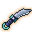 Driftsteel Short Blade

`driftsteel_short_blade` · Equipment, weapon · Sovereign · iLv 86 · stack 1

- **Stats**: Weapon Attack 1153.5 at iLv 86, Common quality (`stats.json` equipment.weapon_attack); Family short_blade; Energy type sage_qi; Sockets 3; Appearance dagger
- **Sources**:
  - Drop: banded equipment roll, grade Sovereign: see [Banded equipment drops](#banded-sovereign)
  - Crafting: Recipe `driftsteel_short_blade` (Smithing, Sovereign): Driftglass ×6, Sunglass ×4, Jelly Silk ×2; known by default
  - Shop: Tidebreak Armoury (Quartermaster Bai in Tidebreak Bastion (Tidebreak Front)) · at list price in Sage Crystals; needs Will Manifest 1

###  Driftsteel Spear

`driftsteel_spear` · Equipment, weapon · Sovereign · iLv 86 · stack 1

- **Stats**: Weapon Attack 1153.5 at iLv 86, Common quality (`stats.json` equipment.weapon_attack); Family spear; Energy type sage_qi; Sockets 3; Appearance spear
- **Sources**:
  - Drop: banded equipment roll, grade Sovereign: see [Banded equipment drops](#banded-sovereign)
  - Crafting: Recipe `driftsteel_spear` (Smithing, Sovereign): Driftglass ×6, Sunglass ×4, Jelly Silk ×2; known by default
  - Shop: Tidebreak Armoury (Quartermaster Bai in Tidebreak Bastion (Tidebreak Front)) · at list price in Sage Crystals; needs Will Manifest 1

###  Driftsteel Staff

`driftsteel_staff` · Equipment, weapon · Sovereign · iLv 86 · stack 1

- **Stats**: Weapon Attack 1153.5 at iLv 86, Common quality (`stats.json` equipment.weapon_attack); Family staff; Energy type sage_qi; Sockets 3; Appearance staff
- **Requires**: Body 100
- **Sources**:
  - Drop: banded equipment roll, grade Sovereign: see [Banded equipment drops](#banded-sovereign)
  - Crafting: Recipe `driftsteel_staff` (Smithing, Sovereign): Driftglass ×6, Sunglass ×4, Jelly Silk ×2; known by default
  - Shop: Tidebreak Armoury (Quartermaster Bai in Tidebreak Bastion (Tidebreak Front)) · at list price in Sage Crystals; needs Will Manifest 1

###  Lanternsteel Bell

`lanternsteel_bell` · Equipment, weapon · Will · iLv 95 · stack 1

- **Stats**: Weapon Attack 1376 at iLv 95, Common quality (`stats.json` equipment.weapon_attack); Family bell; Energy type sage_qi; Sockets 3; Appearance bell
- **Requires**: Essence 110
- **Sources**:
  - Drop: banded equipment roll, grade Will: see [Banded equipment drops](#banded-will)
  - Crafting: Recipe `lanternsteel_bell` (Smithing, Will): Drone Shell ×6, Driftglass ×4, Cinder Ash ×2; known by default
  - Shop: Lanternwright Han's Shelf (Lanternwright Han in Star Chandlery (Lanternfall Harbor)) · at list price in Sage Crystals; needs Sphere Lord 2

###  Lanternsteel Bow

`lanternsteel_bow` · Equipment, weapon · Will · iLv 95 · stack 1

- **Stats**: Weapon Attack 1376 at iLv 95, Common quality (`stats.json` equipment.weapon_attack); Family bow; Energy type sage_qi; Sockets 3; Appearance bow
- **Requires**: Agility 110
- **Sources**:
  - Drop: banded equipment roll, grade Will: see [Banded equipment drops](#banded-will)
  - Crafting: Recipe `lanternsteel_bow` (Smithing, Will): Drone Shell ×6, Driftglass ×4, Cinder Ash ×2; known by default
  - Shop: Lanternwright Han's Shelf (Lanternwright Han in Star Chandlery (Lanternfall Harbor)) · at list price in Sage Crystals; needs Sphere Lord 2

###  Lanternsteel Brush

`lanternsteel_brush` · Equipment, weapon · Will · iLv 95 · stack 1

- **Stats**: Weapon Attack 1376 at iLv 95, Common quality (`stats.json` equipment.weapon_attack); Family brush; Energy type sage_qi; Sockets 3; Appearance brush
- **Requires**: Insight 110
- **Sources**:
  - Drop: banded equipment roll, grade Will: see [Banded equipment drops](#banded-will)
  - Crafting: Recipe `lanternsteel_brush` (Smithing, Will): Drone Shell ×6, Driftglass ×4, Cinder Ash ×2; known by default
  - Shop: Lanternwright Han's Shelf (Lanternwright Han in Star Chandlery (Lanternfall Harbor)) · at list price in Sage Crystals; needs Sphere Lord 2

###  Lanternsteel Fan

`lanternsteel_fan` · Equipment, weapon · Will · iLv 95 · stack 1

- **Stats**: Weapon Attack 1376 at iLv 95, Common quality (`stats.json` equipment.weapon_attack); Family fan; Energy type sage_qi; Sockets 3; Appearance fan
- **Sources**:
  - Drop: banded equipment roll, grade Will: see [Banded equipment drops](#banded-will)
  - Crafting: Recipe `lanternsteel_fan` (Smithing, Will): Drone Shell ×6, Driftglass ×4, Cinder Ash ×2; known by default
  - Shop: Lanternwright Han's Shelf (Lanternwright Han in Star Chandlery (Lanternfall Harbor)) · at list price in Sage Crystals; needs Sphere Lord 2

###  Lanternsteel Flute

`lanternsteel_flute` · Equipment, weapon · Will · iLv 95 · stack 1

- **Stats**: Weapon Attack 1376 at iLv 95, Common quality (`stats.json` equipment.weapon_attack); Family flute; Energy type sage_qi; Sockets 3; Appearance flute
- **Requires**: Insight 110
- **Sources**:
  - Drop: banded equipment roll, grade Will: see [Banded equipment drops](#banded-will)
  - Crafting: Recipe `lanternsteel_flute` (Smithing, Will): Drone Shell ×6, Driftglass ×4, Cinder Ash ×2; known by default
  - Shop: Lanternwright Han's Shelf (Lanternwright Han in Star Chandlery (Lanternfall Harbor)) · at list price in Sage Crystals; needs Sphere Lord 2

###  Lanternsteel Gauntlets

`lanternsteel_gauntlets` · Equipment, weapon · Will · iLv 95 · stack 1

- **Stats**: Weapon Attack 1376 at iLv 95, Common quality (`stats.json` equipment.weapon_attack); Family gauntlets; Energy type sage_qi; Sockets 3; Appearance gauntlets
- **Sources**:
  - Drop: banded equipment roll, grade Will: see [Banded equipment drops](#banded-will)
  - Crafting: Recipe `lanternsteel_gauntlets` (Smithing, Will): Drone Shell ×6, Driftglass ×4, Cinder Ash ×2; known by default
  - Shop: Lanternwright Han's Shelf (Lanternwright Han in Star Chandlery (Lanternfall Harbor)) · at list price in Sage Crystals; needs Sphere Lord 2

###  Lanternsteel Heavy Sabre

`lanternsteel_heavy_sabre` · Equipment, weapon · Will · iLv 95 · stack 1

- **Stats**: Weapon Attack 1376 at iLv 95, Common quality (`stats.json` equipment.weapon_attack); Family heavy_sabre; Energy type sage_qi; Sockets 3; Appearance sabre
- **Requires**: Body 110
- **Sources**:
  - Drop: banded equipment roll, grade Will: see [Banded equipment drops](#banded-will)
  - Crafting: Recipe `lanternsteel_heavy_sabre` (Smithing, Will): Drone Shell ×6, Driftglass ×4, Cinder Ash ×2; known by default
  - Shop: Lanternwright Han's Shelf (Lanternwright Han in Star Chandlery (Lanternfall Harbor)) · at list price in Sage Crystals; needs Sphere Lord 2

###  Lanternsteel Jian

`lanternsteel_jian` · Equipment, weapon · Will · iLv 95 · stack 1

- **Stats**: Weapon Attack 1376 at iLv 95, Common quality (`stats.json` equipment.weapon_attack); Family jian; Energy type sage_qi; Sockets 3; Appearance sword
- **Sources**:
  - Drop: banded equipment roll, grade Will: see [Banded equipment drops](#banded-will)
  - Crafting: Recipe `lanternsteel_jian` (Smithing, Will): Drone Shell ×6, Driftglass ×4, Cinder Ash ×2; known by default
  - Shop: Lanternwright Han's Shelf (Lanternwright Han in Star Chandlery (Lanternfall Harbor)) · at list price in Sage Crystals; needs Sphere Lord 2

### 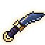 Lanternsteel Short Blade

`lanternsteel_short_blade` · Equipment, weapon · Will · iLv 95 · stack 1

- **Stats**: Weapon Attack 1376 at iLv 95, Common quality (`stats.json` equipment.weapon_attack); Family short_blade; Energy type sage_qi; Sockets 3; Appearance dagger
- **Sources**:
  - Drop: banded equipment roll, grade Will: see [Banded equipment drops](#banded-will)
  - Crafting: Recipe `lanternsteel_short_blade` (Smithing, Will): Drone Shell ×6, Driftglass ×4, Cinder Ash ×2; known by default
  - Shop: Lanternwright Han's Shelf (Lanternwright Han in Star Chandlery (Lanternfall Harbor)) · at list price in Sage Crystals; needs Sphere Lord 2

###  Lanternsteel Spear

`lanternsteel_spear` · Equipment, weapon · Will · iLv 95 · stack 1

- **Stats**: Weapon Attack 1376 at iLv 95, Common quality (`stats.json` equipment.weapon_attack); Family spear; Energy type sage_qi; Sockets 3; Appearance spear
- **Sources**:
  - Drop: banded equipment roll, grade Will: see [Banded equipment drops](#banded-will)
  - Crafting: Recipe `lanternsteel_spear` (Smithing, Will): Drone Shell ×6, Driftglass ×4, Cinder Ash ×2; known by default
  - Shop: Lanternwright Han's Shelf (Lanternwright Han in Star Chandlery (Lanternfall Harbor)) · at list price in Sage Crystals; needs Sphere Lord 2

###  Lanternsteel Staff

`lanternsteel_staff` · Equipment, weapon · Will · iLv 95 · stack 1

- **Stats**: Weapon Attack 1376 at iLv 95, Common quality (`stats.json` equipment.weapon_attack); Family staff; Energy type sage_qi; Sockets 3; Appearance staff
- **Requires**: Body 110
- **Sources**:
  - Drop: banded equipment roll, grade Will: see [Banded equipment drops](#banded-will)
  - Crafting: Recipe `lanternsteel_staff` (Smithing, Will): Drone Shell ×6, Driftglass ×4, Cinder Ash ×2; known by default
  - Shop: Lanternwright Han's Shelf (Lanternwright Han in Star Chandlery (Lanternfall Harbor)) · at list price in Sage Crystals; needs Sphere Lord 2

###  Starwrit Brush

`starwrit_brush` · Equipment, weapon · Will · iLv 95 · stack 1

> Its tip was dipped in lantern ash. The characters it writes glow for a breath after.

- **Stats**: Weapon Attack 1376 at iLv 95, Common quality (`stats.json` equipment.weapon_attack); Family brush; Energy type sage_qi; Sockets 3; Appearance brush; named: Formation, Lantern, element Space (+2% space power), path Confucian, fixed Qi attack +7.2%
- **Requires**: Insight 110
- **Sources**:
  - Shop: Tidebreak Armoury (Quartermaster Bai in Tidebreak Bastion (Tidebreak Front)) · 320 Sage Crystals; needs Sphere Lord 2

###  Tidebreak Bell

`tidebreak_bell` · Equipment, weapon · Will · iLv 95 · stack 1

> Cast from a lantern cage that fell in the Breach. The Hollow does not like its note.

- **Stats**: Weapon Attack 1376 at iLv 95, Common quality (`stats.json` equipment.weapon_attack); Family bell; Energy type sage_qi; Sockets 3; Appearance bell; named: Musician, Lantern, element Metal (+2% metal power), path Buddhist, fixed Melody power +10.8%
- **Requires**: Essence 110
- **Sources**:
  - Shop: Tidebreak Armoury (Quartermaster Bai in Tidebreak Bastion (Tidebreak Front)) · 320 Sage Crystals; needs Sphere Lord 2

## Bath (4)

###  Copper Body Bath

`copper_body_bath` · Bath · Common · iLv 14 · stack 9

> A body-trial bath of tortoise plate, mole claw and willow moss. Soak in it at a Bath station (seclusion): +600 body XP, 10 residue cleared, the pill share of your foundation 10 points lower. Too strong a bath for your body injures it.

- **Effect**: used as: Bath; Bath: {"body_xp": 600, "hours": 1.0, "residue": 10, "share": 0.1, "toxicity": 5}
- **Sources**:
  - Crafting: Recipe `copper_body_bath` (Alchemy, Common): Tortoise Plate ×2, Mole Claw ×2, Willow Moss ×4

### 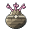 Marrow Washing Bath

`marrow_washing_bath` · Bath · Earth · iLv 27 · stack 9

> A bath that scours the marrow: ginseng, hound fang, ape fur and Mist Lotus. Soak in it at a Bath station (seclusion): +1500 body XP, 20 residue cleared, the pill share of your foundation 10 points lower. Too strong a bath for your body injures it.

- **Effect**: used as: Bath; Bath: {"body_xp": 1500, "hours": 1.0, "residue": 20, "share": 0.1, "toxicity": 8}
- **Sources**:
  - Crafting: Recipe `marrow_washing_bath` (Alchemy, Earth): Riverreed Ginseng (100 yr) ×1, Hound Fang ×3, Ape Fur ×2, Mist Lotus ×1

###  Jade Marrow Bath

`jade_marrow_bath` · Bath · Heaven · iLv 45 · stack 9

> A green bath of cloudtop orchid and jade scale that sets the bones like jade. Soak in it at a Bath station (seclusion): +4000 body XP, 30 residue cleared, the pill share of your foundation 10 points lower. Too strong a bath for your body injures it.

- **Effect**: used as: Bath; Bath: {"body_xp": 4000, "hours": 1.0, "residue": 30, "share": 0.1, "toxicity": 10}
- **Sources**:
  - Crafting: Recipe `jade_marrow_bath` (Alchemy, Heaven): Cloudtop Orchid ×1, Jade Scale ×3, Guardian Stone ×2, Mist Lotus ×2

###  Golden Body Bath

`golden_body_bath` · Bath · Mystic · iLv 59 · stack 9

> A bath of frost lotus and thunder horn, hot and cold at once, that gilds the body. Soak in it at a Bath station (seclusion): +9000 body XP, 40 residue cleared, the pill share of your foundation 10 points lower. Too strong a bath for your body injures it.

- **Effect**: used as: Bath; Bath: {"body_xp": 9000, "hours": 1.0, "residue": 40, "share": 0.1, "toxicity": 12}
- **Sources**:
  - Crafting: Recipe `golden_body_bath` (Alchemy, Mystic): Frost Lotus ×1, Thunder Horn ×2, Snow Ape Hide ×2, Cloudtop Orchid ×2

## Beast part (51)

###  Beetle Shell

`beetle_shell` · Beast part · Plain · iLv 5 · stack 99

> A Rock Beetle's plate, hard as slate. Needle-smiths and Iron Wall talismans both use it.

- **Sources**:
  - Drop: [Rock Beetle](monsters.md#enemy-rock_beetle) (Lv 4–5) · 30% (group 60%, weight 1 of 2)

###  Boar Hide

`boar_hide` · Beast part · Plain · iLv 5 · stack 99

> Bristly hide from a Wild Boarlet. Smiths wrap iron hilts with it.

- **Sources**:
  - Drop: [Wild Boarlet](monsters.md#enemy-wild_boarlet) (Lv 1–2) · 30% (group 60%, weight 1 of 2)
  - Shop: Old Ma's Store (Old Ma in Lotus Ferry at Night (Lotus Ferry), Old Ma's Store (Lotus Ferry)) · daily rotation (1 of 4)
  - Reward: Expedition Willow Path (1/4/8 h) ×2

###  Crab Shell

`crab_shell` · Beast part · Plain · iLv 5 · stack 99

> A mud-brown shell from a Mudshell Crab. Traders buy it to burn for lime.

- **Sources**:
  - Drop: [Mudshell Crab](monsters.md#enemy-mudshell_crab) (Lv 1) · 100% (only during Crab Trouble)
  - Drop: [Mudshell Crab](monsters.md#enemy-mudshell_crab) (Lv 1) · 30% (group 60%, weight 1 of 2)

###  Frog Leg

`frog_leg` · Beast part · Plain · iLv 5 · stack 99

> A Reed Frog's leg. Jade-smiths set its spring into a Swift Jade.

- **Sources**:
  - Drop: [Reed Frog](monsters.md#enemy-reed_frog) (Lv 3–6) · 30% (group 60%, weight 1 of 2)

###  Leech Oil

`leech_oil` · Beast part · Plain · iLv 5 · stack 99

> Oil pressed from a Marsh Leech. Qi Restoration Pills and Essence Jades use it.

- **Sources**:
  - Drop: [Blackreed Disciple](monsters.md#enemy-blackreed_disciple) (Lv 14) · 30% (group 60%, weight 1 of 2)
  - Drop: [Marsh Leech](monsters.md#enemy-marsh_leech) (Lv 4–7) · 60% (group)
  - Reward: Expedition Reed Marsh (4/8 h) ×3

###  Mole Claw

`mole_claw` · Beast part · Plain · iLv 5 · stack 99

> A digging claw from an Ironclaw Mole, still sharp enough to scratch iron.

- **Sources**:
  - Drop: [Ironclaw Mole](monsters.md#enemy-ironclaw_mole) (Lv 5–7) · 30% (group 60%, weight 1 of 2)

###  Moss

`moss` · Beast part · Plain · iLv 5 · stack 99

> Damp moss scraped from a Mossback Toad's back. Qi Gathering Pills start with it.

- **Sources**:
  - Drop: [Mossback Toad](monsters.md#enemy-mossback_toad) (Lv 2–3) · 30% (group 60%, weight 1 of 2)

###  Ore Dust

`ore_dust` · Beast part · Plain · iLv 5 · stack 99

> Glittering grit from an Ironclaw Mole's tunnels. Smiths pack it into Thunderclap Pellets.

- **Sources**:
  - Drop: [Ironclaw Mole](monsters.md#enemy-ironclaw_mole) (Lv 5–7) · 30% (group 60%, weight 1 of 2)
  - Shop: Formation Guild (Array Master Ren in Artisan Row (Stoneford)) · 8 Silver Taels; needs Flag set (flag guild_formations_adept)

###  Rat Tail

`rat_tail` · Beast part · Plain · iLv 5 · stack 99

> A Reedtail Rat's tail. Ink-makers boil it down for its binding fat.

- **Sources**:
  - Drop: [Reedtail Rat](monsters.md#enemy-reedtail_rat) (Lv 2) · 60% (group)

###  Toad Oil

`toad_oil` · Beast part · Plain · iLv 5 · stack 99

> Slick oil wrung from a Mossback Toad's skin. Cooks fold it into dumplings.

- **Sources**:
  - Drop: [Mossback Toad](monsters.md#enemy-mossback_toad) (Lv 2–3) · 30% (group 60%, weight 1 of 2)

###  Tortoise Plate

`tortoise_plate` · Beast part · Plain · iLv 5 · stack 99

> A slab of Stone Tortoise shell. Bone Strengthening Pills and Body Jades need it.

- **Sources**:
  - Drop: [Stone Tortoise](monsters.md#enemy-stone_tortoise) (Lv 5–7) · 60% (group)

###  Tough Meat

`tough_meat` · Beast part · Plain · iLv 5 · stack 99

> Stringy meat from a big beast. Slow-stewed, it builds a body up.

- **Sources**:
  - Drop: [Snow Ape](monsters.md#enemy-snow_ape) (Lv 68–72) · 20% (group 60%, weight 1 of 3)
  - Drop: [Stormgrass Stag](monsters.md#enemy-stormgrass_stag) (Lv 64–68) · 30% (group 60%, weight 1 of 2)
  - Drop: [Thunderhorn Rhino](monsters.md#enemy-thunderhorn_rhino) (Lv 64–69) · 20% (group 60%, weight 1 of 3)
  - Drop: [Wild Boarlet](monsters.md#enemy-wild_boarlet) (Lv 1–2) · 30% (group 60%, weight 1 of 2)
  - Shop: Herders' Camp (Old Suo in Herders' Camp (Thunderhorn Plains)) · at list price in Spirit Stones
  - Shop: Oasis of Bones Stores (Keeper Meng in Oasis of Bones (Sunscar Desert)) · at list price in Spirit Stones

###  Bamboo Shoot

`bamboo_shoot` · Beast part · Common · iLv 14 · stack 99

> A tender shoot a Bamboo Monkey was hoarding. Traders buy them by the basket.

- **Sources**:
  - Drop: [Bamboo Monkey](monsters.md#enemy-bamboo_monkey) (Lv 10–12) · 60% (group)
  - Reward: Expedition Bamboo Grove (4/8 h) ×3

###  Hound Fang

`hound_fang` · Beast part · Common · iLv 14 · stack 99

> A Mud Hound's fang. Boiled with rat tail, it makes beast-blood ink.

- **Sources**:
  - Drop: [Mud Hound](monsters.md#enemy-mud_hound) (Lv 16–20) · 60% (group)

###  Thorn Hide

`thorn_hide` · Beast part · Common · iLv 14 · stack 99

> Hide from a Thornback Boar, studded with thorn-like bristles. Tiger Blood Pills need it.

- **Sources**:
  - Drop: [Fruit-Guardian Boar](monsters.md#enemy-fruit_guardian) (Lv 20) · 100% ×2–3 (guaranteed)
  - Drop: [Thornback Boar](monsters.md#enemy-thornback_boar) (Lv 13–15) · 100% (guaranteed)

###  Venom Sac

`venom_sac` · Beast part · Common · iLv 14 · stack 99

> A Green Viper's venom sac. Antidotes start here, and so do poisons.

- **Sources**:
  - Drop: [Green Viper](monsters.md#enemy-green_viper) (Lv 11–14) · 30% (group 60%, weight 1 of 2)

###  Viper Fang

`viper_fang` · Beast part · Common · iLv 14 · stack 99

> A Green Viper's fang, still beaded with venom. It binds a sealing talisman's stroke.

- **Sources**:
  - Drop: [Green Viper](monsters.md#enemy-green_viper) (Lv 11–14) · 30% (group 60%, weight 1 of 2)

###  Jade Scale

`jade_scale` · Beast part · Earth · iLv 27 · stack 99

> A green scale from a Jade Carp, cool to the touch. Jadeiron smiths and alchemists both want it.

- **Sources**:
  - Drop: [Jade Carp](monsters.md#enemy-jade_carp) (Lv 19–22) · 60% (group)
  - Shop: Alchemist Guild (Guildmaster Tang in Artisan Row (Stoneford)) · 30 Silver Taels; needs Flag set (flag guild_alchemy_adept)
  - Reward: Expedition Deepwater Bend (4/8 h) ×2

###  Lizard Scale

`lizard_scale` · Beast part · Earth · iLv 27 · stack 99

> A slick scale from a Rapids Lizard. Water runs off it without wetting it.

- **Sources**:
  - Drop: [Rapids Lizard](monsters.md#enemy-rapids_lizard) (Lv 28–31) · 60% (group)

###  Pearl

`pearl` · Beast part · Earth · iLv 27 · stack 99

> A small river pearl. Traders buy them; alchemists grind them for clear pills.

- **Sources**:
  - Drop: [Ferryman Lou](monsters.md#enemy-ferryman_lou) (Lv 27) · 100% (guaranteed)
  - Drop: [Hollowed Eel](monsters.md#enemy-hollowed_eel) (Lv 2) · 100% (guaranteed)
  - Drop: [Mossback Toad](monsters.md#enemy-mossback_toad) (Lv 2–3) · 2% (rare)
  - Drop: [Mudshell Crab](monsters.md#enemy-mudshell_crab) (Lv 1) · 2% (rare)
  - Drop: [Rapids Lizard](monsters.md#enemy-rapids_lizard) (Lv 28–31) · 10% (rare)
  - Drop: [Reedtail Rat](monsters.md#enemy-reedtail_rat) (Lv 2) · 2% (rare)
  - Drop: [Tide Crab](monsters.md#enemy-tide_crab) (Lv 20–23) · 15% (rare)
  - Drop: [Wild Boarlet](monsters.md#enemy-wild_boarlet) (Lv 1–2) · 2% (rare)
  - Shop: Mei Qing's Stall (Mei Qing in Artisan Row (Stoneford)) · 40 Silver Taels; needs Heart Tempering 5
  - Reward: Expedition Deepwater Bend (4/8 h)

###  Serpent Scale

`serpent_scale` · Beast part · Earth · iLv 27 · stack 99

> A heavy scale from a river serpent. Traders pay well for an unchipped one.

- **Sources**:
  - Drop: [Boulder Serpent](monsters.md#enemy-boulder_serpent) (Lv 32–35) · 60% (group)
  - Drop: [Riverbed Serpent](monsters.md#enemy-riverbed_serpent) (Lv 25) · 100% ×2–4 (guaranteed)

###  Tide Shell

`tide_shell` · Beast part · Earth · iLv 27 · stack 99

> A Tide Crab's shell, ridged like waves. It rings when tapped.

- **Sources**:
  - Drop: [Tide Crab](monsters.md#enemy-tide_crab) (Lv 20–23) · 60% (group)

###  Vulture Plume

`vulture_plume` · Beast part · Earth · iLv 27 · stack 99

> A grey Mist Vulture plume. A Wind Step talisman's stroke needs its lightness.

- **Sources**:
  - Drop: [Mist Vulture](monsters.md#enemy-mist_vulture) (Lv 34–36) · 60% (group)

###  Ape Fur

`ape_fur` · Beast part · Heaven · iLv 45 · stack 99

> Thick fur from a Cliff Ape, warm enough for the high passes.

- **Sources**:
  - Drop: [Cliff Ape](monsters.md#enemy-cliff_ape) (Lv 41–45) · 60% (group)

###  Cloud Feather

`cloud_feather` · Beast part · Heaven · iLv 45 · stack 99

> A white Cloudwing Crane feather that drifts upward when dropped.

- **Sources**:
  - Drop: [Cloudwing Crane](monsters.md#enemy-cloudwing_crane) (Lv 37–40) · 60% (group)
  - Reward: Cloud Steps route, silver medal, in Cliff Stair (Cloud Sect Monastery) ×2
  - Reward: Route stone in Cliff Stair (Cloud Sect Monastery) ×2

###  Mirror Dust

`mirror_dust` · Beast part · Heaven · iLv 45 · stack 99

> Silver dust shed by a Mirror Wisp. It remembers what it last reflected.

- **Sources**:
  - Drop: [Mirror Wisp](monsters.md#enemy-mirror_wisp) (Lv 47–51) · 60% (group)

###  Mist Pelt

`mist_pelt` · Beast part · Heaven · iLv 45 · stack 99

> A Mist Wolf's pelt, grey and hard to look at directly.

- **Sources**:
  - Drop: [Mist Wolf](monsters.md#enemy-mist_wolf) (Lv 46–50) · 60% (group)

###  Radiant Pelt

`radiant_pelt` · Beast part · Heaven · iLv 45 · stack 99

> The pelt of a radiant beast, a snare's rare prize: pearly, warm, and worth a great deal.

- **Sources**:
  - Gathering: Post: Beast Snaring, side catch

###  Soul Wax

`soul_wax` · Beast part · Heaven · iLv 45 · stack 99

> Wax from a Weeping Lantern that burns without heat. Soul Soothing Pills need it.

- **Sources**:
  - Drop: [Weeping Lantern](monsters.md#enemy-weeping_lantern) (Lv 50–55) · 30% (group 60%, weight 1 of 2)
  - Reward: Expedition Mist Peak (8 h)

###  Storm Feather

`storm_feather` · Beast part · Heaven · iLv 45 · stack 99

> A Stormwing Hawk's feather that crackles in dry air. Thunder talismans need it.

- **Sources**:
  - Drop: [Stormwing Hawk](monsters.md#enemy-stormwing_hawk) (Lv 38–43) · 60% (group)

###  Hollow Antler

`hollow_antler` · Beast part · Mystic · iLv 59 · stack 99

> A Hollow Stag's antler, grey and cold. Handle it with gloves.

- **Sources**:
  - Drop: [Hollow Stag](monsters.md#enemy-hollow_stag) (Lv 55–59) · 60% (group)

###  Roc Feather

`roc_feather` · Beast part · Mystic · iLv 59 · stack 99

> A great flight feather from a Cloudpeak Roc, as long as a spear.

- **Sources**:
  - Drop: [Cloudpeak Roc](monsters.md#enemy-cloudpeak_roc) (Lv 58–63) · 60% (group)
  - Shop: Apothecary Wu's Cabinet (Apothecary Wu in Port Market (Cloudgate Port)) · daily rotation (1 of 2)

###  Dragonet Scale

`dragonet_scale` · Beast part · Spirit · iLv 68 · stack 99

> An azure scale from a carp halfway to becoming a dragon.

- **Sources**:
  - Drop: [Azure Carp Dragonet](monsters.md#enemy-azure_carp_dragonet) (Lv 68–73) · 30% (group 60%, weight 1 of 2)
  - Drop: [Thousand Eye Toad](monsters.md#enemy-thousand_eye_toad) (Lv 68) · 100% ×2–3 (guaranteed)
  - Reward: Quest Clear Skies (side, from Dockmaster Fu), reward ×2

###  Harpy Plume

`harpy_plume` · Beast part · Spirit · iLv 68 · stack 99

> A russet plume from a Canyon Harpy's crest, barred like a hawk's.

- **Sources**:
  - Drop: [Canyon Harpy](monsters.md#enemy-canyon_harpy) (Lv 74–78) · 30% (group 60%, weight 1 of 2)

###  Kite Silk

`kite_silk` · Beast part · Spirit · iLv 68 · stack 99

> Painted silk from a Wind Kite. It still pulls toward the wind.

- **Sources**:
  - Drop: [Wind Kite](monsters.md#enemy-wind_kite) (Lv 73–78) · 30% (group 60%, weight 1 of 2)
  - Reward: Expedition Gale Canyons (8 h) ×2

###  Rime Fang

`rime_fang` · Beast part · Spirit · iLv 68 · stack 99

> A frost lynx's fang, rimed with ice that never melts.

- **Sources**:
  - Drop: [Frost Lynx](monsters.md#enemy-frost_lynx) (Lv 67–70) · 30% (group 60%, weight 1 of 2)

###  Scorpion Stinger

`scorpion_stinger` · Beast part · Spirit · iLv 68 · stack 99

> A Sandstorm Scorpion's stinger, a bead of amber venom still inside.

- **Sources**:
  - Drop: [Sandstorm Scorpion](monsters.md#enemy-sandstorm_scorpion) (Lv 73–78) · 30% (group 60%, weight 1 of 2)

###  Scratched Alliance Badge

`alliance_badge` · Beast part · Spirit · iLv 68 · stack 99

> A Nine Peaks disciple's jade badge, its peak scratched out by a deserter's knife.

- **Sources**:
  - Drop: [Rogue Nine Peaks Disciple](monsters.md#enemy-nine_peaks_disciple) (Lv 76–78) · 30% (group 60%, weight 1 of 2)

###  Snow Ape Hide

`snow_ape_hide` · Beast part · Spirit · iLv 68 · stack 99

> A thick white hide from a Snow Ape. Warm even in a blizzard.

- **Sources**:
  - Drop: [Snow Ape](monsters.md#enemy-snow_ape) (Lv 68–72) · 20% (group 60%, weight 1 of 3)

###  Spark Pelt

`spark_pelt` · Beast part · Spirit · iLv 68 · stack 99

> A golden pelt that snaps with static. Taken from Spark Weasels.

- **Sources**:
  - Drop: [Spark Weasel](monsters.md#enemy-spark_weasel) (Lv 64–67) · 30% (group 60%, weight 1 of 2)

###  Thunder Horn

`thunder_horn` · Beast part · Spirit · iLv 68 · stack 99

> A thunderhorn's horn. It still holds a charge.

- **Sources**:
  - Drop: [Thunderhorn Rhino](monsters.md#enemy-thunderhorn_rhino) (Lv 64–69) · 20% (group 60%, weight 1 of 3)
  - Reward: Expedition Thunderhorn Plains (4/8 h)

###  Worm Glass Tooth

`worm_glass_tooth` · Beast part · Sage · iLv 77 · stack 99

> A tooth of clear desert glass from a Dune Worm's ringed maw.

- **Sources**:
  - Drop: [Dune Worm](monsters.md#enemy-dune_worm) (Lv 77–81) · 30% (group 60%, weight 1 of 2)

###  Comet Plume

`comet_plume` · Beast part · Sovereign · iLv 86 · stack 99

> A tail feather of a Comet Sparrow, still warm, trailing sparks when it is waved.

- **Sources**:
  - Drop: [Comet Sparrow](monsters.md#enemy-comet_sparrow) (Lv 82–87) · 30% (group 60%, weight 1 of 2)

###  Guardian Scale

`guardian_scale` · Beast part · Sovereign · iLv 86 · stack 99

> A bronze plate from a Nest Guardian's shell, set with a crystal that still glows.

- **Sources**:
  - Drop: [Nest Guardian](monsters.md#enemy-nest_guardian) (Lv 85–93) · 30% (group 60%, weight 1 of 2)

###  Jelly Silk

`jelly_silk` · Beast part · Sovereign · iLv 86 · stack 99

> A Star Jellyfish's trailing silk. It glows for a day after the jelly dies, and stings for two.

- **Sources**:
  - Drop: [Star Jellyfish](monsters.md#enemy-star_jellyfish) (Lv 82–87) · 30% (group 60%, weight 1 of 2)
  - Shop: Peddler Ning's Silk and Sundries (Peddler Ning in Harbor Market (Lanternfall Harbor)) · daily rotation (2 of 4)

###  Moth Dust

`moth_dust` · Beast part · Sovereign · iLv 86 · stack 99

> Silver dust from an Orbit Moth's wings. It hangs in the air a long while.

- **Sources**:
  - Drop: [Orbit Moth](monsters.md#enemy-orbit_moth) (Lv 88–93) · 30% (group 60%, weight 1 of 2)

###  Eel Essence

`eel_essence` · Beast part · Will · iLv 95 · stack 99

> The bright thread of a Nebula Eel's life, coiled in a drop. It bends the space around it a hair's width.

- **Sources**:
  - Drop: [Nebula Eel](monsters.md#enemy-nebula_eel) (Lv 94–99) · 30% (group 60%, weight 1 of 2)
  - Drop: [Nebula Leviathan](monsters.md#enemy-nebula_leviathan) (Lv 99) · 100% ×2–4 (guaranteed)

###  Gravity Core

`gravity_core` · Beast part · Will · iLv 95 · stack 99

> The heavy heart of a Gravity Golem. Set it down and small things roll toward it.

- **Sources**:
  - Drop: [Gravity Golem](monsters.md#enemy-gravity_golem) (Lv 88–93) · 20% (group 60%, weight 1 of 3)

###  Leviathan Scale

`leviathan_scale` · Beast part · Will · iLv 95 · stack 99

> A scale from the Nebula Leviathan, as broad as a shield. Stars move in it, slowly.

- **Sources**:
  - Drop: [Nebula Leviathan](monsters.md#enemy-nebula_leviathan) (Lv 99) · 100% ×2–3 (guaranteed)
  - Reward: Quest The Leviathan's Maw (side, from Captain Duan), reward ×2

###  Void Carapace

`void_carapace` · Beast part · Will · iLv 95 · stack 99

> A plate of Void Crab shell. Look into it and it is deeper than it is thick.

- **Sources**:
  - Drop: [Void Crab](monsters.md#enemy-void_crab) (Lv 94–99) · 30% (group 60%, weight 1 of 2)

###  Wyrm Ash

`wyrm_ash` · Beast part · Will · iLv 95 · stack 99

> Grey ash from a Hollowed Wyrmling. It is cold, and it is not quite dead. Cleansing pills are made from it.

- **Sources**:
  - Drop: [Hollowed Wyrmling](monsters.md#enemy-hollowed_wyrmling) (Lv 88–99) · 20% (group 60%, weight 1 of 3)

## Core (44)

###  Pebble Core

`pebble_core` · Core · Common · iLv 14 · stack 99

> A tiny earth core from a Pebble Imp. Absorb it for Qi. Too weak a core to burn as Beast Fire.

- **Effect**: Add progress (pct of need 0.05); Core: {"qp_pct": 0.05, "rank": 1}; Raw: {"toxicity": 12}; Family: accumulation
- **Sources**:
  - Drop: [Pebble Imp](monsters.md#enemy-pebble_imp) (Lv 4–6) · 8% (rare)

###  Guardian Stone

`guardian_stone` · Core · Earth · iLv 27 · stack 99

> Heart-stone of a Stone Guardian. Absorb it for Qi, or burn it as Beast Fire.

- **Effect**: Add progress (pct of need 0.1); Core: {"qp_pct": 0.1, "rank": 2}; Raw: {"toxicity": 12}; Family: accumulation
- **Sources**:
  - Drop: [Stone Guardian](monsters.md#enemy-stone_guardian) (Lv 17–19) · 60% (group)

###  Low Earth Core

`earth_core_low` · Core · Earth · iLv 27 · stack 99

> The core of a rank 2-3 earth beast. A earth spirit animal devours it for growth; the Core Exchange buys it; it burns as Beast Fire.

- **Effect**: Add progress (pct of need 0.1); Core: {"element": "earth", "qp_pct": 0.1, "rank": 2, "tier": "low"}; Raw: {"toxicity": 12}; Family: accumulation
- **Sources**:
  - Drop: [Hollowed Boarlet](monsters.md#enemy-hollowed_boarlet) (Lv 3–12) · 4% (beast core)
  - Drop: [Mud Hound](monsters.md#enemy-mud_hound) (Lv 16–20) · 4%–6% (beast core)
  - Reward: Beast Tide at Stoneford Gate (Stoneford), one of 3 beast cores of a random element at the holder's tier (below Lv 28)

###  Low Fire Core

`fire_core_low` · Core · Earth · iLv 27 · stack 99

> The core of a rank 2-3 fire beast. A fire spirit animal devours it for growth; the Core Exchange buys it; it burns as Beast Fire.

- **Effect**: Add progress (pct of need 0.1); Core: {"element": "fire", "qp_pct": 0.1, "rank": 2, "tier": "low"}; Raw: {"toxicity": 12}; Family: accumulation
- **Sources**:
  - Drop: [Ember Fox](monsters.md#enemy-ember_fox) (Lv 19–24) · 6% (beast core)
  - Reward: Beast Tide at Stoneford Gate (Stoneford), one of 3 beast cores of a random element at the holder's tier (below Lv 28)

###  Low Metal Core

`metal_core_low` · Core · Earth · iLv 27 · stack 99

> The core of a rank 2-3 metal beast. A metal spirit animal devours it for growth; the Core Exchange buys it; it burns as Beast Fire.

- **Effect**: Add progress (pct of need 0.1); Core: {"element": "metal", "qp_pct": 0.1, "rank": 2, "tier": "low"}; Raw: {"toxicity": 12}; Family: accumulation
- **Sources**:
  - Shop: Hermit Yao's Beast Hall (Hermit Yao in Hermit's Stilt House (Reed Marsh)) · 4 Spirit Stones; 2 a day

###  Low Soul Core

`soul_core_low` · Core · Earth · iLv 27 · stack 99

> The core of a rank 2-3 soul beast. A soul spirit animal devours it for growth; the Core Exchange buys it; it burns as Beast Fire.

- **Effect**: Add progress (pct of need 0.1); Core: {"element": "soul", "qp_pct": 0.1, "rank": 2, "tier": "low"}; Raw: {"toxicity": 12}; Family: accumulation
- **Sources**:
  - Shop: Broker Mu's Back Room (Broker Mu in Hall of Nine (Nine Peaks), Wayfarers' Inn (Cloudgate Port)) · 20 Spirit Stones; needs Alignment at most (value -20)

###  Low Space Core

`space_core_low` · Core · Earth · iLv 27 · stack 99

> The core of a rank 2-3 space beast. A space spirit animal devours it for growth; the Core Exchange buys it; it burns as Beast Fire.

- **Effect**: Add progress (pct of need 0.1); Core: {"element": "space", "qp_pct": 0.1, "rank": 2, "tier": "low"}; Raw: {"toxicity": 12}; Family: accumulation
- **Sources**:
  - Shop: Peddler Ning's Silk and Sundries (Peddler Ning in Harbor Market (Lanternfall Harbor)) · 1 Sage Crystals; 2 a day; needs Will Manifest 1

###  Low Star Core

`star_core_low` · Core · Earth · iLv 27 · stack 99

> The core of a rank 2-3 star beast. A star spirit animal devours it for growth; the Core Exchange buys it; it burns as Beast Fire.

- **Effect**: Add progress (pct of need 0.1); Core: {"element": "star", "qp_pct": 0.1, "rank": 2, "tier": "low"}; Raw: {"toxicity": 12}; Family: accumulation
- **Sources**:
  - Shop: Peddler Ning's Silk and Sundries (Peddler Ning in Harbor Market (Lanternfall Harbor)) · 1 Sage Crystals; 2 a day; needs Will Manifest 1

###  Low Thunder Core

`thunder_core_low` · Core · Earth · iLv 27 · stack 99

> The core of a rank 2-3 thunder beast. A thunder spirit animal devours it for growth; the Core Exchange buys it; it burns as Beast Fire.

- **Effect**: Add progress (pct of need 0.1); Core: {"element": "thunder", "qp_pct": 0.1, "rank": 2, "tier": "low"}; Raw: {"toxicity": 12}; Family: accumulation
- **Sources**:
  - Reward: Beast Tide at Stoneford Gate (Stoneford), one of 3 beast cores of a random element at the holder's tier (below Lv 28)

###  Low Water Core

`water_core_low` · Core · Earth · iLv 27 · stack 99

> The core of a rank 2-3 water beast. A water spirit animal devours it for growth; the Core Exchange buys it; it burns as Beast Fire.

- **Effect**: Add progress (pct of need 0.1); Core: {"element": "water", "qp_pct": 0.1, "rank": 2, "tier": "low"}; Raw: {"toxicity": 12}; Family: accumulation
- **Sources**:
  - Drop: [Greyfin](monsters.md#enemy-greyfin) (Lv 7–11) · 4% (beast core)
  - Drop: [Jade Carp](monsters.md#enemy-jade_carp) (Lv 19–22) · 6% (beast core)
  - Drop: [Reed Otter](monsters.md#enemy-reed_otter) (Lv 19–24) · 6% (beast core)
  - Drop: [Riverbed Serpent](monsters.md#enemy-riverbed_serpent) (Lv 25) · 6% (beast core)
  - Drop: [Tide Crab](monsters.md#enemy-tide_crab) (Lv 20–23) · 6% (beast core)
  - Reward: Beast Tide at Stoneford Gate (Stoneford), one of 3 beast cores of a random element at the holder's tier (below Lv 28)

###  Low Wind Core

`wind_core_low` · Core · Earth · iLv 27 · stack 99

> The core of a rank 2-3 wind beast. A wind spirit animal devours it for growth; the Core Exchange buys it; it burns as Beast Fire.

- **Effect**: Add progress (pct of need 0.1); Core: {"element": "wind", "qp_pct": 0.1, "rank": 2, "tier": "low"}; Raw: {"toxicity": 12}; Family: accumulation
- **Sources**:
  - Drop: [Jade Crane Chick](monsters.md#enemy-jade_crane_chick) (Lv 19–24) · 6% (beast core)
  - Reward: Beast Tide at Stoneford Gate (Stoneford), one of 3 beast cores of a random element at the holder's tier (below Lv 28)

###  Low Wood Core

`wood_core_low` · Core · Earth · iLv 27 · stack 99

> The core of a rank 2-3 wood beast. A wood spirit animal devours it for growth; the Core Exchange buys it; it burns as Beast Fire.

- **Effect**: Add progress (pct of need 0.1); Core: {"element": "wood", "qp_pct": 0.1, "rank": 2, "tier": "low"}; Raw: {"toxicity": 12}; Family: accumulation
- **Sources**:
  - Drop: [Bamboo Monkey](monsters.md#enemy-bamboo_monkey) (Lv 10–12) · 4% (beast core)
  - Drop: [Fruit-Guardian Boar](monsters.md#enemy-fruit_guardian) (Lv 20) · 6% (beast core)
  - Drop: [Green Viper](monsters.md#enemy-green_viper) (Lv 11–14) · 4% (beast core)
  - Drop: [Thornback Boar](monsters.md#enemy-thornback_boar) (Lv 13–15) · 4% (beast core)
  - Reward: Beast Tide at Stoneford Gate (Stoneford), one of 3 beast cores of a random element at the holder's tier (below Lv 28)

###  Serpent Core

`serpent_core` · Core · Earth · iLv 27 · stack 99

> The core of the Riverbed Serpent; a pill ingredient. Absorb it for Qi, or burn it as Beast Fire.

- **Effect**: Add progress (pct of need 0.1); Core: {"qp_pct": 0.1, "rank": 2}; Raw: {"toxicity": 12}; Family: accumulation
- **Sources**:
  - Drop: [Riverbed Serpent](monsters.md#enemy-riverbed_serpent) (Lv 25) · 100% (guaranteed)
  - Reward: Quest The Riverbed Serpent (guided, from Deacon Rui), reward

###  Jade Core

`jade_core` · Core · Heaven · iLv 45 · stack 99

> A jade core from a Forgotten Monastery sentinel. Absorb it for Qi, or burn it as Beast Fire.

- **Effect**: Add progress (pct of need 0.1); Core: {"qp_pct": 0.1, "rank": 3}; Raw: {"toxicity": 12}; Family: accumulation
- **Sources**:
  - Drop: [Jade Sentinel](monsters.md#enemy-jade_sentinel) (Lv 52–56) · 8% (rare)
  - Shop: Apothecary Wu's Cabinet (Apothecary Wu in Port Market (Cloudgate Port)) · daily rotation (1 of 2)
  - Shop: Auction Pavilion (Azure Expanse) lot ×2, opening bid 24 · 7.87% of lots
  - Shop: Broker Mu's Back Room (Broker Mu in Hall of Nine (Nine Peaks), Wayfarers' Inn (Cloudgate Port)) · daily rotation (2 of 5)

### 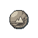 Mid Earth Core

`earth_core_mid` · Core · Heaven · iLv 45 · stack 99

> The core of a rank 4-5 earth beast. A earth spirit animal devours it for growth; the Core Exchange buys it; it burns as Beast Fire.

- **Effect**: Add progress (pct of need 0.15); Core: {"element": "earth", "qp_pct": 0.15, "rank": 4, "tier": "mid"}; Raw: {"toxicity": 12}; Family: accumulation
- **Sources**:
  - Drop: [Boulder Serpent](monsters.md#enemy-boulder_serpent) (Lv 32–35) · 8% (beast core)
  - Drop: [Cliff Ape](monsters.md#enemy-cliff_ape) (Lv 41–45) · 10% (beast core)
  - Drop: [Riverstone Ox](monsters.md#enemy-riverstone_ox) (Lv 37–38) · 10% (beast core)
  - Reward: Beast Tide at Stoneford Gate (Stoneford), one of 3 beast cores of a random element at the holder's tier (Lv 28–45)

###  Mid Fire Core

`fire_core_mid` · Core · Heaven · iLv 45 · stack 99

> The core of a rank 4-5 fire beast. A fire spirit animal devours it for growth; the Core Exchange buys it; it burns as Beast Fire.

- **Effect**: Add progress (pct of need 0.15); Core: {"element": "fire", "qp_pct": 0.15, "rank": 4, "tier": "mid"}; Raw: {"toxicity": 12}; Family: accumulation
- **Sources**:
  - Reward: Beast Tide at Stoneford Gate (Stoneford), one of 3 beast cores of a random element at the holder's tier (Lv 28–45)

###  Mid Metal Core

`metal_core_mid` · Core · Heaven · iLv 45 · stack 99

> The core of a rank 4-5 metal beast. A metal spirit animal devours it for growth; the Core Exchange buys it; it burns as Beast Fire.

- **Effect**: Add progress (pct of need 0.15); Core: {"element": "metal", "qp_pct": 0.15, "rank": 4, "tier": "mid"}; Raw: {"toxicity": 12}; Family: accumulation
- **Sources**:
  - Shop: Hermit Yao's Beast Hall (Hermit Yao in Hermit's Stilt House (Reed Marsh)) · 12 Spirit Stones; 2 a day

###  Mid Soul Core

`soul_core_mid` · Core · Heaven · iLv 45 · stack 99

> The core of a rank 4-5 soul beast. A soul spirit animal devours it for growth; the Core Exchange buys it; it burns as Beast Fire.

- **Effect**: Add progress (pct of need 0.15); Core: {"element": "soul", "qp_pct": 0.15, "rank": 4, "tier": "mid"}; Raw: {"toxicity": 12}; Family: accumulation
- **Sources**:
  - Shop: Broker Mu's Back Room (Broker Mu in Hall of Nine (Nine Peaks), Wayfarers' Inn (Cloudgate Port)) · 45 Spirit Stones; needs Alignment at most (value -20)

###  Mid Space Core

`space_core_mid` · Core · Heaven · iLv 45 · stack 99

> The core of a rank 4-5 space beast. A space spirit animal devours it for growth; the Core Exchange buys it; it burns as Beast Fire.

- **Effect**: Add progress (pct of need 0.15); Core: {"element": "space", "qp_pct": 0.15, "rank": 4, "tier": "mid"}; Raw: {"toxicity": 12}; Family: accumulation
- **Sources**:
  - Shop: Peddler Ning's Silk and Sundries (Peddler Ning in Harbor Market (Lanternfall Harbor)) · 3 Sage Crystals; 2 a day; needs Will Manifest 1

###  Mid Star Core

`star_core_mid` · Core · Heaven · iLv 45 · stack 99

> The core of a rank 4-5 star beast. A star spirit animal devours it for growth; the Core Exchange buys it; it burns as Beast Fire.

- **Effect**: Add progress (pct of need 0.15); Core: {"element": "star", "qp_pct": 0.15, "rank": 4, "tier": "mid"}; Raw: {"toxicity": 12}; Family: accumulation
- **Sources**:
  - Shop: Peddler Ning's Silk and Sundries (Peddler Ning in Harbor Market (Lanternfall Harbor)) · 3 Sage Crystals; 2 a day; needs Will Manifest 1

###  Mid Thunder Core

`thunder_core_mid` · Core · Heaven · iLv 45 · stack 99

> The core of a rank 4-5 thunder beast. A thunder spirit animal devours it for growth; the Core Exchange buys it; it burns as Beast Fire.

- **Effect**: Add progress (pct of need 0.15); Core: {"element": "thunder", "qp_pct": 0.15, "rank": 4, "tier": "mid"}; Raw: {"toxicity": 12}; Family: accumulation
- **Sources**:
  - Drop: [Stormwing Hawk](monsters.md#enemy-stormwing_hawk) (Lv 38–43) · 10% (beast core)
  - Reward: Beast Tide at Stoneford Gate (Stoneford), one of 3 beast cores of a random element at the holder's tier (Lv 28–45)

###  Mid Water Core

`water_core_mid` · Core · Heaven · iLv 45 · stack 99

> The core of a rank 4-5 water beast. A water spirit animal devours it for growth; the Core Exchange buys it; it burns as Beast Fire.

- **Effect**: Add progress (pct of need 0.15); Core: {"element": "water", "qp_pct": 0.15, "rank": 4, "tier": "mid"}; Raw: {"toxicity": 12}; Family: accumulation
- **Sources**:
  - Drop: [Rapids Lizard](monsters.md#enemy-rapids_lizard) (Lv 28–31) · 8% (beast core)
  - Reward: Beast Tide at Stoneford Gate (Stoneford), one of 3 beast cores of a random element at the holder's tier (Lv 28–45)

###  Mid Wind Core

`wind_core_mid` · Core · Heaven · iLv 45 · stack 99

> The core of a rank 4-5 wind beast. A wind spirit animal devours it for growth; the Core Exchange buys it; it burns as Beast Fire.

- **Effect**: Add progress (pct of need 0.15); Core: {"element": "wind", "qp_pct": 0.15, "rank": 4, "tier": "mid"}; Raw: {"toxicity": 12}; Family: accumulation
- **Sources**:
  - Drop: [Cloudwing Crane](monsters.md#enemy-cloudwing_crane) (Lv 37–40) · 10% (beast core)
  - Drop: [Mist Vulture](monsters.md#enemy-mist_vulture) (Lv 34–36) · 8% (beast core)
  - Reward: Beast Tide at Stoneford Gate (Stoneford), one of 3 beast cores of a random element at the holder's tier (Lv 28–45)

###  Mid Wood Core

`wood_core_mid` · Core · Heaven · iLv 45 · stack 99

> The core of a rank 4-5 wood beast. A wood spirit animal devours it for growth; the Core Exchange buys it; it burns as Beast Fire.

- **Effect**: Add progress (pct of need 0.15); Core: {"element": "wood", "qp_pct": 0.15, "rank": 4, "tier": "mid"}; Raw: {"toxicity": 12}; Family: accumulation
- **Sources**:
  - Reward: Beast Tide at Stoneford Gate (Stoneford), one of 3 beast cores of a random element at the holder's tier (Lv 28–45)

###  High Earth Core

`earth_core_high` · Core · Mystic · iLv 59 · stack 99

> The core of a rank 6-7 earth beast. A earth spirit animal devours it for growth; the Core Exchange buys it; it burns as Beast Fire.

- **Effect**: Add progress (pct of need 0.2); Core: {"element": "earth", "qp_pct": 0.2, "rank": 6, "tier": "high"}; Raw: {"toxicity": 12}; Family: accumulation
- **Sources**:
  - Drop: [Hollow Behemoth](monsters.md#enemy-hollow_behemoth) (Lv 58) · 14% (beast core)
  - Reward: Beast Tide at Stoneford Gate (Stoneford), one of 3 beast cores of a random element at the holder's tier (Lv 46 and up)

###  High Fire Core

`fire_core_high` · Core · Mystic · iLv 59 · stack 99

> The core of a rank 6-7 fire beast. A fire spirit animal devours it for growth; the Core Exchange buys it; it burns as Beast Fire.

- **Effect**: Add progress (pct of need 0.2); Core: {"element": "fire", "qp_pct": 0.2, "rank": 6, "tier": "high"}; Raw: {"toxicity": 12}; Family: accumulation
- **Sources**:
  - Reward: Beast Tide at Stoneford Gate (Stoneford), one of 3 beast cores of a random element at the holder's tier (Lv 46 and up)

###  High Metal Core

`metal_core_high` · Core · Mystic · iLv 59 · stack 99

> The core of a rank 6-7 metal beast. A metal spirit animal devours it for growth; the Core Exchange buys it; it burns as Beast Fire.

- **Effect**: Add progress (pct of need 0.2); Core: {"element": "metal", "qp_pct": 0.2, "rank": 6, "tier": "high"}; Raw: {"toxicity": 12}; Family: accumulation
- **Sources**:
  - Shop: Hermit Yao's Beast Hall (Hermit Yao in Hermit's Stilt House (Reed Marsh)) · 32 Spirit Stones; 2 a day

###  High Soul Core

`soul_core_high` · Core · Mystic · iLv 59 · stack 99

> The core of a rank 6-7 soul beast. A soul spirit animal devours it for growth; the Core Exchange buys it; it burns as Beast Fire.

- **Effect**: Add progress (pct of need 0.2); Core: {"element": "soul", "qp_pct": 0.2, "rank": 6, "tier": "high"}; Raw: {"toxicity": 12}; Family: accumulation
- **Sources**:
  - Drop: [Mirror Wisp](monsters.md#enemy-mirror_wisp) (Lv 47–51) · 2% (rare)
  - Drop: [Weeping Lantern](monsters.md#enemy-weeping_lantern) (Lv 50–55) · 3% (rare)

###  High Space Core

`space_core_high` · Core · Mystic · iLv 59 · stack 99

> The core of a rank 6-7 space beast. A space spirit animal devours it for growth; the Core Exchange buys it; it burns as Beast Fire.

- **Effect**: Add progress (pct of need 0.2); Core: {"element": "space", "qp_pct": 0.2, "rank": 6, "tier": "high"}; Raw: {"toxicity": 12}; Family: accumulation
- **Sources**:
  - Shop: Peddler Ning's Silk and Sundries (Peddler Ning in Harbor Market (Lanternfall Harbor)) · 8 Sage Crystals; 2 a day; needs Will Manifest 1

###  High Star Core

`star_core_high` · Core · Mystic · iLv 59 · stack 99

> The core of a rank 6-7 star beast. A star spirit animal devours it for growth; the Core Exchange buys it; it burns as Beast Fire.

- **Effect**: Add progress (pct of need 0.2); Core: {"element": "star", "qp_pct": 0.2, "rank": 6, "tier": "high"}; Raw: {"toxicity": 12}; Family: accumulation
- **Sources**:
  - Shop: Peddler Ning's Silk and Sundries (Peddler Ning in Harbor Market (Lanternfall Harbor)) · 8 Sage Crystals; 2 a day; needs Will Manifest 1

###  High Thunder Core

`thunder_core_high` · Core · Mystic · iLv 59 · stack 99

> The core of a rank 6-7 thunder beast. A thunder spirit animal devours it for growth; the Core Exchange buys it; it burns as Beast Fire.

- **Effect**: Add progress (pct of need 0.2); Core: {"element": "thunder", "qp_pct": 0.2, "rank": 6, "tier": "high"}; Raw: {"toxicity": 12}; Family: accumulation
- **Sources**:
  - Reward: Beast Tide at Stoneford Gate (Stoneford), one of 3 beast cores of a random element at the holder's tier (Lv 46 and up)

###  High Water Core

`water_core_high` · Core · Mystic · iLv 59 · stack 99

> The core of a rank 6-7 water beast. A water spirit animal devours it for growth; the Core Exchange buys it; it burns as Beast Fire.

- **Effect**: Add progress (pct of need 0.2); Core: {"element": "water", "qp_pct": 0.2, "rank": 6, "tier": "high"}; Raw: {"toxicity": 12}; Family: accumulation
- **Sources**:
  - Drop: [Mist Wolf](monsters.md#enemy-mist_wolf) (Lv 46–50) · 12% (beast core)
  - Reward: Beast Tide at Stoneford Gate (Stoneford), one of 3 beast cores of a random element at the holder's tier (Lv 46 and up)

###  High Wind Core

`wind_core_high` · Core · Mystic · iLv 59 · stack 99

> The core of a rank 6-7 wind beast. A wind spirit animal devours it for growth; the Core Exchange buys it; it burns as Beast Fire.

- **Effect**: Add progress (pct of need 0.2); Core: {"element": "wind", "qp_pct": 0.2, "rank": 6, "tier": "high"}; Raw: {"toxicity": 12}; Family: accumulation
- **Sources**:
  - Drop: [Cloudpeak Roc](monsters.md#enemy-cloudpeak_roc) (Lv 58–63) · 14% (beast core)
  - Reward: Beast Tide at Stoneford Gate (Stoneford), one of 3 beast cores of a random element at the holder's tier (Lv 46 and up)

###  High Wood Core

`wood_core_high` · Core · Mystic · iLv 59 · stack 99

> The core of a rank 6-7 wood beast. A wood spirit animal devours it for growth; the Core Exchange buys it; it burns as Beast Fire.

- **Effect**: Add progress (pct of need 0.2); Core: {"element": "wood", "qp_pct": 0.2, "rank": 6, "tier": "high"}; Raw: {"toxicity": 12}; Family: accumulation
- **Sources**:
  - Drop: [Hollow Stag](monsters.md#enemy-hollow_stag) (Lv 55–59) · 14% (beast core)
  - Reward: Beast Tide at Stoneford Gate (Stoneford), one of 3 beast cores of a random element at the holder's tier (Lv 46 and up)

###  Peak Earth Core

`earth_core_peak` · Core · Spirit · iLv 68 · stack 99

> The core of a rank 8-9 earth beast. A earth spirit animal devours it for growth; the Core Exchange buys it; it burns as Beast Fire.

- **Effect**: Add progress (pct of need 0.25); Core: {"element": "earth", "qp_pct": 0.25, "rank": 8, "tier": "peak"}; Raw: {"toxicity": 12}; Family: accumulation
- **Sources**:
  - Drop: [Dune Worm](monsters.md#enemy-dune_worm) (Lv 77–81) · 18% (beast core)
  - Drop: [Gravity Golem](monsters.md#enemy-gravity_golem) (Lv 88–93) · 18% (beast core)
  - Drop: [Nest Guardian](monsters.md#enemy-nest_guardian) (Lv 85–93) · 18% (beast core)
  - Drop: [Sandstorm Scorpion](monsters.md#enemy-sandstorm_scorpion) (Lv 73–78) · 18% (beast core)
  - Drop: [Snow Ape](monsters.md#enemy-snow_ape) (Lv 68–72) · 16% (beast core)

###  Peak Fire Core

`fire_core_peak` · Core · Spirit · iLv 68 · stack 99

> The core of a rank 8-9 fire beast. A fire spirit animal devours it for growth; the Core Exchange buys it; it burns as Beast Fire.

- **Effect**: Add progress (pct of need 0.25); Core: {"element": "fire", "qp_pct": 0.25, "rank": 8, "tier": "peak"}; Raw: {"toxicity": 12}; Family: accumulation
- **Sources**:
  - Drop: [Comet Sparrow](monsters.md#enemy-comet_sparrow) (Lv 82–87) · 18% (beast core)
  - Drop: [Hollowed Wyrmling](monsters.md#enemy-hollowed_wyrmling) (Lv 88–99) · 18% (beast core)

###  Peak Metal Core

`metal_core_peak` · Core · Spirit · iLv 68 · stack 99

> The core of a rank 8-9 metal beast. A metal spirit animal devours it for growth; the Core Exchange buys it; it burns as Beast Fire.

- **Effect**: Add progress (pct of need 0.25); Core: {"element": "metal", "qp_pct": 0.25, "rank": 8, "tier": "peak"}; Raw: {"toxicity": 12}; Family: accumulation
- **Sources**:
  - Drop: [Hollow Drone](monsters.md#enemy-hollow_drone) (Lv 88–99) · 18% (beast core)

###  Peak Soul Core

`soul_core_peak` · Core · Spirit · iLv 68 · stack 99

> The core of a rank 8-9 soul beast. A soul spirit animal devours it for growth; the Core Exchange buys it; it burns as Beast Fire.

- **Effect**: Add progress (pct of need 0.25); Core: {"element": "soul", "qp_pct": 0.25, "rank": 8, "tier": "peak"}; Raw: {"toxicity": 12}; Family: accumulation
- **Sources**:
  - Drop: [Terracotta Warden](monsters.md#enemy-terracotta_warden) (Lv 77) · 3% (rare)

###  Peak Space Core

`space_core_peak` · Core · Spirit · iLv 68 · stack 99

> The core of a rank 8-9 space beast. A space spirit animal devours it for growth; the Core Exchange buys it; it burns as Beast Fire.

- **Effect**: Add progress (pct of need 0.25); Core: {"element": "space", "qp_pct": 0.25, "rank": 8, "tier": "peak"}; Raw: {"toxicity": 12}; Family: accumulation
- **Sources**:
  - Drop: [Nebula Leviathan](monsters.md#enemy-nebula_leviathan) (Lv 99) · 18% (beast core)
  - Drop: [Void Crab](monsters.md#enemy-void_crab) (Lv 94–99) · 18% (beast core)

###  Peak Star Core

`star_core_peak` · Core · Spirit · iLv 68 · stack 99

> The core of a rank 8-9 star beast. A star spirit animal devours it for growth; the Core Exchange buys it; it burns as Beast Fire.

- **Effect**: Add progress (pct of need 0.25); Core: {"element": "star", "qp_pct": 0.25, "rank": 8, "tier": "peak"}; Raw: {"toxicity": 12}; Family: accumulation
- **Sources**:
  - Drop: [Orbit Moth](monsters.md#enemy-orbit_moth) (Lv 88–93) · 18% (beast core)
  - Drop: [Star Jellyfish](monsters.md#enemy-star_jellyfish) (Lv 82–87) · 18% (beast core)

###  Peak Thunder Core

`thunder_core_peak` · Core · Spirit · iLv 68 · stack 99

> The core of a rank 8-9 thunder beast. A thunder spirit animal devours it for growth; the Core Exchange buys it; it burns as Beast Fire.

- **Effect**: Add progress (pct of need 0.25); Core: {"element": "thunder", "qp_pct": 0.25, "rank": 8, "tier": "peak"}; Raw: {"toxicity": 12}; Family: accumulation
- **Sources**:
  - Drop: [Spark Weasel](monsters.md#enemy-spark_weasel) (Lv 64–67) · 16% (beast core)
  - Drop: [Thunderhorn Rhino](monsters.md#enemy-thunderhorn_rhino) (Lv 64–69) · 16% (beast core)

###  Peak Water Core

`water_core_peak` · Core · Spirit · iLv 68 · stack 99

> The core of a rank 8-9 water beast. A water spirit animal devours it for growth; the Core Exchange buys it; it burns as Beast Fire.

- **Effect**: Add progress (pct of need 0.25); Core: {"element": "water", "qp_pct": 0.25, "rank": 8, "tier": "peak"}; Raw: {"toxicity": 12}; Family: accumulation
- **Sources**:
  - Drop: [Azure Carp Dragonet](monsters.md#enemy-azure_carp_dragonet) (Lv 68–73) · 16%–18% (beast core)
  - Drop: [Frost Lynx](monsters.md#enemy-frost_lynx) (Lv 67–70) · 16% (beast core)
  - Drop: [Nebula Eel](monsters.md#enemy-nebula_eel) (Lv 94–99) · 18% (beast core)
  - Drop: [Thousand Eye Toad](monsters.md#enemy-thousand_eye_toad) (Lv 68) · 16% (beast core)

###  Peak Wind Core

`wind_core_peak` · Core · Spirit · iLv 68 · stack 99

> The core of a rank 8-9 wind beast. A wind spirit animal devours it for growth; the Core Exchange buys it; it burns as Beast Fire.

- **Effect**: Add progress (pct of need 0.25); Core: {"element": "wind", "qp_pct": 0.25, "rank": 8, "tier": "peak"}; Raw: {"toxicity": 12}; Family: accumulation
- **Sources**:
  - Drop: [Canyon Harpy](monsters.md#enemy-canyon_harpy) (Lv 74–78) · 18% (beast core)
  - Drop: [Wind Kite](monsters.md#enemy-wind_kite) (Lv 73–78) · 18% (beast core)

###  Peak Wood Core

`wood_core_peak` · Core · Spirit · iLv 68 · stack 99

> The core of a rank 8-9 wood beast. A wood spirit animal devours it for growth; the Core Exchange buys it; it burns as Beast Fire.

- **Effect**: Add progress (pct of need 0.25); Core: {"element": "wood", "qp_pct": 0.25, "rank": 8, "tier": "peak"}; Raw: {"toxicity": 12}; Family: accumulation
- **Sources**:
  - Drop: [Stormgrass Stag](monsters.md#enemy-stormgrass_stag) (Lv 64–68) · 16% (beast core)

## Critter (8)

###  Jade Frog

`jade_frog` · Critter · Plain · iLv 5 · stack 99

> A thumb-sized jade frog from the reed pools. Spirit beasts gulp them whole.

- **Effect**: Food: {"group": "pet", "pet_food": true}
- **Sources**:
  - Gathering: Beast trail (snaring) in Marsh Edge (Reed Marsh), Reed Shallows (Lotus Ferry)
  - Gathering: Post: Beast Snaring in Marsh Edge (Reed Marsh)
  - Gathering: Post: Beast Snaring in Reed Shallows (Lotus Ferry)
  - Gathering: Post: Beast Snaring, gate Lv 1

###  Mist Hare

`mist_hare` · Critter · Common · iLv 14 · stack 99

> A grey hare that fades into morning mist. Its fur lines winter robes.

- **Effect**: Food: {"group": "pet", "pet_food": true}
- **Sources**:
  - Gathering: Beast trail (snaring) in Quarry Rim (Stonewall Quarry), Willow Path West (Willow Path)
  - Gathering: Post: Beast Snaring in Quarry Rim (Stonewall Quarry)
  - Gathering: Post: Beast Snaring in Willow Path West (Willow Path)
  - Gathering: Post: Beast Snaring, gate Lv 5

###  Reed Ferret

`reed_ferret` · Critter · Earth · iLv 27 · stack 99

> A quick ferret of the bamboo and reeds, sleek and curious.

- **Effect**: Food: {"group": "pet", "pet_food": true}
- **Sources**:
  - Gathering: Beast trail (snaring) in Bend Shore (Deepwater Bend), Whispering Bamboo (Bamboo Grove)
  - Gathering: Post: Beast Snaring in Bend Shore (Deepwater Bend)
  - Gathering: Post: Beast Snaring in Whispering Bamboo (Bamboo Grove)
  - Gathering: Post: Beast Snaring, gate Lv 12

###  Cloud Marmot

`cloud_marmot` · Critter · Mystic · iLv 59 · stack 99

> A plump marmot of the high ledges with a tail like a puff of cloud.

- **Effect**: Food: {"group": "pet", "pet_food": true}
- **Sources**:
  - Gathering: Beast trail (snaring) in Misty Slopes (Mist Peak), Sky Ledges (Crane Cliffs)
  - Gathering: Post: Beast Snaring in Misty Slopes (Mist Peak)
  - Gathering: Post: Beast Snaring in Sky Ledges (Crane Cliffs)
  - Gathering: Post: Beast Snaring, gate Lv 20

###  Frost Stoat

`frost_stoat` · Critter · Spirit · iLv 68 · stack 99

> A white winter stoat of the Rimefrost, colder than the snow it hides in.

- **Effect**: Food: {"group": "pet", "pet_food": true}
- **Sources**:
  - Gathering: Beast trail (snaring) in Frostpine Climb (Rimefrost Heights), Snow Ape Ledges (Rimefrost Heights)
  - Gathering: Post: Beast Snaring in Frostpine Climb (Rimefrost Heights)
  - Gathering: Post: Beast Snaring in Snow Ape Ledges (Rimefrost Heights)
  - Gathering: Post: Beast Snaring, gate Lv 38

###  Thunder Hedgehog

`thunder_hedgehog` · Critter · Spirit · iLv 68 · stack 99

> A hedgehog whose quills crackle before a storm.

- **Effect**: Food: {"group": "pet", "pet_food": true}
- **Sources**:
  - Gathering: Beast trail (snaring) in Stormgrass Verge (Thunderhorn Plains), Thunderhorn Flats (Thunderhorn Plains)
  - Gathering: Post: Beast Snaring in Stormgrass Verge (Thunderhorn Plains)
  - Gathering: Post: Beast Snaring in Thunderhorn Flats (Thunderhorn Plains)
  - Gathering: Post: Beast Snaring, gate Lv 30

###  Sand Fox

`sand_fox` · Critter · Sage · iLv 77 · stack 99

> A small fox of the Sunscar with ears like sails.

- **Effect**: Food: {"group": "pet", "pet_food": true}
- **Sources**:
  - Gathering: Beast trail (snaring) in Glass Dunes (Sunscar Desert), Scorpion Flats (Sunscar Desert)
  - Gathering: Post: Beast Snaring in Glass Dunes (Sunscar Desert)
  - Gathering: Post: Beast Snaring in Scorpion Flats (Sunscar Desert)
  - Gathering: Post: Beast Snaring, gate Lv 45

###  Star Gecko

`star_gecko` · Critter · Sovereign · iLv 86 · stack 99

> A gecko of the drifting islands with gold spots that glow like distant stars.

- **Effect**: Food: {"group": "pet", "pet_food": true}
- **Sources**:
  - Gathering: Beast trail (snaring) in Driftglass Bank (Drifting Shoals), Sparrow Reefs (Drifting Shoals)
  - Gathering: Post: Beast Snaring in Driftglass Bank (Drifting Shoals)
  - Gathering: Post: Beast Snaring in Sparrow Reefs (Drifting Shoals)
  - Gathering: Post: Beast Snaring, gate Lv 50

## Curio (2)

###  Dusty Curio

`dusty_curio` · Curio · Common · iLv 14 · stack 99

> An old trinket of uncertain worth. Appraise it to learn what it really is.

- **Effect**: used as: Appraise
- **Notes**: value 15
- **Sources**:
  - Shop: Old Pan's Wares (Old Pan in Market Street (Stoneford), Willow Path East (Willow Path)) · 1 Spirit Stones
  - Shop: Trade House (Elder Gu in Artisan Row (Stoneford); Madam Hua in Artisan Row (Stoneford)) · 20 Silver Taels; needs Qi Kindling 6
  - Reward: Quest Is It Real? (guided, from Elder Gu), on accept ×3

###  Sealed Storage Pouch

`sealed_storage_pouch` · Curio · Earth · iLv 27 · stack 20

> A rogue cultivator's storage pouch, sealed with Qi that is not yours. An appraiser can open it; there is no telling what is inside.

- **Effect**: used as: Appraise
- **Notes**: value 30
- **Sources**:
  - Drop: [Rogue Cultivator](monsters.md#enemy-rogue_cultivator) (Lv 24–26) · 100% (guaranteed)
  - Drop: [Rogue Treasure Adept](monsters.md#enemy-rogue_treasure_adept) (Lv 48–50) · 100% ×1–2 (guaranteed)

## Currency item (3)

###  Spirit Stone Low

`spirit_stone_low` · Currency item · Earth · iLv 27 · stack 99

> Crystallised Qi used as money and fuel.

- **Notes**: value 100
- **Sources**:
  - Reward: Quest Min's First Caravan (side, from Trader Min), reward ×3
  - Reward: Quest Old Pan's First Errand (side, from Old Pan), reward ×2
  - Reward: Quest Old Pan's Second Errand (side, from Old Pan), reward ×4
  - Reward: Quest Su Qing's Map (side, from Su Qing), reward ×2

###  Spirit Stone Mid

`spirit_stone_mid` · Currency item · Heaven · iLv 45 · stack 99

> Crystallised Qi used as money and fuel.

- **Notes**: value 1000
- **Sources**:
  - Shop: Alliance Factor's Hall (Factor Ruan in Port Market (Cloudgate Port)) · daily rotation (1 of 2)
  - Shop: Auction Pavilion (Azure Expanse) lot ×5, opening bid 60 · 5.51% of lots
  - Reward: Achievements: Grain of Heaven, reward ×3
  - Reward: Achievements: The Furnace Breathes, reward ×10
  - Reward: Achievements: Thousand Eyes Closed, reward ×5

###  Spirit Stone High

`spirit_stone_high` · Currency item · Mystic · iLv 59 · stack 99

> Crystallised Qi used as money and fuel.

- **Notes**: value 10000
- **Sources**:
  - Container: Chest in Hall of Sand Kings (Tomb of Sunscar), Throne of the Tomb King (Tomb of Sunscar) (Lv 77) · 5% (rare)
  - Container: Chest in Pirate Deck (Skyport Wreck) (Lv 80) · 5% (rare)
  - Shop: Auction Pavilion (Azure Expanse) lot, opening bid 90 · 3.15% of lots
  - Reward: Achievements: Sovereign of Sages, reward

## Draught (1)

###  Riverreed Draught

`riverreed_draught` · Draught · Common · iLv 14 · stack 9

> A liquid medicine: +30% HP and a minor body injury mended. It goes to the Draught slot and goes flat 10 minutes after it is made.

- **Effect**: Heal (over s 3, pct 0.3); Cure injury (injury body, max severity 1); Draught: {"expires_s": 600, "toxicity": 2}
- **Sources**:
  - Crafting: Recipe `riverreed_draught` (Alchemy, Common): Riverreed Ginseng (10 yr) ×1, River Minnow ×1; known by default

## Egg (4)

###  Spirit Egg

`spirit_egg` · Egg · Earth · iLv 27 · stack 1

> A warm egg. Something stirs inside. Use it to start incubating.

- **Effect**: used as: Incubate
- **Sources**:
  - Gathering: Pickup "Beast Nest" in Thicket Heart (Bamboo Grove)
  - Shop: Auction Day on Market Street (valley) lot, opening bid 18 · 9.8% of lots
  - Shop: Auction Pavilion (Azure Expanse) lot, opening bid 40 · 7.87% of lots
  - Shop: Broker Mu's Back Room (Broker Mu in Hall of Nine (Nine Peaks), Wayfarers' Inn (Cloudgate Port)) · 36 Spirit Stones
  - Shop: Old Pan's Wares (Old Pan in Market Street (Stoneford), Willow Path East (Willow Path)) · daily rotation (3 of 7)
  - Shop: Peddler Gou's Packs (Peddler Gou in Port Market (Cloudgate Port)) · daily rotation (2 of 4)
  - Shop: Peddler Ning's Silk and Sundries (Peddler Ning in Harbor Market (Lanternfall Harbor)) · daily rotation (2 of 4)
  - Shop: Peddler Shao's Mat (Peddler Shao in Caravan Road) · 900 Silver Taels; needs Qi Unfurling 1
  - Reward: Beast Tide at Stoneford Gate (Stoneford)
  - Reward: Expedition Mist Peak (8 h) · 10%
  - Reward: Quest The Warm Egg (guided, from Hermit Yao), on accept
  - Reward: Quest The Warm Egg (guided, from Hermit Yao), reward

###  Cloud Stag Egg

`cloud_stag_egg` · Egg · Heaven · iLv 45 · stack 1

> A pale egg that weighs almost nothing, left by the Beast Tide. A Cloud Stag, a mount that leaps like wind, hatches from it.

- **Effect**: used as: Incubate; Egg species: cloud_stag
- **Sources**:
  - Reward: Beast Tide at Stoneford Gate (Stoneford), from Cloud Stride 1

###  Rare Spirit Egg

`rare_spirit_egg` · Egg · Heaven · iLv 45 · stack 1

> An egg from a Beast King's nest, warm as a hearth. What hatches is Rare or finer.

- **Effect**: used as: Incubate; Egg rarity: rare
- **Sources**:
  - Gathering: Beast King nest of [Riverbed Serpent](monsters.md#enemy-riverbed_serpent) in Serpent's Shallows (Deepwater Bend), one every 30 min while the king lives
  - Gathering: Beast King nest of [Thousand Eye Toad](monsters.md#enemy-thousand_eye_toad) in Toad's Hollow (Mirrorwater Lake), one every 30 min while the king lives
  - Shop: Auction Day on Market Street (valley) lot, opening bid 45 · 3.92% of lots

###  Wyrm Egg

`wyrm_egg` · Egg · Will · iLv 95 · stack 1

> The last star-wyrm egg of the Wyrmnest Isles: pearl-white, warm, humming. It will not hatch for anyone below Sphere Lord 2, however long it is warmed.

- **Effect**: used as: Incubate; Egg species: hatchling_wyrm; Egg rarity: primordial
- **Requires**: hatches at Sphere Lord 2
- **Notes**: cannot be sold
- **Sources**:
  - Gathering: Pickup in Hatching Cave (Wyrmnest Isles)

## Fish (7)

###  Reed Perch

`reed_perch` · Fish · Plain · iLv 5 · stack 99

> A striped perch that hides among the reeds.

- **Sources**:
  - Gathering: Fishing at Marsh edge (Marsh Edge (Reed Marsh)) · 33.98% of catches
  - Gathering: Fishing at Reed shallows (Reed Shallows (Lotus Ferry)) · 33.98% of catches
  - Gathering: Fishing at Village docks (Lotus Ferry Village (Lotus Ferry)) · 33.98% of catches
  - Gathering: Post: River Angling, gate Lv 3

###  River Minnow

`river_minnow` · Fish · Plain · iLv 5 · stack 99

> A silver minnow from the Jade River shallows. Bait, or a quick snack.

- **Sources**:
  - Gathering: Fishing at Marsh edge (Marsh Edge (Reed Marsh)) · 58.25% of catches
  - Gathering: Fishing at Reed shallows (Reed Shallows (Lotus Ferry)) · 58.25% of catches
  - Gathering: Fishing at Village docks (Lotus Ferry Village (Lotus Ferry)) · 58.25% of catches
  - Gathering: Post: River Angling, gate Lv 1

###  River Eel

`river_eel` · Fish · Common · iLv 14 · stack 99

> A slippery river eel. Smoked, it keeps for a month.

- **Sources**:
  - Gathering: Fishing at Bend shore (Bend Shore (Deepwater Bend)) · 34.09% of catches
  - Gathering: Post: River Angling, gate Lv 10

###  Jade Carp

`jade_carp_fish` · Fish · Earth · iLv 27 · stack 99

> A green-gold carp from the deeper pools. Said to bring luck to a household.

- **Sources**:
  - Drop: [Jade Carp](monsters.md#enemy-jade_carp) (Lv 19–22) · 15% (rare)
  - Gathering: Fishing at Bend shore (Bend Shore (Deepwater Bend)) · 56.82% of catches
  - Gathering: Fishing at Mirror lake (Reedless Shore (Mirrorwater Lake)) · 46.3% of catches
  - Gathering: Post: River Angling, gate Lv 15
  - Reward: Lu at heart 3 ×3

###  Mist Trout

`mist_trout` · Fish · Earth · iLv 27 · stack 99

> A pale trout from the cold falls pool, lean and full of Qi.

- **Sources**:
  - Gathering: Fishing at Falls pool (Falls Pool (Crane Falls)) · 86.21% of catches
  - Gathering: Fishing at Mirror lake (Reedless Shore (Mirrorwater Lake)) · 46.3% of catches
  - Gathering: Post: River Angling, gate Lv 20

###  Rapids Salmon

`rapids_salmon` · Fish · Earth · iLv 27 · stack 99

> A strong salmon caught where the river runs white.

- **Sources**:
  - Gathering: Fishing at Rapids (Rapids Terraces (Whitewater Gorge)) · 86.21% of catches
  - Gathering: Post: River Angling, gate Lv 28

###  Moon Carp

`moon_carp` · Fish · Heaven · iLv 45 · stack 99

> A carp that shines faintly in the dark. It bites only at night, in any water.

- **Sources**:
  - Gathering: Fishing at Bend shore (Bend Shore (Deepwater Bend)) · 9.09% of catches (night only)
  - Gathering: Fishing at Falls pool (Falls Pool (Crane Falls)) · 13.79% of catches (night only)
  - Gathering: Fishing at Marsh edge (Marsh Edge (Reed Marsh)) · 7.77% of catches (night only)
  - Gathering: Fishing at Mirror lake (Reedless Shore (Mirrorwater Lake)) · 7.41% of catches (night only)
  - Gathering: Fishing at Rapids (Rapids Terraces (Whitewater Gorge)) · 13.79% of catches (night only)
  - Gathering: Fishing at Reed shallows (Reed Shallows (Lotus Ferry)) · 7.77% of catches (night only)
  - Gathering: Fishing at Village docks (Lotus Ferry Village (Lotus Ferry)) · 7.77% of catches (night only)
  - Gathering: Post: River Angling, gate Lv 35

## Food (16)

###  Boar Bone Broth

`boar_bone_broth` · Food · Plain · iLv 5 · stack 99

> +120 body XP.

- **Effect**: Add body xp (amount 120); Food: {"group": "utility", "pet_food": false}
- **Sources**:
  - Crafting: Recipe `boar_bone_broth` (Cooking, Plain): Tough Meat ×2
  - Reward: Quest Crab Trouble (prologue, from Uncle Guo), reward
  - Reward: Skip-the-Prologue start

###  Herbal Tea

`herbal_tea` · Food · Plain · iLv 5 · stack 99

> A calming brew of willow moss. +25% max HP over 5 s.

- **Effect**: Heal (over s 5, pct 0.25); Food: {"group": "healing", "pet_food": false}
- **Sources**:
  - Container: Crate in Artisan Row (Stoneford), Collapsed Tunnel (Stonewall Quarry), Lower Pit (Stonewall Quarry), Pilgrim Stairs (Cleansing Peak), Quarry Rim (Stonewall Quarry), Willow Path East (Willow Path) (Lv 1–18) · 10% (group 50%, weight 1 of 5)
  - Container: Jar in Collapsed Tunnel (Stonewall Quarry), Granny Liu's Herb Hut (Lotus Ferry), Grey Pools (Reed Marsh), Lotus Ferry Village (Lotus Ferry), Lower Pit (Stonewall Quarry), Marsh Edge (Reed Marsh), Pilgrim Stairs (Cleansing Peak), Quarry Rim (Stonewall Quarry), Reed Shallows (Lotus Ferry), Sunken Causeway (Reed Marsh), Thicket Heart (Bamboo Grove), Whispering Bamboo (Bamboo Grove) and 2 more (Lv 1–18) · 10% (group 50%, weight 1 of 5)
  - Gathering: Pickup "Herbal Tea" in Fisher's Hut (Lotus Ferry)
  - Crafting: Recipe `herbal_tea` (Cooking, Plain): Willow Moss ×1; known by default
  - Shop: Granny Liu's Herb Hut (Granny Liu in Granny Liu's Herb Hut (Lotus Ferry), Lotus Ferry at Night (Lotus Ferry)) · at list price in Silver Taels
  - Shop: Oasis of Bones Stores (Keeper Meng in Oasis of Bones (Sunscar Desert)) · at list price in Spirit Stones
  - Shop: Old Ma's Store (Old Ma in Lotus Ferry at Night (Lotus Ferry), Old Ma's Store (Lotus Ferry)) · 6 Silver Taels
  - Shop: Stoneford General Store (Proprietor Fang in Market Street (Stoneford)) · at list price in Silver Taels
  - Shop: Wayfarers' Inn Kitchen (Innkeeper Tang in Wayfarers' Inn (Cloudgate Port)) · at list price in Spirit Stones
  - Reward: Quest Eyes for Qi (guided, from Elder Hu), reward ×2
  - Reward: Quest Fists First (prologue, from Uncle Guo), reward
  - Reward: Quest Granny's Remedy (prologue, from Granny Liu), reward ×3
  - Reward: Quest Morning Tide (prologue, from Aunt Ping), on accept
  - Reward: Room event in Lotus Ferry at Night (Lotus Ferry) ×2
  - Reward: Skip-the-Prologue start ×5

###  Rice Ball

`rice_ball` · Food · Plain · iLv 5 · stack 99

> Plain and filling. +0.5% HP regeneration per second for 10 minutes.

- **Effect**: Add modifier (duration 600, op flat, source rice_ball, stat hp_regen, value 0.01); Food: {"group": "buff", "pet_food": false}
- **Sources**:
  - Container: Crate in Caravan Road, Cliff Faces (Crane Cliffs), Echo Cliffs (Whitewater Gorge), Gorge Mouth (Whitewater Gorge), Loot Cave (Mudwater Hideout), Misty Slopes (Mist Peak), Rapids Terraces (Whitewater Gorge), Sky Ledges (Crane Cliffs), Stockade (Mudwater Hideout), Tunnels (Mudwater Hideout) (Lv 16–48) · 30% (group 60%, weight 2 of 4)
  - Container: Jar in Bend Shore (Deepwater Bend), Caravan Road, Cliff Faces (Crane Cliffs), Echo Cliffs (Whitewater Gorge), Flooded Gate (Drowned Shrine), Forgotten Monastery (Mist Peak), Frozen Shrine (Summit Ridge), Gorge Mouth (Whitewater Gorge), Hall of Lanterns (Drowned Shrine), Loot Cave (Mudwater Hideout), Misty Slopes (Mist Peak), Rapids Terraces (Whitewater Gorge) and 5 more (Lv 16–60) · 30% (group 60%, weight 2 of 4)
  - Container: Wine jar in Boss Den (Mudwater Hideout) (Lv 18) · 30% (group 60%, weight 2 of 4)
  - Crafting: Recipe `rice_ball` (Cooking, Plain): Rice ×1; known by default
  - Shop: Greyreed Trade Post (Trader Min in Greyreed Hamlet) · at list price in Silver Taels
  - Shop: Oasis of Bones Stores (Keeper Meng in Oasis of Bones (Sunscar Desert)) · at list price in Spirit Stones
  - Shop: Old Ma's Store (Old Ma in Lotus Ferry at Night (Lotus Ferry), Old Ma's Store (Lotus Ferry)) · 4 Silver Taels
  - Shop: Peddler Gou's Packs (Peddler Gou in Port Market (Cloudgate Port)) · at list price in Spirit Stones
  - Shop: Peddler Ning's Silk and Sundries (Peddler Ning in Harbor Market (Lanternfall Harbor)) · at list price in Sage Crystals
  - Shop: Stoneford General Store (Proprietor Fang in Market Street (Stoneford)) · at list price in Silver Taels
  - Shop: Stoneford Tea House (Auntie Rong in Market Street (Stoneford)) · at list price in Silver Taels
  - Shop: Wayfarers' Inn Kitchen (Innkeeper Tang in Wayfarers' Inn (Cloudgate Port)) · at list price in Spirit Stones
  - Reward: Little Dou at heart 3 ×5
  - Reward: Quest Aunt Ping's Ladle (side, from Aunt Ping), reward ×2
  - Reward: Quest First Technique (guided, from Master Lin), reward ×5
  - Reward: Quest The Runaway Kite (prologue, from Little Dou), reward
  - Reward: Quest The Willow Path (guided, from Lu), reward ×3

###  Riverfish Soup

`riverfish_soup` · Food · Plain · iLv 5 · stack 99

> +5% max HP for 20 minutes.

- **Effect**: Add modifier (duration 1200, op pct_add, source riverfish_soup, stat max_hp, value 0.05); Food: {"group": "buff", "pet_food": false}
- **Sources**:
  - Gathering: Pickup "Riverfish Soup" ×2 in Old Ma's Store (Lotus Ferry)
  - Crafting: Recipe `riverfish_soup` (Cooking, Plain): River Minnow ×2
  - Shop: Stoneford Tea House (Auntie Rong in Market Street (Stoneford)) · daily rotation (1 of 3)

###  Roast Fish

`roast_fish` · Food · Plain · iLv 5 · stack 99

> A spirit animal favourite.

- **Effect**: Heal (over s 3, pct 0.1); Food: {"group": "buff", "pet_food": true}
- **Sources**:
  - Crafting: Recipe `roast_fish` (Cooking, Plain): River Minnow ×2
  - Shop: Hermit Yao's Beast Hall (Hermit Yao in Hermit's Stilt House (Reed Marsh)) · at list price in Silver Taels
  - Reward: Quest Nets and Shells (side, from Fisher Wen), reward ×2

###  Toad Oil Dumplings

`toad_oil_dumplings` · Food · Plain · iLv 5 · stack 99

> +5% move speed for 15 minutes.

- **Effect**: Add modifier (duration 900, op pct_add, source toad_dumplings, stat move_speed, value 0.05); Food: {"group": "buff", "pet_food": false}
- **Sources**:
  - Crafting: Recipe `toad_oil_dumplings` (Cooking, Plain): Toad Oil ×1, Rice ×1
  - Shop: Stoneford Tea House (Auntie Rong in Market Street (Stoneford)) · daily rotation (1 of 3)

###  Ember Pepper Broth

`ember_pepper_broth` · Food · Common · iLv 14 · stack 99

> A spicy broth spirit animals love.

- **Effect**: Heal (over s 3, pct 0.1); Food: {"group": "buff", "pet_food": true}
- **Sources**:
  - Crafting: Recipe `ember_pepper_broth` (Cooking, Plain): Ember Pepper ×1, Tough Meat ×1

###  Ember Pepper Stew

`ember_pepper_stew` · Food · Common · iLv 14 · stack 99

> +10% attack and +5 Fire resistance for 20 minutes.

- **Effect**: Add modifier (duration 1200, op pct_add, source ember_stew, stat physical_attack, value 0.1); Food: {"group": "buff", "pet_food": false}
- **Sources**:
  - Crafting: Recipe `ember_pepper_stew` (Cooking, Plain): Ember Pepper ×2, Tough Meat ×1
  - Shop: Stoneford Tea House (Auntie Rong in Market Street (Stoneford)) · daily rotation (1 of 3)

###  Jasmine Dew Tea

`jasmine_dew_tea` · Food · Common · iLv 14 · stack 99

> Stoneford's jasmine, picked with the dew on it. +10% insight for 30 minutes.

- **Effect**: Add modifier (duration 1800, op flat, source jasmine_tea, stat insight_rate, value 0.1); Food: {"group": "buff", "pet_food": false}; Region: stoneford
- **Sources**:
  - Gathering: Pickup "Festival Lantern" in Fairground (Stoneford)
  - Shop: Stoneford Tea House (Auntie Rong in Market Street (Stoneford)) · 30 Silver Taels

###  Marsh Mist Tea

`marsh_mist_tea` · Food · Common · iLv 14 · stack 99

> Greyreed's grey-green tea, brewed thin as marsh fog. +8% evasion for 30 minutes.

- **Effect**: Add modifier (duration 1800, op pct_add, source marsh_tea, stat evasion, value 0.08); Food: {"group": "buff", "pet_food": false}; Region: greyreed_hamlet
- **Sources**:
  - Shop: Greyreed Trade Post (Trader Min in Greyreed Hamlet) · 30 Silver Taels

###  Jade Carp Congee

`jade_carp_congee` · Food · Earth · iLv 27 · stack 99

> +5% accumulation for 30 minutes.

- **Effect**: Add modifier (duration 1800, op flat, source carp_congee, stat accumulation_rate, value 0.05); Food: {"group": "buff", "pet_food": false}
- **Sources**:
  - Crafting: Recipe `jade_carp_congee` (Cooking, Plain): Jade Carp ×1, Rice ×1
  - Shop: Stoneford Tea House (Auntie Rong in Market Street (Stoneford)) · at list price in Silver Taels
  - Shop: Wayfarers' Inn Kitchen (Innkeeper Tang in Wayfarers' Inn (Cloudgate Port)) · at list price in Spirit Stones
  - Reward: Quest Snares Before Swords (side, from Kai), reward ×2

###  Lotus Root Tea

`lotus_root_tea` · Food · Earth · iLv 27 · stack 99

> +10% QI regeneration for 20 minutes.

- **Effect**: Add modifier (duration 1200, op pct_add, source lotus_tea, stat qi_regen, value 0.1); Food: {"group": "buff", "pet_food": false}
- **Sources**:
  - Crafting: Recipe `lotus_root_tea` (Cooking, Plain): Mist Lotus ×1
  - Shop: Stoneford General Store (Proprietor Fang in Market Street (Stoneford)) · at list price in Silver Taels
  - Shop: Stoneford Tea House (Auntie Rong in Market Street (Stoneford)) · at list price in Silver Taels
  - Reward: Quest Auntie Rong's Soup (side, from Auntie Rong), reward ×2

###  Thunderhead Tea

`thunderhead_tea` · Food · Earth · iLv 27 · stack 99

> A Cloudgate brew that crackles on the tongue. +2 Storm Ward for 30 minutes.

- **Effect**: Add modifier (duration 1800, op flat, source thunderhead_tea, stat attunement_bonus, value 2); Food: {"group": "buff", "pet_food": false}; Region: cloudgate_port
- **Sources**:
  - Shop: Peddler Gou's Packs (Peddler Gou in Port Market (Cloudgate Port)) · 3 Spirit Stones

###  Cloudtop Orchid Broth

`cloudtop_orchid_broth` · Food · Heaven · iLv 45 · stack 99

> +300 body XP.

- **Effect**: Add body xp (amount 300); Food: {"group": "utility", "pet_food": false}
- **Sources**:
  - Crafting: Recipe `cloudtop_orchid_broth` (Cooking, Plain): Cloudtop Orchid ×1, Tough Meat ×2
  - Shop: Wayfarers' Inn Kitchen (Innkeeper Tang in Wayfarers' Inn (Cloudgate Port)) · at list price in Spirit Stones

###  Thunderhorn Stew

`thunderhorn_stew` · Food · Spirit · iLv 68 · stack 99

> +8% max HP and +5% physical defence for 30 minutes.

- **Effect**: Add modifier (duration 1800, op pct_add, source thunderhorn_stew, stat max_hp, value 0.08); Add modifier (duration 1800, op pct_add, source thunderhorn_stew, stat physical_defense, value 0.05); Food: {"group": "buff", "pet_food": false}
- **Sources**:
  - Crafting: Recipe `thunderhorn_stew` (Cooking, Plain): Tough Meat ×2, Thunder Horn ×1
  - Shop: Herders' Camp (Old Suo in Herders' Camp (Thunderhorn Plains)) · at list price in Spirit Stones
  - Shop: Ironroot Clan Forge (Smith Gang in Clan Hearth (Ironroot Clan Hold)) · at list price in Spirit Stones; needs Flag set (flag clan_ironroot)
  - Shop: Wayfarers' Inn Kitchen (Innkeeper Tang in Wayfarers' Inn (Cloudgate Port)) · at list price in Spirit Stones
  - Reward: Quest A-Lan's Herd (side, from A-Lan), reward ×3

###  Cactus Water

`cactus_water` · Food · Sage · iLv 77 · stack 99

> +20 Essence for 20 minutes: the Sunscar heat slides off.

- **Effect**: Add modifier (duration 1200, op flat, source cactus_water, stat essence, value 20); Food: {"group": "buff", "pet_food": false}
- **Sources**:
  - Crafting: Recipe `cactus_water` (Cooking, Plain): Ember Cactus ×1
  - Shop: Oasis of Bones Stores (Keeper Meng in Oasis of Bones (Sunscar Desert)) · 12 Spirit Stones
  - Reward: Quest Cactus Water (side, from Keeper Meng), reward ×4

## Formation (3)

###  Array Plate

`array_plate` · Formation · Earth · iLv 27 · stack 20

> A guarding array for 12 s: while you stand inside its ring, +15% Physical Defense.

- **Effect**: Deploy array (array guard, defense 0.15, duration 12, radius 150)
- **Sources**:
  - Crafting: Recipe `array_plate` (Formations, Earth): Blank Plate ×1, Formation Stone ×1

###  Binding Array Plate

`binding_array_plate` · Formation · Earth · iLv 27 · stack 20

> A binding array for 10 s: every foe inside its ring is slowed by 40%.

- **Effect**: Deploy array (array binding, duration 10, radius 160, slow 0.4)
- **Sources**:
  - Crafting: Recipe `binding_array_plate` (Formations, Earth): Blank Plate ×1, Formation Stone ×1, Willow Moss ×2
  - Shop: Formation Guild (Array Master Ren in Artisan Row (Stoneford)) · 260 Silver Taels; needs Flag set (flag guild_formations_expert)

###  Killing Array Plate

`killing_array_plate` · Formation · Earth · iLv 27 · stack 20

> A killing array for 10 s: every foe inside its ring takes 50% of your Qi Attack each second.

- **Effect**: Deploy array (array killing, duration 10, mult 0.5, radius 160)
- **Sources**:
  - Crafting: Recipe `killing_array_plate` (Formations, Earth): Blank Plate ×1, Formation Stone ×1, Ore Dust ×2
  - Shop: Formation Guild (Array Master Ren in Artisan Row (Stoneford)) · 260 Silver Taels; needs Flag set (flag guild_formations_expert)

## Herb (16)

###  Willow Moss

`willow_moss` · Herb · Plain · iLv 5 · stack 99

> Soft moss from willow roots. The base of many remedies. Can be eaten raw in need: weak, and hard on the meridians.

- **Effect**: Heal (over s 5, pct 0.09); Herb: {"age": 10, "family": "willow_moss"}; Raw: {"toxicity": 10}; Nature: neutral; Roles: ["assistant", "envoy"]
- **Sources**:
  - Drop: [Reed Frog](monsters.md#enemy-reed_frog) (Lv 3–6) · 30% (group 60%, weight 1 of 2)
  - Container: Crate in Artisan Row (Stoneford), Collapsed Tunnel (Stonewall Quarry), Lower Pit (Stonewall Quarry), Pilgrim Stairs (Cleansing Peak), Quarry Rim (Stonewall Quarry), Willow Path East (Willow Path) (Lv 1–18) · 20% ×1–2 (group 50%, weight 2 of 5)
  - Container: Jar in Collapsed Tunnel (Stonewall Quarry), Granny Liu's Herb Hut (Lotus Ferry), Grey Pools (Reed Marsh), Lotus Ferry Village (Lotus Ferry), Lower Pit (Stonewall Quarry), Marsh Edge (Reed Marsh), Pilgrim Stairs (Cleansing Peak), Quarry Rim (Stonewall Quarry), Reed Shallows (Lotus Ferry), Sunken Causeway (Reed Marsh), Thicket Heart (Bamboo Grove), Whispering Bamboo (Bamboo Grove) and 2 more (Lv 1–18) · 20% ×1–2 (group 50%, weight 2 of 5)
  - Gathering: Herb patch, apprentice rank in Cloud Herb Terraces (Cloud Sect Monastery), Grey Pools (Reed Marsh), Herb Terraces (Jade Sect Academy), Marsh Edge (Reed Marsh), Pavilion Rooftops (Jade Sect Academy), Reed Shallows (Lotus Ferry), Whispering Bamboo (Bamboo Grove), Willow Path East (Willow Path), Willow Path West (Willow Path)
  - Gathering: Pickup "Willow Moss" ×2 in Granny Liu's Herb Hut (Lotus Ferry)
  - Gathering: Post: Spirit Foraging, gate Lv 1
  - Garden: Garden bed, grown from [Willow Moss Seed](#item-willow_moss_seed), harvested at 10 years
  - Crafting: Puppetry: a Carrier Puppet works 3 an hour
  - Shop: Mei Qing's Stall (Mei Qing in Artisan Row (Stoneford)) · at list price in Silver Taels
  - Shop: Old Ma's Store (Old Ma in Lotus Ferry at Night (Lotus Ferry), Old Ma's Store (Lotus Ferry)) · daily rotation (1 of 4)
  - Reward: Expedition Willow Path (1/4/8 h) ×3
  - Reward: Quest Seeds of the Valley (guided, from Gardener Ji), reward ×5

###  Ember Pepper

`ember_pepper` · Herb · Common · iLv 14 · stack 99

> A fiery red pepper that warms the meridians. A hot herb: it drives the Extraction band up. Can be eaten raw in need: weak, and hard on the meridians.

- **Effect**: Add modifier (duration 60, op pct_add, source raw_ember_pepper, stat physical_attack, value 0.06); Herb: {"age": 10, "family": "ember_pepper"}; Raw: {"toxicity": 24}; Nature: hot; Roles: ["minister", "assistant", "envoy"]
- **Sources**:
  - Drop: [Thornback Boar](monsters.md#enemy-thornback_boar) (Lv 13–15) · 60% ×1–2 (guaranteed)
  - Gathering: Herb patch, apprentice rank in Caravan Road, Cloud Herb Terraces (Cloud Sect Monastery), Thicket Heart (Bamboo Grove), Whispering Bamboo (Bamboo Grove)
  - Gathering: Post: Spirit Foraging, gate Lv 4
  - Garden: Garden bed, grown from [Ember Pepper Seed](#item-ember_pepper_seed), harvested at 10 years
  - Crafting: Puppetry: a Carrier Puppet works 1 an hour
  - Reward: Expedition Bamboo Grove (4/8 h) ×3
  - Reward: Quest Ink and Paper (guided, from Old Scribe Bai), on accept

###  Riverreed Ginseng (10 yr)

`riverreed_ginseng_10` · Herb · Common · iLv 14 · stack 99

> A ten-year riverreed ginseng root. A hot herb: it drives the Extraction band up. Can be eaten raw in need: weak, and hard on the meridians.

- **Effect**: Add progress (pct of need 0.02); Herb: {"age": 10, "family": "riverreed_ginseng"}; Raw: {"toxicity": 20}; Nature: hot; Roles: ["principal", "minister", "assistant"]; Family: accumulation
- **Sources**:
  - Gathering: Herb patch, apprentice rank in Bend Shore (Deepwater Bend), Cloud Herb Terraces (Cloud Sect Monastery), Herb Terraces (Jade Sect Academy), Hermit's Stilt House (Reed Marsh), Marsh Edge (Reed Marsh), Sunken Causeway (Reed Marsh), Thicket Heart (Bamboo Grove)
  - Gathering: Post: Spirit Foraging, gate Lv 9
  - Garden: Garden bed, grown from [Riverreed Ginseng Seed](#item-riverreed_ginseng_seed), harvested at 10 years
  - Shop: Mei Qing's Stall (Mei Qing in Artisan Row (Stoneford)) · at list price in Silver Taels
  - Reward: Quest Eyes for Qi (guided, from Elder Hu), reward

###  Ember Pepper (100 yr)

`ember_pepper_100` · Herb · Earth · iLv 27 · stack 99

> A century-old ember pepper, dark red and hot enough to blister the hand that picks it. A hot herb: it drives the Extraction band up. Can be eaten raw in need: weak, and hard on the meridians.

- **Effect**: Add modifier (duration 60, op pct_add, source raw_ember_pepper_100, stat physical_attack, value 0.1); Herb: {"age": 100, "family": "ember_pepper"}; Raw: {"toxicity": 30}; Nature: hot; Roles: ["minister", "assistant", "envoy"]
- **Sources**:
  - Gathering: Herb patch, adept rank (rare) in Thicket Heart (Bamboo Grove)
  - Garden: Garden bed, grown from [Ember Pepper Seed](#item-ember_pepper_seed), harvested at 100 years

###  Mist Lotus

`mist_lotus` · Herb · Earth · iLv 27 · stack 99

> A pale lotus that only opens in waterfall mist. A cold herb: it draws the Extraction band down. Can be eaten raw in need: weak, and hard on the meridians.

- **Effect**: Add modifier (duration 540, op flat, source raw_mist_lotus, stat insight_rate, value 0.15); Herb: {"age": 10, "family": "mist_lotus"}; Raw: {"toxicity": 16}; Nature: cold; Roles: ["principal", "minister", "assistant"]
- **Sources**:
  - Container: Chest in Falls Pool (Crane Falls) (Lv 12) · 100% ×1–2 (guaranteed)
  - Gathering: Herb patch, adept rank in Back Mountain (Hidden Vale), Bend Shore (Deepwater Bend), Cloud Herb Terraces (Cloud Sect Monastery), Drowned Grotto (Drowned Shrine), Falls Pool (Crane Falls), Gorge Mouth (Whitewater Gorge), Rapids Terraces (Whitewater Gorge), Waterfall Cave (Whitewater Gorge)
  - Gathering: Pickup in Hermit's Stilt House (Reed Marsh)
  - Gathering: Post: Spirit Foraging, gate Lv 15
  - Garden: Garden bed, grown from [Mist Lotus Seed](#item-mist_lotus_seed), harvested at 10 years
  - Shop: Alchemist Guild (Guildmaster Tang in Artisan Row (Stoneford)) · 35 Silver Taels; needs Flag set (flag guild_alchemy_adept)
  - Shop: Apothecary Wu's Cabinet (Apothecary Wu in Port Market (Cloudgate Port)) · at list price in Spirit Stones
  - Shop: Mei Qing's Stall (Mei Qing in Artisan Row (Stoneford)) · 35 Silver Taels; needs Heart Tempering 5
  - Shop: Old Pan's Wares (Old Pan in Market Street (Stoneford), Willow Path East (Willow Path)) · daily rotation (3 of 7)
  - Reward: Expedition Whitewater Gorge (8 h) ×2
  - Reward: Quest Moon on the Water (side, from Elder Hu), reward ×2
  - Reward: The Herb Terraces Trial (calendar event), place rest ×2

###  Riverreed Ginseng (100 yr)

`riverreed_ginseng_100` · Herb · Earth · iLv 27 · stack 99

> A century-old root with golden hairs; strong and rare. A hot herb: it drives the Extraction band up. Can be eaten raw in need: weak, and hard on the meridians.

- **Effect**: Add progress (pct of need 0.05); Herb: {"age": 100, "family": "riverreed_ginseng"}; Raw: {"toxicity": 30}; Nature: hot; Roles: ["principal", "minister", "assistant"]; Family: accumulation
- **Sources**:
  - Gathering: Herb patch, adept rank (rare) in Bend Shore (Deepwater Bend), Rapids Terraces (Whitewater Gorge)
  - Garden: Garden bed, grown from [Riverreed Ginseng Seed](#item-riverreed_ginseng_seed), harvested at 100 years
  - Shop: Old Pan's Wares (Old Pan in Market Street (Stoneford), Willow Path East (Willow Path)) · daily rotation (3 of 7)
  - Reward: Expedition Deepwater Bend (4/8 h) · 30%

###  Cloudtop Orchid

`cloudtop_orchid` · Herb · Heaven · iLv 45 · stack 99

> An orchid that grows on ledges only flyers can reach. A cold herb: it draws the Extraction band down. Can be eaten raw in need: weak, and hard on the meridians.

- **Effect**: Add body xp (amount 90); Herb: {"age": 10, "family": "cloudtop_orchid"}; Raw: {"toxicity": 30}; Nature: cold; Roles: ["principal", "minister"]; Family: body
- **Sources**:
  - Drop: [Cliff Ape](monsters.md#enemy-cliff_ape) (Lv 41–45) · 5% (rare)
  - Drop: [Stormgrass Stag](monsters.md#enemy-stormgrass_stag) (Lv 64–68) · 5% (rare)
  - Gathering: Herb patch, expert rank in Back Mountain (Hidden Vale), Cliff Faces (Crane Cliffs), Sky Ledges (Crane Cliffs)
  - Gathering: Post: Spirit Foraging, gate Lv 25
  - Garden: Garden bed, grown from [Cloudtop Orchid Seed](#item-cloudtop_orchid_seed), harvested at 10 years
  - Shop: Apothecary Wu's Cabinet (Apothecary Wu in Port Market (Cloudgate Port)) · at list price in Spirit Stones
  - Shop: Mei Qing's Stall (Mei Qing in Artisan Row (Stoneford)) · 120 Silver Taels; needs Cloud Stride 5
  - Mail: Karma debt dou_rescue: a letter from Little Dou

###  Mist Lotus (100 yr)

`mist_lotus_100` · Herb · Heaven · iLv 45 · stack 99

> A century-old mist lotus. Its petals never quite dry. A cold herb: it draws the Extraction band down. Can be eaten raw in need: weak, and hard on the meridians.

- **Effect**: Add modifier (duration 540, op flat, source raw_mist_lotus_100, stat insight_rate, value 0.3); Herb: {"age": 100, "family": "mist_lotus"}; Raw: {"toxicity": 24}; Nature: cold; Roles: ["principal", "minister", "assistant"]
- **Sources**:
  - Gathering: Herb patch, adept rank (rare) in Behind the Falls (Crane Falls), Falls Pool (Crane Falls)
  - Garden: Garden bed, grown from [Mist Lotus Seed](#item-mist_lotus_seed), harvested at 100 years

###  Riverreed Ginseng (1,000 yr)

`riverreed_ginseng_1000` · Herb · Heaven · iLv 45 · stack 99

> A thousand-year root, gold to the tip. It grows on the rock the Riverbed Serpent sleeps around. A hot herb: it drives the Extraction band up. Can be eaten raw in need: weak, and hard on the meridians.

- **Effect**: Add progress (pct of need 0.1); Herb: {"age": 1000, "family": "riverreed_ginseng"}; Raw: {"toxicity": 40}; Nature: hot; Roles: ["principal", "minister"]; Family: accumulation
- **Sources**:
  - Gathering: Herb patch, expert rank (rare) in Serpent's Shallows (Deepwater Bend)
  - Garden: Garden bed, grown from [Riverreed Ginseng Seed](#item-riverreed_ginseng_seed), harvested at 1000 years

###  Soulbell Flower

`soulbell_flower` · Herb · Heaven · iLv 45 · stack 99

> Its bell-shaped petals ring softly against the soul. Can be eaten raw in need: weak, and hard on the meridians.

- **Effect**: Add soul (amount 15); Herb: {"age": 10, "family": "soulbell_flower"}; Raw: {"toxicity": 16}; Nature: neutral; Roles: ["principal", "assistant", "envoy"]; Family: soul
- **Sources**:
  - Gathering: Herb patch, expert rank in Forgotten Monastery (Mist Peak), Misty Slopes (Mist Peak)
  - Gathering: Post: Spirit Foraging, gate Lv 32
  - Garden: Garden bed, grown from [Soulbell Flower Seed](#item-soulbell_flower_seed), harvested at 10 years
  - Shop: Alchemist Guild (Guildmaster Tang in Artisan Row (Stoneford)) · 180 Silver Taels; needs Flag set (flag guild_alchemy_master)
  - Shop: Apothecary Wu's Cabinet (Apothecary Wu in Port Market (Cloudgate Port)) · at list price in Spirit Stones
  - Reward: Expedition Mist Peak (8 h) ×2

###  Cloudtop Orchid (100 yr)

`cloudtop_orchid_100` · Herb · Mystic · iLv 59 · stack 99

> A century-old orchid from the highest ledge. It smells of thin air. A cold herb: it draws the Extraction band down. Can be eaten raw in need: weak, and hard on the meridians.

- **Effect**: Add body xp (amount 220); Herb: {"age": 100, "family": "cloudtop_orchid"}; Raw: {"toxicity": 40}; Nature: cold; Roles: ["principal", "minister"]; Family: body
- **Sources**:
  - Gathering: Herb patch, expert rank (rare) in Sky Ledges (Crane Cliffs)
  - Garden: Garden bed, grown from [Cloudtop Orchid Seed](#item-cloudtop_orchid_seed), harvested at 100 years

###  Riverreed Ginseng (10,000 yr)

`riverreed_ginseng_10000` · Herb · Mystic · iLv 59 · stack 99

> A ten-thousand-year root, pale as jade and warm as a hand. The valley's Qi is too thin to grow one: it ripens only on the Expanse's high ledges, or in an Expanse garden bed. A hot herb: it drives the Extraction band up.

- **Effect**: Herb: {"age": 10000, "family": "riverreed_ginseng"}; Nature: hot; Roles: ["principal", "minister"]
- **Sources**:
  - Gathering: Herb patch, master rank (rare) in Harpy Roosts (Gale Canyons), Snow Ape Ledges (Rimefrost Heights)
  - Garden: Garden bed, grown from [Riverreed Ginseng Seed](#item-riverreed_ginseng_seed), harvested at 10000 years

###  Soulbell Flower (100 yr)

`soulbell_flower_100` · Herb · Mystic · iLv 59 · stack 99

> A century-old soulbell. Its ring carries in the soul for a whole breath. Can be eaten raw in need: weak, and hard on the meridians.

- **Effect**: Add soul (amount 35); Herb: {"age": 100, "family": "soulbell_flower"}; Raw: {"toxicity": 24}; Nature: neutral; Roles: ["principal", "assistant", "envoy"]; Family: soul
- **Sources**:
  - Gathering: Herb patch, expert rank (rare) in Frozen Shrine (Summit Ridge), Misty Slopes (Mist Peak)
  - Garden: Garden bed, grown from [Soulbell Flower Seed](#item-soulbell_flower_seed), harvested at 100 years

###  Frost Lotus

`frost_lotus` · Herb · Spirit · iLv 68 · stack 99

> A lotus that blooms in snow on Rimefrost Heights. Cold to the touch, clear to the mind. A cold herb: it draws the Extraction band down. Can be eaten raw in need: weak, and hard on the meridians.

- **Effect**: Cure injury (injury meridian, max severity 1); Add composure (amount 20); Herb: {"age": 10, "family": "frost_lotus"}; Raw: {"toxicity": 30}; Nature: cold; Roles: ["principal", "minister"]
- **Sources**:
  - Drop: [Frost Lynx](monsters.md#enemy-frost_lynx) (Lv 67–70) · 8% (rare)
  - Gathering: Herb patch, master rank in Frostpine Climb (Rimefrost Heights), Rimefrost Summit (Rimefrost Heights), Snow Ape Ledges (Rimefrost Heights)
  - Gathering: Post: Spirit Foraging, gate Lv 40
  - Garden: Garden bed, no seed: a transplanted plant, harvested at 10 years
  - Shop: Alchemist Guild (Guildmaster Tang in Artisan Row (Stoneford)) · 320 Silver Taels; needs Flag set (flag guild_alchemy_master)
  - Shop: Apothecary Sang's Jars (Apothecary Sang in Harbor Market (Lanternfall Harbor)) · 3 Sage Crystals
  - Shop: Auction Pavilion (Azure Expanse) lot ×3, opening bid 30 · 7.87% of lots
  - Shop: Broker Mu's Back Room (Broker Mu in Hall of Nine (Nine Peaks), Wayfarers' Inn (Cloudgate Port)) · daily rotation (2 of 5)
  - Reward: Quest Frost and Silence (main, from Broker Mu), reward ×2

###  Ember Cactus

`ember_cactus` · Herb · Sage · iLv 77 · stack 99

> A cactus flower that stores the Sunscar sun. It glows like a coal long after dusk. A hot herb: it drives the Extraction band up. Can be eaten raw in need: weak, and hard on the meridians.

- **Effect**: Heal (over s 5, pct 0.1); Herb: {"age": 10, "family": "ember_cactus"}; Raw: {"toxicity": 30}; Nature: hot; Roles: ["principal", "minister"]
- **Sources**:
  - Container: Chest in Hall of Sand Kings (Tomb of Sunscar), Throne of the Tomb King (Tomb of Sunscar) (Lv 77) · 33.33% ×1–2 (group 100%, weight 1 of 3)
  - Gathering: Herb patch, master rank in Glass Dunes (Sunscar Desert), Scorpion Flats (Sunscar Desert), Worm Sea (Sunscar Desert)
  - Gathering: Post: Spirit Foraging, gate Lv 45
  - Garden: Garden bed, no seed: a transplanted plant, harvested at 10 years
  - Shop: Apothecary Sang's Jars (Apothecary Sang in Harbor Market (Lanternfall Harbor)) · 3 Sage Crystals
  - Reward: Expedition Sunscar Desert (8 h) ×2

###  Star Lotus

`star_lotus` · Herb · Sovereign · iLv 86 · stack 99

> A lotus of the Drifting Shoals' starlit shallows. A small star sleeps in every seed head. A cold herb: it draws the Extraction band down. Can be eaten raw in need: weak, and hard on the meridians.

- **Effect**: Add soul (amount 60); Herb: {"age": 10, "family": "star_lotus"}; Raw: {"toxicity": 30}; Nature: cold; Roles: ["principal", "minister", "assistant"]; Family: soul
- **Sources**:
  - Drop: [Star Jellyfish](monsters.md#enemy-star_jellyfish) (Lv 82–87) · 5% (rare)
  - Gathering: Herb patch, master rank in Driftglass Bank (Drifting Shoals), Guardian's Crown (Wyrmnest Isles), Jellyfish Shallows (Drifting Shoals), Nebula Verge (Nebula Deep), Nest Cliffs (Wyrmnest Isles), Orbit Garden (Orbit Ruins)
  - Gathering: Post: Spirit Foraging, gate Lv 50
  - Garden: Garden bed, no seed: a transplanted plant, harvested at 10 years
  - Shop: Apothecary Sang's Jars (Apothecary Sang in Harbor Market (Lanternfall Harbor)) · 5 Sage Crystals

## Hollow (4)

###  Grey Hide

`grey_hide` · Hollow · Common · iLv 14 · stack 99

> Hide from a Hollowed beast, grey and cold.

- **Sources**:
  - Drop: [Hollowed Boarlet](monsters.md#enemy-hollowed_boarlet) (Lv 3–12) · 100% (only during Mei Qing's Errand)
  - Drop: [Hollowed Boarlet](monsters.md#enemy-hollowed_boarlet) (Lv 3–12) · 60% (group)
  - Shop: Greyreed Trade Post (Trader Min in Greyreed Hamlet) · at list price in Silver Taels

###  Hollowed Eel Fang

`hollow_eel_fang` · Hollow · Common · iLv 14 · stack 99

> The Hollowed eel's fang, from the night of the storm: hooked, grey to the root, still cold. A trader would give 80 taels for it.

- **Notes**: value 80
- **Sources**:
  - Drop: [Hollowed Eel](monsters.md#enemy-hollowed_eel) (Lv 2) · first defeat, once

### 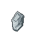 Tiny Hollow Shard

`tiny_hollow_shard` · Hollow · Common · iLv 14 · stack 99

> A grey sliver that drinks warmth. Handle with care.

- **Sources**:
  - Drop: [Greyfin](monsters.md#enemy-greyfin) (Lv 7–11) · 60% (group)
  - Drop: [Hollow Minnow](monsters.md#enemy-hollow_minnow) (Lv 1) · 25% (rare)

### 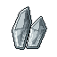 Hollow Shard

`hollow_shard` · Hollow · Earth · iLv 27 · stack 99

> A shard of the Hollow Tide. Appraise before use.

- **Sources**:
  - Drop: [Hollow Drone](monsters.md#enemy-hollow_drone) (Lv 88–99) · 20% (group 60%, weight 1 of 3)
  - Drop: [Hollow Stag](monsters.md#enemy-hollow_stag) (Lv 55–59) · 20% (rare)
  - Drop: [Hollowed Boarlet](monsters.md#enemy-hollowed_boarlet) (Lv 3–12) · 12% (rare)
  - Drop: [Hollowed Wyrmling](monsters.md#enemy-hollowed_wyrmling) (Lv 88–99) · 20% (group 60%, weight 1 of 3)
  - Reward: Expedition Reed Marsh (4/8 h)

## Insect (8)

###  Glowfly

`glowfly` · Insect · Plain · iLv 5 · stack 99

> A firefly whose tail holds a bead of Qi-light. Lamp-makers and night alchemists buy them by the jar.

- **Sources**:
  - Gathering: Insect swarm, apprentice rank, 100% of catches in Reed Shallows (Lotus Ferry), Willow Path West (Willow Path)
  - Gathering: Insect swarm, apprentice rank, 30% of catches in Grey Pools (Reed Marsh)
  - Gathering: Insect swarm, apprentice rank, 70% of catches in Marsh Edge (Reed Marsh)
  - Gathering: Post: Insect Netting in Grey Pools (Reed Marsh) · 30% of catches
  - Gathering: Post: Insect Netting in Marsh Edge (Reed Marsh) · 70% of catches
  - Gathering: Post: Insect Netting in Reed Shallows (Lotus Ferry) · 100% of catches
  - Gathering: Post: Insect Netting in Willow Path West (Willow Path) · 100% of catches
  - Gathering: Post: Insect Netting, gate Lv 1

###  Reed Cicada

`reed_cicada` · Insect · Common · iLv 14 · stack 99

> A reed cicada. Its dried shell calms fevers; its song carries Qi a long way.

- **Sources**:
  - Gathering: Insect swarm, apprentice rank, 30% of catches in Bend Shore (Deepwater Bend), Marsh Edge (Reed Marsh)
  - Gathering: Insect swarm, apprentice rank, 60% of catches in Whispering Bamboo (Bamboo Grove)
  - Gathering: Insect swarm, apprentice rank, 70% of catches in Grey Pools (Reed Marsh)
  - Gathering: Post: Insect Netting in Bend Shore (Deepwater Bend) · 30% of catches
  - Gathering: Post: Insect Netting in Grey Pools (Reed Marsh) · 70% of catches
  - Gathering: Post: Insect Netting in Marsh Edge (Reed Marsh) · 30% of catches
  - Gathering: Post: Insect Netting in Whispering Bamboo (Bamboo Grove) · 60% of catches
  - Gathering: Post: Insect Netting, gate Lv 5

###  Jade Scarab

`jade_scarab` · Insect · Earth · iLv 27 · stack 99

> A green scarab whose shell is half jade. Ground, it binds a pill's ingredients.

- **Sources**:
  - Gathering: Insect swarm, apprentice rank, 100% of catches in Thicket Heart (Bamboo Grove)
  - Gathering: Insect swarm, apprentice rank, 30% of catches in Forgotten Monastery (Mist Peak)
  - Gathering: Insect swarm, apprentice rank, 40% of catches in Whispering Bamboo (Bamboo Grove)
  - Gathering: Insect swarm, apprentice rank, 50% of catches in Sky Ledges (Crane Cliffs)
  - Gathering: Insect swarm, apprentice rank, 70% of catches in Bend Shore (Deepwater Bend)
  - Gathering: Post: Insect Netting in Bend Shore (Deepwater Bend) · 70% of catches
  - Gathering: Post: Insect Netting in Forgotten Monastery (Mist Peak) · 30% of catches
  - Gathering: Post: Insect Netting in Sky Ledges (Crane Cliffs) · 50% of catches
  - Gathering: Post: Insect Netting in Thicket Heart (Bamboo Grove) · 100% of catches
  - Gathering: Post: Insect Netting in Whispering Bamboo (Bamboo Grove) · 40% of catches
  - Gathering: Post: Insect Netting, gate Lv 12

###  Silk Moth

`silk_moth` · Insect · Mystic · iLv 59 · stack 99

> A pale moth of the Mist Peak mulberries. Its cocoons spin spirit silk.

- **Sources**:
  - Gathering: Insect swarm, apprentice rank, 100% of catches in Misty Slopes (Mist Peak)
  - Gathering: Insect swarm, apprentice rank, 20% of catches in Lightning Scar (Thunderhorn Plains)
  - Gathering: Insect swarm, apprentice rank, 50% of catches in Sky Ledges (Crane Cliffs)
  - Gathering: Insect swarm, apprentice rank, 70% of catches in Forgotten Monastery (Mist Peak)
  - Gathering: Post: Insect Netting in Forgotten Monastery (Mist Peak) · 70% of catches
  - Gathering: Post: Insect Netting in Lightning Scar (Thunderhorn Plains) · 20% of catches
  - Gathering: Post: Insect Netting in Misty Slopes (Mist Peak) · 100% of catches
  - Gathering: Post: Insect Netting in Sky Ledges (Crane Cliffs) · 50% of catches
  - Gathering: Post: Insect Netting, gate Lv 20

###  Frost Cricket

`frost_cricket` · Insect · Spirit · iLv 68 · stack 99

> An ice-blue cricket from the Rimefrost. It chirps colder than the wind.

- **Sources**:
  - Gathering: Insect swarm, apprentice rank, 100% of catches in Frostpine Climb (Rimefrost Heights), Snow Ape Ledges (Rimefrost Heights)
  - Gathering: Insect swarm, apprentice rank, 20% of catches in Worm Sea (Sunscar Desert)
  - Gathering: Insect swarm, apprentice rank, 80% of catches in Rimefrost Summit (Rimefrost Heights)
  - Gathering: Post: Insect Netting in Frostpine Climb (Rimefrost Heights) · 100% of catches
  - Gathering: Post: Insect Netting in Rimefrost Summit (Rimefrost Heights) · 80% of catches
  - Gathering: Post: Insect Netting in Snow Ape Ledges (Rimefrost Heights) · 100% of catches
  - Gathering: Post: Insect Netting in Worm Sea (Sunscar Desert) · 20% of catches
  - Gathering: Post: Insect Netting, gate Lv 40

###  Thunder Mantis

`thunder_mantis` · Insect · Spirit · iLv 68 · stack 99

> A storm-grass mantis that stores a spark in its claws. Handle it by the wings.

- **Sources**:
  - Gathering: Insect swarm, apprentice rank, 100% of catches in Stormgrass Verge (Thunderhorn Plains), Thunderhorn Flats (Thunderhorn Plains)
  - Gathering: Insect swarm, apprentice rank, 20% of catches in Rimefrost Summit (Rimefrost Heights)
  - Gathering: Insect swarm, apprentice rank, 80% of catches in Lightning Scar (Thunderhorn Plains)
  - Gathering: Post: Insect Netting in Lightning Scar (Thunderhorn Plains) · 80% of catches
  - Gathering: Post: Insect Netting in Rimefrost Summit (Rimefrost Heights) · 20% of catches
  - Gathering: Post: Insect Netting in Stormgrass Verge (Thunderhorn Plains) · 100% of catches
  - Gathering: Post: Insect Netting in Thunderhorn Flats (Thunderhorn Plains) · 100% of catches
  - Gathering: Post: Insect Netting, gate Lv 30

###  Ember Locust

`ember_locust` · Insect · Sage · iLv 77 · stack 99

> A Sunscar locust with ember-bright wings. A swarm can strip a dune garden bare.

- **Sources**:
  - Gathering: Insect swarm, apprentice rank, 100% of catches in Glass Dunes (Sunscar Desert), Scorpion Flats (Sunscar Desert)
  - Gathering: Insect swarm, apprentice rank, 20% of catches in Driftglass Bank (Drifting Shoals)
  - Gathering: Insect swarm, apprentice rank, 80% of catches in Worm Sea (Sunscar Desert)
  - Gathering: Post: Insect Netting in Driftglass Bank (Drifting Shoals) · 20% of catches
  - Gathering: Post: Insect Netting in Glass Dunes (Sunscar Desert) · 100% of catches
  - Gathering: Post: Insect Netting in Scorpion Flats (Sunscar Desert) · 100% of catches
  - Gathering: Post: Insect Netting in Worm Sea (Sunscar Desert) · 80% of catches
  - Gathering: Post: Insect Netting, gate Lv 45

###  Starwing Mote

`starwing_mote` · Insect · Sovereign · iLv 86 · stack 99

> A fly no bigger than a grain of rice, its wings dusted with starlight from the lanterns.

- **Sources**:
  - Gathering: Insect swarm, apprentice rank, 100% of catches in Jellyfish Shallows (Drifting Shoals), Sparrow Reefs (Drifting Shoals)
  - Gathering: Insect swarm, apprentice rank, 80% of catches in Driftglass Bank (Drifting Shoals)
  - Gathering: Post: Insect Netting in Driftglass Bank (Drifting Shoals) · 80% of catches
  - Gathering: Post: Insect Netting in Jellyfish Shallows (Drifting Shoals) · 100% of catches
  - Gathering: Post: Insect Netting in Sparrow Reefs (Drifting Shoals) · 100% of catches
  - Gathering: Post: Insect Netting, gate Lv 50

## Jade (5)

###  Body Jade

`body_jade` · Jade · Common · iLv 14 · stack 99

> A Qi jade for an inlay socket. +3/+6/+10 body at Common/Earth/Heaven.

- **Effect**: Jade: {"attribute": "body", "values": [3, 6, 10]}
- **Sources**:
  - Crafting: Recipe `body_jade` (Smithing, Earth): Jadeiron ×3, Tortoise Plate ×1, Spirit Stone Shard ×1

###  Essence Jade

`essence_jade` · Jade · Common · iLv 14 · stack 99

> A Qi jade for an inlay socket. +3/+6/+10 essence at Common/Earth/Heaven.

- **Effect**: Jade: {"attribute": "essence", "values": [3, 6, 10]}
- **Sources**:
  - Crafting: Recipe `essence_jade` (Smithing, Earth): Jadeiron ×3, Leech Oil ×2, Spirit Stone Shard ×1

###  Insight Jade

`insight_jade` · Jade · Common · iLv 14 · stack 99

> A Qi jade for an inlay socket. +3/+6/+10 insight at Common/Earth/Heaven.

- **Effect**: Jade: {"attribute": "insight", "values": [3, 6, 10]}
- **Sources**:
  - Crafting: Recipe `insight_jade` (Smithing, Earth): Jadeiron ×3, Talisman Paper ×2, Spirit Stone Shard ×1

###  Spirit Jade

`spirit_jade` · Jade · Common · iLv 14 · stack 99

> A Qi jade for an inlay socket. +3/+6/+10 spirit at Common/Earth/Heaven.

- **Effect**: Jade: {"attribute": "spirit", "values": [3, 6, 10]}
- **Sources**:
  - Drop: [One-Eye Pang](monsters.md#enemy-one_eye_pang) (Lv 20) · 50% (guaranteed)
  - Crafting: Recipe `spirit_jade` (Smithing, Earth): Jadeiron ×3, Mirror Dust ×1, Spirit Stone Shard ×1
  - Shop: Old Pan's Wares (Old Pan in Market Street (Stoneford), Willow Path East (Willow Path)) · daily rotation (3 of 7)
  - Reward: Daily activity chest at 100 points, reward ×2
  - Reward: Old Ma at heart 5 ×3

###  Swift Jade

`swift_jade` · Jade · Common · iLv 14 · stack 99

> A Qi jade for an inlay socket. +3/+6/+10 agility at Common/Earth/Heaven.

- **Effect**: Jade: {"attribute": "agility", "values": [3, 6, 10]}
- **Sources**:
  - Crafting: Recipe `swift_jade` (Smithing, Earth): Jadeiron ×3, Frog Leg ×2, Spirit Stone Shard ×1

## Key (21)

###  Aunt Ping's Ladle

`aunt_pings_ladle` · Key · Plain · iLv 5 · stack 1

> Aunt Ping's soup ladle. The gulls keep stealing it.

- **Notes**: cannot be sold, quest item
- **Sources**:
  - Gathering: Pickup "Aunt Ping's Ladle" in Lotus Ferry Village (Lotus Ferry)

###  Cloud Token

`cloud_token` · Key · Plain · iLv 5 · stack 1

> Identity token of the Cloud Sect. Returns you home.

- **Notes**: cannot be sold
- **Sources**:
  - Reward: joining the Cloud Sect

###  Entry Token

`entry_token` · Key · Plain · iLv 5 · stack 1

> Proof of passing a sect entry trial.

- **Notes**: cannot be sold
- **Sources**:
  - Drop: [Trial Puppet](monsters.md#enemy-trial_puppet) (Lv 2) · 100% (guaranteed)
  - Reward: Quest Entry Trial (guided, from Qing Lan), reward

###  Jade Token

`jade_token` · Key · Plain · iLv 5 · stack 1

> Identity token of the Jade Sect. Returns you home.

- **Notes**: cannot be sold
- **Sources**:
  - Reward: joining the Jade Sect

###  Kite

`kite` · Key · Plain · iLv 5 · stack 1

> Little Dou's paper kite.

- **Notes**: cannot be sold, quest item
- **Sources**:
  - Gathering: Pickup "Little Dou's Kite" in Lotus Ferry Village (Lotus Ferry)

###  Mudwater Key

`mudwater_key` · Key · Plain · iLv 5 · stack 1

> Opens the Mudwater Hideout gate.

- **Notes**: cannot be sold
- **Sources**:
  - Drop: [Mudwater Bandit](monsters.md#enemy-mudwater_bandit) (Lv 14–52) · 30% (only during The Caravan Road)
  - Gathering: Pickup "Gate Key" in Stockade (Mudwater Hideout)

###  River Token

`river_token` · Key · Plain · iLv 5 · stack 1

> Lu's River Token. It hums when the river is troubled.

- **Notes**: cannot be sold
- **Sources**:
  - Reward: Quest The River Token (main, from Lu), reward
  - Reward: Skip-the-Prologue start

###  Siege Medal

`siege_medal` · Key · Plain · iLv 5 · stack 1

> Awarded to defenders of the Two Sects.

- **Notes**: cannot be sold
- **Sources**:
  - Drop: [Hollow Behemoth](monsters.md#enemy-hollow_behemoth) (Lv 58) · 100% (guaranteed)
  - Reward: Quest The Siege (main, from Elder Hu), reward

###  Smuggler Ledger

`smuggler_ledger` · Key · Plain · iLv 5 · stack 1

> Elder Gu's secret ledger.

- **Notes**: cannot be sold, quest item
- **Sources**:
  - Drop: [Elder Gu](monsters.md#enemy-elder_gu) (Lv 53) · 100% (guaranteed)

###  Rubbing Kit

`rubbing_kit` · Key · Common · iLv 14 · stack 1

> Paper, a pad and pine-soot ink for taking a rubbing from carved stone.

- **Notes**: cannot be sold
- **Sources**:
  - Shop: Stoneford General Store (Proprietor Fang in Market Street (Stoneford)) · 120 Silver Taels; needs Qi Kindling 5

###  Alliance Token

`alliance_token` · Key · Spirit · iLv 68 · stack 1

> A jade token of the Nine Peaks Alliance. Sky roads open for its bearer.

- **Sources**:
  - Reward: Dialogue with Envoy Lanshi

###  Ironroot Token

`ironroot_token` · Key · Spirit · iLv 68 · stack 1

> An iron-hard sliver of root, carved with the Ironroot clan's mark.

- **Sources**:
  - Reward: Quest Ironroot Blood (main, from Warden Tie Shan), reward

###  Black Ledger

`black_ledger` · Key · Sage · iLv 77 · stack 1

> Elder Gu's Black Ledger, stitched back together. Every valley family that ever paid him is in it.

- **Notes**: cannot be sold, quest item
- **Sources**:
  - Reward: Dialogue with Elder Gu

###  Cloud Elder's Token

`cloud_elder_token` · Key · Sage · iLv 77 · stack 1

> An Elder's token of the Cloud Sect. At any teleport stone it calls you home to the Monastery, free.

- **Notes**: cannot be sold
- **Sources**:
  - Reward: Unlock: Elder's token: the Cloud Sect's token becomes an Elder's

###  Cloud Skiff

`cloud_skiff` · Key · Sage · iLv 77 · stack 1

> A one-sail skiff with a ward-lantern at the bow. Slow, stubborn, and yours. Crosses the Starsea.

- **Effect**: Vessel: {"speed": 1.0}
- **Notes**: cannot be sold
- **Sources**:
  - Crafting: Recipe `cloud_skiff` (Shipwright, Sage): Spirit Wood ×6, Stormsteel Ore ×4, Formation Stone ×2, Harpy Plume ×3; known by default

###  Jade Elder's Token

`jade_elder_token` · Key · Sage · iLv 77 · stack 1

> An Elder's token of the Jade Sect. At any teleport stone it calls you home to the Academy, free.

- **Notes**: cannot be sold
- **Sources**:
  - Reward: Unlock: Elder's token: the Jade Sect's token becomes an Elder's

###  Star Chart: the Lantern Run

`star_chart_lantern` · Key · Sage · iLv 77 · stack 1

> A chart that ends at a field of lanterns hanging in the dark. No one alive has sailed it.

- **Effect**: Chart: lantern_run
- **Notes**: cannot be sold
- **Sources**:
  - Crafting: Recipe `star_chart_lantern` (Star charting, Sage): Star Reading ×8, Sky Ink ×4

###  Star Chart: the Wreck Run

`star_chart_wreck` · Key · Sage · iLv 77 · stack 1

> A chart of the Wreck Run: from the Cloudgate Skydock across the Starsea to the Skyport Wreck, and home.

- **Effect**: Chart: wreck_run
- **Notes**: cannot be sold
- **Sources**:
  - Crafting: Recipe `star_chart_wreck` (Star charting, Sage): Star Reading ×4, Sky Ink ×2; known by default

###  Storm Sloop

`storm_sloop` · Key · Sage · iLv 77 · stack 1

> A two-sail sloop with a comet-iron keel and a formation ward. It crosses the Starsea half again as fast.

- **Effect**: Vessel: {"speed": 1.5}
- **Notes**: cannot be sold
- **Sources**:
  - Crafting: Recipe `storm_sloop` (Shipwright, Sage): Spirit Wood ×10, Comet Iron ×6, Formation Stone ×4, Kite Silk ×4

###  Sunscar Seal

`sunscar_seal` · Key · Sage · iLv 77 · stack 1

> The Tomb King's sun seal: a disc of gold and jade, warm as a living hand.

- **Notes**: cannot be sold, quest item
- **Sources**:
  - Drop: [Tomb King](monsters.md#enemy-tomb_king) (Lv 77) · 100% (only during The Tomb King)

###  Admirals Seal

`admirals_seal` · Key · Will · iLv 95 · stack 1

> Admiral Voss's seal of command: a bronze star on a chain. Every pirate lane in the Field answered to it.

- **Notes**: cannot be sold, quest item
- **Sources**:
  - Drop: [Admiral Voss](monsters.md#enemy-admiral_voss) (Lv 90) · 100% (guaranteed)

## Legend piece (27)

###  Crane Bone Mouthpiece

`crane_mouthpiece` · Legend piece · Mystic · iLv 59 · stack 1

> A piece of Crane Mourning Flute, found with an old foe of the valley. Three pieces, and an Expert smith, make it whole.

- **Notes**: cannot be sold, quest item
- **Sources**:
  - Drop: [Big Toad Tan](monsters.md#enemy-big_toad_tan) (Lv 18) · 100% (only during Crane Mourning Flute)

###  Crane Jade Body

`crane_jade_body` · Legend piece · Mystic · iLv 59 · stack 1

> A piece of Crane Mourning Flute, found with the Azure Expanse. Three pieces, and an Expert smith, make it whole.

- **Notes**: cannot be sold, quest item
- **Sources**:
  - Drop: [Spark Weasel](monsters.md#enemy-spark_weasel) (Lv 64–67) · 12% (only during Crane Mourning Flute)

###  Crane Tassel

`crane_tassel` · Legend piece · Mystic · iLv 59 · stack 1

> A piece of Crane Mourning Flute, found with the Azure Expanse. Three pieces, and an Expert smith, make it whole.

- **Notes**: cannot be sold, quest item
- **Sources**:
  - Drop: [Thousand Eye Toad](monsters.md#enemy-thousand_eye_toad) (Lv 68) · 100% (only during Crane Mourning Flute)

###  Dragonfly Limb

`dragonfly_limb` · Legend piece · Mystic · iLv 59 · stack 1

> A piece of Dragonfly Bow, found with an old foe of the valley. Three pieces, and an Expert smith, make it whole.

- **Notes**: cannot be sold, quest item
- **Sources**:
  - Drop: [Gu Family Enforcer](monsters.md#enemy-gu_enforcer) (Lv 26) · 50% (only during Dragonfly Bow)

###  Dragonfly Sight

`dragonfly_sight` · Legend piece · Mystic · iLv 59 · stack 1

> A piece of Dragonfly Bow, found with the Azure Expanse. Three pieces, and an Expert smith, make it whole.

- **Notes**: cannot be sold, quest item
- **Sources**:
  - Drop: [Tomb King](monsters.md#enemy-tomb_king) (Lv 77) · 100% (only during Dragonfly Bow)

###  Dragonfly String

`dragonfly_string` · Legend piece · Mystic · iLv 59 · stack 1

> A piece of Dragonfly Bow, found with the Azure Expanse. Three pieces, and an Expert smith, make it whole.

- **Notes**: cannot be sold, quest item
- **Sources**:
  - Drop: [Sandstorm Scorpion](monsters.md#enemy-sandstorm_scorpion) (Lv 73–78) · 12% (only during Dragonfly Bow)

###  Ferryman's Iron Cap

`ferryman_iron_cap` · Legend piece · Mystic · iLv 59 · stack 1

> A piece of The Ferryman's Pole, found with an old foe of the valley. Three pieces, and an Expert smith, make it whole.

- **Notes**: cannot be sold, quest item
- **Sources**:
  - Drop: [Ferryman Lou](monsters.md#enemy-ferryman_lou) (Lv 27) · 60% (only during The Ferryman's Pole)

###  Ferryman's Knot

`ferryman_knot` · Legend piece · Mystic · iLv 59 · stack 1

> A piece of The Ferryman's Pole, found with the Azure Expanse. Three pieces, and an Expert smith, make it whole.

- **Notes**: cannot be sold, quest item
- **Sources**:
  - Drop: [Thousand Eye Toad](monsters.md#enemy-thousand_eye_toad) (Lv 68) · 100% (only during The Ferryman's Pole)

###  Ferryman's Oak Shaft

`ferryman_oak_shaft` · Legend piece · Mystic · iLv 59 · stack 1

> A piece of The Ferryman's Pole, found with the Azure Expanse. Three pieces, and an Expert smith, make it whole.

- **Notes**: cannot be sold, quest item
- **Sources**:
  - Drop: [River Sentinel](monsters.md#enemy-river_sentinel) (Lv 70–75) · 12% (only during The Ferryman's Pole)

###  Heron Shaft

`heron_shaft` · Legend piece · Mystic · iLv 59 · stack 1

> A piece of Heron's Reach, found with the Azure Expanse. Three pieces, and an Expert smith, make it whole.

- **Notes**: cannot be sold, quest item
- **Sources**:
  - Drop: [Cloudpeak Roc](monsters.md#enemy-cloudpeak_roc) (Lv 58–63) · 12% (only during Heron's Reach)

###  Heron Spearhead

`heron_spearhead` · Legend piece · Mystic · iLv 59 · stack 1

> A piece of Heron's Reach, found with an old foe of the valley. Three pieces, and an Expert smith, make it whole.

- **Notes**: cannot be sold, quest item
- **Sources**:
  - Drop: [Knife-Hand Sui](monsters.md#enemy-knife_hand_sui) (Lv 34) · 50% (only during Heron's Reach)

###  Heron Tassel

`heron_tassel` · Legend piece · Mystic · iLv 59 · stack 1

> A piece of Heron's Reach, found with the Azure Expanse. Three pieces, and an Expert smith, make it whole.

- **Notes**: cannot be sold, quest item
- **Sources**:
  - Drop: [Warden Rong Yan](monsters.md#enemy-scarlet_kiln_warden) (Lv 66) · 60% (only during Heron's Reach)

###  Mountainsplit Edge

`mountainsplit_edge` · Legend piece · Mystic · iLv 59 · stack 1

> A piece of Mountainsplit Sabre, found with the Azure Expanse. Three pieces, and an Expert smith, make it whole.

- **Notes**: cannot be sold, quest item
- **Sources**:
  - Drop: [Snow Ape](monsters.md#enemy-snow_ape) (Lv 68–72) · 12% (only during Mountainsplit Sabre)

###  Mountainsplit Guard

`mountainsplit_guard` · Legend piece · Mystic · iLv 59 · stack 1

> A piece of Mountainsplit Sabre, found with the Azure Expanse. Three pieces, and an Expert smith, make it whole.

- **Notes**: cannot be sold, quest item
- **Sources**:
  - Drop: [Warden Rong Yan](monsters.md#enemy-scarlet_kiln_warden) (Lv 66) · 60% (only during Mountainsplit Sabre)

###  Mountainsplit Spine

`mountainsplit_spine` · Legend piece · Mystic · iLv 59 · stack 1

> A piece of Mountainsplit Sabre, found with an old foe of the valley. Three pieces, and an Expert smith, make it whole.

- **Notes**: cannot be sold, quest item
- **Sources**:
  - Drop: [Riverbed Serpent](monsters.md#enemy-riverbed_serpent) (Lv 25) · 100% (only during Mountainsplit Sabre)

###  Reedwhisper Edge

`reedwhisper_edge` · Legend piece · Mystic · iLv 59 · stack 1

> A piece of Reedwhisper Dagger, found with an old foe of the valley. Three pieces, and an Expert smith, make it whole.

- **Notes**: cannot be sold, quest item
- **Sources**:
  - Drop: [One-Eye Pang](monsters.md#enemy-one_eye_pang) (Lv 20) · 50% (only during Reedwhisper Dagger)

###  Reedwhisper Grip

`reedwhisper_grip` · Legend piece · Mystic · iLv 59 · stack 1

> A piece of Reedwhisper Dagger, found with the Azure Expanse. Three pieces, and an Expert smith, make it whole.

- **Notes**: cannot be sold, quest item
- **Sources**:
  - Drop: [Frost Lynx](monsters.md#enemy-frost_lynx) (Lv 67–70) · 12% (only during Reedwhisper Dagger)

###  Reedwhisper Sheath

`reedwhisper_sheath` · Legend piece · Mystic · iLv 59 · stack 1

> A piece of Reedwhisper Dagger, found with the Azure Expanse. Three pieces, and an Expert smith, make it whole.

- **Notes**: cannot be sold, quest item
- **Sources**:
  - Drop: [Tomb King](monsters.md#enemy-tomb_king) (Lv 77) · 100% (only during Reedwhisper Dagger)

###  Riverlight Blade

`riverlight_blade` · Legend piece · Mystic · iLv 59 · stack 1

> A piece of Riverlight Jian, found with the Azure Expanse. Three pieces, and an Expert smith, make it whole.

- **Notes**: cannot be sold, quest item
- **Sources**:
  - Drop: [Azure Carp Dragonet](monsters.md#enemy-azure_carp_dragonet) (Lv 68–73) · 12% (only during Riverlight Jian)

###  Riverlight Hilt

`riverlight_hilt` · Legend piece · Mystic · iLv 59 · stack 1

> A piece of Riverlight Jian, found with an old foe of the valley. Three pieces, and an Expert smith, make it whole.

- **Notes**: cannot be sold, quest item
- **Sources**:
  - Drop: [Drowned Abbot](monsters.md#enemy-drowned_abbot) (Lv 27) · 100% (only during Riverlight Jian)

###  Riverlight Soul Bead

`riverlight_soul` · Legend piece · Mystic · iLv 59 · stack 1

> A piece of Riverlight Jian, found with the Azure Expanse. Three pieces, and an Expert smith, make it whole.

- **Notes**: cannot be sold, quest item
- **Sources**:
  - Drop: [Tomb King](monsters.md#enemy-tomb_king) (Lv 77) · 100% (only during Riverlight Jian)

###  Seven Winds Pin

`seven_winds_pin` · Legend piece · Mystic · iLv 59 · stack 1

> A piece of Seven Winds Fan, found with the Azure Expanse. Three pieces, and an Expert smith, make it whole.

- **Notes**: cannot be sold, quest item
- **Sources**:
  - Drop: [Canyon Harpy](monsters.md#enemy-canyon_harpy) (Lv 74–78) · 12% (only during Seven Winds Fan)

###  Seven Winds Rib

`seven_winds_rib` · Legend piece · Mystic · iLv 59 · stack 1

> A piece of Seven Winds Fan, found with an old foe of the valley. Three pieces, and an Expert smith, make it whole.

- **Notes**: cannot be sold, quest item
- **Sources**:
  - Drop: [Rogue Treasure Adept](monsters.md#enemy-rogue_treasure_adept) (Lv 48–50) · 50% (only during Seven Winds Fan)

###  Seven Winds Silk

`seven_winds_silk` · Legend piece · Mystic · iLv 59 · stack 1

> A piece of Seven Winds Fan, found with the Azure Expanse. Three pieces, and an Expert smith, make it whole.

- **Notes**: cannot be sold, quest item
- **Sources**:
  - Drop: [Wind Kite](monsters.md#enemy-wind_kite) (Lv 73–78) · 12% (only during Seven Winds Fan)

###  Stone Drum Cuff

`stone_drum_cuff` · Legend piece · Mystic · iLv 59 · stack 1

> A piece of Stone Drum Gauntlets, found with the Azure Expanse. Three pieces, and an Expert smith, make it whole.

- **Notes**: cannot be sold, quest item
- **Sources**:
  - Drop: [Thunderhorn Rhino](monsters.md#enemy-thunderhorn_rhino) (Lv 64–69) · 12% (only during Stone Drum Gauntlets)

###  Stone Drum Heart

`stone_drum_heart` · Legend piece · Mystic · iLv 59 · stack 1

> A piece of Stone Drum Gauntlets, found with the Azure Expanse. Three pieces, and an Expert smith, make it whole.

- **Notes**: cannot be sold, quest item
- **Sources**:
  - Drop: [Thousand Eye Toad](monsters.md#enemy-thousand_eye_toad) (Lv 68) · 100% (only during Stone Drum Gauntlets)

###  Stone Drum Knuckle

`stone_drum_knuckle` · Legend piece · Mystic · iLv 59 · stack 1

> A piece of Stone Drum Gauntlets, found with an old foe of the valley. Three pieces, and an Expert smith, make it whole.

- **Notes**: cannot be sold, quest item
- **Sources**:
  - Drop: [Gorge Stalker](monsters.md#enemy-gorge_stalker) (Lv 32) · 50% (only during Stone Drum Gauntlets)

## Material (54)

###  Dyed Root

`dyed_root` · Material · Plain · iLv 5 · stack 99

> A carrot root dyed and combed to pass for hundred-year ginseng. Worth nothing, except as a lesson.

- **Source mark**: `system` (made by a game system whose own rule names the item (see the description))

### 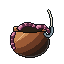 Fish Bait

`fish_bait` · Material · Plain · iLv 5 · stack 99

> Worms and dough in a clay pot. The fish of the valley are not picky.

- **Sources**:
  - Shop: Hermit Yao's Beast Hall (Hermit Yao in Hermit's Stilt House (Reed Marsh)) · at list price in Silver Taels
  - Shop: Stoneford General Store (Proprietor Fang in Market Street (Stoneford)) · at list price in Silver Taels

###  Rice

`rice` · Material · Plain · iLv 5 · stack 99

> A sack of valley rice. Every kitchen starts here.

- **Sources**:
  - Container: Crate in Artisan Row (Stoneford), Collapsed Tunnel (Stonewall Quarry), Lower Pit (Stonewall Quarry), Pilgrim Stairs (Cleansing Peak), Quarry Rim (Stonewall Quarry), Willow Path East (Willow Path) (Lv 1–18) · 20% (group 50%, weight 2 of 5)
  - Container: Jar in Collapsed Tunnel (Stonewall Quarry), Granny Liu's Herb Hut (Lotus Ferry), Grey Pools (Reed Marsh), Lotus Ferry Village (Lotus Ferry), Lower Pit (Stonewall Quarry), Marsh Edge (Reed Marsh), Pilgrim Stairs (Cleansing Peak), Quarry Rim (Stonewall Quarry), Reed Shallows (Lotus Ferry), Sunken Causeway (Reed Marsh), Thicket Heart (Bamboo Grove), Whispering Bamboo (Bamboo Grove) and 2 more (Lv 1–18) · 20% (group 50%, weight 2 of 5)
  - Shop: Greyreed Trade Post (Trader Min in Greyreed Hamlet) · at list price in Silver Taels
  - Shop: Old Ma's Store (Old Ma in Lotus Ferry at Night (Lotus Ferry), Old Ma's Store (Lotus Ferry)) · 2 Silver Taels
  - Shop: Stoneford General Store (Proprietor Fang in Market Street (Stoneford)) · at list price in Silver Taels

###  River Mud

`river_mud` · Material · Plain · iLv 5 · stack 99

> Thick grey mud from the riverbank. Potters and wall-menders pay a little for it.

- **Sources**:
  - Drop: [Mudshell Crab](monsters.md#enemy-mudshell_crab) (Lv 1) · 30% (group 60%, weight 1 of 2)
  - Shop: Old Ma's Store (Old Ma in Lotus Ferry at Night (Lotus Ferry), Old Ma's Store (Lotus Ferry)) · daily rotation (1 of 4)

###  Arrows

`arrows` · Material · Common · iLv 14 · stack 99

> A bundle of fletched arrows. Hunters and bandits never have enough.

- **Sources**:
  - Drop: [Bandit Archer](monsters.md#enemy-bandit_archer) (Lv 16–20) · 30% (group 60%, weight 1 of 2)
  - Drop: [Gorge Stalker](monsters.md#enemy-gorge_stalker) (Lv 32) · 100% (guaranteed)

###  Bottled Spring Water

`spring_water` · Material · Common · iLv 14 · stack 20

> Qi-spring water in a stoppered gourd. Poured on a garden bed, it hurries the herb along by a quarter. A spring gives three bottles a day.

- **Sources**:
  - Reward: Quest Seeds of the Valley (guided, from Gardener Ji), reward ×3

###  Bow Parts

`bow_parts` · Material · Common · iLv 14 · stack 99

> A cracked bow limb and a spool of string. A bowyer can make something of them.

- **Sources**:
  - Drop: [Bandit Archer](monsters.md#enemy-bandit_archer) (Lv 16–20) · 30% (group 60%, weight 1 of 2)

### 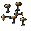 Bronze Rivet

`bronze_rivet` · Material · Common · iLv 14 · stack 99

> A handful of bronze rivets for binding a tool's head to its haft.

- **Sources**:
  - Crafting: Apprentice Bench (posts): 200 work a piece, from craft Lv 5

###  Cinnabar

`cinnabar` · Material · Common · iLv 14 · stack 99

> Red mercury ore ground to powder: the ink every talisman begins with. Stoneford General Store sells it.

- **Sources**:
  - Shop: Stoneford General Store (Proprietor Fang in Market Street (Stoneford)) · 8 Silver Taels
  - Reward: Quest Ink and Paper (guided, from Old Scribe Bai), on accept ×3

###  Cinnabar Salt

`cinnabar_salt` · Material · Common · iLv 14 · stack 999

> A red Essence Salt calcined from copper and moss. Seals, flags and fine tools want it.

- **Sources**:
  - Crafting: Post calcination: Copper ×3, Willow Moss ×2

###  Cloth

`cloth` · Material · Common · iLv 14 · stack 99

> A bolt of plain hemp cloth, for bandages, patches and tailoring.

- **Sources**:
  - Drop: [Gorge Bandit Adept](monsters.md#enemy-gorge_bandit_adept) (Lv 29–33) · 60% (group)
  - Drop: [Gu Family Enforcer](monsters.md#enemy-gu_enforcer) (Lv 26) · 100% (guaranteed)
  - Drop: [Ironpine Disciple](monsters.md#enemy-ironpine_disciple) (Lv 10) · 30% (group 60%, weight 1 of 2)
  - Drop: [Kuai Shan](monsters.md#enemy-kuai_shan) (Lv 20) · 100% (guaranteed)
  - Drop: [Lieutenant Kuai](monsters.md#enemy-mudwater_lieutenant) (Lv 19) · 100% (guaranteed)
  - Drop: [Mudwater Bandit](monsters.md#enemy-mudwater_bandit) (Lv 14–52) · 60% (group)
  - Drop: [Mudwater Cutthroat](monsters.md#enemy-mudwater_cutthroat) (Lv 18) · 100% (guaranteed)
  - Drop: [One-Eye Pang](monsters.md#enemy-one_eye_pang) (Lv 20) · 100% (guaranteed)
  - Shop: Old Ma's Store (Old Ma in Lotus Ferry at Night (Lotus Ferry), Old Ma's Store (Lotus Ferry)) · daily rotation (1 of 4)
  - Reward: Quest A Pouch for the Road (side, from Tailor Xun), reward ×4

###  Hemp Cord

`hemp_cord` · Material · Common · iLv 14 · stack 99

> A coil of hemp cord, twisted by an apprentice's patient hands.

- **Sources**:
  - Crafting: Apprentice Bench (posts): 100 work a piece, from craft Lv 1

###  Refining Essence

`refining_essence` · Material · Common · iLv 14 · stack 99

> The refined Qi of a salvaged piece. The forge feeds it into an enhancement to steady it.

- **Sources**:
  - Crafting: appraising a [Sealed Storage Pouch](#item-sealed_storage_pouch) · 18.75% ×3
  - Crafting: salvaging Common-grade equipment ×2
  - Crafting: salvaging Earth-grade equipment ×5
  - Crafting: salvaging Heaven-grade equipment ×9
  - Crafting: salvaging Mystic-grade equipment ×15
  - Crafting: salvaging Sage-grade equipment ×24
  - Crafting: salvaging Sovereign-grade equipment ×30
  - Crafting: salvaging Spirit-grade equipment ×18
  - Crafting: salvaging Will-grade equipment ×36
  - Shop: Forge Guild (Smith Bao in Artisan Row (Stoneford)) · 60 Silver Taels; needs Flag set (flag guild_smithing_adept)
  - Reward: Forge Guild, rank Expert ×10
  - Reward: Quest The Blade That Sleeps No More (side, from Elder Hu), reward ×2

###  Rice Wine

`rice_wine` · Material · Common · iLv 14 · stack 20

> A clay jar of cloudy rice wine. Herbs soaked in it on a drying rack make stronger pills.

- **Sources**:
  - Shop: Stoneford General Store (Proprietor Fang in Market Street (Stoneford)) · 12 Silver Taels

### 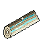 Spirit Wood

`spirit_wood` · Material · Common · iLv 14 · stack 99

> Pale wood that holds a trace of Qi. Puppet frames are cut from it.

- **Sources**:
  - Gathering: Post: Spirit Foraging side drop, one every 20 gathers
  - Shop: Lao's Slipway Stores (Shipwright Lao in Shipwrights' Yard (Cloudgate Port)) · 40 Spirit Stones
  - Shop: Tinkerer's Workshop (Tinkerer Yu in Artisan Row (Stoneford)) · 30 Silver Taels; needs Cloud Stride 5
  - Reward: Quest Hands of Wood (guided, from Tinkerer Yu), on accept ×4

###  Talisman Paper

`talisman_paper` · Material · Common · iLv 14 · stack 99

> Coarse yellow paper cut to a talisman's size. It takes cinnabar well.

- **Sources**:
  - Drop: [Paper Talisman Ghost](monsters.md#enemy-paper_talisman_ghost) (Lv 22–26) · 30% (group 60%, weight 1 of 2)
  - Reward: Quest Ink and Paper (guided, from Old Scribe Bai), on accept ×3

###  Beast-Blood Ink

`beast_blood_ink` · Material · Earth · iLv 27 · stack 99

> Ink cut with a beast's blood; it holds a stronger charge than cinnabar alone.

- **Sources**:
  - Crafting: Recipe `beast_blood_ink` (Talisman, Earth): Hound Fang ×2, Rat Tail ×2

###  Blank Plate

`blank_plate` · Material · Earth · iLv 27 · stack 99

> A blank jade plate for portable arrays.

- **Sources**:
  - Shop: Formation Guild (Array Master Ren in Artisan Row (Stoneford)) · 45 Silver Taels; needs Flag set (flag guild_formations_adept)
  - Shop: Trade House (Elder Gu in Artisan Row (Stoneford); Madam Hua in Artisan Row (Stoneford)) · 60 Silver Taels; needs Heart Tempering 5
  - Reward: Formation Guild, rank Expert ×5
  - Reward: Quest Carry a Wall (guided, from Elder Bian), on accept
  - Reward: Quest Carry a Wall (guided, from Elder Bian), reward ×3

###  Formation Stone

`formation_stone` · Material · Earth · iLv 27 · stack 99

> A palm-sized stone that holds a trace of Qi: the anchor of every array.

- **Sources**:
  - Drop: [Jade Sentinel](monsters.md#enemy-jade_sentinel) (Lv 52–56) · 60% (group)
  - Shop: Formation Guild (Array Master Ren in Artisan Row (Stoneford)) · 60 Silver Taels; needs Flag set (flag guild_formations_adept)
  - Shop: Lao's Slipway Stores (Shipwright Lao in Shipwrights' Yard (Cloudgate Port)) · at list price in Spirit Stones
  - Reward: Bai Ling at heart 3 ×2
  - Reward: Formation Guild, rank Adept ×5
  - Reward: Formation Guild, rank Master ×10
  - Reward: Quest Carry a Wall (guided, from Elder Bian), on accept
  - Reward: Quest Keel and Ward (guided, from Shipwright Lao), reward ×2

###  Fuel Crystal Low

`fuel_crystal_low` · Material · Earth · iLv 27 · stack 99

> Formation fuel pressed from Spirit Stone shards.

- **Sources**:
  - Crafting: Recipe `fuel_crystal_low` (Smithing, Common): Spirit Stone Shard ×2; known by default
  - Shop: Cloud Sect Mission Hall (Deacon Heng in Cliff Stair (Cloud Sect Monastery)) · at list price in Contribution; needs Heart Tempering 1
  - Shop: Jade Sect Mission Hall (Deacon Rui in Gate Street (Jade Sect Academy)) · at list price in Contribution; needs Heart Tempering 1
  - Shop: Stoneford General Store (Proprietor Fang in Market Street (Stoneford)) · at list price in Silver Taels; needs Heart Tempering 1
  - Reward: Quest Keep Watch (guided, from Elder Bian), reward ×2
  - Reward: Quest Lines in the Sand (guided, from Elder Bian), on accept ×3
  - Reward: Quest Lines in the Sand (guided, from Elder Bian), reward ×10

###  Ink

`ink` · Material · Earth · iLv 27 · stack 99

> Pine-soot ink ground with spirit water. Scribes and formation masters use it.

- **Sources**:
  - Drop: [Paper Talisman Ghost](monsters.md#enemy-paper_talisman_ghost) (Lv 22–26) · 30% (group 60%, weight 1 of 2)

###  Kiln Brick

`kiln_brick` · Material · Earth · iLv 27 · stack 99

> A fired brick with the bench's stamp. Furnaces and forges are built of them.

- **Sources**:
  - Crafting: Apprentice Bench (posts): 350 work a piece, from craft Lv 12

###  Lacquer Pot

`lacquer_pot` · Material · Earth · iLv 27 · stack 99

> A pot of red lacquer with its brush, to seal wood against the damp.

- **Sources**:
  - Crafting: Apprentice Bench (posts): 700 work a piece, from craft Lv 17

###  Prayer Beads

`prayer_beads` · Material · Earth · iLv 27 · stack 99

> Worn sandalwood beads, smooth from years of counted breaths.

- **Sources**:
  - Drop: [Drowned Acolyte](monsters.md#enemy-drowned_acolyte) (Lv 21–26) · 60% (group)

###  Puppet Core

`puppet_core` · Material · Earth · iLv 27 · stack 99

> A carved jade heart that lets a puppet follow simple orders.

- **Sources**:
  - Shop: Tinkerer's Workshop (Tinkerer Yu in Artisan Row (Stoneford)) · 300 Silver Taels; needs Cloud Stride 5
  - Reward: Quest Hands of Wood (guided, from Tinkerer Yu), on accept

###  Spirit Paper

`spirit_paper` · Material · Earth · iLv 27 · stack 99

> Talisman paper steeped with Mist Lotus until it drinks Qi.

- **Sources**:
  - Crafting: Recipe `spirit_paper` (Talisman, Earth): Talisman Paper ×1, Mist Lotus ×1

### 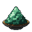 Verdigris Salt

`verdigris_salt` · Material · Earth · iLv 27 · stack 999

> A green Essence Salt, bitter as old bronze.

- **Sources**:
  - Crafting: Post calcination: Riverstone ×3, Reed Perch ×2, Cinnabar Salt ×1

###  Azurite Salt

`azurite_salt` · Material · Heaven · iLv 45 · stack 999

> A deep blue Essence Salt that hums faintly in the hand.

- **Sources**:
  - Crafting: Post calcination: Jadeiron ×3, Jade Scarab ×2, Verdigris Salt ×1

###  Fuel Crystal Mid

`fuel_crystal_mid` · Material · Heaven · iLv 45 · stack 99

> Ten low fuel crystals fused into one.

- **Sources**:
  - Crafting: Recipe `fuel_crystal_mid` (Smithing, Earth): Fuel Crystal Low ×10
  - Shop: Auction Pavilion (Azure Expanse) lot ×5, opening bid 30 · 7.87% of lots
  - Shop: Peddler Gou's Packs (Peddler Gou in Port Market (Cloudgate Port)) · at list price in Spirit Stones; needs Sage 1

###  Lantern Wick

`lantern_wick` · Material · Heaven · iLv 45 · stack 99

> A wick braided with spirit silk. It burns for a month without trimming.

- **Sources**:
  - Drop: [Weeping Lantern](monsters.md#enemy-weeping_lantern) (Lv 50–55) · 30% (group 60%, weight 1 of 2)
  - Shop: Stoneford General Store (Proprietor Fang in Market Street (Stoneford)) · daily rotation (1 of 3)

###  Restoration Ink

`restoration_ink` · Material · Heaven · iLv 45 · stack 99

> Ink steeped with mending herbs: it can close a torn scripture and still hold a stroke.

- **Sources**:
  - Reward: Quest Torn Pages (guided, from Librarian Zhu), on accept
  - Reward: Quest Torn Pages (guided, from Librarian Zhu), reward ×3

###  Spirit Soil

`spirit_soil` · Material · Heaven · iLv 45 · stack 20

> Black earth that still remembers a spirit vein. Worked into a garden bed, it raises the bed's field grade one step, for good. Strong beasts sometimes carry it in their hides.

- **Sources**:
  - Drop: any beast of Lv 19+ · 1%: [Azure Carp Dragonet](monsters.md#enemy-azure_carp_dragonet), [Boulder Serpent](monsters.md#enemy-boulder_serpent), [Canyon Harpy](monsters.md#enemy-canyon_harpy), [Cliff Ape](monsters.md#enemy-cliff_ape), [Cloudpeak Roc](monsters.md#enemy-cloudpeak_roc), [Cloudwing Crane](monsters.md#enemy-cloudwing_crane), [Comet Sparrow](monsters.md#enemy-comet_sparrow), [Dune Worm](monsters.md#enemy-dune_worm), [Ember Fox](monsters.md#enemy-ember_fox), [Frost Lynx](monsters.md#enemy-frost_lynx), [Fruit-Guardian Boar](monsters.md#enemy-fruit_guardian), [Gravity Golem](monsters.md#enemy-gravity_golem), [Hollow Behemoth](monsters.md#enemy-hollow_behemoth), [Hollow Drone](monsters.md#enemy-hollow_drone), [Hollow Stag](monsters.md#enemy-hollow_stag), [Hollowed Wyrmling](monsters.md#enemy-hollowed_wyrmling), [Jade Carp](monsters.md#enemy-jade_carp), [Jade Crane Chick](monsters.md#enemy-jade_crane_chick), [Mist Vulture](monsters.md#enemy-mist_vulture), [Mist Wolf](monsters.md#enemy-mist_wolf), [Mud Hound](monsters.md#enemy-mud_hound), [Nebula Eel](monsters.md#enemy-nebula_eel), [Nebula Leviathan](monsters.md#enemy-nebula_leviathan), [Nest Guardian](monsters.md#enemy-nest_guardian), [Orbit Moth](monsters.md#enemy-orbit_moth), [Rapids Lizard](monsters.md#enemy-rapids_lizard), [Reed Otter](monsters.md#enemy-reed_otter), [Riverbed Serpent](monsters.md#enemy-riverbed_serpent), [Riverstone Ox](monsters.md#enemy-riverstone_ox), [Sandstorm Scorpion](monsters.md#enemy-sandstorm_scorpion), [Snow Ape](monsters.md#enemy-snow_ape), [Spark Weasel](monsters.md#enemy-spark_weasel), [Star Jellyfish](monsters.md#enemy-star_jellyfish), [Stormgrass Stag](monsters.md#enemy-stormgrass_stag), [Stormwing Hawk](monsters.md#enemy-stormwing_hawk), [Thousand Eye Toad](monsters.md#enemy-thousand_eye_toad), [Thunderhorn Rhino](monsters.md#enemy-thunderhorn_rhino), [Tide Crab](monsters.md#enemy-tide_crab), [Void Crab](monsters.md#enemy-void_crab), [Wind Kite](monsters.md#enemy-wind_kite)
  - Container: Chest in Abbot's Sanctum (Drowned Shrine) (Lv 27) · 100% (guaranteed)
  - Reward: Beast Tide at Stoneford Gate (Stoneford)

###  Weapon Soul Crystal

`weapon_soul_crystal` · Material · Heaven · iLv 45 · stack 9

> A crystal with a small flame inside. At a forge it wakes a weapon forged to +10, of Heaven grade or better, for one whose Dao of that weapon has reached Explanation.

- **Notes**: cannot be sold
- **Sources**:
  - Shop: Forge Guild (Smith Bao in Artisan Row (Stoneford)) · 9000 Silver Taels; needs Flag set (flag guild_smithing_master)
  - Shop: Ironroot Clan Forge (Smith Gang in Clan Hearth (Ironroot Clan Hold)) · 900 Spirit Stones; needs after A Blade That Answers
  - Reward: Forge Guild, rank Master
  - Reward: Quest A Blade That Answers (side, from Smith Hong), reward

###  Whetstone

`whetstone` · Material · Heaven · iLv 45 · stack 99

> A fine grey whetstone. A blade or a sickle kept on it cuts true.

- **Sources**:
  - Crafting: Apprentice Bench (posts): 1200 work a piece, from craft Lv 25

###  Pearl Salt

`pearl_salt` · Material · Mystic · iLv 59 · stack 999

> A pale, lustrous Essence Salt, calcined from spirit stone and river carp.

- **Sources**:
  - Crafting: Post calcination: Spirit Stone Shard ×3, Jade Carp ×2, Azurite Salt ×1

###  Spirit Glue

`spirit_glue` · Material · Mystic · iLv 59 · stack 99

> Amber glue boiled from spirit resin. It holds what nails cannot.

- **Sources**:
  - Crafting: Apprentice Bench (posts): 2000 work a piece, from craft Lv 30

###  Amethyst Salt

`amethyst_salt` · Material · Spirit · iLv 68 · stack 999

> A violet Essence Salt that holds a little of the high clouds' chill.

- **Sources**:
  - Crafting: Post calcination: Cloudsteel Ore ×3, Cloudtop Orchid ×2, Pearl Salt ×1

###  Mirror Eye

`mirror_eye` · Material · Spirit · iLv 68 · stack 99

> One of the Thousand-Eye Toad's mirror eyes. It still shows what it last saw.

- **Sources**:
  - Drop: [Thousand Eye Toad](monsters.md#enemy-thousand_eye_toad) (Lv 68) · 100% (guaranteed)
  - Shop: Auction Pavilion (Azure Expanse) lot, opening bid 80 · 3.94% of lots
  - Shop: Broker Mu's Back Room (Broker Mu in Hall of Nine (Nine Peaks), Wayfarers' Inn (Cloudgate Port)) · daily rotation (2 of 5)

###  Sentinel Core

`sentinel_core` · Material · Spirit · iLv 68 · stack 99

> The polished heart-stone of a River Sentinel. Water turns slowly inside it.

- **Sources**:
  - Drop: [River Sentinel](monsters.md#enemy-river_sentinel) (Lv 70–75) · 30% (group 60%, weight 1 of 2)
  - Shop: Auction Pavilion (Azure Expanse) lot ×2, opening bid 40 · 5.51% of lots
  - Shop: Broker Mu's Back Room (Broker Mu in Hall of Nine (Nine Peaks), Wayfarers' Inn (Cloudgate Port)) · daily rotation (2 of 5)
  - Mail: Dialogue with Elder Gu: a letter from Gu, a free man

###  Sky Ink

`sky_ink` · Material · Spirit · iLv 68 · stack 99

> Ink ground with star-dust. The Starsea wind cannot fade it.

- **Sources**:
  - Container: Chest in Pirate Deck (Skyport Wreck) (Lv 80) · 33.33% ×2–3 (group 100%, weight 1 of 3)
  - Shop: Navigator Sun's Charts (Navigator Sun in Shipwrights' Yard (Cloudgate Port)) · 30 Spirit Stones
  - Reward: Quest A Chart of One's Own (guided, from Navigator Sun), reward ×4
  - Reward: Quest Clear Skies over the Peak (side, from Navigator Sun), reward ×6
  - Reward: Quest Gu's Ledger (main, from Auctioneer Tong), reward ×4

###  Storm Shard

`storm_shard` · Material · Spirit · iLv 68 · stack 999

> A splinter of the Expanse's storms. Levels your Storm Ward jades (Character > Attunement).

- **Sources**:
  - Drop: [Azure Carp Dragonet](monsters.md#enemy-azure_carp_dragonet) (Lv 68–73) · 30% (group 60%, weight 1 of 2)
  - Drop: [Canyon Brigand](monsters.md#enemy-canyon_brigand) (Lv 73–78) · 30% (group 60%, weight 1 of 2)
  - Drop: [Canyon Harpy](monsters.md#enemy-canyon_harpy) (Lv 74–78) · 30% ×1–2 (group 60%, weight 1 of 2)
  - Drop: [Comet Captain Rao](monsters.md#enemy-pirate_captain) (Lv 80) · 100% ×10–15 (guaranteed)
  - Drop: [Dune Worm](monsters.md#enemy-dune_worm) (Lv 77–81) · 30% ×1–3 (group 60%, weight 1 of 2)
  - Drop: [Frost Lynx](monsters.md#enemy-frost_lynx) (Lv 67–70) · 30% (group 60%, weight 1 of 2)
  - Drop: [River Sentinel](monsters.md#enemy-river_sentinel) (Lv 70–75) · 30% ×1–2 (group 60%, weight 1 of 2)
  - Drop: [Rogue Nine Peaks Disciple](monsters.md#enemy-nine_peaks_disciple) (Lv 76–78) · 30% ×1–2 (group 60%, weight 1 of 2)
  - Drop: [Sandstorm Scorpion](monsters.md#enemy-sandstorm_scorpion) (Lv 73–78) · 30% ×1–2 (group 60%, weight 1 of 2)
  - Drop: [Scarlet Kiln Disciple](monsters.md#enemy-scarlet_kiln_disciple) (Lv 64) · 30% (group 60%, weight 1 of 2)
  - Drop: [Snow Ape](monsters.md#enemy-snow_ape) (Lv 68–72) · 20% ×1–2 (group 60%, weight 1 of 3)
  - Drop: [Spark Weasel](monsters.md#enemy-spark_weasel) (Lv 64–67) · 30% (group 60%, weight 1 of 2)
  - Drop: [Starsea Pirate](monsters.md#enemy-starsea_pirate) (Lv 78–90) · 20% ×1–2 (group 60%, weight 1 of 3)
  - Drop: [Stormgrass Stag](monsters.md#enemy-stormgrass_stag) (Lv 64–68) · 30% ×1–2 (group 60%, weight 1 of 2)
  - Drop: [Terracotta Warden](monsters.md#enemy-terracotta_warden) (Lv 77) · 30% ×1–2 (group 60%, weight 1 of 2)
  - Drop: [Thousand Eye Toad](monsters.md#enemy-thousand_eye_toad) (Lv 68) · 100% ×6–10 (guaranteed)
  - Drop: [Thunderhorn Rhino](monsters.md#enemy-thunderhorn_rhino) (Lv 64–69) · 20% ×1–2 (group 60%, weight 1 of 3)
  - Drop: [Tomb King](monsters.md#enemy-tomb_king) (Lv 77) · 100% ×12–18 (guaranteed)
  - Drop: [Warden Rong Yan](monsters.md#enemy-scarlet_kiln_warden) (Lv 66) · 60% ×1–2 (guaranteed)
  - Drop: [Wind Kite](monsters.md#enemy-wind_kite) (Lv 73–78) · 30% ×1–2 (group 60%, weight 1 of 2)
  - Container: Chest in Broken Pier (Skyport Wreck), Canyon Mouth (Gale Canyons), Frostpine Climb (Rimefrost Heights), Glass Dunes (Sunscar Desert), Hall of Sand Kings (Tomb of Sunscar), Harpy Roosts (Gale Canyons), Lightning Scar (Thunderhorn Plains), Mirror Crypt (Tomb of Sunscar), Mirror Shallows (Mirrorwater Lake), Pirate Deck (Skyport Wreck), Reedless Shore (Mirrorwater Lake), Rimefrost Summit (Rimefrost Heights) and 10 more (Lv 66–81) · 100% ×3–6 (guaranteed)
  - Container: Chest in Hall of Sand Kings (Tomb of Sunscar), Throne of the Tomb King (Tomb of Sunscar) (Lv 77) · 100% ×6–10 (guaranteed)
  - Container: Chest in Pirate Deck (Skyport Wreck) (Lv 80) · 100% ×6–10 (guaranteed)
  - Container: Crate in Broken Pier (Skyport Wreck), Canyon Mouth (Gale Canyons), Hall of Sand Kings (Tomb of Sunscar), Harpy Roosts (Gale Canyons), Kite Winds (Gale Canyons), Mirror Crypt (Tomb of Sunscar), Riven Peak (Skyport Wreck), Sealed Gate (Tomb of Sunscar), Windbridge (Gale Canyons) (Lv 74–80) · 24% ×1–2 (group 60%, weight 2 of 5)
  - Container: Jar in Broken Pier (Skyport Wreck), Canyon Mouth (Gale Canyons), Frostpine Climb (Rimefrost Heights), Glass Dunes (Sunscar Desert), Hall of Sand Kings (Tomb of Sunscar), Harpy Roosts (Gale Canyons), Kite Winds (Gale Canyons), Lightning Scar (Thunderhorn Plains), Mirror Crypt (Tomb of Sunscar), Mirror Shallows (Mirrorwater Lake), Pirate Deck (Skyport Wreck), Reedless Shore (Mirrorwater Lake) and 10 more (Lv 65–80) · 24% ×1–2 (group 60%, weight 2 of 5)
  - Shop: Alliance Factor's Hall (Factor Ruan in Port Market (Cloudgate Port)) · daily rotation (1 of 2)
  - Reward: Expedition Gale Canyons (8 h) ×8
  - Reward: Expedition Sunscar Desert (8 h) ×8
  - Reward: Expedition Thunderhorn Plains (4/8 h) ×6
  - Reward: Quest Glass and Bone (main, from Matriarch Tie Yun), reward ×20
  - Reward: Quest Shards for Sale (main, from Broker Mu), reward ×15
  - Reward: Quest Silk on the Wind (side, from Tollkeeper Bai), reward ×10
  - Reward: Quest Storm in the Blood (main, from Broker Mu), on accept ×12
  - Reward: Quest The Canyon Toll (main, from Elder Zhong), reward ×30
  - Reward: Quest The Mirror Remembers (main, from Hermit Shuang), reward ×25
  - Reward: Quest The Sealed Gate (main, from Bone-Reader Xiu), reward ×20
  - Reward: Room event in Sect War: the Alliance Gate ×10

###  Terracotta Shard

`terracotta_shard` · Material · Spirit · iLv 68 · stack 99

> A shard of a Terracotta Warden. The clay is warm, as if fired yesterday.

- **Sources**:
  - Drop: [Terracotta Warden](monsters.md#enemy-terracotta_warden) (Lv 77) · 30% (group 60%, weight 1 of 2)

###  Black Ledger Page

`ledger_page` · Material · Sage · iLv 77 · stack 9

> A page of the Black Ledger: valley family names, and what each paid to keep them secret.

- **Notes**: cannot be sold, quest item
- **Sources**:
  - Drop: [Starsea Pirate](monsters.md#enemy-starsea_pirate) (Lv 78–90) · 35% (only during The Skyport Wreck)

###  Comet Iron

`comet_iron` · Material · Sage · iLv 77 · stack 99

> Iron hammered from a pirate hull that once flew through a comet's tail. It rings like a bell.

- **Sources**:
  - Drop: [Admiral Voss](monsters.md#enemy-admiral_voss) (Lv 90) · 100% ×3–5 (guaranteed)
  - Drop: [Comet Captain Rao](monsters.md#enemy-pirate_captain) (Lv 80) · 100% ×3–5 (guaranteed)
  - Drop: [Pirate Gunner](monsters.md#enemy-pirate_gunner) (Lv 85–90) · 20% (rare)
  - Drop: [Starsea Pirate](monsters.md#enemy-starsea_pirate) (Lv 78–90) · 20% (group 60%, weight 1 of 3)
  - Container: Chest in Pirate Deck (Skyport Wreck) (Lv 80) · 100% ×2–3 (guaranteed)
  - Reward: Quest The Skyport Wreck (main, from Navigator Sun), reward ×3
  - Reward: Room event in Sect War: the Alliance Gate ×2

###  Star Reading

`star_reading` · Material · Sage · iLv 77 · stack 99

> A star's place, taken through a sighting ring and written in sky ink. Charts are made of them.

- **Sources**:
  - Gathering: Star sight, any rank in Presence Terrace (Nine Peaks), Rimefrost Summit (Rimefrost Heights), Riven Peak (Skyport Wreck), Shipwrights' Yard (Cloudgate Port)

###  Star Salt

`star_salt` · Material · Sage · iLv 77 · stack 999

> A glittering Essence Salt. A pinch of it seals a formation for a generation.

- **Sources**:
  - Crafting: Post calcination: Stormsteel Ore ×3, Frost Lotus ×2, Amethyst Salt ×1

###  Sun Crown Fragment

`sun_crown_fragment` · Material · Sage · iLv 77 · stack 99

> A gold ray broken from the Tomb King's sun crown. It never cools.

- **Sources**:
  - Drop: [Tomb King](monsters.md#enemy-tomb_king) (Lv 77) · 100% ×2–3 (guaranteed)

###  Sun Seal Shard

`sun_seal_shard` · Material · Sage · iLv 77 · stack 9

> A curved piece of a gold and jade disc, swallowed long ago by a Dune Worm.

- **Notes**: cannot be sold, quest item
- **Sources**:
  - Drop: [Dune Worm](monsters.md#enemy-dune_worm) (Lv 77–81) · 50% (only during The Sealed Gate)

###  Orbit Stone Chip

`orbit_stone_chip` · Material · Sovereign · iLv 86 · stack 99

> A chip of an orbit stone. It turns slowly in the palm, by itself.

- **Sources**:
  - Drop: [Gravity Golem](monsters.md#enemy-gravity_golem) (Lv 88–93) · 20% (group 60%, weight 1 of 3)

###  Star Powder

`star_powder` · Material · Sovereign · iLv 86 · stack 99

> Pirate gunpowder cut with star-dust. It burns blue and bangs gold.

- **Sources**:
  - Drop: [Admiral Voss](monsters.md#enemy-admiral_voss) (Lv 90) · 100% ×2–4 (guaranteed)
  - Drop: [Pirate Gunner](monsters.md#enemy-pirate_gunner) (Lv 85–90) · 30% (group 60%, weight 1 of 2)

###  Star Shard

`star_shard` · Material · Sovereign · iLv 86 · stack 999

> A chip of fallen starlight. Levels your Starsea Endurance jades (Character > Attunement).

- **Sources**:
  - Drop: [Admiral Voss](monsters.md#enemy-admiral_voss) (Lv 90) · 100% ×12–18 (guaranteed)
  - Drop: [Ashborn Pyre Keeper](monsters.md#enemy-ashborn_pyre_keeper) (Lv 91–96) · 100% ×2–4 (guaranteed)
  - Drop: [Ashborn Raider](monsters.md#enemy-ashborn_raider) (Lv 88–96) · 30% ×1–3 (group 60%, weight 1 of 2)
  - Drop: [Comet Sparrow](monsters.md#enemy-comet_sparrow) (Lv 82–87) · 30% ×1–2 (group 60%, weight 1 of 2)
  - Drop: [General Kharn](monsters.md#enemy-general_kharn) (Lv 92) · 100% ×14–20 (guaranteed)
  - Drop: [Gravity Golem](monsters.md#enemy-gravity_golem) (Lv 88–93) · 20% ×1–3 (group 60%, weight 1 of 3)
  - Drop: [Hollow Drone](monsters.md#enemy-hollow_drone) (Lv 88–99) · 20% ×1–2 (group 60%, weight 1 of 3)
  - Drop: [Hollowed Wyrmling](monsters.md#enemy-hollowed_wyrmling) (Lv 88–99) · 20% ×1–2 (group 60%, weight 1 of 3)
  - Drop: [Nebula Eel](monsters.md#enemy-nebula_eel) (Lv 94–99) · 30% ×1–3 (group 60%, weight 1 of 2)
  - Drop: [Nebula Leviathan](monsters.md#enemy-nebula_leviathan) (Lv 99) · 100% ×20–30 (guaranteed)
  - Drop: [Nest Guardian](monsters.md#enemy-nest_guardian) (Lv 85–93) · 30% ×1–3 (group 60%, weight 1 of 2)
  - Drop: [Orbit Moth](monsters.md#enemy-orbit_moth) (Lv 88–93) · 30% ×1–2 (group 60%, weight 1 of 2)
  - Drop: [Pirate Gunner](monsters.md#enemy-pirate_gunner) (Lv 85–90) · 30% ×1–2 (group 60%, weight 1 of 2)
  - Drop: [Star Jellyfish](monsters.md#enemy-star_jellyfish) (Lv 82–87) · 30% ×1–2 (group 60%, weight 1 of 2)
  - Drop: [Void Crab](monsters.md#enemy-void_crab) (Lv 94–99) · 30% ×1–3 (group 60%, weight 1 of 2)
  - Container: Chest in Ashborn Palisade (Ashen Reach), Blackmast Docks (Blackmast Haven), Crab Grottoes (Nebula Deep), Driftglass Bank (Drifting Shoals), Drone Hive (Tidebreak Front), Eel Currents (Nebula Deep), Eggshell Terraces (Wyrmnest Isles), Flagship Deck (Blackmast Haven), Flame Heart (The Lantern Heart), Golem Foundry (Orbit Ruins), Guardian's Crown (Wyrmnest Isles), Hall of Burning Stars (The Lantern Heart) and 8 more (Lv 84–99) · 100% ×4–8 (guaranteed)
  - Container: Crate in Ashborn Palisade (Ashen Reach), Cinder Fields (Ashen Reach), Crab Grottoes (Nebula Deep), Drone Hive (Tidebreak Front), Eel Currents (Nebula Deep), Eggshell Terraces (Wyrmnest Isles), Golem Foundry (Orbit Ruins), Greyfall Breach (Tidebreak Front), Guardian's Crown (Wyrmnest Isles), Hall of Burning Stars (The Lantern Heart), Hollow Wake (Tidebreak Front), Nebula Verge (Nebula Deep) and 5 more (Lv 86–98) · 30% ×1–2 (group 60%, weight 2 of 4)
  - Container: Jar in Ashborn Palisade (Ashen Reach), Blackmast Docks (Blackmast Haven), Cinder Fields (Ashen Reach), Crab Grottoes (Nebula Deep), Driftglass Bank (Drifting Shoals), Drone Hive (Tidebreak Front), Eel Currents (Nebula Deep), Eggshell Terraces (Wyrmnest Isles), Golem Foundry (Orbit Ruins), Greyfall Breach (Tidebreak Front), Guardian's Crown (Wyrmnest Isles), Gunners' Battery (Blackmast Haven) and 10 more (Lv 83–98) · 30% ×1–2 (group 60%, weight 2 of 4)
  - Shop: Peddler Ning's Silk and Sundries (Peddler Ning in Harbor Market (Lanternfall Harbor)) · daily rotation (2 of 4)
  - Reward: Quest Salt of the Stars (main, from Warden Xiao Ning), on accept ×16
  - Reward: Room event in The Tide Breaks (Tidebreak Front) ×12

###  Cinder Ash

`cinder_ash` · Material · Will · iLv 95 · stack 99

> Ash from an Ashborn's cinder Qi. It stays warm for days. Smiths temper blades in it.

- **Sources**:
  - Drop: [Ashborn Pyre Keeper](monsters.md#enemy-ashborn_pyre_keeper) (Lv 91–96) · 100% ×2–3 (guaranteed)
  - Drop: [Ashborn Raider](monsters.md#enemy-ashborn_raider) (Lv 88–96) · 30% (group 60%, weight 1 of 2)
  - Drop: [General Kharn](monsters.md#enemy-general_kharn) (Lv 92) · 100% ×4–6 (guaranteed)

###  Drone Shell

`drone_shell` · Material · Will · iLv 95 · stack 99

> The grey carapace of a Hollow Drone: metal that forgot it was metal. Copperjaw beetles love it.

- **Sources**:
  - Drop: [Hollow Drone](monsters.md#enemy-hollow_drone) (Lv 88–99) · 20% (group 60%, weight 1 of 3)
  - Reward: Quest The Copperjaw Box (guided, from Tinker Mei), reward ×4
  - Reward: Room event in The Tide Breaks (Tidebreak Front) ×3

###  Pyre Ember

`pyre_ember` · Material · Will · iLv 95 · stack 99

> An ember from an Ashborn pyre that will not go out. Alchemists use it to keep a furnace steady.

- **Sources**:
  - Drop: [Ashborn Pyre Keeper](monsters.md#enemy-ashborn_pyre_keeper) (Lv 91–96) · 35% (guaranteed)
  - Drop: [General Kharn](monsters.md#enemy-general_kharn) (Lv 92) · 100% ×2–3 (guaranteed)
  - Crafting: salvaging Will-grade equipment

## Oil (2)

###  Ember Oil

`ember_oil` · Oil · Common · iLv 14 · stack 99

> Rubbed on the blade: for 5 minutes each hit has a 20% chance to set the foe burning. One oil at a time.

- **Effect**: Cure status (status viper_oil); Apply status (duration 300, status ember_oil); Food: {"group": "utility"}
- **Sources**:
  - Crafting: Recipe `ember_oil` (Alchemy, Common): Ember Pepper ×2, Toad Oil ×1; known by default

###  Viper Oil

`viper_oil` · Oil · Common · iLv 14 · stack 99

> Rubbed on the blade: for 5 minutes each hit has a 20% chance to poison. One oil at a time.

- **Effect**: Cure status (status ember_oil); Apply status (duration 300, status viper_oil); Food: {"group": "utility"}
- **Sources**:
  - Crafting: Recipe `viper_oil` (Alchemy, Common): Venom Sac ×1, Toad Oil ×1; known by default

## Ore (9)

### 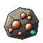 Copper

`copper_ore` · Ore · Plain · iLv 5 · stack 99

> Soft copper ore from the quarry rim.

- **Sources**:
  - Drop: [Rock Beetle](monsters.md#enemy-rock_beetle) (Lv 4–5) · 30% (group 60%, weight 1 of 2)
  - Gathering: Ore vein, apprentice rank in Lower Pit (Stonewall Quarry), Quarry Rim (Stonewall Quarry)
  - Gathering: Post: Vein Delving, gate Lv 1
  - Crafting: Puppetry: a Worker Puppet works 3 an hour
  - Crafting: salvaging Plain-grade equipment
  - Shop: Stoneford Smith (Smith Bao in Artisan Row (Stoneford)) · at list price in Silver Taels
  - Reward: Expedition Stonewall Quarry (1/4/8 h) ×4
  - Reward: Quest Fire and Salt (side, from Array Master Ren), reward ×30

###  Riverstone

`riverstone` · Ore · Common · iLv 14 · stack 99

> Dense river-polished stone used in forging and building.

- **Sources**:
  - Drop: [Pebble Imp](monsters.md#enemy-pebble_imp) (Lv 4–6) · 60% (group)
  - Gathering: Ore vein, apprentice rank in Caravan Road, Lower Pit (Stonewall Quarry), Quarry Rim (Stonewall Quarry), Tunnels (Mudwater Hideout)
  - Gathering: Post: Vein Delving, gate Lv 5
  - Crafting: Puppetry: a Worker Puppet works 1 an hour
  - Crafting: salvaging Common-grade equipment ×2
  - Shop: Forge Guild (Smith Bao in Artisan Row (Stoneford)) · 12 Silver Taels; needs Flag set (flag guild_smithing_adept)
  - Shop: Stoneford Smith (Smith Bao in Artisan Row (Stoneford)) · at list price in Silver Taels
  - Reward: Expedition Stonewall Quarry (1/4/8 h) ×3

###  Jadeiron

`jadeiron` · Ore · Earth · iLv 27 · stack 99

> Iron veined with jade; it holds Qi paths well.

- **Sources**:
  - Drop: [Boulder Serpent](monsters.md#enemy-boulder_serpent) (Lv 32–35) · 20% (rare)
  - Drop: [Stone Tortoise](monsters.md#enemy-stone_tortoise) (Lv 5–7) · 15% (rare)
  - Gathering: Ore vein, adept rank in Collapsed Tunnel (Stonewall Quarry), Echo Cliffs (Whitewater Gorge), Gorge Mouth (Whitewater Gorge), Lower Pit (Stonewall Quarry), Rapids Terraces (Whitewater Gorge)
  - Gathering: Post: Vein Delving, gate Lv 10
  - Crafting: salvaging Earth-grade equipment ×2
  - Shop: Forge Guild (Smith Bao in Artisan Row (Stoneford)) · 40 Silver Taels; needs Flag set (flag guild_smithing_adept)
  - Reward: Expedition Stonewall Quarry (1/4/8 h) · 8 h or longer
  - Reward: Expedition Whitewater Gorge (8 h) ×3

###  Spirit Stone Shard

`spirit_stone_shard` · Ore · Earth · iLv 27 · stack 99

> A splinter of crystallised Qi. Fuel and small change.

- **Sources**:
  - Drop: [Blackreed Disciple](monsters.md#enemy-blackreed_disciple) (Lv 14) · 30% (group 60%, weight 1 of 2)
  - Drop: [Canyon Brigand](monsters.md#enemy-canyon_brigand) (Lv 73–78) · 30% ×1–2 (group 60%, weight 1 of 2)
  - Drop: [Ironpine Disciple](monsters.md#enemy-ironpine_disciple) (Lv 10) · 30% (group 60%, weight 1 of 2)
  - Drop: [Scarlet Kiln Disciple](monsters.md#enemy-scarlet_kiln_disciple) (Lv 64) · 30% ×1–2 (group 60%, weight 1 of 2)
  - Drop: [Starsea Pirate](monsters.md#enemy-starsea_pirate) (Lv 78–90) · 20% ×1–2 (group 60%, weight 1 of 3)
  - Drop: [Warden Dai Song](monsters.md#enemy-ironpine_warden) (Lv 12) · 100% ×2–4 (guaranteed)
  - Drop: [Warden Qu Heng](monsters.md#enemy-blackreed_warden) (Lv 16) · 100% ×2–4 (guaranteed)
  - Drop: [Warden Rong Yan](monsters.md#enemy-scarlet_kiln_warden) (Lv 66) · 100% ×3–5 (guaranteed)
  - Container: Chest in Abbot's Sanctum (Drowned Shrine) (Lv 27) · 100% ×2–4 (guaranteed)
  - Container: Chest in Ashborn Palisade (Ashen Reach), Blackmast Docks (Blackmast Haven), Crab Grottoes (Nebula Deep), Driftglass Bank (Drifting Shoals), Drone Hive (Tidebreak Front), Eel Currents (Nebula Deep), Eggshell Terraces (Wyrmnest Isles), Flagship Deck (Blackmast Haven), Flame Heart (The Lantern Heart), Golem Foundry (Orbit Ruins), Guardian's Crown (Wyrmnest Isles), Hall of Burning Stars (The Lantern Heart) and 8 more (Lv 84–99) · 100% ×3–5 (guaranteed)
  - Container: Chest in Behind the Falls (Crane Falls), Boss Den (Mudwater Hideout), Cliff Faces (Crane Cliffs), Collapsed Tunnel (Stonewall Quarry), Drowned Grotto (Drowned Shrine), Flooded Gate (Drowned Shrine), Forgotten Monastery (Mist Peak), Hall of Lanterns (Drowned Shrine), Hidden Grotto (Somewhere Unmapped), Loot Cave (Mudwater Hideout), Misty Slopes (Mist Peak), Scripture Well (Drowned Shrine) and 5 more (Lv 0–60) · 100% ×2–4 (guaranteed)
  - Container: Chest in Bend Shore (Deepwater Bend), Frozen Shrine (Summit Ridge), Gate Street (Jade Sect Academy), Grey Pools (Reed Marsh), Lower Pit (Stonewall Quarry), Misty Slopes (Mist Peak), Pavilion Rooftops (Jade Sect Academy), Thicket Heart (Bamboo Grove), Whispering Bamboo (Bamboo Grove), Willow Path West (Willow Path) (Lv 3–63) · 100% ×1–3 (guaranteed)
  - Container: Chest in Broken Pier (Skyport Wreck), Canyon Mouth (Gale Canyons), Frostpine Climb (Rimefrost Heights), Glass Dunes (Sunscar Desert), Hall of Sand Kings (Tomb of Sunscar), Harpy Roosts (Gale Canyons), Lightning Scar (Thunderhorn Plains), Mirror Crypt (Tomb of Sunscar), Mirror Shallows (Mirrorwater Lake), Pirate Deck (Skyport Wreck), Reedless Shore (Mirrorwater Lake), Rimefrost Summit (Rimefrost Heights) and 10 more (Lv 66–81) · 100% ×2–4 (guaranteed)
  - Container: Crate in Ashborn Palisade (Ashen Reach), Cinder Fields (Ashen Reach), Crab Grottoes (Nebula Deep), Drone Hive (Tidebreak Front), Eel Currents (Nebula Deep), Eggshell Terraces (Wyrmnest Isles), Golem Foundry (Orbit Ruins), Greyfall Breach (Tidebreak Front), Guardian's Crown (Wyrmnest Isles), Hall of Burning Stars (The Lantern Heart), Hollow Wake (Tidebreak Front), Nebula Verge (Nebula Deep) and 5 more (Lv 86–98) · 15% ×2–3 (group 60%, weight 1 of 4)
  - Container: Crate in Broken Pier (Skyport Wreck), Canyon Mouth (Gale Canyons), Hall of Sand Kings (Tomb of Sunscar), Harpy Roosts (Gale Canyons), Kite Winds (Gale Canyons), Mirror Crypt (Tomb of Sunscar), Riven Peak (Skyport Wreck), Sealed Gate (Tomb of Sunscar), Windbridge (Gale Canyons) (Lv 74–80) · 24% ×1–2 (group 60%, weight 2 of 5)
  - Container: Crate in Caravan Road, Cliff Faces (Crane Cliffs), Echo Cliffs (Whitewater Gorge), Gorge Mouth (Whitewater Gorge), Loot Cave (Mudwater Hideout), Misty Slopes (Mist Peak), Rapids Terraces (Whitewater Gorge), Sky Ledges (Crane Cliffs), Stockade (Mudwater Hideout), Tunnels (Mudwater Hideout) (Lv 16–48) · 15% (group 60%, weight 1 of 4)
  - Container: Jar in Ashborn Palisade (Ashen Reach), Blackmast Docks (Blackmast Haven), Cinder Fields (Ashen Reach), Crab Grottoes (Nebula Deep), Driftglass Bank (Drifting Shoals), Drone Hive (Tidebreak Front), Eel Currents (Nebula Deep), Eggshell Terraces (Wyrmnest Isles), Golem Foundry (Orbit Ruins), Greyfall Breach (Tidebreak Front), Guardian's Crown (Wyrmnest Isles), Gunners' Battery (Blackmast Haven) and 10 more (Lv 83–98) · 15% ×2–3 (group 60%, weight 1 of 4)
  - Container: Jar in Bend Shore (Deepwater Bend), Caravan Road, Cliff Faces (Crane Cliffs), Echo Cliffs (Whitewater Gorge), Flooded Gate (Drowned Shrine), Forgotten Monastery (Mist Peak), Frozen Shrine (Summit Ridge), Gorge Mouth (Whitewater Gorge), Hall of Lanterns (Drowned Shrine), Loot Cave (Mudwater Hideout), Misty Slopes (Mist Peak), Rapids Terraces (Whitewater Gorge) and 5 more (Lv 16–60) · 15% (group 60%, weight 1 of 4)
  - Container: Jar in Broken Pier (Skyport Wreck), Canyon Mouth (Gale Canyons), Frostpine Climb (Rimefrost Heights), Glass Dunes (Sunscar Desert), Hall of Sand Kings (Tomb of Sunscar), Harpy Roosts (Gale Canyons), Kite Winds (Gale Canyons), Lightning Scar (Thunderhorn Plains), Mirror Crypt (Tomb of Sunscar), Mirror Shallows (Mirrorwater Lake), Pirate Deck (Skyport Wreck), Reedless Shore (Mirrorwater Lake) and 10 more (Lv 65–80) · 24% ×1–2 (group 60%, weight 2 of 5)
  - Container: Spatial Rift (calendar event) in 17 field rooms · 100% ×2–4 (guaranteed)
  - Container: Trial Tower floors 13–30, clear or daily sweep, in Trial Tower (Stoneford) (Lv 28–62) · 100% ×2–4 (guaranteed)
  - Container: Trial Tower floors 1–12, clear or daily sweep, in Trial Tower (Stoneford) (Lv 4–26) · 100% ×1–3 (guaranteed)
  - Container: Wine jar in Boss Den (Mudwater Hideout) (Lv 18) · 15% (group 60%, weight 1 of 4)
  - Gathering: Ore vein, adept rank in Back Mountain (Hidden Vale), Collapsed Tunnel (Stonewall Quarry), Lower Pit (Stonewall Quarry), Rapids Terraces (Whitewater Gorge), Waterfall Cave (Whitewater Gorge)
  - Gathering: Pickup "Spirit Stone Shard" in Market Street (Stoneford)
  - Gathering: Pickup "Spirit Stone Shards" ×3 in Lower Pit (Stonewall Quarry)
  - Gathering: Post: Vein Delving, gate Lv 18
  - Crafting: Appraisal (profession) · 14.29% of results ×3
  - Crafting: appraising a [Sealed Storage Pouch](#item-sealed_storage_pouch) · 25% ×4
  - Shop: Trade House (Elder Gu in Artisan Row (Stoneford); Madam Hua in Artisan Row (Stoneford)) · at list price in Silver Taels
  - Reward: Daily activity chest at 40 points, reward ×3
  - Reward: Npc in Market Street (Stoneford)
  - Reward: Quest A Disciple's Chores (side, from Steward Wei), reward ×2
  - Reward: Quest Is It Real? (guided, from Elder Gu), reward ×3
  - Reward: Quest Stones That Move You (guided, from Keeper Shi), reward ×3
  - Reward: Unlock: Teleport stones ×2
  - Reward: catching the Quick-Fingered Hou in Market Street (Stoneford)

###  Cloudsteel Ore

`cloudsteel_ore` · Ore · Heaven · iLv 45 · stack 99

> Feather-light ore from the sky ledges.

- **Sources**:
  - Gathering: Ore vein, expert rank in Cliff Faces (Crane Cliffs), Sky Ledges (Crane Cliffs)
  - Gathering: Post: Vein Delving, gate Lv 25
  - Crafting: salvaging Heaven-grade equipment ×2
  - Shop: Forge Guild (Smith Bao in Artisan Row (Stoneford)) · 120 Silver Taels; needs Flag set (flag guild_smithing_expert)
  - Reward: Fortune deck: A Meteor Fragment ×3

###  Mystic Ore

`mystic_ore` · Ore · Mystic · iLv 59 · stack 99

> Ore that hums faintly in cold wind.

- **Sources**:
  - Drop: [Cloudpeak Roc](monsters.md#enemy-cloudpeak_roc) (Lv 58–63) · 10% (rare)
  - Gathering: Ore vein, expert rank in Forgotten Monastery (Mist Peak), Frozen Shrine (Summit Ridge), Misty Slopes (Mist Peak), Windswept Ridge (Summit Ridge)
  - Gathering: Post: Vein Delving, gate Lv 32
  - Crafting: salvaging Mystic-grade equipment
  - Shop: Forge Guild (Smith Bao in Artisan Row (Stoneford)) · 260 Silver Taels; needs Flag set (flag guild_smithing_expert) and Heaven Glimpse 1
  - Shop: Hong's Stormsteel Forge (Smith Hong in Port Market (Cloudgate Port)) · at list price in Spirit Stones

###  Stormsteel Ore

`stormsteel_ore` · Ore · Spirit · iLv 68 · stack 99

> Blue-black ore from where lightning strikes the same ground twice.

- **Sources**:
  - Container: Chest in Broken Pier (Skyport Wreck), Canyon Mouth (Gale Canyons), Frostpine Climb (Rimefrost Heights), Glass Dunes (Sunscar Desert), Hall of Sand Kings (Tomb of Sunscar), Harpy Roosts (Gale Canyons), Lightning Scar (Thunderhorn Plains), Mirror Crypt (Tomb of Sunscar), Mirror Shallows (Mirrorwater Lake), Pirate Deck (Skyport Wreck), Reedless Shore (Mirrorwater Lake), Rimefrost Summit (Rimefrost Heights) and 10 more (Lv 66–81) · 66.67% ×1–2 (group 100%, weight 2 of 3)
  - Gathering: Ore vein, master rank in Broken Pier (Skyport Wreck), Canyon Mouth (Gale Canyons), Frostpine Climb (Rimefrost Heights), Harpy Roosts (Gale Canyons), Lightning Scar (Thunderhorn Plains), Snow Ape Ledges (Rimefrost Heights), Stormgrass Verge (Thunderhorn Plains), Thunderhorn Flats (Thunderhorn Plains)
  - Gathering: Post: Vein Delving, gate Lv 40
  - Crafting: salvaging Spirit-grade equipment ×2
  - Shop: Auction Pavilion (Azure Expanse) lot ×10, opening bid 35 · 7.87% of lots
  - Shop: Forge Guild (Smith Bao in Artisan Row (Stoneford)) · 480 Silver Taels; needs Flag set (flag guild_smithing_master)
  - Shop: Hong's Stormsteel Forge (Smith Hong in Port Market (Cloudgate Port)) · at list price in Spirit Stones
  - Shop: Ironroot Clan Forge (Smith Gang in Clan Hearth (Ironroot Clan Hold)) · at list price in Spirit Stones
  - Shop: Lao's Slipway Stores (Shipwright Lao in Shipwrights' Yard (Cloudgate Port)) · at list price in Spirit Stones
  - Reward: Expedition Gale Canyons (8 h) ×3
  - Reward: Quest Plumes for the Bellows (side, from Smith Gang), reward ×4
  - Reward: Quest Stingers for the Hold (side, from Smith Gang), reward ×4

### 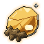 Sunglass

`sunglass_ore` · Ore · Sage · iLv 77 · stack 99

> Desert glass the Sunscar sun fused out of the dunes. It holds heat and light like a lamp.

- **Sources**:
  - Drop: [Sandstorm Scorpion](monsters.md#enemy-sandstorm_scorpion) (Lv 73–78) · 8% (rare)
  - Drop: [Tomb King](monsters.md#enemy-tomb_king) (Lv 77) · 100% ×3–5 (guaranteed)
  - Container: Chest in Hall of Sand Kings (Tomb of Sunscar), Throne of the Tomb King (Tomb of Sunscar) (Lv 77) · 100% ×2–3 (guaranteed)
  - Gathering: Ore vein, master rank in Glass Dunes (Sunscar Desert), Scorpion Flats (Sunscar Desert), Worm Sea (Sunscar Desert)
  - Gathering: Post: Vein Delving, gate Lv 45
  - Crafting: salvaging Sage-grade equipment ×2
  - Reward: Expedition Sunscar Desert (8 h) ×2

###  Driftglass

`driftglass` · Ore · Sovereign · iLv 86 · stack 99

> Glass the star tides have worn smooth on the Driftglass Bank. Lantern-makers grind it into lenses.

- **Sources**:
  - Container: Chest in Ashborn Palisade (Ashen Reach), Blackmast Docks (Blackmast Haven), Crab Grottoes (Nebula Deep), Driftglass Bank (Drifting Shoals), Drone Hive (Tidebreak Front), Eel Currents (Nebula Deep), Eggshell Terraces (Wyrmnest Isles), Flagship Deck (Blackmast Haven), Flame Heart (The Lantern Heart), Golem Foundry (Orbit Ruins), Guardian's Crown (Wyrmnest Isles), Hall of Burning Stars (The Lantern Heart) and 8 more (Lv 84–99) · 50% ×1–2 (group 100%, weight 2 of 4)
  - Gathering: Ore vein, master rank in Cinder Fields (Ashen Reach), Crab Grottoes (Nebula Deep), Driftglass Bank (Drifting Shoals), Golem Foundry (Orbit Ruins)
  - Gathering: Post: Vein Delving, gate Lv 50
  - Crafting: salvaging Sovereign-grade equipment ×2
  - Shop: Tidebreak Armoury (Quartermaster Bai in Tidebreak Bastion (Tidebreak Front)) · 6 Sage Crystals
  - Reward: Quest The Copperjaw Box (guided, from Tinker Mei), on accept ×4

## Other (14)

###  Calm Incense

`calm_incense` · Other · Plain · iLv 5 · stack 99

> Calming incense. Burn it and meditate to steady the heart.

- **Effect**: Add composure (amount 30)
- **Sources**:
  - Shop: Apothecary Sang's Jars (Apothecary Sang in Harbor Market (Lanternfall Harbor)) · at list price in Sage Crystals
  - Shop: Condensing Hall Stores (Alchemist Fen in Condensing Hall (Cloudgate Port)) · at list price in Spirit Stones
  - Shop: Granny Liu's Herb Hut (Granny Liu in Granny Liu's Herb Hut (Lotus Ferry), Lotus Ferry at Night (Lotus Ferry)) · at list price in Silver Taels; needs Qi Unfurling 9
  - Reward: Quest The Quiet Heart (guided, from Elder Hu), on accept

###  Old Net

`old_net` · Other · Plain · iLv 5 · stack 99

> A torn fishing net. Old Ma buys these.

- **Notes**: value 40
- **Sources**:
  - Gathering: Pickup "Old Net" in Old Ma's Store (Lotus Ferry)

###  Hour Incense (1 h)

`hour_incense_1` · Other · Common · iLv 14 · stack 99

> Burned at a character's post from the Roll-Call: 1 hour of that post's work at once.

- **Effect**: Hour incense: {"hours": 1}
- **Sources**:
  - Reward: Quest Keeping Post (guided, from Fisher Wen), on accept
  - Reward: Quest Keeping Post (guided, from Fisher Wen), reward

###  Hour Incense (2 h)

`hour_incense_2` · Other · Common · iLv 14 · stack 99

> Burned at a character's post from the Roll-Call: 2 hours of that post's work at once.

- **Effect**: Hour incense: {"hours": 2}
- **Sources**:
  - Reward: Daily activity chest at 40 points, reward

###  Snapper Claw

`snapper_claw` · Other · Common · iLv 14 · stack 99

> Old Snapper's claw. Worth 40 taels to a trader.

- **Notes**: value 40
- **Sources**:
  - Drop: [Old Snapper](monsters.md#enemy-old_snapper) (Lv 3) · 100% (guaranteed)

###  Calm Heart Incense

`calm_heart_incense` · Other · Earth · iLv 27 · stack 99

> Incense of prayer beads and Mist Lotus. Burn it and sit: heart demon -10.

- **Effect**: Add heart demon (amount -10); Food: {"group": "utility"}
- **Sources**:
  - Crafting: Recipe `calm_heart_incense` (Alchemy, Earth): Prayer Beads ×1, Lantern Wick ×2, Mist Lotus ×1; known by default
  - Shop: Cloud Sect Mission Hall (Deacon Heng in Cliff Stair (Cloud Sect Monastery)) · 60 Contribution; needs Alignment at least (value 20)
  - Reward: Granny Liu at heart 5 ×2

###  Clear Heart Incense

`clear_heart_incense` · Other · Earth · iLv 27 · stack 99

> Burnt while you sit, it lets a cultivator unlearn a whole tree of realised arts, to walk it again another way.

- **Notes**: value 60
- **Sources**:
  - Shop: Cloud Sect Mission Hall (Deacon Heng in Cliff Stair (Cloud Sect Monastery)) · 200 Contribution
  - Shop: Jade Sect Mission Hall (Deacon Rui in Gate Street (Jade Sect Academy)) · 200 Contribution

###  Hour Incense (4 h)

`hour_incense_4` · Other · Earth · iLv 27 · stack 99

> Burned at a character's post from the Roll-Call: 4 hours of that post's work at once.

- **Effect**: Hour incense: {"hours": 4}
- **Sources**:
  - Reward: Daily activity chest at 60 points, reward

###  Hour Incense (12 h)

`hour_incense_12` · Other · Heaven · iLv 45 · stack 99

> Burned at a character's post from the Roll-Call: 12 hours of that post's work at once.

- **Effect**: Hour incense: {"hours": 12}
- **Sources**:
  - Reward: Daily activity chest at 100 points, reward

###  Wandering Incense

`wandering_incense` · Other · Heaven · iLv 45 · stack 99

> Its smoke wanders. Burned at a post it grants anywhere from 5 to 500 hours of that post's work, most often about a day.

- **Effect**: Hour incense: {"max": 500, "min": 5}
- **Sources**:
  - Container: Chest in Ashborn Palisade (Ashen Reach), Blackmast Docks (Blackmast Haven), Crab Grottoes (Nebula Deep), Driftglass Bank (Drifting Shoals), Drone Hive (Tidebreak Front), Eel Currents (Nebula Deep), Eggshell Terraces (Wyrmnest Isles), Flagship Deck (Blackmast Haven), Flame Heart (The Lantern Heart), Golem Foundry (Orbit Ruins), Guardian's Crown (Wyrmnest Isles), Hall of Burning Stars (The Lantern Heart) and 8 more (Lv 84–99) · 3% (rare)
  - Container: Chest in Broken Pier (Skyport Wreck), Canyon Mouth (Gale Canyons), Frostpine Climb (Rimefrost Heights), Glass Dunes (Sunscar Desert), Hall of Sand Kings (Tomb of Sunscar), Harpy Roosts (Gale Canyons), Lightning Scar (Thunderhorn Plains), Mirror Crypt (Tomb of Sunscar), Mirror Shallows (Mirrorwater Lake), Pirate Deck (Skyport Wreck), Reedless Shore (Mirrorwater Lake), Rimefrost Summit (Rimefrost Heights) and 10 more (Lv 66–81) · 2% (rare)
  - Shop: Auction Day on Market Street (valley) lot, opening bid 20 · 2.94% of lots

###  Hour Incense (24 h)

`hour_incense_24` · Other · Mystic · iLv 59 · stack 99

> Burned at a character's post from the Roll-Call: 24 hours of that post's work at once.

- **Effect**: Hour incense: {"hours": 24}
- **Sources**:
  - Shop: Auction Day on Market Street (valley) lot, opening bid 12 · 7.84% of lots
  - Reward: Tower: floor_15
  - Reward: Tower: floor_20
  - Reward: Tower: floor_25
  - Reward: Tower: floor_30

###  Hour Incense (72 h)

`hour_incense_72` · Other · Spirit · iLv 68 · stack 99

> Burned at a character's post from the Roll-Call: 72 hours of that post's work at once.

- **Effect**: Hour incense: {"hours": 72}
- **Sources**:
  - Container: Chest in Broken Pier (Skyport Wreck), Canyon Mouth (Gale Canyons), Frostpine Climb (Rimefrost Heights), Glass Dunes (Sunscar Desert), Hall of Sand Kings (Tomb of Sunscar), Harpy Roosts (Gale Canyons), Lightning Scar (Thunderhorn Plains), Mirror Crypt (Tomb of Sunscar), Mirror Shallows (Mirrorwater Lake), Pirate Deck (Skyport Wreck), Reedless Shore (Mirrorwater Lake), Rimefrost Summit (Rimefrost Heights) and 10 more (Lv 66–81) · 3% (rare)
  - Shop: Auction Pavilion (Azure Expanse) lot, opening bid 40 · 3.94% of lots

###  Lantern Incense

`lantern_incense` · Other · Sovereign · iLv 86 · stack 20

> Lantern-wick incense from the Star Chandlery. Burned, it draws 15 points of Hollowing out of you.

- **Effect**: Cleanse hollowing (amount 15)
- **Sources**:
  - Shop: Apothecary Sang's Jars (Apothecary Sang in Harbor Market (Lanternfall Harbor)) · 4 Sage Crystals
  - Shop: Lanternwright Han's Shelf (Lanternwright Han in Star Chandlery (Lanternfall Harbor)) · 4 Sage Crystals
  - Shop: Tidebreak Armoury (Quartermaster Bai in Tidebreak Bastion (Tidebreak Front)) · 4 Sage Crystals
  - Reward: Quest A Hollowed Brood (main, from Tamer Qiu), on accept ×3
  - Reward: Quest A Hollowed Brood (main, from Tamer Qiu), reward ×3

###  Copperjaw Box

`copperjaw_box` · Other · Will · iLv 92 · stack 1

> A lacquered box of Copperjaw beetles. Feed it ore and the swarm grows, an hour at a time, even while you are away. Open it and for 8 s the swarm chews every foe near you, the bigger it is the harder (Wood foes shrug off half). It comes home after, and rests 30 s.

- **Effect**: used as: Swarm
- **Notes**: cannot be sold
- **Sources**:
  - Reward: Quest The Copperjaw Box (guided, from Tinker Mei), on accept

## Pet book (6)

###  Skill Book: Iron Hide

`pet_book_iron_hide` · Pet book · Common · iLv 14 · stack 5

> An animal that learns it takes 10% less damage. Teach it on the Spirit Animals page, or use it to teach your active animal.

- **Effect**: Learn pet skill (skill iron_hide); used as: Pet item; Pet book: iron_hide
- **Sources**:
  - Shop: Hermit Yao's Beast Hall (Hermit Yao in Hermit's Stilt House (Reed Marsh)) · 400 Silver Taels; needs Qi Unfurling 1
  - Reward: Beast Grove trial in Beast Trial Grove (Stoneford) · 20% of rewards

###  Skill Book: Deep Pockets

`pet_book_deep_pockets` · Pet book · Earth · iLv 27 · stack 5

> While it is your active animal, your gourd holds one more row (6 slots). Teach it on the Spirit Animals page, or use it to teach your active animal.

- **Effect**: Learn pet skill (skill deep_pockets); used as: Pet item; Pet book: deep_pockets
- **Sources**:
  - Shop: Hermit Yao's Beast Hall (Hermit Yao in Hermit's Stilt House (Reed Marsh)) · 900 Silver Taels; needs Heart Tempering 1

###  Skill Book: Frenzy

`pet_book_frenzy` · Pet book · Earth · iLv 27 · stack 5

> After a kill the animal strikes 15% faster for 6 seconds. Teach it on the Spirit Animals page, or use it to teach your active animal.

- **Effect**: Learn pet skill (skill frenzy); used as: Pet item; Pet book: frenzy
- **Sources**:
  - Drop: [Big Toad Tan](monsters.md#enemy-big_toad_tan) (Lv 18) · 35% (pet skill book)
  - Reward: Beast Grove trial in Beast Trial Grove (Stoneford) · 10% of rewards

###  Skill Book: Herb Whisper

`pet_book_herb_whisper` · Pet book · Earth · iLv 27 · stack 5

> While it walks beside you, herbs within 400 show how long until they ripen. Teach it on the Spirit Animals page, or use it to teach your active animal.

- **Effect**: Learn pet skill (skill herb_whisper); used as: Pet item; Pet book: herb_whisper
- **Sources**:
  - Container: Chest in Falls Pool (Crane Falls) (Lv 12) · 100% (guaranteed)

###  Skill Book: Guardian Spirit

`pet_book_guardian_spirit` · Pet book · Heaven · iLv 45 · stack 5

> Once every 30 seconds it takes a blow meant for you. Teach it on the Spirit Animals page, or use it to teach your active animal.

- **Effect**: Learn pet skill (skill guardian_spirit); used as: Pet item; Pet book: guardian_spirit
- **Sources**:
  - Reward: Beast Grove trial in Beast Trial Grove (Stoneford), first clear

###  Skill Book: Thunder Roar

`pet_book_thunder_roar` · Pet book · Heaven · iLv 45 · stack 5

> Every 15 seconds of a fight it roars: foes near it are stunned for 1 second. Teach it on the Spirit Animals page, or use it to teach your active animal.

- **Effect**: Learn pet skill (skill thunder_roar); used as: Pet item; Pet book: thunder_roar
- **Sources**:
  - Drop: [Stormwing Hawk](monsters.md#enemy-stormwing_hawk) (Lv 38–43) · 25% (elites only)
  - Reward: Beast Grove trial in Beast Trial Grove (Stoneford) · 10% of rewards

## Pill (32)

### 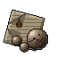 Murky Pill

`murky_pill` · Pill · Plain · iLv 5 · stack 99

> What a failed experiment leaves: grey, gritty, and good for nothing but a stomach ache. A trader gives a tael for it.

- **Effect**: Pill: {"cause": null, "group": "utility", "mark": "drop_leaf", "toxicity": 8}; Soul effect: steady_heart
- **Notes**: value 1
- **Source mark**: `system` (made by a game system whose own rule names the item (see the description))

###  Bone Strengthening Pill

`bone_strengthening_pill` · Pill · Common · iLv 14 · stack 99

> Adds 150 body XP.

- **Effect**: Add body xp (amount 150); Pill: {"cause": "structure", "group": "utility", "mark": "bone", "toxicity": 8}; Soul effect: iron_skin; Family: body
- **Sources**:
  - Crafting: Recipe `bone_strengthening_pill` (Alchemy, Common): Tortoise Plate ×1, Boar Hide ×1, Riverreed Ginseng (10 yr) ×1
  - Shop: Ironroot Clan Forge (Smith Gang in Clan Hearth (Ironroot Clan Hold)) · at list price in Spirit Stones
  - Shop: Mei Qing's Stall (Mei Qing in Artisan Row (Stoneford)) · daily rotation (1 of 3)

###  Cleansing Pill

`cleansing_pill` · Pill · Common · iLv 14 · stack 99

> Support item: lowers the risk of Heaven's Cleansing by one step.

- **Effect**: Pill: {"cause": "environment", "group": "utility", "mark": "gate", "toxicity": 10}; Support: {"event": "heavens_cleansing", "risk": -1}; Soul effect: steady_heart; Family: support
- **Sources**:
  - Crafting: Recipe `cleansing_pill` (Alchemy, Common): Mist Lotus ×1, Jade Scale ×2, Riverreed Ginseng (100 yr) ×1
  - Shop: Cloud Sect Mission Hall (Deacon Heng in Cliff Stair (Cloud Sect Monastery)) · at list price in Contribution; needs Qi Kindling 9
  - Shop: Greyreed Trade Post (Trader Min in Greyreed Hamlet) · at list price in Silver Taels
  - Shop: Jade Sect Mission Hall (Deacon Rui in Gate Street (Jade Sect Academy)) · at list price in Contribution; needs Qi Kindling 9
  - Reward: Quest Cleansing the Well (side, from Elder Gao), on accept

###  Healing Pill

`healing_pill` · Pill · Common · iLv 14 · stack 99

> Cures a minor body injury and restores 30% HP over 5 s.

- **Effect**: Cure injury (injury body, max severity 1); Heal (over s 5, pct 0.3); Pill: {"cause": "structure", "group": "healing", "mark": "heart", "toxicity": 5}; Soul effect: mend_meridians
- **Sources**:
  - Container: Chest in Bend Shore (Deepwater Bend), Frozen Shrine (Summit Ridge), Gate Street (Jade Sect Academy), Grey Pools (Reed Marsh), Lower Pit (Stonewall Quarry), Misty Slopes (Mist Peak), Pavilion Rooftops (Jade Sect Academy), Thicket Heart (Bamboo Grove), Whispering Bamboo (Bamboo Grove), Willow Path West (Willow Path) (Lv 3–63) · 50% ×1–2 (group 100%, weight 2 of 4)
  - Container: Crate in Caravan Road, Cliff Faces (Crane Cliffs), Echo Cliffs (Whitewater Gorge), Gorge Mouth (Whitewater Gorge), Loot Cave (Mudwater Hideout), Misty Slopes (Mist Peak), Rapids Terraces (Whitewater Gorge), Sky Ledges (Crane Cliffs), Stockade (Mudwater Hideout), Tunnels (Mudwater Hideout) (Lv 16–48) · 15% (group 60%, weight 1 of 4)
  - Container: Jar in Bend Shore (Deepwater Bend), Caravan Road, Cliff Faces (Crane Cliffs), Echo Cliffs (Whitewater Gorge), Flooded Gate (Drowned Shrine), Forgotten Monastery (Mist Peak), Frozen Shrine (Summit Ridge), Gorge Mouth (Whitewater Gorge), Hall of Lanterns (Drowned Shrine), Loot Cave (Mudwater Hideout), Misty Slopes (Mist Peak), Rapids Terraces (Whitewater Gorge) and 5 more (Lv 16–60) · 15% (group 60%, weight 1 of 4)
  - Container: Trial Tower floors 1–12, clear or daily sweep, in Trial Tower (Stoneford) (Lv 4–26) · 50% ×1–2 (group 100%, weight 2 of 4)
  - Container: Wine jar in Boss Den (Mudwater Hideout) (Lv 18) · 15% (group 60%, weight 1 of 4)
  - Crafting: Recipe `healing_pill` (Alchemy, Common): Riverreed Ginseng (10 yr) ×1, Willow Moss ×2
  - Shop: Apothecary Wu's Cabinet (Apothecary Wu in Port Market (Cloudgate Port)) · at list price in Spirit Stones
  - Shop: Cloud Sect Mission Hall (Deacon Heng in Cliff Stair (Cloud Sect Monastery)) · at list price in Contribution
  - Shop: Jade Sect Mission Hall (Deacon Rui in Gate Street (Jade Sect Academy)) · at list price in Contribution
  - Shop: Mei Qing's Stall (Mei Qing in Artisan Row (Stoneford)) · at list price in Silver Taels
  - Shop: Peddler Gou's Packs (Peddler Gou in Port Market (Cloudgate Port)) · at list price in Spirit Stones
  - Shop: Peddler Ning's Silk and Sundries (Peddler Ning in Harbor Market (Lanternfall Harbor)) · at list price in Sage Crystals
  - Reward: Daily activity chest at 20 points, reward ×2
  - Reward: Dialogue with Granny Liu
  - Reward: Quest Mei Qing's Errand (main, from Mei Qing), reward ×3

###  Purging Pill

`purging_pill` · Pill · Common · iLv 14 · stack 99

> Purges 30 toxicity.

- **Effect**: Add toxicity (amount -30); Pill: {"cause": null, "group": "utility", "mark": "leaf", "toxicity": 0}; Soul effect: steady_heart
- **Sources**:
  - Crafting: Recipe `purging_pill` (Alchemy, Common): Willow Moss ×3, River Mud ×1
  - Shop: Granny Liu's Herb Hut (Granny Liu in Granny Liu's Herb Hut (Lotus Ferry), Lotus Ferry at Night (Lotus Ferry)) · at list price in Silver Taels; needs Qi Kindling 2
  - Shop: Greyreed Trade Post (Trader Min in Greyreed Hamlet) · at list price in Silver Taels

###  Qi Gathering Pill

`qi_gathering_pill` · Pill · Common · iLv 14 · stack 99

> Adds 8% of the current stage's need.

- **Effect**: Add progress (pct of need 0.08); Pill: {"cause": "energy", "group": "utility", "mark": "spiral_up", "toxicity": 10}; Soul effect: steady_heart; Family: accumulation
- **Sources**:
  - Container: Chest in Bend Shore (Deepwater Bend), Frozen Shrine (Summit Ridge), Gate Street (Jade Sect Academy), Grey Pools (Reed Marsh), Lower Pit (Stonewall Quarry), Misty Slopes (Mist Peak), Pavilion Rooftops (Jade Sect Academy), Thicket Heart (Bamboo Grove), Whispering Bamboo (Bamboo Grove), Willow Path West (Willow Path) (Lv 3–63) · 25% (group 100%, weight 1 of 4)
  - Container: Trial Tower floors 1–12, clear or daily sweep, in Trial Tower (Stoneford) (Lv 4–26) · 25% (group 100%, weight 1 of 4)
  - Crafting: Recipe `qi_gathering_pill` (Alchemy, Common): Riverreed Ginseng (10 yr) ×2, Moss ×2
  - Crafting: appraising a [Sealed Storage Pouch](#item-sealed_storage_pouch) · 6.25% ×2
  - Shop: Mei Qing's Stall (Mei Qing in Artisan Row (Stoneford)) · at list price in Silver Taels
  - Reward: Achievements: First Current, reward
  - Reward: Quest Eyes for Qi (guided, from Elder Hu), reward
  - Reward: Quest The First Current (main, from Lu), reward ×2
  - Reward: Quest The Wall (guided, from Elder Hu), reward

###  Qi Restoration Pill

`qi_restoration_pill` · Pill · Common · iLv 14 · stack 99

> Restores 40% QI and cures a minor meridian injury.

- **Effect**: Restore resource (pct 0.4, pool qi); Cure injury (injury meridian, max severity 1); Pill: {"cause": "energy", "group": "restoration", "mark": "spiral", "toxicity": 5}; Soul effect: mend_meridians
- **Sources**:
  - Container: Crate in Ashborn Palisade (Ashen Reach), Cinder Fields (Ashen Reach), Crab Grottoes (Nebula Deep), Drone Hive (Tidebreak Front), Eel Currents (Nebula Deep), Eggshell Terraces (Wyrmnest Isles), Golem Foundry (Orbit Ruins), Greyfall Breach (Tidebreak Front), Guardian's Crown (Wyrmnest Isles), Hall of Burning Stars (The Lantern Heart), Hollow Wake (Tidebreak Front), Nebula Verge (Nebula Deep) and 5 more (Lv 86–98) · 15% (group 60%, weight 1 of 4)
  - Container: Crate in Broken Pier (Skyport Wreck), Canyon Mouth (Gale Canyons), Hall of Sand Kings (Tomb of Sunscar), Harpy Roosts (Gale Canyons), Kite Winds (Gale Canyons), Mirror Crypt (Tomb of Sunscar), Riven Peak (Skyport Wreck), Sealed Gate (Tomb of Sunscar), Windbridge (Gale Canyons) (Lv 74–80) · 12% (group 60%, weight 1 of 5)
  - Container: Jar in Ashborn Palisade (Ashen Reach), Blackmast Docks (Blackmast Haven), Cinder Fields (Ashen Reach), Crab Grottoes (Nebula Deep), Driftglass Bank (Drifting Shoals), Drone Hive (Tidebreak Front), Eel Currents (Nebula Deep), Eggshell Terraces (Wyrmnest Isles), Golem Foundry (Orbit Ruins), Greyfall Breach (Tidebreak Front), Guardian's Crown (Wyrmnest Isles), Gunners' Battery (Blackmast Haven) and 10 more (Lv 83–98) · 15% (group 60%, weight 1 of 4)
  - Container: Jar in Broken Pier (Skyport Wreck), Canyon Mouth (Gale Canyons), Frostpine Climb (Rimefrost Heights), Glass Dunes (Sunscar Desert), Hall of Sand Kings (Tomb of Sunscar), Harpy Roosts (Gale Canyons), Kite Winds (Gale Canyons), Lightning Scar (Thunderhorn Plains), Mirror Crypt (Tomb of Sunscar), Mirror Shallows (Mirrorwater Lake), Pirate Deck (Skyport Wreck), Reedless Shore (Mirrorwater Lake) and 10 more (Lv 65–80) · 12% (group 60%, weight 1 of 5)
  - Crafting: Recipe `qi_restoration_pill` (Alchemy, Common): Willow Moss ×2, Leech Oil ×1
  - Shop: Apothecary Wu's Cabinet (Apothecary Wu in Port Market (Cloudgate Port)) · at list price in Spirit Stones
  - Shop: Cloud Sect Mission Hall (Deacon Heng in Cliff Stair (Cloud Sect Monastery)) · at list price in Contribution
  - Shop: Jade Sect Mission Hall (Deacon Rui in Gate Street (Jade Sect Academy)) · at list price in Contribution
  - Shop: Mei Qing's Stall (Mei Qing in Artisan Row (Stoneford)) · at list price in Silver Taels
  - Shop: Oasis of Bones Stores (Keeper Meng in Oasis of Bones (Sunscar Desert)) · at list price in Spirit Stones
  - Shop: Peddler Gou's Packs (Peddler Gou in Port Market (Cloudgate Port)) · at list price in Spirit Stones
  - Shop: Peddler Ning's Silk and Sundries (Peddler Ning in Harbor Market (Lanternfall Harbor)) · at list price in Sage Crystals
  - Reward: Quest Two Breaths, One River (guided, from Alchemist Fen), reward ×3

###  Sunfire Pill

`sunfire_pill` · Pill · Common · iLv 14 · stack 99

> Found by experiment: ginseng and Ember Pepper. +12% attack for 10 minutes.

- **Effect**: Add modifier (duration 600, op pct_add, source sunfire_pill, stat physical_attack, value 0.12); Pill: {"cause": null, "group": "buff", "mark": "flame", "toxicity": 8}; Burst: True; Soul effect: iron_skin
- **Sources**:
  - Crafting: Recipe `sunfire_pill` (Alchemy, Common): Riverreed Ginseng (10 yr) ×1, Ember Pepper ×1; a hidden recipe

###  Tiger Blood Pill

`tiger_blood_pill` · Pill · Common · iLv 14 · stack 99

> +20% attack for 60 s, then exhaustion (-20% for 60 s).

- **Effect**: Add modifier (duration 60, op pct_add, source tiger_blood, stat physical_attack, value 0.2); Apply status (delay 60, duration 60, status exhausted); Pill: {"cause": null, "group": "buff", "mark": "flame", "toxicity": 12}; Burst: True; Soul effect: iron_skin
- **Sources**:
  - Crafting: Recipe `tiger_blood_pill` (Alchemy, Common): Thorn Hide ×1, Ember Pepper ×2

###  Viper Antidote

`viper_antidote` · Pill · Common · iLv 14 · stack 99

> Cures poison.

- **Effect**: Cure status (status poison); Pill: {"cause": null, "group": "utility", "mark": "leaf", "toxicity": 0}; Soul effect: steady_heart
- **Sources**:
  - Crafting: Recipe `viper_antidote` (Alchemy, Common): Venom Sac ×1, Willow Moss ×1
  - Shop: Oasis of Bones Stores (Keeper Meng in Oasis of Bones (Sunscar Desert)) · at list price in Spirit Stones

###  Beast Marrow Washing Pill

`beast_marrow_washing_pill` · Pill · Earth · iLv 27 · stack 20

> A pill for a spirit animal, not for you. It washes the marrow of your active animal's weakest gift and rolls it again. It leaves no toxicity. The animal must be a Juvenile before its gifts show.

- **Effect**: Wash pet marrow; used as: Pet item; Pill: {"group": "utility", "toxicity": 0}
- **Sources**:
  - Crafting: Recipe `beast_marrow_washing_pill` (Alchemy, Earth): Riverreed Ginseng (100 yr) ×1, Tough Meat ×3, Mist Lotus ×1
  - Reward: Beast Arena weekly rank 2–3
  - Reward: Beast Grove trial in Beast Trial Grove (Stoneford) · 30% of rewards

###  Beast Revival Pill

`beast_revival_pill` · Pill · Earth · iLv 27 · stack 20

> A pill for a spirit animal, not for you. It mends a Grievous Wound at once.

- **Effect**: Heal pet wound; used as: Pet item; Pill: {"group": "utility", "toxicity": 0}
- **Sources**:
  - Crafting: Recipe `beast_revival_pill` (Alchemy, Common): Riverreed Ginseng (10 yr) ×2, Tough Meat ×1, Willow Moss ×1
  - Shop: Hermit Yao's Beast Hall (Hermit Yao in Hermit's Stilt House (Reed Marsh)) · 45 Silver Taels

###  Clear Mind Pill

`clear_mind_pill` · Pill · Earth · iLv 27 · stack 99

> +50% insight rate for 30 minutes.

- **Effect**: Add modifier (duration 1800, op flat, source clear_mind, stat insight_rate, value 0.5); Pill: {"cause": "understanding", "group": "buff", "mark": "lamp", "toxicity": 8}; Soul effect: clear_mind; Family: insight
- **Sources**:
  - Crafting: Recipe `clear_mind_pill` (Alchemy, Earth): Mist Lotus ×1, Jade Scale ×1, Willow Moss ×2
  - Shop: Apothecary Sang's Jars (Apothecary Sang in Harbor Market (Lanternfall Harbor)) · at list price in Sage Crystals
  - Shop: Auction Pavilion (Azure Expanse) lot ×3, opening bid 20 · 7.87% of lots
  - Shop: Cloud Sect Mission Hall (Deacon Heng in Cliff Stair (Cloud Sect Monastery)) · at list price in Contribution
  - Shop: Condensing Hall Stores (Alchemist Fen in Condensing Hall (Cloudgate Port)) · at list price in Spirit Stones
  - Shop: Jade Sect Mission Hall (Deacon Rui in Gate Street (Jade Sect Academy)) · at list price in Contribution
  - Shop: Lanternwright Han's Shelf (Lanternwright Han in Star Chandlery (Lanternfall Harbor)) · at list price in Sage Crystals
  - Shop: Mei Qing's Stall (Mei Qing in Artisan Row (Stoneford)) · daily rotation (1 of 3)
  - Shop: Navigator Sun's Charts (Navigator Sun in Shipwrights' Yard (Cloudgate Port)) · at list price in Spirit Stones
  - Shop: Old Pan's Wares (Old Pan in Market Street (Stoneford), Willow Path East (Willow Path)) · daily rotation (3 of 7)
  - Shop: Peddler Gou's Packs (Peddler Gou in Port Market (Cloudgate Port)) · daily rotation (2 of 4)
  - Shop: Stargazer Ming's Star-stones (Stargazer Ming in Observatory (Star Warden Citadel)) · at list price in Sage Crystals
  - Reward: Quest Glass Teeth (side, from Bone-Reader Xiu), reward ×2
  - Reward: Quest Listening to the Waterfall (guided, from Elder Hu), reward
  - Reward: Shen Lian at heart 3 ×2

###  Foundation Guard Pill

`foundation_guard_pill` · Pill · Earth · iLv 27 · stack 99

> Breakthrough support: lowers risk by one step.

- **Effect**: Pill: {"cause": "structure", "group": "utility", "mark": "gate", "toxicity": 12}; Support: {"risk": -1}; Soul effect: steady_heart; Family: support
- **Sources**:
  - Container: Chest in Abbot's Sanctum (Drowned Shrine) (Lv 27) · 50% (group 100%, weight 1 of 2)
  - Container: Chest in Behind the Falls (Crane Falls), Boss Den (Mudwater Hideout), Cliff Faces (Crane Cliffs), Collapsed Tunnel (Stonewall Quarry), Drowned Grotto (Drowned Shrine), Flooded Gate (Drowned Shrine), Forgotten Monastery (Mist Peak), Hall of Lanterns (Drowned Shrine), Hidden Grotto (Somewhere Unmapped), Loot Cave (Mudwater Hideout), Misty Slopes (Mist Peak), Scripture Well (Drowned Shrine) and 5 more (Lv 0–60) · 50% (group 100%, weight 1 of 2)
  - Container: Spatial Rift (calendar event) in 17 field rooms · 50% (group 100%, weight 1 of 2)
  - Container: Trial Tower floors 13–30, clear or daily sweep, in Trial Tower (Stoneford) (Lv 28–62) · 50% (group 100%, weight 1 of 2)
  - Crafting: Recipe `foundation_guard_pill` (Alchemy, Earth): Serpent Core ×1, Riverreed Ginseng (100 yr) ×2, Guardian Stone ×1
  - Shop: Cloud Sect Mission Hall (Deacon Heng in Cliff Stair (Cloud Sect Monastery)) · at list price in Contribution; needs Qi Unfurling 1
  - Shop: Jade Sect Mission Hall (Deacon Rui in Gate Street (Jade Sect Academy)) · at list price in Contribution; needs Qi Unfurling 1
  - Shop: Mei Qing's Stall (Mei Qing in Artisan Row (Stoneford)) · daily rotation (1 of 3)
  - Reward: The Herb Terraces Trial (calendar event), place 1 ×3
  - Reward: The Herb Terraces Trial (calendar event), place 2

###  Heavenly Flame Pill

`heavenly_flame_pill` · Pill · Earth · iLv 27 · stack 99

> Refined over a Heavenly Flame. Taken within the hour before Heart Tempering 9 → Cloud Stride 1, it is one Core Forging preparation point. Composure +20.

- **Effect**: Add composure (amount 20); Pill: {"cause": "energy", "group": "utility", "mark": "flame", "toxicity": 6}; Soul effect: steady_heart
- **Sources**:
  - Crafting: Recipe `heavenly_flame_pill` (Alchemy, Earth): Ember Pepper ×3, Riverreed Ginseng (100 yr) ×1, Serpent Core ×1

###  Meridian Reversal Pill

`meridian_reversal_pill` · Pill · Earth · iLv 27 · stack 99

> Resets all meridian points.

- **Effect**: Reset meridians; Pill: {"cause": null, "group": "utility", "mark": "arrows_loop", "toxicity": 10}; Soul effect: steady_heart
- **Sources**:
  - Crafting: Recipe `meridian_reversal_pill` (Alchemy, Earth): Prayer Beads ×2, Mist Lotus ×1

###  Method Conversion Pill

`method_conversion_pill` · Pill · Earth · iLv 27 · stack 99

> Halves the cost of switching cultivation methods.

- **Effect**: Pill: {"cause": null, "group": "utility", "mark": "arrows", "toxicity": 10}; Soul effect: clear_mind; Method conversion: True
- **Sources**:
  - Crafting: Recipe `method_conversion_pill` (Alchemy, Earth): Manual Page ×1, Jade Scale ×2, Mist Lotus ×1

###  Qi Flow Pill

`qi_flow_pill` · Pill · Earth · iLv 27 · stack 99

> +20% accumulation for 60 minutes. When it wears off, the toxicity it held back comes due: +15.

- **Effect**: Add modifier (duration 3600, op flat, source qi_flow_pill, stat accumulation_rate, value 0.2); Pill: {"cause": "energy", "group": "buff", "mark": "spiral_up", "toxicity": 5}; Soul effect: iron_skin; Then: [{"amount": 15, "kind": "add_toxicity"}]; Family: accumulation
- **Sources**:
  - Crafting: Recipe `qi_flow_pill` (Alchemy, Earth): Riverreed Ginseng (100 yr) ×1, Jade Scale ×2, Leech Oil ×1

###  Qi Refining Pill

`qi_refining_pill` · Pill · Earth · iLv 27 · stack 99

> Required to break through from Heart Tempering 9 to Cloud Stride 1.

- **Effect**: Pill: {"cause": "material", "group": "utility", "mark": "spiral", "toxicity": 15}; Soul effect: steady_heart
- **Sources**:
  - Crafting: Recipe `qi_refining_pill` (Alchemy, Earth): Pearl ×2, Mist Lotus ×2, Serpent Core ×1

###  Stillwater Pill

`stillwater_pill` · Pill · Earth · iLv 27 · stack 99

> Found by experiment: Mist Lotus, Soulbell and willow moss. Composure +40, heart demon -5.

- **Effect**: Add composure (amount 40); Add heart demon (amount -5); Pill: {"cause": "soul", "group": "utility", "mark": "drop_leaf", "toxicity": 6}; Soul effect: steady_heart
- **Sources**:
  - Crafting: Recipe `stillwater_pill` (Alchemy, Earth): Mist Lotus ×1, Soulbell Flower ×1, Willow Moss ×1; a hidden recipe

###  Cloudstep Pill

`cloudstep_pill` · Pill · Heaven · iLv 45 · stack 99

> Found by experiment: Cloudtop Orchid and willow moss. +10% move speed for 20 minutes.

- **Effect**: Add modifier (duration 1200, op pct_add, source cloudstep_pill, stat move_speed, value 0.1); Pill: {"cause": null, "group": "buff", "mark": "arrows", "toxicity": 8}; Soul effect: iron_skin
- **Sources**:
  - Crafting: Recipe `cloudstep_pill` (Alchemy, Heaven): Cloudtop Orchid ×1, Willow Moss ×2; a hidden recipe

###  Mind Lake Opening Pill

`mind_lake_opening_pill` · Pill · Heaven · iLv 45 · stack 99

> Required to break through from Cloud Stride 9 to Spirit Awakening 1.

- **Effect**: Pill: {"cause": "material", "group": "utility", "mark": "eye_gate", "toxicity": 15}; Soul effect: clear_mind
- **Sources**:
  - Crafting: Recipe `mind_lake_opening_pill` (Alchemy, Heaven): Cloud Feather ×3, Mist Lotus ×2, Cloudtop Orchid ×1

###  Soul Soothing Pill

`soul_soothing_pill` · Pill · Heaven · iLv 45 · stack 99

> Cures a soul injury; +20% Soul for 10 minutes.

- **Effect**: Cure injury (injury soul, max severity 3); Add modifier (duration 600, op pct_add, source soul_soothing, stat max_soul, value 0.2); Add soul (amount 50); Pill: {"cause": "soul", "group": "restoration", "mark": "eye", "toxicity": 8}; Soul effect: clear_mind; Family: soul
- **Sources**:
  - Crafting: Recipe `soul_soothing_pill` (Alchemy, Heaven): Mirror Dust ×2, Soul Wax ×1, Mist Lotus ×1
  - Shop: Apothecary Sang's Jars (Apothecary Sang in Harbor Market (Lanternfall Harbor)) · at list price in Sage Crystals
  - Shop: Condensing Hall Stores (Alchemist Fen in Condensing Hall (Cloudgate Port)) · at list price in Spirit Stones
  - Shop: Peddler Gou's Packs (Peddler Gou in Port Market (Cloudgate Port)) · daily rotation (2 of 4)

###  Sage Condensing Pill

`sage_condensing_pill` · Pill · Mystic · iLv 59 · stack 99

> Required to break through from Heaven Glimpse 3 to Sage 1.

- **Effect**: Pill: {"cause": "material", "group": "utility", "mark": "knot", "toxicity": 20}; Soul effect: steady_heart
- **Sources**:
  - Crafting: Recipe `sage_condensing_pill` (Alchemy, Mystic): Roc Feather ×2, Jade Core ×1, Soulbell Flower ×2
  - Shop: Auction Pavilion (Azure Expanse) lot, opening bid 70 · 4.72% of lots
  - Shop: Broker Mu's Back Room (Broker Mu in Hall of Nine (Nine Peaks), Wayfarers' Inn (Cloudgate Port)) · daily rotation (2 of 5)
  - Shop: Condensing Hall Stores (Alchemist Fen in Condensing Hall (Cloudgate Port)) · 90 Spirit Stones; needs Heaven Glimpse 3
  - Reward: Quest Horns for the Furnace (main, from Alchemist Fen), reward

###  Storm Blood Pill

`storm_blood_pill` · Pill · Mystic · iLv 59 · stack 99

> +4 attunement in the zone you stand in for 30 minutes.

- **Effect**: Add modifier (duration 1800, op flat, source storm_blood, stat attunement_bonus, value 4); Pill: {"cause": null, "group": "buff", "mark": "bolt", "toxicity": 10}; Soul effect: iron_skin
- **Sources**:
  - Crafting: Recipe `storm_blood_pill` (Alchemy, Mystic): Spark Pelt ×1, Storm Shard ×2, Soulbell Flower ×1
  - Shop: Auction Pavilion (Azure Expanse) lot ×3, opening bid 25 · 7.87% of lots
  - Shop: Broker Mu's Back Room (Broker Mu in Hall of Nine (Nine Peaks), Wayfarers' Inn (Cloudgate Port)) · at list price in Spirit Stones
  - Shop: Herders' Camp (Old Suo in Herders' Camp (Thunderhorn Plains)) · at list price in Spirit Stones
  - Shop: Oasis of Bones Stores (Keeper Meng in Oasis of Bones (Sunscar Desert)) · at list price in Spirit Stones
  - Reward: Quest Snow for the Cabinet (side, from Apothecary Wu), reward ×3
  - Reward: Quest Storm in the Blood (main, from Broker Mu), reward ×2

###  Sovereign Settling Pill

`sovereign_settling_pill` · Pill · Sage · iLv 77 · stack 99

> Settles a new Sage Sovereign stage at once: its consolidation ends.

- **Effect**: Settle consolidation; Pill: {"cause": "structure", "group": "utility", "mark": "knot", "toxicity": 15}; Soul effect: steady_heart
- **Sources**:
  - Container: Chest in Hall of Sand Kings (Tomb of Sunscar), Throne of the Tomb King (Tomb of Sunscar) (Lv 77) · 33.33% (group 100%, weight 1 of 3)
  - Crafting: Recipe `sovereign_settling_pill` (Alchemy, Sage): Ember Cactus ×2, Worm Glass Tooth ×1, Frost Lotus ×1
  - Shop: Condensing Hall Stores (Alchemist Fen in Condensing Hall (Cloudgate Port)) · 120 Spirit Stones; needs Sage Sovereign 1
  - Reward: Quest The Sealed Gate (main, from Bone-Reader Xiu), reward
  - Reward: Quest The Tomb King (main, from Bone-Reader Xiu), reward ×2

###  Will Tempering Pill

`will_tempering_pill` · Pill · Sage · iLv 77 · stack 99

> +40 Will for 30 minutes: another's Presence weighs less on you.

- **Effect**: Add modifier (duration 1800, op flat, source will_tempering, stat will, value 40); Pill: {"cause": "soul", "group": "buff", "mark": "eye", "toxicity": 12}; Soul effect: iron_skin
- **Sources**:
  - Drop: [Admiral Voss](monsters.md#enemy-admiral_voss) (Lv 90) · 100% ×1–2 (guaranteed)
  - Drop: [Comet Captain Rao](monsters.md#enemy-pirate_captain) (Lv 80) · 100% ×1–2 (guaranteed)
  - Drop: [General Kharn](monsters.md#enemy-general_kharn) (Lv 92) · 100% ×1–2 (guaranteed)
  - Drop: [Nebula Leviathan](monsters.md#enemy-nebula_leviathan) (Lv 99) · 100% ×2–3 (guaranteed)
  - Drop: [Starsea Pirate](monsters.md#enemy-starsea_pirate) (Lv 78–90) · 4% (rare)
  - Container: Chest in Ashborn Palisade (Ashen Reach), Blackmast Docks (Blackmast Haven), Crab Grottoes (Nebula Deep), Driftglass Bank (Drifting Shoals), Drone Hive (Tidebreak Front), Eel Currents (Nebula Deep), Eggshell Terraces (Wyrmnest Isles), Flagship Deck (Blackmast Haven), Flame Heart (The Lantern Heart), Golem Foundry (Orbit Ruins), Guardian's Crown (Wyrmnest Isles), Hall of Burning Stars (The Lantern Heart) and 8 more (Lv 84–99) · 25% (group 100%, weight 1 of 4)
  - Container: Chest in Pirate Deck (Skyport Wreck) (Lv 80) · 33.33% ×1–2 (group 100%, weight 1 of 3)
  - Shop: Lanternwright Han's Shelf (Lanternwright Han in Star Chandlery (Lanternfall Harbor)) · 6 Sage Crystals
  - Shop: Peddler Ning's Silk and Sundries (Peddler Ning in Harbor Market (Lanternfall Harbor)) · 6 Sage Crystals
  - Shop: Stargazer Ming's Star-stones (Stargazer Ming in Observatory (Star Warden Citadel)) · 6 Sage Crystals
  - Reward: Quest A Presence of One's Own (main, from Warden Xiao Ning), reward ×2
  - Reward: Quest A Sphere of One's Own (guided, from Stargazer Ming), reward
  - Reward: Quest Greyfall (main, from Warden-Commander Yao), reward ×3
  - Reward: Quest Kharn's Pyre (main, from Warden Hu Jin), reward ×2
  - Reward: Quest Salt of the Stars (main, from Warden Xiao Ning), reward ×2
  - Reward: Quest Sect War (main, from Elder Zhong), reward ×2
  - Reward: Quest The Aspirant (main, from Warden-Commander Yao), reward ×2
  - Reward: Quest The Deserters (side, from Champion Qiao), reward
  - Reward: Quest The Presence Trial (main, from Trial Master Wen), reward ×2

###  Tide Cleansing Pill

`tide_cleansing_pill` · Pill · Sovereign · iLv 86 · stack 99

> Draws 40 points of Hollowing out of you at once.

- **Effect**: Cleanse hollowing (amount 40); Pill: {"cause": "soul", "group": "restoration", "mark": "knot", "toxicity": 12}; Soul effect: mend_meridians
- **Sources**:
  - Crafting: Recipe `tide_cleansing_pill` (Alchemy, Sovereign): Star Lotus ×2, Wyrm Ash ×1, Jelly Silk ×1
  - Reward: Quest Gunners' Battery (main, from Deckhand Mo), reward ×2

###  Law Condensing Pill

`law_condensing_pill` · Pill · Law · iLv 105 · stack 99

> Converts Sage Qi toward Law Qi. (Later zones.)

- **Effect**: Pill: {"group": "utility", "mark": "arrows", "toxicity": 20}
- **Sources**:
  - Crafting: Recipe `law_condensing_pill` (Alchemy, Will): Star Lotus ×2, Void Carapace ×1, Eel Essence ×1

###  Law Touching Pill

`law_touching_pill` · Pill · Law · iLv 106 · stack 99

> Supports the attempt to touch a World Law. (Later zones.)

- **Effect**: Pill: {"group": "utility", "mark": "gate", "toxicity": 20}
- **Sources**:
  - Crafting: Recipe `law_touching_pill` (Alchemy, Will): Star Lotus ×1, Leviathan Scale ×1, Eel Essence ×2

###  Monarch Condensing Pill

`monarch_condensing_pill` · Pill · Monarch · iLv 115 · stack 99

> Helps the Monarch conversion. (Later zones.)

- **Effect**: Pill: {"group": "utility", "mark": "knot", "toxicity": 25}
- **Source mark**: `later` (belongs to a zone not built yet; nothing hands it out in this build)

###  Sigil Anchor Pill

`sigil_anchor_pill` · Pill · Monarch · iLv 120 · stack 99

> Anchors the Dao Sigil. (Later zones.)

- **Effect**: Pill: {"group": "utility", "mark": "knot", "toxicity": 25}
- **Source mark**: `later` (belongs to a zone not built yet; nothing hands it out in this build)

## Relic shard (1)

###  Shattered Moon Blade

`shattered_moon_blade` · Relic shard · Heaven · iLv 45 · stack 1

> The pieces of a jian that once held a spirit, pale as moonlight. A smith of Expert rank could restore it at the forge.

- **Notes**: cannot be sold
- **Sources**:
  - Drop: [Drowned Abbot](monsters.md#enemy-drowned_abbot) (Lv 27) · first defeat, once

## Scroll (24)

###  Lu Journal Page

`lu_journal_page` · Scroll · Plain · iLv 5 · stack 99

> A page of Lu's journal, water-stained.

- **Sources**:
  - Gathering: Pickup in Abbot's Sanctum (Drowned Shrine), Behind the Falls (Crane Falls), Cinder Fields (Ashen Reach), Collapsed Tunnel (Stonewall Quarry), Crab Grottoes (Nebula Deep), Frostpine Climb (Rimefrost Heights), Frozen Shrine (Summit Ridge), Glass Dunes (Sunscar Desert), Golem Foundry (Orbit Ruins), Gunners' Battery (Blackmast Haven), Hollow Wake (Tidebreak Front), Jellyfish Shallows (Drifting Shoals), Kite Winds (Gale Canyons), Lake Shrine (Mirrorwater Lake), Mirror Crypt (Tomb of Sunscar), Nest Cliffs (Wyrmnest Isles), Riven Peak (Skyport Wreck), Sparrow Reefs (Drifting Shoals), Stormgrass Verge (Thunderhorn Plains), Waterfall Cave (Whitewater Gorge)

###  Manual Page

`manual_page` · Scroll · Common · iLv 14 · stack 99

> A loose technique manual page. Raises mastery beyond tier 3.

- **Sources**:
  - Drop: [Ashborn Pyre Keeper](monsters.md#enemy-ashborn_pyre_keeper) (Lv 91–96) · 5% (rare)
  - Drop: [Drowned Acolyte](monsters.md#enemy-drowned_acolyte) (Lv 21–26) · 4% (rare)
  - Drop: [Ferryman Lou](monsters.md#enemy-ferryman_lou) (Lv 27) · 5% (rare)
  - Drop: [Fruit-Guardian Boar](monsters.md#enemy-fruit_guardian) (Lv 20) · 5% (rare)
  - Drop: [Gorge Bandit Adept](monsters.md#enemy-gorge_bandit_adept) (Lv 29–33) · 6% (rare)
  - Drop: [Gorge Stalker](monsters.md#enemy-gorge_stalker) (Lv 32) · 5% (rare)
  - Drop: [Gu Family Enforcer](monsters.md#enemy-gu_enforcer) (Lv 26) · 5% (rare)
  - Drop: [Knife-Hand Sui](monsters.md#enemy-knife_hand_sui) (Lv 34) · 100% (guaranteed)
  - Drop: [Knife-Hand Sui](monsters.md#enemy-knife_hand_sui) (Lv 34) · 5% (rare)
  - Drop: [Kuai Shan](monsters.md#enemy-kuai_shan) (Lv 20) · 5% (rare)
  - Drop: [Lieutenant Kuai](monsters.md#enemy-mudwater_lieutenant) (Lv 19) · 5% (rare)
  - Drop: [Mossback Toad](monsters.md#enemy-mossback_toad) (Lv 2–3) · 0.5% (rare)
  - Drop: [Mudshell Crab](monsters.md#enemy-mudshell_crab) (Lv 1) · 0.5% (rare)
  - Drop: [Mudwater Cutthroat](monsters.md#enemy-mudwater_cutthroat) (Lv 18) · 5% (rare)
  - Drop: [Old Snapper](monsters.md#enemy-old_snapper) (Lv 3) · 5% (rare)
  - Drop: [One-Eye Pang](monsters.md#enemy-one_eye_pang) (Lv 20) · 5% (rare)
  - Drop: [Reedtail Rat](monsters.md#enemy-reedtail_rat) (Lv 2) · 0.5% (rare)
  - Drop: [Rogue Cultivator](monsters.md#enemy-rogue_cultivator) (Lv 24–26) · 5% (rare)
  - Drop: [Rogue Treasure Adept](monsters.md#enemy-rogue_treasure_adept) (Lv 48–50) · 5% (rare)
  - Drop: [Thornback Boar](monsters.md#enemy-thornback_boar) (Lv 13–15) · 5% (rare)
  - Drop: [Warden Dai Song](monsters.md#enemy-ironpine_warden) (Lv 12) · 25% (guaranteed)
  - Drop: [Warden Dai Song](monsters.md#enemy-ironpine_warden) (Lv 12) · 5% (rare)
  - Drop: [Warden Qu Heng](monsters.md#enemy-blackreed_warden) (Lv 16) · 25% (guaranteed)
  - Drop: [Warden Qu Heng](monsters.md#enemy-blackreed_warden) (Lv 16) · 5% (rare)
  - Drop: [Warden Rong Yan](monsters.md#enemy-scarlet_kiln_warden) (Lv 66) · 5% (rare)
  - Drop: [Wild Boarlet](monsters.md#enemy-wild_boarlet) (Lv 1–2) · 0.5% (rare)
  - Container: Chest in Abbot's Sanctum (Drowned Shrine) (Lv 27) · 50% ×1–2 (group 100%, weight 1 of 2)
  - Container: Chest in Ashborn Palisade (Ashen Reach), Blackmast Docks (Blackmast Haven), Crab Grottoes (Nebula Deep), Driftglass Bank (Drifting Shoals), Drone Hive (Tidebreak Front), Eel Currents (Nebula Deep), Eggshell Terraces (Wyrmnest Isles), Flagship Deck (Blackmast Haven), Flame Heart (The Lantern Heart), Golem Foundry (Orbit Ruins), Guardian's Crown (Wyrmnest Isles), Hall of Burning Stars (The Lantern Heart) and 8 more (Lv 84–99) · 25% ×2–3 (group 100%, weight 1 of 4)
  - Container: Chest in Behind the Falls (Crane Falls), Boss Den (Mudwater Hideout), Cliff Faces (Crane Cliffs), Collapsed Tunnel (Stonewall Quarry), Drowned Grotto (Drowned Shrine), Flooded Gate (Drowned Shrine), Forgotten Monastery (Mist Peak), Hall of Lanterns (Drowned Shrine), Hidden Grotto (Somewhere Unmapped), Loot Cave (Mudwater Hideout), Misty Slopes (Mist Peak), Scripture Well (Drowned Shrine) and 5 more (Lv 0–60) · 50% ×1–2 (group 100%, weight 1 of 2)
  - Container: Chest in Bend Shore (Deepwater Bend), Frozen Shrine (Summit Ridge), Gate Street (Jade Sect Academy), Grey Pools (Reed Marsh), Lower Pit (Stonewall Quarry), Misty Slopes (Mist Peak), Pavilion Rooftops (Jade Sect Academy), Thicket Heart (Bamboo Grove), Whispering Bamboo (Bamboo Grove), Willow Path West (Willow Path) (Lv 3–63) · 25% (group 100%, weight 1 of 4)
  - Container: Chest in Broken Pier (Skyport Wreck), Canyon Mouth (Gale Canyons), Frostpine Climb (Rimefrost Heights), Glass Dunes (Sunscar Desert), Hall of Sand Kings (Tomb of Sunscar), Harpy Roosts (Gale Canyons), Lightning Scar (Thunderhorn Plains), Mirror Crypt (Tomb of Sunscar), Mirror Shallows (Mirrorwater Lake), Pirate Deck (Skyport Wreck), Reedless Shore (Mirrorwater Lake), Rimefrost Summit (Rimefrost Heights) and 10 more (Lv 66–81) · 33.33% ×1–2 (group 100%, weight 1 of 3)
  - Container: Chest in Hall of Sand Kings (Tomb of Sunscar), Throne of the Tomb King (Tomb of Sunscar) (Lv 77) · 33.33% ×2–3 (group 100%, weight 1 of 3)
  - Container: Chest in Pirate Deck (Skyport Wreck) (Lv 80) · 33.33% ×2–3 (group 100%, weight 1 of 3)
  - Container: Spatial Rift (calendar event) in 17 field rooms · 50% ×1–2 (group 100%, weight 1 of 2)
  - Container: Trial Tower floors 13–30, clear or daily sweep, in Trial Tower (Stoneford) (Lv 28–62) · 50% ×1–2 (group 100%, weight 1 of 2)
  - Container: Trial Tower floors 1–12, clear or daily sweep, in Trial Tower (Stoneford) (Lv 4–26) · 25% (group 100%, weight 1 of 4)
  - Crafting: Appraisal (profession) · 7.14% of results
  - Crafting: Research (profession) · 10% of results ×3
  - Crafting: Research (profession) · 50% of results ×2
  - Crafting: appraising a [Sealed Storage Pouch](#item-sealed_storage_pouch) · 12.5% ×2
  - Shop: Auction Day on Market Street (valley) lot ×3, opening bid 8 · 9.8% of lots
  - Shop: Auction Pavilion (Azure Expanse) lot ×5, opening bid 18 · 7.87% of lots
  - Shop: Broker Mu's Back Room (Broker Mu in Hall of Nine (Nine Peaks), Wayfarers' Inn (Cloudgate Port)) · 5 Spirit Stones
  - Shop: Cloud Sect Mission Hall (Deacon Heng in Cliff Stair (Cloud Sect Monastery)) · daily rotation (1 of 1)
  - Shop: Jade Sect Mission Hall (Deacon Rui in Gate Street (Jade Sect Academy)) · daily rotation (1 of 1)
  - Shop: Old Pan's Wares (Old Pan in Market Street (Stoneford), Willow Path East (Willow Path)) · daily rotation (3 of 7)
  - Shop: Peddler Gou's Packs (Peddler Gou in Port Market (Cloudgate Port)) · daily rotation (2 of 4)
  - Shop: Peddler Ning's Silk and Sundries (Peddler Ning in Harbor Market (Lanternfall Harbor)) · daily rotation (2 of 4)
  - Shop: Peddler Shao's Mat (Peddler Shao in Caravan Road) · 45 Silver Taels
  - Shop: Trade House (Elder Gu in Artisan Row (Stoneford); Madam Hua in Artisan Row (Stoneford)) · 400 Silver Taels
  - Reward: Daily activity chest at 60 points, reward ×2
  - Reward: Elder Hu at heart 3 ×3
  - Reward: Elder Sung at heart 3 ×3
  - Reward: Expedition Bamboo Grove (4/8 h) · 20%
  - Reward: Fortune deck: A Remnant Soul in a Ring ×3
  - Reward: Quest Full Hands (guided, from Master Lin), reward
  - Reward: Quest The Upper Stacks (guided, from Librarian Zhu), reward ×2

###  Mudwater Manual

`mudwater_manual` · Scroll · Common · iLv 14 · stack 99

> A technique manual. Read it to learn Rising Tide.

- **Effect**: Learn lost art (art rising_tide)
- **Sources**:
  - Drop: [Big Toad Tan](monsters.md#enemy-big_toad_tan) (Lv 18) · 100% (guaranteed)
  - Drop: [Lieutenant Kuai](monsters.md#enemy-mudwater_lieutenant) (Lv 19) · 30% (lost art, until found)
  - Reward: Quest Mudwater Hideout (main, from Captain Hou), reward

###  Recipe Scroll

`recipe_scroll` · Scroll · Common · iLv 14 · stack 99

> A recipe written in a steady hand.

- **Sources**:
  - Shop: Alchemist Guild (Guildmaster Tang in Artisan Row (Stoneford)) · 2400 Silver Taels; teaches recipe `storm_blood_pill`; needs Flag set (flag guild_alchemy_expert) and Heaven Glimpse 1
  - Shop: Alchemist Guild (Guildmaster Tang in Artisan Row (Stoneford)) · 500 Silver Taels; teaches recipe `clear_mind_pill`; needs Flag set (flag guild_alchemy_adept)
  - Shop: Alchemist Guild (Guildmaster Tang in Artisan Row (Stoneford)) · 600 Silver Taels; teaches recipe `foundation_guard_pill`; needs Flag set (flag guild_alchemy_adept)
  - Shop: Alchemist Guild (Guildmaster Tang in Artisan Row (Stoneford)) · 700 Silver Taels; teaches recipe `meridian_reversal_pill`; needs Flag set (flag guild_alchemy_adept)
  - Shop: Alchemist Guild (Guildmaster Tang in Artisan Row (Stoneford)) · 900 Silver Taels; teaches recipe `jadeiron_furnace`; needs Flag set (flag guild_alchemy_adept)
  - Shop: Apothecary Sang's Jars (Apothecary Sang in Harbor Market (Lanternfall Harbor)) · 40 Sage Crystals; teaches recipe `tide_cleansing_pill`
  - Shop: Apothecary Wu's Cabinet (Apothecary Wu in Port Market (Cloudgate Port)) · 30 Spirit Stones; teaches recipe `storm_blood_pill`
  - Shop: Auction Day on Market Street (valley) lot, opening bid 12 · 7.84% of lots; teaches recipe `cloudtop_orchid_broth`
  - Shop: Auction Day on Market Street (valley) lot, opening bid 16 · 7.84% of lots; teaches recipe `foundation_guard_pill`
  - Shop: Auction Day on Market Street (valley) lot, opening bid 20 · 5.88% of lots; teaches recipe `clear_mind_pill`
  - Shop: Hong's Stormsteel Forge (Smith Hong in Port Market (Cloudgate Port)) · 40 Spirit Stones; teaches recipe `bp_stormsilk_robe`; needs Sage 1
  - Shop: Hong's Stormsteel Forge (Smith Hong in Port Market (Cloudgate Port)) · 40 Spirit Stones; teaches recipe `stormsteel_bow`; needs Sage 1
  - Shop: Hong's Stormsteel Forge (Smith Hong in Port Market (Cloudgate Port)) · 40 Spirit Stones; teaches recipe `stormsteel_gauntlets`; needs Sage 1
  - Shop: Hong's Stormsteel Forge (Smith Hong in Port Market (Cloudgate Port)) · 40 Spirit Stones; teaches recipe `stormsteel_jian`; needs Sage 1
  - Shop: Hong's Stormsteel Forge (Smith Hong in Port Market (Cloudgate Port)) · 40 Spirit Stones; teaches recipe `stormsteel_short_blade`; needs Sage 1
  - Shop: Hong's Stormsteel Forge (Smith Hong in Port Market (Cloudgate Port)) · 40 Spirit Stones; teaches recipe `stormsteel_spear`; needs Sage 1
  - Shop: Hong's Stormsteel Forge (Smith Hong in Port Market (Cloudgate Port)) · 40 Spirit Stones; teaches recipe `stormsteel_staff`; needs Sage 1
  - Shop: Ironroot Clan Forge (Smith Gang in Clan Hearth (Ironroot Clan Hold)) · 60 Spirit Stones; teaches recipe `nine_sword_array`
  - Shop: Mei Qing's Recipe Box (Mei Qing in Artisan Row (Stoneford)) · 120 Silver Taels; teaches recipe `bone_strengthening_pill`; needs Qi Kindling 3
  - Shop: Mei Qing's Recipe Box (Mei Qing in Artisan Row (Stoneford)) · 120 Silver Taels; teaches recipe `qi_gathering_pill`; needs Qi Kindling 3
  - Shop: Mei Qing's Recipe Box (Mei Qing in Artisan Row (Stoneford)) · 150 Silver Taels; teaches recipe `tiger_blood_pill`; needs Qi Kindling 5
  - Shop: Mei Qing's Recipe Box (Mei Qing in Artisan Row (Stoneford)) · 80 Silver Taels; teaches recipe `viper_antidote`; needs Qi Kindling 3
  - Shop: Mei Qing's Recipe Box (Mei Qing in Artisan Row (Stoneford)) · 800 Silver Taels; teaches recipe `qi_refining_pill`; needs Heart Tempering 5
  - Shop: Mei Qing's Stall (Mei Qing in Artisan Row (Stoneford)) · at list price in Silver Taels; teaches recipe `healing_pill`
  - Shop: Navigator Sun's Charts (Navigator Sun in Shipwrights' Yard (Cloudgate Port)) · 400 Spirit Stones; teaches recipe `star_chart_lantern`; needs Sage Sovereign 3
  - Shop: Stargazer Ming's Star-stones (Stargazer Ming in Observatory (Star Warden Citadel)) · 150 Sage Crystals; teaches recipe `law_condensing_pill`; needs Sphere Lord 3
  - Shop: Stargazer Ming's Star-stones (Stargazer Ming in Observatory (Star Warden Citadel)) · 200 Sage Crystals; teaches recipe `law_touching_pill`; needs Sphere Lord 3
  - Shop: Stoneford Smith (Smith Bao in Artisan Row (Stoneford)) · 2400 Silver Taels; teaches recipe `drowsing_edge`; needs Flag set (flag bound:sleeping_blade)
  - Shop: Stoneford Smith (Smith Bao in Artisan Row (Stoneford)) · 2400 Silver Taels; teaches recipe `moonshadow_jian`; needs Flag set (flag bound:moonlit_blade)

###  Emberheart Sutra (manual)

`manual_emberheart_sutra` · Scroll · Earth · iLv 27 · stack 1

> A fire method: fast accumulation, hot temper. Ceiling Spirit Awakening 9.

- **Effect**: Learn method (method emberheart_sutra)
- **Sources**:
  - Shop: Cloud Sect Mission Hall (Deacon Heng in Cliff Stair (Cloud Sect Monastery)) · 300 Contribution; needs sect rank Inner disciple
  - Shop: Jade Sect Mission Hall (Deacon Rui in Gate Street (Jade Sect Academy)) · 300 Contribution; needs sect rank Inner disciple

###  Inner Art Manual

`inner_art_manual` · Scroll · Earth · iLv 27 · stack 99

> A thin book of breathing and bearing: one Inner Art, learned once.

- **Sources**:
  - Shop: Cloud Sect Mission Hall (Deacon Heng in Cliff Stair (Cloud Sect Monastery)) · 150 Contribution; teaches recipe `iron_shirt`; needs Qi Unfurling 1
  - Shop: Cloud Sect Mission Hall (Deacon Heng in Cliff Stair (Cloud Sect Monastery)) · 150 Contribution; teaches recipe `riverflow_circulation`; needs Qi Unfurling 1
  - Shop: Cloud Sect Mission Hall (Deacon Heng in Cliff Stair (Cloud Sect Monastery)) · 200 Contribution; teaches recipe `hunters_patience`; needs Qi Unfurling 1
  - Shop: Cloud Sect Mission Hall (Deacon Heng in Cliff Stair (Cloud Sect Monastery)) · 200 Contribution; teaches recipe `stone_root`; needs Qi Unfurling 1
  - Shop: Cloud Sect Mission Hall (Deacon Heng in Cliff Stair (Cloud Sect Monastery)) · 200 Contribution; teaches recipe `swallows_breath`; needs Qi Unfurling 1
  - Shop: Cloud Sect Mission Hall (Deacon Heng in Cliff Stair (Cloud Sect Monastery)) · 300 Contribution; teaches recipe `clear_lake`; needs Heart Tempering 1
  - Shop: Cloud Sect Mission Hall (Deacon Heng in Cliff Stair (Cloud Sect Monastery)) · 300 Contribution; teaches recipe `ember_channel`; needs Heart Tempering 1
  - Shop: Cloud Sect Mission Hall (Deacon Heng in Cliff Stair (Cloud Sect Monastery)) · 400 Contribution; teaches recipe `sword_heart`; needs Heart Tempering 1
  - Shop: Jade Sect Mission Hall (Deacon Rui in Gate Street (Jade Sect Academy)) · 150 Contribution; teaches recipe `iron_shirt`; needs Qi Unfurling 1
  - Shop: Jade Sect Mission Hall (Deacon Rui in Gate Street (Jade Sect Academy)) · 150 Contribution; teaches recipe `riverflow_circulation`; needs Qi Unfurling 1
  - Shop: Jade Sect Mission Hall (Deacon Rui in Gate Street (Jade Sect Academy)) · 200 Contribution; teaches recipe `hunters_patience`; needs Qi Unfurling 1
  - Shop: Jade Sect Mission Hall (Deacon Rui in Gate Street (Jade Sect Academy)) · 200 Contribution; teaches recipe `stone_root`; needs Qi Unfurling 1
  - Shop: Jade Sect Mission Hall (Deacon Rui in Gate Street (Jade Sect Academy)) · 200 Contribution; teaches recipe `swallows_breath`; needs Qi Unfurling 1
  - Shop: Jade Sect Mission Hall (Deacon Rui in Gate Street (Jade Sect Academy)) · 300 Contribution; teaches recipe `clear_lake`; needs Heart Tempering 1
  - Shop: Jade Sect Mission Hall (Deacon Rui in Gate Street (Jade Sect Academy)) · 300 Contribution; teaches recipe `ember_channel`; needs Heart Tempering 1
  - Shop: Jade Sect Mission Hall (Deacon Rui in Gate Street (Jade Sect Academy)) · 400 Contribution; teaches recipe `sword_heart`; needs Heart Tempering 1

###  Manual Ember Burst

`manual_ember_burst` · Scroll · Earth · iLv 27 · stack 99

> A technique manual. Read it to learn Ember Burst.

- **Effect**: Learn lost art (art ember_burst)
- **Sources**:
  - Drop: [Gorge Bandit Adept](monsters.md#enemy-gorge_bandit_adept) (Lv 29–33) · 3% (lost art, until found, sure by kill 30)
  - Crafting: Research (profession) · 20% of results

###  Manual Rain of Reeds

`manual_rain_of_reeds` · Scroll · Earth · iLv 27 · stack 99

> A technique manual. Read it to learn Rain of Reeds.

- **Effect**: Learn lost art (art rain_of_reeds)
- **Sources**:
  - Crafting: Research (profession) · 20% of results

###  Stonebody Canon (manual)

`manual_stonebody_canon` · Scroll · Earth · iLv 27 · stack 1

> An earth method: slow, heavy, the body grows with it. Ceiling Spirit Awakening 9.

- **Effect**: Learn method (method stonebody_canon)
- **Sources**:
  - Shop: Cloud Sect Mission Hall (Deacon Heng in Cliff Stair (Cloud Sect Monastery)) · 300 Contribution; needs sect rank Inner disciple
  - Shop: Jade Sect Mission Hall (Deacon Rui in Gate Street (Jade Sect Academy)) · 300 Contribution; needs sect rank Inner disciple

###  Technique Manual

`technique_manual` · Scroll · Earth · iLv 27 · stack 99

> A library copy of one technique, learned once and returned.

- **Sources**:
  - Shop: Cloud Sect Mission Hall (Deacon Heng in Cliff Stair (Cloud Sect Monastery)) · 150 Contribution; teaches recipe `gale_step`; needs Qi Unfurling 6 and sect rank Inner disciple and  reputation 0
  - Shop: Cloud Sect Mission Hall (Deacon Heng in Cliff Stair (Cloud Sect Monastery)) · 150 Contribution; teaches recipe `mountain_shaker`; needs Heart Tempering 1 and sect rank Inner disciple and  reputation 0
  - Shop: Cloud Sect Mission Hall (Deacon Heng in Cliff Stair (Cloud Sect Monastery)) · 150 Contribution; teaches recipe `stone_skin`; needs Qi Unfurling 4 and sect rank Inner disciple and  reputation 0
  - Shop: Cloud Sect Mission Hall (Deacon Heng in Cliff Stair (Cloud Sect Monastery)) · 150 Contribution; teaches recipe `vine_snare`; needs Qi Unfurling 2 and sect rank Inner disciple and  reputation 0
  - Shop: Cloud Sect Mission Hall (Deacon Heng in Cliff Stair (Cloud Sect Monastery)) · 300 Contribution; teaches recipe `shadowstep_cut`; needs Cloud Stride 4 and sect rank Core disciple and  reputation 0
  - Shop: Cloud Sect Mission Hall (Deacon Heng in Cliff Stair (Cloud Sect Monastery)) · 400 Contribution; teaches recipe `golden_body`; needs Heart Tempering 3 and Alignment at least (value 20) and Merit at least (value 50) and  reputation 0
  - Shop: Cloud Sect Mission Hall (Deacon Heng in Cliff Stair (Cloud Sect Monastery)) · 60 Contribution; teaches recipe `bell_toll_strike`; needs Qi Kindling 5 and sect rank Outer disciple and  reputation 0
  - Shop: Cloud Sect Mission Hall (Deacon Heng in Cliff Stair (Cloud Sect Monastery)) · 60 Contribution; teaches recipe `clear_heart_melody`; needs Qi Kindling 5 and sect rank Outer disciple and  reputation 0
  - Shop: Cloud Sect Mission Hall (Deacon Heng in Cliff Stair (Cloud Sect Monastery)) · 60 Contribution; teaches recipe `dragon_tail_sweep`; needs Qi Kindling 5 and sect rank Outer disciple and  reputation 0
  - Shop: Cloud Sect Mission Hall (Deacon Heng in Cliff Stair (Cloud Sect Monastery)) · 60 Contribution; teaches recipe `gale_fan`; needs Qi Kindling 5 and sect rank Outer disciple and  reputation 0
  - Shop: Cloud Sect Mission Hall (Deacon Heng in Cliff Stair (Cloud Sect Monastery)) · 60 Contribution; teaches recipe `mountain_cleaver`; needs Qi Kindling 5 and sect rank Outer disciple and  reputation 0
  - Shop: Cloud Sect Mission Hall (Deacon Heng in Cliff Stair (Cloud Sect Monastery)) · 60 Contribution; teaches recipe `pinning_arrow`; needs Qi Kindling 5 and sect rank Outer disciple and  reputation 0
  - Shop: Cloud Sect Mission Hall (Deacon Heng in Cliff Stair (Cloud Sect Monastery)) · 60 Contribution; teaches recipe `shadow_flick`; needs Qi Kindling 5 and sect rank Outer disciple and  reputation 0
  - Shop: Cloud Sect Mission Hall (Deacon Heng in Cliff Stair (Cloud Sect Monastery)) · 60 Contribution; teaches recipe `tiger_rush`; needs Qi Kindling 5 and sect rank Outer disciple and  reputation 0
  - Shop: Cloud Sect Mission Hall (Deacon Heng in Cliff Stair (Cloud Sect Monastery)) · 60 Contribution; teaches recipe `willow_leaf_parry`; needs Qi Kindling 5 and sect rank Outer disciple and  reputation 0
  - Shop: Jade Sect Mission Hall (Deacon Rui in Gate Street (Jade Sect Academy)) · 150 Contribution; teaches recipe `mountain_shaker`; needs Heart Tempering 1 and sect rank Inner disciple and  reputation 0
  - Shop: Jade Sect Mission Hall (Deacon Rui in Gate Street (Jade Sect Academy)) · 150 Contribution; teaches recipe `stone_skin`; needs Qi Unfurling 4 and sect rank Inner disciple and  reputation 0
  - Shop: Jade Sect Mission Hall (Deacon Rui in Gate Street (Jade Sect Academy)) · 150 Contribution; teaches recipe `vine_snare`; needs Qi Unfurling 2 and sect rank Inner disciple and  reputation 0
  - Shop: Jade Sect Mission Hall (Deacon Rui in Gate Street (Jade Sect Academy)) · 300 Contribution; teaches recipe `shadowstep_cut`; needs Cloud Stride 4 and sect rank Core disciple and  reputation 0
  - Shop: Jade Sect Mission Hall (Deacon Rui in Gate Street (Jade Sect Academy)) · 400 Contribution; teaches recipe `golden_body`; needs Heart Tempering 3 and Alignment at least (value 20) and Merit at least (value 50) and  reputation 0
  - Shop: Jade Sect Mission Hall (Deacon Rui in Gate Street (Jade Sect Academy)) · 60 Contribution; teaches recipe `bell_toll_strike`; needs Qi Kindling 5 and sect rank Outer disciple and  reputation 0
  - Shop: Jade Sect Mission Hall (Deacon Rui in Gate Street (Jade Sect Academy)) · 60 Contribution; teaches recipe `clear_heart_melody`; needs Qi Kindling 5 and sect rank Outer disciple and  reputation 0
  - Shop: Jade Sect Mission Hall (Deacon Rui in Gate Street (Jade Sect Academy)) · 60 Contribution; teaches recipe `dragon_tail_sweep`; needs Qi Kindling 5 and sect rank Outer disciple and  reputation 0
  - Shop: Jade Sect Mission Hall (Deacon Rui in Gate Street (Jade Sect Academy)) · 60 Contribution; teaches recipe `gale_fan`; needs Qi Kindling 5 and sect rank Outer disciple and  reputation 0
  - Shop: Jade Sect Mission Hall (Deacon Rui in Gate Street (Jade Sect Academy)) · 60 Contribution; teaches recipe `mountain_cleaver`; needs Qi Kindling 5 and sect rank Outer disciple and  reputation 0
  - Shop: Jade Sect Mission Hall (Deacon Rui in Gate Street (Jade Sect Academy)) · 60 Contribution; teaches recipe `pinning_arrow`; needs Qi Kindling 5 and sect rank Outer disciple and  reputation 0
  - Shop: Jade Sect Mission Hall (Deacon Rui in Gate Street (Jade Sect Academy)) · 60 Contribution; teaches recipe `shadow_flick`; needs Qi Kindling 5 and sect rank Outer disciple and  reputation 0
  - Shop: Jade Sect Mission Hall (Deacon Rui in Gate Street (Jade Sect Academy)) · 60 Contribution; teaches recipe `tiger_rush`; needs Qi Kindling 5 and sect rank Outer disciple and  reputation 0
  - Shop: Jade Sect Mission Hall (Deacon Rui in Gate Street (Jade Sect Academy)) · 60 Contribution; teaches recipe `willow_leaf_parry`; needs Qi Kindling 5 and sect rank Outer disciple and  reputation 0
  - Shop: Lanternwright Han's Shelf (Lanternwright Han in Star Chandlery (Lanternfall Harbor)) · 60 Sage Crystals; teaches recipe `benevolent_script`; needs Will Manifest 3 and unlock The Confucian path
  - Shop: Lanternwright Han's Shelf (Lanternwright Han in Star Chandlery (Lanternfall Harbor)) · 90 Sage Crystals; teaches recipe `rite_seal_script`; needs Sphere Lord 1 and unlock The Confucian path
  - Shop: Peddler Shao's Mat (Peddler Shao in Caravan Road) · 1400 Silver Taels; teaches recipe `blood_river_slash`; needs Heart Tempering 5 and Alignment at most (value -20)
  - Shop: Peddler Shao's Mat (Peddler Shao in Caravan Road) · 3200 Silver Taels; teaches recipe `sanguine_lotus`; needs Cloud Stride 1 and Alignment at most (value -20)
  - Shop: Peddler Shao's Mat (Peddler Shao in Caravan Road) · 420 Silver Taels; teaches recipe `venom_needles`; needs Qi Unfurling 1
  - Shop: Peddler Shao's Mat (Peddler Shao in Caravan Road) · 600 Silver Taels; teaches recipe `crimson_palm`; needs Heart Tempering 1 and Alignment at most (value -20)
  - Shop: Peddler Shao's Mat (Peddler Shao in Caravan Road) · 900 Silver Taels; teaches recipe `miasma_palm`; needs Heart Tempering 1
  - Shop: Tidebreak Armoury (Quartermaster Bai in Tidebreak Bastion (Tidebreak Front)) · 120 Sage Crystals; teaches recipe `cursive_storm`; needs Sphere Lord 2
  - Shop: Tidebreak Armoury (Quartermaster Bai in Tidebreak Bastion (Tidebreak Front)) · 120 Sage Crystals; teaches recipe `wardens_call`; needs Sphere Lord 2
  - Shop: Tidebreak Armoury (Quartermaster Bai in Tidebreak Bastion (Tidebreak Front)) · 60 Sage Crystals; teaches recipe `splashed_ink`; needs Sphere Lord 1
  - Shop: Tidebreak Armoury (Quartermaster Bai in Tidebreak Bastion (Tidebreak Front)) · 60 Sage Crystals; teaches recipe `stilling_peal`; needs Sphere Lord 1
  - Shop: Tidebreak Armoury (Quartermaster Bai in Tidebreak Bastion (Tidebreak Front)) · 70 Sage Crystals; teaches recipe `qi_seal_toll`; needs Sphere Lord 1

###  Torn Manual

`torn_manual` · Scroll · Earth · iLv 27 · stack 99

> A water-stained manual, half its characters gone. A librarian's bench can restore it.

- **Notes**: value 30
- **Sources**:
  - Crafting: appraising a [Sealed Storage Pouch](#item-sealed_storage_pouch) · 12.5%
  - Shop: Auction Pavilion (Azure Expanse) lot, opening bid 30 · 7.87% of lots
  - Shop: Broker Mu's Back Room (Broker Mu in Hall of Nine (Nine Peaks), Wayfarers' Inn (Cloudgate Port)) · 24 Spirit Stones
  - Shop: Old Pan's Wares (Old Pan in Market Street (Stoneford), Willow Path East (Willow Path)) · daily rotation (3 of 7)
  - Shop: Peddler Shao's Mat (Peddler Shao in Caravan Road) · 160 Silver Taels
  - Reward: Quest Torn Pages (guided, from Librarian Zhu), on accept

###  Willow Breath Art (manual)

`manual_willow_breath_art` · Scroll · Earth · iLv 27 · stack 1

> A wood method that bends and returns. Ceiling Spirit Awakening 9.

- **Effect**: Learn method (method willow_breath_art)
- **Sources**:
  - Shop: Cloud Sect Mission Hall (Deacon Heng in Cliff Stair (Cloud Sect Monastery)) · 300 Contribution; needs sect rank Inner disciple
  - Shop: Jade Sect Mission Hall (Deacon Rui in Gate Street (Jade Sect Academy)) · 300 Contribution; needs sect rank Inner disciple

###  Nine Winds Canon (manual)

`manual_nine_winds_canon` · Scroll · Heaven · iLv 45 · stack 1

> The Cloud Sect's core wind method. Ceiling Sage Sovereign 3.

- **Effect**: Learn method (method nine_winds_canon)
- **Sources**:
  - Shop: Cloud Sect Mission Hall (Deacon Heng in Cliff Stair (Cloud Sect Monastery)) · 800 Contribution; needs sect rank Core disciple

### 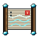 Riverbreath Scroll

`riverbreath_scroll` · Scroll · Heaven · iLv 45 · stack 99

> The Riverbreath inheritance scroll: the complete method.

- **Effect**: Learn method (method riverbreath_complete)
- **Sources**:
  - Drop: [Drowned Abbot](monsters.md#enemy-drowned_abbot) (Lv 27) · 100% (guaranteed)
  - Reward: Quest The Drowned Abbot (main, from Elder Hu), reward

###  Serpent-Coil Scroll

`scroll_serpent_coil_thrust` · Scroll · Heaven · iLv 45 · stack 99

> A scroll in an old hand. Read it to learn what it holds.

- **Effect**: Learn lost art (art serpent_coil_thrust)
- **Sources**:
  - Drop: [Riverbed Serpent](monsters.md#enemy-riverbed_serpent) (Lv 25) · 4% (lost art, until found, sure by kill 20)

###  Tidal Sovereign Scripture (manual)

`manual_tidal_sovereign_scripture` · Scroll · Heaven · iLv 45 · stack 1

> The Jade Sect's core water method. Ceiling Sage Sovereign 3.

- **Effect**: Learn method (method tidal_sovereign_scripture)
- **Sources**:
  - Shop: Jade Sect Mission Hall (Deacon Rui in Gate Street (Jade Sect Academy)) · 800 Contribution; needs sect rank Core disciple

###  Tide-Palm Scroll

`scroll_tide_palm` · Scroll · Heaven · iLv 45 · stack 99

> A scroll in an old hand. Read it to learn what it holds.

- **Effect**: Learn lost art (art tide_palm)
- **Sources**:
  - Drop: [Elder Gu](monsters.md#enemy-elder_gu) (Lv 53) · 15% (lost art, until found, sure by kill 6)

###  Many-Eyed Scroll

`scroll_many_eyed_pool_air` · Scroll · Spirit · iLv 68 · stack 99

> A scroll in an old hand. Read it to learn what it holds.

- **Effect**: Learn lost art (art many_eyed_pool_air)
- **Sources**:
  - Drop: [Thousand Eye Toad](monsters.md#enemy-thousand_eye_toad) (Lv 68) · 4% (lost art, until found, sure by kill 20)

###  Nine Peaks Lot Scroll

`scroll_ninth_peak_scroll` · Scroll · Spirit · iLv 68 · stack 99

> A scroll in an old hand. Read it to learn what it holds.

- **Effect**: Learn lost art (art ninth_peak_scroll)
- **Sources**:
  - Shop: Auction Pavilion (Azure Expanse) lot, opening bid 120 · 2.36% of lots

###  Sand-Throne Scroll

`scroll_sand_throne_sweep` · Scroll · Spirit · iLv 68 · stack 99

> A scroll in an old hand. Read it to learn what it holds.

- **Effect**: Learn lost art (art sand_throne_sweep)
- **Sources**:
  - Drop: [Tomb King](monsters.md#enemy-tomb_king) (Lv 77) · 4% (lost art, until found, sure by kill 20)

###  Broadside Scroll

`scroll_broadside_fan` · Scroll · Sovereign · iLv 86 · stack 99

> A scroll in an old hand. Read it to learn what it holds.

- **Effect**: Learn lost art (art broadside_fan)
- **Sources**:
  - Drop: [Admiral Voss](monsters.md#enemy-admiral_voss) (Lv 90) · 4% (lost art, until found, sure by kill 20)

###  Comet-Tail Scroll

`scroll_comet_tail_arrow` · Scroll · Sovereign · iLv 86 · stack 99

> A scroll in an old hand. Read it to learn what it holds.

- **Effect**: Learn lost art (art comet_tail_arrow)
- **Sources**:
  - Drop: [Comet Captain Rao](monsters.md#enemy-pirate_captain) (Lv 80) · 5% (lost art, until found, sure by kill 20)

###  Pyre-General's Scroll

`scroll_pyre_generals_lance` · Scroll · Sovereign · iLv 86 · stack 99

> A scroll in an old hand. Read it to learn what it holds.

- **Effect**: Learn lost art (art pyre_generals_lance)
- **Sources**:
  - Drop: [General Kharn](monsters.md#enemy-general_kharn) (Lv 92) · 4% (lost art, until found, sure by kill 20)

###  Maw-Song Scroll

`scroll_maw_song` · Scroll · Will · iLv 95 · stack 99

> A scroll in an old hand. Read it to learn what it holds.

- **Effect**: Learn lost art (art maw_song)
- **Sources**:
  - Drop: [Nebula Leviathan](monsters.md#enemy-nebula_leviathan) (Lv 99) · 3% (lost art, until found, sure by kill 20)

## Seed (6)

### 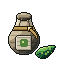 Willow Moss Seed

`willow_moss_seed` · Seed · Plain · iLv 5 · stack 99

> Dust-fine spores of willow moss, wrapped in a leaf. Granny Liu sells them. Plant it in a garden bed.

- **Effect**: Seed: {"family": "willow_moss"}
- **Sources**:
  - Garden: a harvest of Willow moss in a garden bed returns seeds · 10%
  - Shop: Granny Liu's Herb Hut (Granny Liu in Granny Liu's Herb Hut (Lotus Ferry), Lotus Ferry at Night (Lotus Ferry)) · 6 Silver Taels
  - Shop: Greyreed Trade Post (Trader Min in Greyreed Hamlet) · 6 Silver Taels
  - Reward: Quest Seeds of the Valley (guided, from Gardener Ji), on accept ×3

### 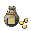 Ember Pepper Seed

`ember_pepper_seed` · Seed · Common · iLv 14 · stack 99

> Flat, pale pepper seeds that are warm to hold. Granny Liu sells them. Plant it in a garden bed.

- **Effect**: Seed: {"family": "ember_pepper"}
- **Sources**:
  - Garden: a harvest of Ember pepper in a garden bed returns seeds · 10%
  - Shop: Granny Liu's Herb Hut (Granny Liu in Granny Liu's Herb Hut (Lotus Ferry), Lotus Ferry at Night (Lotus Ferry)) · 14 Silver Taels
  - Shop: Greyreed Trade Post (Trader Min in Greyreed Hamlet) · 14 Silver Taels

### 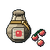 Riverreed Ginseng Seed

`riverreed_ginseng_seed` · Seed · Common · iLv 14 · stack 99

> Red ginseng berries with the seed still inside. Granny Liu sells them. Plant it in a garden bed.

- **Effect**: Seed: {"family": "riverreed_ginseng"}
- **Sources**:
  - Garden: a harvest of Riverreed ginseng in a garden bed returns seeds · 10%
  - Shop: Auction Day on Market Street (valley) lot ×3, opening bid 8 · 9.8% of lots
  - Shop: Granny Liu's Herb Hut (Granny Liu in Granny Liu's Herb Hut (Lotus Ferry), Lotus Ferry at Night (Lotus Ferry)) · 20 Silver Taels
  - Shop: Greyreed Trade Post (Trader Min in Greyreed Hamlet) · 20 Silver Taels

###  Mist Lotus Seed

`mist_lotus_seed` · Seed · Earth · iLv 27 · stack 99

> A lotus seed from a perfect harvest. No shop in the valley sells them. Plant it in a garden bed.

- **Effect**: Seed: {"family": "mist_lotus"}
- **Sources**:
  - Garden: a harvest of Mist lotus in a garden bed returns seeds · 10%
  - Shop: Auction Day on Market Street (valley) lot ×4, opening bid 6 · 9.8% of lots

###  Cloudtop Orchid Seed

`cloudtop_orchid_seed` · Seed · Heaven · iLv 45 · stack 99

> Orchid seed finer than flour, sealed in wax. Only old inheritances hold them. Plant it in a garden bed.

- **Effect**: Seed: {"family": "cloudtop_orchid"}
- **Sources**:
  - Shop: Auction Day on Market Street (valley) lot ×2, opening bid 14 · 9.8% of lots
  - Reward: Quest The Riverbreath Trial (main, from Elder Hu), reward ×2

### 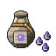 Soulbell Flower Seed

`soulbell_flower_seed` · Seed · Heaven · iLv 45 · stack 99

> A soulbell seed that hums when you hold it to your ear. Only old inheritances hold them. Plant it in a garden bed.

- **Effect**: Seed: {"family": "soulbell_flower"}
- **Sources**:
  - Shop: Auction Day on Market Street (valley) lot, opening bid 20 · 9.8% of lots
  - Reward: Quest The Drowned Abbot (main, from Elder Hu), reward ×2

## Talisman (11)

###  Return Charm

`return_charm` · Talisman · Plain · iLv 5 · stack 99

> Teleports you to the last town.

- **Effect**: Teleport (target last_town)
- **Sources**:
  - Shop: Peddler Gou's Packs (Peddler Gou in Port Market (Cloudgate Port)) · at list price in Spirit Stones
  - Shop: Peddler Ning's Silk and Sundries (Peddler Ning in Harbor Market (Lanternfall Harbor)) · at list price in Sage Crystals
  - Shop: Stoneford General Store (Proprietor Fang in Market Street (Stoneford)) · at list price in Silver Taels

###  Willow Salve

`willow_salve` · Talisman · Plain · iLv 5 · stack 99

> Cures a minor body injury.

- **Effect**: Cure injury (injury body, max severity 1); Food: {"group": "healing"}
- **Sources**:
  - Shop: Granny Liu's Herb Hut (Granny Liu in Granny Liu's Herb Hut (Lotus Ferry), Lotus Ferry at Night (Lotus Ferry)) · at list price in Silver Taels

###  Escape Talisman

`escape_talisman` · Talisman · Common · iLv 14 · stack 99

> Leaves a dungeon at once.

- **Effect**: Teleport (target dungeon_exit)
- **Sources**:
  - Shop: Peddler Gou's Packs (Peddler Gou in Port Market (Cloudgate Port)) · at list price in Spirit Stones
  - Shop: Peddler Ning's Silk and Sundries (Peddler Ning in Harbor Market (Lanternfall Harbor)) · at list price in Sage Crystals
  - Shop: Stoneford General Store (Proprietor Fang in Market Street (Stoneford)) · at list price in Silver Taels

###  Flame Talisman

`flame_talisman` · Talisman · Common · iLv 14 · stack 20

> Thrown, it bursts into a sheet of fire: 180% fire damage at the talisman's own grade within 80.

- **Effect**: used as: Talisman; Talisman: attack
- **Sources**:
  - Crafting: Recipe `flame_talisman` (Talisman, Common): Talisman Paper ×1, Cinnabar ×1, Ember Pepper ×1

###  Iron Wall Talisman

`iron_wall_talisman` · Talisman · Common · iLv 14 · stack 20

> Burned, it wraps you in iron Qi: a shield that absorbs 20% of your max HP for 6 s.

- **Effect**: used as: Talisman; Talisman: defence
- **Sources**:
  - Crafting: Recipe `iron_wall_talisman` (Talisman, Common): Talisman Paper ×1, Cinnabar ×1, Beetle Shell ×2

###  Revival Talisman

`revival_talisman` · Talisman · Common · iLv 14 · stack 99

> Revive where you fall: 30% HP, 5 s invulnerable. Once per 5 minutes.

- **Notes**: value 15
- **Sources**:
  - Crafting: Recipe `revival_talisman` (Talisman, Common): Talisman Paper ×1, Cinnabar ×1, Snapper Claw ×1
  - Shop: Cloud Sect Mission Hall (Deacon Heng in Cliff Stair (Cloud Sect Monastery)) · at list price in Contribution
  - Shop: Granny Liu's Herb Hut (Granny Liu in Granny Liu's Herb Hut (Lotus Ferry), Lotus Ferry at Night (Lotus Ferry)) · at list price in Silver Taels
  - Shop: Jade Sect Mission Hall (Deacon Rui in Gate Street (Jade Sect Academy)) · at list price in Contribution
  - Shop: Peddler Gou's Packs (Peddler Gou in Port Market (Cloudgate Port)) · at list price in Spirit Stones
  - Shop: Peddler Ning's Silk and Sundries (Peddler Ning in Harbor Market (Lanternfall Harbor)) · at list price in Sage Crystals

###  Wind Step Talisman

`wind_step_talisman` · Talisman · Common · iLv 14 · stack 20

> Burned, it lends you one free dodge within 60 s, cooldown or not.

- **Effect**: used as: Talisman; Talisman: movement
- **Sources**:
  - Crafting: Recipe `wind_step_talisman` (Talisman, Common): Talisman Paper ×1, Cinnabar ×1, Vulture Plume ×1

###  Binding Talisman

`binding_talisman` · Talisman · Earth · iLv 27 · stack 20

> Thrown, it roots the nearest foe for 2 s. Bosses shrug it off.

- **Effect**: used as: Talisman; Talisman: sealing
- **Sources**:
  - Crafting: Recipe `binding_talisman` (Talisman, Earth): Spirit Paper ×1, Beast-Blood Ink ×1, Viper Fang ×1

###  Thunder Talisman

`thunder_talisman` · Talisman · Earth · iLv 27 · stack 20

> Thrown, it calls a bolt: 240% thunder damage at the talisman's own grade, and Shock.

- **Effect**: used as: Talisman; Talisman: attack
- **Sources**:
  - Crafting: Recipe `thunder_talisman` (Talisman, Earth): Spirit Paper ×1, Beast-Blood Ink ×1, Storm Feather ×1

###  Veil Talisman

`veil_talisman` · Talisman · Earth · iLv 27 · stack 20

> Burned, it hides you for 10 s: monsters that have not found you pass you by.

- **Effect**: used as: Talisman; Talisman: movement
- **Sources**:
  - Crafting: Recipe `veil_talisman` (Talisman, Earth): Spirit Paper ×1, Restoration Ink ×1, Tiny Hollow Shard ×1

###  Lightning Rod Talisman

`lightning_rod_talisman` · Talisman · Heaven · iLv 45 · stack 9

> Carried through a heavenly tribulation, it draws one bolt into itself and burns away.

- **Sources**:
  - Crafting: Recipe `lightning_rod_talisman` (Talisman, Heaven): Spirit Paper ×1, Beast-Blood Ink ×1, Cloudsteel Ore ×1

## Taming (5)

###  Bonding Offering (Common)

`bonding_offering_common` · Taming · Common · iLv 14 · stack 99

> Calms a wounded spirit beast (below 30% HP, paw-marked) so it may bond with you. Use it from quick-use beside one.

- **Effect**: used as: Tame
- **Sources**:
  - Crafting: Recipe `bonding_offering_common` (Cooking, Plain): Tough Meat ×1, Rice ×1
  - Shop: Hermit Yao's Beast Hall (Hermit Yao in Hermit's Stilt House (Reed Marsh)) · at list price in Silver Taels
  - Shop: Old Ma's Store (Old Ma in Lotus Ferry at Night (Lotus Ferry), Old Ma's Store (Lotus Ferry)) · at list price in Silver Taels; needs Qi Unfurling 5
  - Shop: Peddler Shao's Mat (Peddler Shao in Caravan Road) · 60 Silver Taels
  - Reward: Quest A Friend in the Reeds (guided, from Hermit Yao), reward ×5

###  Beast Essence Blood

`beast_essence_blood` · Taming · Earth · iLv 27 · stack 20

> A drop of a great beast's essence blood in a jade vial. Your active spirit animal drinks it for +10 bloodline purity; it also seals a Blood Contract or rerolls one hidden trait of an egg you are warming.

- **Effect**: Add pet purity (amount 10); used as: Pet item
- **Sources**:
  - Shop: Broker Mu's Back Room (Broker Mu in Hall of Nine (Nine Peaks), Wayfarers' Inn (Cloudgate Port)) · 25 Spirit Stones; needs Alignment at most (value -20)
  - Shop: Hermit Yao's Beast Hall (Hermit Yao in Hermit's Stilt House (Reed Marsh)) · 600 Silver Taels; needs Heart Tempering 1
  - Reward: Beast Arena weekly rank 1
  - Reward: Beast Grove trial in Beast Trial Grove (Stoneford) · 30% of rewards

###  Bonding Offering (Earth)

`bonding_offering_earth` · Taming · Earth · iLv 27 · stack 99

> Calms a wounded spirit beast (below 30% HP, paw-marked) so it may bond with you. Use it from quick-use beside one.

- **Effect**: used as: Tame
- **Sources**:
  - Crafting: Recipe `bonding_offering_earth` (Cooking, Plain): Jade Carp ×1, Mist Lotus ×1
  - Shop: Cloud Sect Mission Hall (Deacon Heng in Cliff Stair (Cloud Sect Monastery)) · at list price in Contribution; needs Qi Unfurling 5
  - Shop: Jade Sect Mission Hall (Deacon Rui in Gate Street (Jade Sect Academy)) · at list price in Contribution; needs Qi Unfurling 5
  - Reward: Quest Calming the Wild (guided, from Hermit Yao), reward

###  Purifying Offering

`purifying_offering` · Taming · Earth · iLv 27 · stack 20

> Incense and salt bound in a lotus leaf. Offered to a weakened demonic beast, it lets the beast be tamed; offered to a Hollowed one, it cleanses the grey from it first. Use it from quick-use beside one.

- **Effect**: used as: Tame
- **Sources**:
  - Shop: Hermit Yao's Beast Hall (Hermit Yao in Hermit's Stilt House (Reed Marsh)) · 60 Silver Taels; needs Qi Unfurling 7

###  Bonding Offering (Heaven)

`bonding_offering_heaven` · Taming · Heaven · iLv 45 · stack 99

> Calms a wounded spirit beast (below 30% HP, paw-marked) so it may bond with you. Use it from quick-use beside one.

- **Effect**: used as: Tame
- **Sources**:
  - Crafting: Recipe `bonding_offering_heaven` (Cooking, Plain): Mist Trout ×2, Cloudtop Orchid ×1
  - Shop: Herders' Camp (Old Suo in Herders' Camp (Thunderhorn Plains)) · at list price in Spirit Stones
  - Reward: Quest Star-Tier Beasts (main, from Tamer Qiu), reward ×2

## Throwable (4)

###  Iron Needles

`iron_needles` · Throwable · Common · iLv 14 · stack 99

> Three needles flicked at once. Light, fast, and they find the gaps in armour.

- **Effect**: Throw (art needle, count 3, mult 0.45, pierce 0, range 380, speed 760); Food: {"group": "throw"}
- **Sources**:
  - Crafting: Recipe `iron_needles` (Smithing, Common): Riverstone ×1, Beetle Shell ×1 ×20; known by default
  - Shop: Peddler Shao's Mat (Peddler Shao in Caravan Road) · 24 Silver Taels

###  Thunderclap Pellet

`thunderclap_pellet` · Throwable · Common · iLv 14 · stack 99

> A lacquered pellet packed with ore dust and pepper. It bursts where it lands: damage and knockback all around.

- **Effect**: Throw (art pellet, burst 120, count 1, knockback 130, mult 1.6, range 360, speed 520); Food: {"group": "throw"}
- **Sources**:
  - Crafting: Recipe `thunderclap_pellet` (Smithing, Common): Ore Dust ×2, Ember Pepper ×1, Lantern Wick ×1 ×3; known by default
  - Mail: Karma debt lieutenant_spared: a letter from A friend from the Hideout ×3

###  Viper Smoke Pill

`viper_smoke_pill` · Throwable · Common · iLv 14 · stack 99

> A poison pill. Thrown, it bursts into a green cloud: 4% of max HP a second for 5 s to everything within 90.

- **Effect**: Throw (art smoke, burst 90, cloud {"duration_s": 5, "power": 0.04, "status": "poison"}, count 1, mult 0.2, range 340, speed 520); Food: {"group": "throw"}
- **Sources**:
  - Crafting: Recipe `viper_smoke_pill` (Alchemy, Common): Venom Sac ×2, Viper Fang ×1, River Mud ×1; known by default
  - Shop: Peddler Shao's Mat (Peddler Shao in Caravan Road) · 35 Silver Taels

###  Flying Knives

`flying_knives` · Throwable · Earth · iLv 27 · stack 99

> A balanced throwing knife. One hard hit at range that passes through a foe.

- **Effect**: Throw (art knife, count 1, mult 1.2, pierce 1, range 420, speed 640); Food: {"group": "throw"}
- **Sources**:
  - Crafting: Recipe `flying_knives` (Smithing, Earth): Jadeiron ×1 ×10; known by default

## Tool (58)

###  Bamboo Rod

`bamboo_rod` · Tool · Plain · iLv 5 · stack 1

> A bamboo fishing rod with a horsehair line. Every fisher starts with one.

- **Effect**: Post: {"craft": "angling", "finesse_pct": 0, "level_req": 1, "power": 3, "speed": 3, "tier": 0}; Tool: {"craft": "fishing", "power": 1.0}
- **Requires**: Angling level 1
- **Sources**:
  - Shop: Old Ma's Store (Old Ma in Lotus Ferry at Night (Lotus Ferry), Old Ma's Store (Lotus Ferry)) · at list price in Silver Taels; needs Bone Forging 8
  - Shop: Stoneford General Store (Proprietor Fang in Market Street (Stoneford)) · daily rotation (1 of 3)
  - Shop: Tinkerer's Workshop (Tinkerer Yu in Artisan Row (Stoneford)) · at list price in Silver Taels
  - Reward: Unlock: Cooking

###  Clay Pot

`clay_pot` · Tool · Plain · iLv 5 · stack 1

> A blackened clay pot. Cooking starts here.

- **Effect**: Tool: {"craft": "cooking", "power": 1.0}
- **Sources**:
  - Shop: Stoneford General Store (Proprietor Fang in Market Street (Stoneford)) · daily rotation (1 of 3)
  - Shop: Tinkerer's Workshop (Tinkerer Yu in Artisan Row (Stoneford)) · at list price in Silver Taels
  - Reward: Unlock: Cooking

###  Old Pickaxe

`old_pickaxe` · Tool · Plain · iLv 5 · stack 1

> A worn pickaxe with a loose head. It still breaks ore, slowly.

- **Effect**: Post: {"craft": "delving", "finesse_pct": 0, "level_req": 1, "power": 2, "speed": 3, "tier": 0}; Tool: {"craft": "mining", "power": 1.0}
- **Requires**: Delving level 1
- **Sources**:
  - Reward: Unlock: Mining

###  Reed Net

`reed_net` · Tool · Plain · iLv 5 · stack 1

> Nets spirit insects from a swarm. Post power 4, speed 4; Level 1 in the craft to use it at a post.

- **Effect**: Post: {"craft": "netting", "finesse_pct": 0, "level_req": 1, "power": 4, "speed": 4, "tier": 0}; Tool: {"craft": "insect_netting", "power": 1.0}
- **Requires**: Netting level 1
- **Sources**:
  - Reward: Quest Little Dou's Glowflies (side, from Little Dou), reward
  - Reward: Unlock: Insect netting

###  Appraisers Loupe

`appraisers_loupe` · Tool · Common · iLv 14 · stack 1

> A jade loupe that shows what a curio really is, and what it is worth.

- **Effect**: Tool: {"craft": "appraisal", "power": 1.0}
- **Sources**:
  - Shop: Trade House (Elder Gu in Artisan Row (Stoneford); Madam Hua in Artisan Row (Stoneford)) · at list price in Silver Taels; needs Qi Kindling 6
  - Reward: Unlock: Appraisal

###  Copper Pick

`copper_pick` · Tool · Common · iLv 14 · stack 1

> Breaks spirit ore at a post. Post power 6, speed 3; Level 3 in the craft to use it at a post.

- **Effect**: Post: {"craft": "delving", "finesse_pct": 0, "level_req": 3, "power": 6, "speed": 3, "tier": 1}; Tool: {"craft": "mining", "power": 1.15}
- **Requires**: Delving level 3
- **Sources**:
  - Crafting: Recipe `copper_pick` (Smithing, Common): Copper ×6, Spirit Wood ×2, Cloth ×1; known by default

###  Copper Sickle

`copper_sickle` · Tool · Common · iLv 14 · stack 1

> Cuts herbs at a post. Post power 7, speed 3; Level 4 in the craft to use it at a post.

- **Effect**: Post: {"craft": "foraging", "finesse_pct": 0, "level_req": 4, "power": 7, "speed": 3, "tier": 1}; Tool: {"craft": "gathering", "power": 1.15}
- **Requires**: Foraging level 4
- **Sources**:
  - Crafting: Recipe `copper_sickle` (Smithing, Common): Copper ×4, Spirit Wood ×2, Cloth ×1; known by default

###  Cord Net

`cord_net` · Tool · Common · iLv 14 · stack 1

> Nets spirit insects from a swarm. Post power 14, speed 4; Level 10 in the craft to use it at a post.

- **Effect**: Post: {"craft": "netting", "finesse_pct": 0, "level_req": 10, "power": 14, "speed": 4, "tier": 2}; Tool: {"craft": "insect_netting", "power": 1.3}
- **Requires**: Netting level 10
- **Sources**:
  - Crafting: Recipe `cord_net` (Smithing, Common): Riverstone ×2, Cloth ×4, Spirit Wood ×1; known by default

###  Drying Rack

`drying_rack` · Tool · Common · iLv 14 · stack 1

> A folding bamboo rack. Steam herbs on it (their pills carry 30% less toxicity) or soak them in rice wine (10% more potency). Set it up at any garden bed.

- **Effect**: Tool: {"craft": "alchemy", "power": 1.0}
- **Sources**:
  - Shop: Tinkerer's Workshop (Tinkerer Yu in Artisan Row (Stoneford)) · at list price in Silver Taels; needs Qi Kindling 8
  - Reward: Quest Batch Work (guided, from Mei Qing), reward

###  Forge Hammer

`forge_hammer` · Tool · Common · iLv 14 · stack 1

> A smith's hammer, balanced for long days at the anvil.

- **Effect**: Tool: {"craft": "smithing", "power": 1.0}
- **Sources**:
  - Reward: Quest Copper for the Bellows (side, from Smith Bao), reward
  - Reward: Unlock: Smithing

###  Hemp Net

`hemp_net` · Tool · Common · iLv 14 · stack 1

> Nets spirit insects from a swarm. Post power 9, speed 4; Level 4 in the craft to use it at a post.

- **Effect**: Post: {"craft": "netting", "finesse_pct": 0, "level_req": 4, "power": 9, "speed": 4, "tier": 1}; Tool: {"craft": "insect_netting", "power": 1.15}
- **Requires**: Netting level 4
- **Sources**:
  - Crafting: Recipe `hemp_net` (Smithing, Common): Copper ×2, Cloth ×3, Spirit Wood ×1; known by default

###  Hemp Snare Kit

`hemp_snare_kit` · Tool · Common · iLv 14 · stack 1

> A snare kit: 1 snare at once, power 4; Level 1 in Beast Snaring to use it.

- **Effect**: Post: {"craft": "snaring", "finesse_pct": 0, "level_req": 1, "power": 4, "snares": 1, "speed": 3, "tier": 0}
- **Requires**: Snaring level 1
- **Sources**:
  - Reward: Unlock: Beast snaring

###  Herb Sickle

`herb_sickle` · Tool · Common · iLv 14 · stack 1

> A curved sickle for cutting herbs cleanly at the stem, so they keep their potency.

- **Effect**: Post: {"craft": "foraging", "finesse_pct": 0, "level_req": 1, "power": 3, "speed": 3, "tier": 0}; Tool: {"craft": "gathering", "power": 1.3}
- **Requires**: Foraging level 1
- **Sources**:
  - Shop: Stoneford General Store (Proprietor Fang in Market Street (Stoneford)) · at list price in Silver Taels; needs Bone Forging 4
  - Shop: Tinkerer's Workshop (Tinkerer Yu in Artisan Row (Stoneford)) · at list price in Silver Taels
  - Reward: Unlock: Herb gathering

###  Iron Pickaxe

`iron_pickaxe` · Tool · Common · iLv 14 · stack 1

> A sound iron pickaxe: veins give up their ore faster.

- **Effect**: Post: {"craft": "delving", "finesse_pct": 0, "level_req": 8, "power": 10, "speed": 4, "tier": 2}; Tool: {"craft": "mining", "power": 1.3}
- **Requires**: Delving level 8
- **Sources**:
  - Crafting: Recipe `iron_pickaxe` (Smithing, Common): Riverstone ×6, Copper ×3, Spirit Wood ×2; known by default
  - Shop: Stoneford General Store (Proprietor Fang in Market Street (Stoneford)) · at list price in Silver Taels; needs Bone Forging 5
  - Shop: Tinkerer's Workshop (Tinkerer Yu in Artisan Row (Stoneford)) · at list price in Silver Taels
  - Reward: Quest Stone and Sweat (guided, from Foreman Dong), reward

### 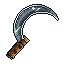 Iron Sickle

`iron_sickle` · Tool · Common · iLv 14 · stack 1

> Cuts herbs at a post. Post power 10, speed 3; Level 8 in the craft to use it at a post.

- **Effect**: Post: {"craft": "foraging", "finesse_pct": 0, "level_req": 8, "power": 10, "speed": 3, "tier": 2}; Tool: {"craft": "gathering", "power": 1.3}
- **Requires**: Foraging level 8
- **Sources**:
  - Crafting: Recipe `iron_sickle` (Smithing, Common): Riverstone ×4, Copper ×3, Spirit Wood ×2; known by default

###  Ironwood Rod

`ironwood_rod` · Tool · Common · iLv 14 · stack 1

> Fishes a spot through the day. Post power 13, speed 4; Level 9 in the craft to use it at a post.

- **Effect**: Post: {"craft": "angling", "finesse_pct": 0, "level_req": 9, "power": 13, "speed": 4, "tier": 2}; Tool: {"craft": "fishing", "power": 1.3}
- **Requires**: Angling level 9
- **Sources**:
  - Crafting: Recipe `ironwood_rod` (Smithing, Common): Riverstone ×2, Spirit Wood ×3, Spirit Wood ×2; known by default

###  Reed Beast Bag

`beast_bag_reed` · Tool · Common · iLv 14 · stack 1

> A Spirit Beast Bag with 2 quiet rooms inside. Carry that many spirit animals and swap them in the field, though never in a fight.

- **Effect**: Beast bag: {"slots": 2}
- **Sources**:
  - Shop: Hermit Yao's Beast Hall (Hermit Yao in Hermit's Stilt House (Reed Marsh)) · 150 Silver Taels; needs Qi Unfurling 7

###  Reedline Rod

`reedline_rod` · Tool · Common · iLv 14 · stack 1

> Fishes a spot through the day. Post power 8, speed 3; Level 4 in the craft to use it at a post.

- **Effect**: Post: {"craft": "angling", "finesse_pct": 0, "level_req": 4, "power": 8, "speed": 3, "tier": 1}; Tool: {"craft": "fishing", "power": 1.15}
- **Requires**: Angling level 4
- **Sources**:
  - Crafting: Recipe `reedline_rod` (Smithing, Common): Copper ×2, Spirit Wood ×3, Cloth ×1; known by default

###  Wood Rite Tablet

`wood_rite_tablet` · Tool · Common · iLv 14 · stack 1

> An ancestral tablet for the Rites: power 4, charge speed 4; Level 1 in Ancestral Rites to use it.

- **Effect**: Post: {"craft": "rites", "finesse_pct": 0, "level_req": 1, "power": 4, "speed": 4, "tier": 0}
- **Requires**: Rites level 1
- **Sources**:
  - Reward: Unlock: Ancestral rites

###  Formation Kit

`formation_kit` · Tool · Earth · iLv 27 · stack 1

> Chalk, a compass and a pouch of flags: all a formation needs to be laid out.

- **Effect**: Tool: {"craft": "formations", "power": 1.0}
- **Sources**:
  - Reward: Unlock: Formations

###  Guqin

`guqin` · Tool · Earth · iLv 27 · stack 1

> A seven-string guqin in a cloth wrap. Play it to calm the Qi: meditation runs up to 15% faster for 30 minutes.

- **Effect**: used as: Guqin
- **Sources**:
  - Shop: Stoneford Tea House (Auntie Rong in Market Street (Stoneford)) · 450 Silver Taels

###  Hide Beast Bag

`beast_bag_hide` · Tool · Earth · iLv 27 · stack 1

> A Spirit Beast Bag with 3 quiet rooms inside. Carry that many spirit animals and swap them in the field, though never in a fight.

- **Effect**: Beast bag: {"slots": 3}
- **Sources**:
  - Shop: Hermit Yao's Beast Hall (Hermit Yao in Hermit's Stilt House (Reed Marsh)) · 900 Silver Taels; needs Heart Tempering 1

###  Iron Snare Kit

`iron_snare_kit` · Tool · Earth · iLv 27 · stack 1

> A snare kit: 2 snares at once, power 14; Level 15 in Beast Snaring to use it.

- **Effect**: Post: {"craft": "snaring", "finesse_pct": 0, "level_req": 15, "power": 14, "snares": 2, "speed": 3, "tier": 1}
- **Requires**: Snaring level 15
- **Sources**:
  - Crafting: Recipe `iron_snare_kit` (Smithing, Earth): Jadeiron ×3, Hemp Cord ×6, Boar Hide ×2; known by default

###  Jade Rite Tablet

`jade_rite_tablet` · Tool · Earth · iLv 27 · stack 1

> An ancestral tablet for the Rites: power 12, charge speed 5; Level 15 in Ancestral Rites to use it.

- **Effect**: Post: {"craft": "rites", "finesse_pct": 0, "level_req": 15, "power": 12, "speed": 5, "tier": 1}
- **Requires**: Rites level 15
- **Sources**:
  - Crafting: Recipe `jade_rite_tablet` (Smithing, Earth): Jadeiron ×2, Spirit Wood ×3, Cinnabar ×2; known by default

### 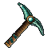 Jadeiron Pick

`jadeiron_pick` · Tool · Earth · iLv 27 · stack 1

> Breaks spirit ore at a post. Post power 13, speed 4; Level 15 in the craft to use it at a post.

- **Effect**: Post: {"craft": "delving", "finesse_pct": 0, "level_req": 15, "power": 13, "speed": 4, "tier": 3}; Tool: {"craft": "mining", "power": 1.45}
- **Requires**: Delving level 15
- **Sources**:
  - Crafting: Recipe `jadeiron_pick` (Smithing, Earth): Jadeiron ×6, Riverstone ×3, Jade Scale ×1; known by default

###  Jadeiron Sickle

`jadeiron_sickle` · Tool · Earth · iLv 27 · stack 1

> Cuts herbs at a post. Post power 14, speed 4; Level 15 in the craft to use it at a post.

- **Effect**: Post: {"craft": "foraging", "finesse_pct": 0, "level_req": 15, "power": 14, "speed": 4, "tier": 3}; Tool: {"craft": "gathering", "power": 1.45}
- **Requires**: Foraging level 15
- **Sources**:
  - Crafting: Recipe `jadeiron_sickle` (Smithing, Earth): Jadeiron ×4, Riverstone ×3, Jade Scale ×1; known by default

###  Jadeline Rod

`jadeline_rod` · Tool · Earth · iLv 27 · stack 1

> Fishes a spot through the day. Post power 19, speed 4; Level 15 in the craft to use it at a post.

- **Effect**: Post: {"craft": "angling", "finesse_pct": 0, "level_req": 15, "power": 19, "speed": 4, "tier": 3}; Tool: {"craft": "fishing", "power": 1.45}
- **Requires**: Angling level 15
- **Sources**:
  - Crafting: Recipe `jadeline_rod` (Smithing, Earth): Jadeiron ×2, Spirit Wood ×3, Jade Scale ×1; known by default

###  Needle Case

`needle_case` · Tool · Earth · iLv 27 · stack 1

> A case of fine silver needles for acupuncture and stitching wounds.

- **Effect**: Tool: {"craft": "healing", "power": 1.0}
- **Sources**:
  - Reward: Unlock: Healing

###  Silk Net

`silk_net` · Tool · Earth · iLv 27 · stack 1

> Nets spirit insects from a swarm. Post power 20, speed 5; Level 15 in the craft to use it at a post.

- **Effect**: Post: {"craft": "netting", "finesse_pct": 0, "level_req": 15, "power": 20, "speed": 5, "tier": 3}; Tool: {"craft": "insect_netting", "power": 1.45}
- **Requires**: Netting level 15
- **Sources**:
  - Crafting: Recipe `silk_net` (Smithing, Earth): Jadeiron ×2, Kite Silk ×1, Spirit Wood ×1; known by default

###  Cloud Beast Bag

`beast_bag_cloud` · Tool · Heaven · iLv 45 · stack 1

> A Spirit Beast Bag with 4 quiet rooms inside. Carry that many spirit animals and swap them in the field, though never in a fight.

- **Effect**: Beast bag: {"slots": 4}
- **Sources**:
  - Shop: Hermit Yao's Beast Hall (Hermit Yao in Hermit's Stilt House (Reed Marsh)) · 2400 Silver Taels; needs Cloud Stride 1

###  Cloud Rod

`cloud_rod` · Tool · Heaven · iLv 45 · stack 1

> Fishes a spot through the day. Post power 25, speed 5; Level 25 in the craft to use it at a post.

- **Effect**: Post: {"craft": "angling", "finesse_pct": 0, "level_req": 25, "power": 25, "speed": 5, "tier": 4}; Tool: {"craft": "fishing", "power": 1.6}
- **Requires**: Angling level 25
- **Sources**:
  - Crafting: Recipe `cloud_rod` (Smithing, Heaven): Cloudsteel Ore ×2, Spirit Wood ×3, Cloud Feather ×1, Bronze Rivet ×3; known by default

###  Cloudsilk Net

`cloudsilk_net` · Tool · Heaven · iLv 45 · stack 1

> Nets spirit insects from a swarm. Post power 26, speed 5; Level 20 in the craft to use it at a post.

- **Effect**: Post: {"craft": "netting", "finesse_pct": 0, "level_req": 20, "power": 26, "speed": 5, "tier": 4}; Tool: {"craft": "insect_netting", "power": 1.6}
- **Requires**: Netting level 20
- **Sources**:
  - Crafting: Recipe `cloudsilk_net` (Smithing, Heaven): Cloudsteel Ore ×2, Cloud Feather ×2, Spirit Wood ×1, Bronze Rivet ×3; known by default

###  Cloudsteel Pick

`cloudsteel_pick` · Tool · Heaven · iLv 45 · stack 1

> Breaks spirit ore at a post. Post power 16, speed 4; Level 25 in the craft to use it at a post.

- **Effect**: Post: {"craft": "delving", "finesse_pct": 0, "level_req": 25, "power": 16, "speed": 4, "tier": 4}; Tool: {"craft": "mining", "power": 1.6}
- **Requires**: Delving level 25
- **Sources**:
  - Crafting: Recipe `cloudsteel_pick` (Smithing, Heaven): Cloudsteel Ore ×6, Jadeiron ×3, Cloud Feather ×1, Bronze Rivet ×3; known by default

###  Cloudsteel Sickle

`cloudsteel_sickle` · Tool · Heaven · iLv 45 · stack 1

> Cuts herbs at a post. Post power 18, speed 4; Level 20 in the craft to use it at a post.

- **Effect**: Post: {"craft": "foraging", "finesse_pct": 0, "level_req": 20, "power": 18, "speed": 4, "tier": 4}; Tool: {"craft": "gathering", "power": 1.6}
- **Requires**: Foraging level 20
- **Sources**:
  - Crafting: Recipe `cloudsteel_sickle` (Smithing, Heaven): Cloudsteel Ore ×4, Jadeiron ×3, Cloud Feather ×1, Bronze Rivet ×3; known by default

###  Spirit Spade

`spirit_spade` · Tool · Heaven · iLv 45 · stack 1

> A jade-edged spade that cuts earth without cutting roots. With Expert gathering, dig a rare herb up whole and move it to a garden bed.

- **Effect**: Tool: {"craft": "transplant", "power": 1.0}
- **Sources**:
  - Shop: Stoneford General Store (Proprietor Fang in Market Street (Stoneford)) · 900 Silver Taels; needs Cloud Stride 1

###  Cloud Rite Tablet

`cloud_rite_tablet` · Tool · Mystic · iLv 59 · stack 1

> An ancestral tablet for the Rites: power 24, charge speed 6; Level 30 in Ancestral Rites to use it.

- **Effect**: Post: {"craft": "rites", "finesse_pct": 0, "level_req": 30, "power": 24, "speed": 6, "tier": 2}
- **Requires**: Rites level 30
- **Sources**:
  - Crafting: Recipe `cloud_rite_tablet` (Smithing, Mystic): Cloudsteel Ore ×2, Spirit Wood ×3, Soul Wax ×1, Bronze Rivet ×4; known by default

###  Mistjade Beast Bag

`beast_bag_mist` · Tool · Mystic · iLv 59 · stack 1

> A Spirit Beast Bag with 5 quiet rooms inside. Carry that many spirit animals and swap them in the field, though never in a fight.

- **Effect**: Beast bag: {"slots": 5}
- **Sources**:
  - Shop: Hermit Yao's Beast Hall (Hermit Yao in Hermit's Stilt House (Reed Marsh)) · 6000 Silver Taels; needs Heaven Glimpse 1

###  Mystic Net

`mystic_net` · Tool · Mystic · iLv 59 · stack 1

> Nets spirit insects from a swarm. Post power 31, speed 5; Level 25 in the craft to use it at a post.

- **Effect**: Post: {"craft": "netting", "finesse_pct": 0, "level_req": 25, "power": 31, "speed": 5, "tier": 5}; Tool: {"craft": "insect_netting", "power": 1.75}
- **Requires**: Netting level 25
- **Sources**:
  - Crafting: Recipe `mystic_net` (Smithing, Mystic): Mystic Ore ×2, Roc Feather ×2, Spirit Wood ×1, Bronze Rivet ×4; known by default

###  Mystic Pick

`mystic_pick` · Tool · Mystic · iLv 59 · stack 1

> Breaks spirit ore at a post. Post power 19, speed 5; Level 32 in the craft to use it at a post. +2% Finesse.

- **Effect**: Post: {"craft": "delving", "finesse_pct": 2, "level_req": 32, "power": 19, "speed": 5, "tier": 5}; Tool: {"craft": "mining", "power": 1.75}
- **Requires**: Delving level 32
- **Sources**:
  - Crafting: Recipe `mystic_pick` (Smithing, Mystic): Mystic Ore ×6, Cloudsteel Ore ×3, Roc Feather ×1, Bronze Rivet ×4; known by default

###  Mystic Rod

`mystic_rod` · Tool · Mystic · iLv 59 · stack 1

> Fishes a spot through the day. Post power 30, speed 5; Level 32 in the craft to use it at a post.

- **Effect**: Post: {"craft": "angling", "finesse_pct": 0, "level_req": 32, "power": 30, "speed": 5, "tier": 5}; Tool: {"craft": "fishing", "power": 1.75}
- **Requires**: Angling level 32
- **Sources**:
  - Crafting: Recipe `mystic_rod` (Smithing, Mystic): Mystic Ore ×2, Spirit Wood ×3, Roc Feather ×1, Bronze Rivet ×4; known by default

###  Mystic Sickle

`mystic_sickle` · Tool · Mystic · iLv 59 · stack 1

> Cuts herbs at a post. Post power 23, speed 5; Level 25 in the craft to use it at a post.

- **Effect**: Post: {"craft": "foraging", "finesse_pct": 0, "level_req": 25, "power": 23, "speed": 5, "tier": 5}; Tool: {"craft": "gathering", "power": 1.75}
- **Requires**: Foraging level 25
- **Sources**:
  - Crafting: Recipe `mystic_sickle` (Smithing, Mystic): Mystic Ore ×4, Cloudsteel Ore ×3, Roc Feather ×1, Bronze Rivet ×4; known by default

###  Silk Snare Kit

`silk_snare_kit` · Tool · Mystic · iLv 59 · stack 1

> A snare kit: 3 snares at once, power 26; Level 30 in Beast Snaring to use it.

- **Effect**: Post: {"craft": "snaring", "finesse_pct": 0, "level_req": 30, "power": 26, "snares": 3, "speed": 3, "tier": 2}
- **Requires**: Snaring level 30
- **Sources**:
  - Crafting: Recipe `silk_snare_kit` (Smithing, Mystic): Mystic Ore ×2, Kite Silk ×3, Bronze Rivet ×4; known by default

###  Starweave Beast Bag

`beast_bag_star` · Tool · Spirit · iLv 68 · stack 1

> A Spirit Beast Bag with 6 quiet rooms inside. Carry that many spirit animals and swap them in the field, though never in a fight.

- **Effect**: Beast bag: {"slots": 6}
- **Sources**:
  - Shop: Herders' Camp (Old Suo in Herders' Camp (Thunderhorn Plains)) · 160 Spirit Stones; needs Sage 1

###  Storm Net

`storm_net` · Tool · Spirit · iLv 68 · stack 1

> Nets spirit insects from a swarm. Post power 37, speed 5; Level 30 in the craft to use it at a post. +4% Finesse.

- **Effect**: Post: {"craft": "netting", "finesse_pct": 4, "level_req": 30, "power": 37, "speed": 5, "tier": 6}; Tool: {"craft": "insect_netting", "power": 1.9}
- **Requires**: Netting level 30
- **Sources**:
  - Crafting: Recipe `storm_net` (Smithing, Spirit): Stormsteel Ore ×2, Kite Silk ×3, Spirit Wood ×1, Whetstone ×2, Cinnabar Salt ×6; known by default

###  Storm Rod

`storm_rod` · Tool · Spirit · iLv 68 · stack 1

> Fishes a spot through the day. Post power 36, speed 5; Level 40 in the craft to use it at a post. +4% Finesse.

- **Effect**: Post: {"craft": "angling", "finesse_pct": 4, "level_req": 40, "power": 36, "speed": 5, "tier": 6}; Tool: {"craft": "fishing", "power": 1.9}
- **Requires**: Angling level 40
- **Sources**:
  - Crafting: Recipe `storm_rod` (Smithing, Spirit): Stormsteel Ore ×2, Spirit Wood ×3, Spark Pelt ×1, Whetstone ×2, Cinnabar Salt ×6; known by default

###  Stormsteel Pick

`stormsteel_pick` · Tool · Spirit · iLv 68 · stack 1

> Breaks spirit ore at a post. Post power 24, speed 5; Level 40 in the craft to use it at a post. +8% Finesse.

- **Effect**: Post: {"craft": "delving", "finesse_pct": 8, "level_req": 40, "power": 24, "speed": 5, "tier": 6}; Tool: {"craft": "mining", "power": 1.9}
- **Requires**: Delving level 40
- **Sources**:
  - Crafting: Recipe `stormsteel_pick` (Smithing, Spirit): Stormsteel Ore ×6, Mystic Ore ×3, Spark Pelt ×1, Whetstone ×2, Cinnabar Salt ×6; known by default

###  Stormsteel Sickle

`stormsteel_sickle` · Tool · Spirit · iLv 68 · stack 1

> Cuts herbs at a post. Post power 26, speed 5; Level 30 in the craft to use it at a post. +4% Finesse.

- **Effect**: Post: {"craft": "foraging", "finesse_pct": 4, "level_req": 30, "power": 26, "speed": 5, "tier": 6}; Tool: {"craft": "gathering", "power": 1.9}
- **Requires**: Foraging level 30
- **Sources**:
  - Crafting: Recipe `stormsteel_sickle` (Smithing, Spirit): Stormsteel Ore ×4, Mystic Ore ×3, Spark Pelt ×1, Whetstone ×2, Cinnabar Salt ×6; known by default

###  Verdant Dew Vial

`verdant_dew_vial` · Tool · Spirit · iLv 68 · stack 1

> A green glass vial that fills with one drop of dew a day, even while you are away (it holds three). A drop ages the herb in a bed one tier.

- **Effect**: Tool: {"craft": "garden_dew", "power": 1.0}
- **Sources**:
  - Reward: Quest A Lake Inside (guided, from Elder Hu), reward

###  Sunglass Net

`sunglass_net` · Tool · Sage · iLv 77 · stack 1

> Nets spirit insects from a swarm. Post power 45, speed 6; Level 40 in the craft to use it at a post. +8% Finesse.

- **Effect**: Post: {"craft": "netting", "finesse_pct": 8, "level_req": 40, "power": 45, "speed": 6, "tier": 7}; Tool: {"craft": "insect_netting", "power": 2.05}
- **Requires**: Netting level 40
- **Sources**:
  - Crafting: Recipe `sunglass_net` (Smithing, Sage): Sunglass ×2, Kite Silk ×4, Spirit Wood ×1, Whetstone ×3, Verdigris Salt ×6; known by default

###  Sunglass Pick

`sunglass_pick` · Tool · Sage · iLv 77 · stack 1

> Breaks spirit ore at a post. Post power 30, speed 6; Level 45 in the craft to use it at a post. +12% Finesse.

- **Effect**: Post: {"craft": "delving", "finesse_pct": 12, "level_req": 45, "power": 30, "speed": 6, "tier": 7}; Tool: {"craft": "mining", "power": 2.05}
- **Requires**: Delving level 45
- **Sources**:
  - Crafting: Recipe `sunglass_pick` (Smithing, Sage): Sunglass ×6, Stormsteel Ore ×3, Scorpion Stinger ×1, Whetstone ×3, Verdigris Salt ×6; known by default

###  Sunglass Rod

`sunglass_rod` · Tool · Sage · iLv 77 · stack 1

> Fishes a spot through the day. Post power 43, speed 6; Level 45 in the craft to use it at a post. +8% Finesse.

- **Effect**: Post: {"craft": "angling", "finesse_pct": 8, "level_req": 45, "power": 43, "speed": 6, "tier": 7}; Tool: {"craft": "fishing", "power": 2.05}
- **Requires**: Angling level 45
- **Sources**:
  - Crafting: Recipe `sunglass_rod` (Smithing, Sage): Sunglass ×2, Spirit Wood ×3, Scorpion Stinger ×1, Whetstone ×3, Verdigris Salt ×6; known by default

###  Sunglass Sickle

`sunglass_sickle` · Tool · Sage · iLv 77 · stack 1

> Cuts herbs at a post. Post power 29, speed 6; Level 40 in the craft to use it at a post. +8% Finesse.

- **Effect**: Post: {"craft": "foraging", "finesse_pct": 8, "level_req": 40, "power": 29, "speed": 6, "tier": 7}; Tool: {"craft": "gathering", "power": 2.05}
- **Requires**: Foraging level 40
- **Sources**:
  - Crafting: Recipe `sunglass_sickle` (Smithing, Sage): Sunglass ×4, Stormsteel Ore ×3, Scorpion Stinger ×1, Whetstone ×3, Verdigris Salt ×6; known by default

###  Driftglass Pick

`driftglass_pick` · Tool · Sovereign · iLv 86 · stack 1

> Breaks spirit ore at a post. Post power 35, speed 6; Level 50 in the craft to use it at a post. +16% Finesse.

- **Effect**: Post: {"craft": "delving", "finesse_pct": 16, "level_req": 50, "power": 35, "speed": 6, "tier": 8}; Tool: {"craft": "mining", "power": 2.2}
- **Requires**: Delving level 50
- **Sources**:
  - Crafting: Recipe `driftglass_pick` (Smithing, Sovereign): Driftglass ×6, Sunglass ×3, Star Shard ×2, Spirit Glue ×2, Azurite Salt ×6; known by default

###  Driftglass Sickle

`driftglass_sickle` · Tool · Sovereign · iLv 86 · stack 1

> Cuts herbs at a post. Post power 35, speed 6; Level 50 in the craft to use it at a post. +12% Finesse.

- **Effect**: Post: {"craft": "foraging", "finesse_pct": 12, "level_req": 50, "power": 35, "speed": 6, "tier": 8}; Tool: {"craft": "gathering", "power": 2.2}
- **Requires**: Foraging level 50
- **Sources**:
  - Crafting: Recipe `driftglass_sickle` (Smithing, Sovereign): Driftglass ×4, Sunglass ×3, Star Shard ×2, Spirit Glue ×2, Azurite Salt ×6; known by default

###  Star Rite Tablet

`star_rite_tablet` · Tool · Sovereign · iLv 86 · stack 1

> An ancestral tablet for the Rites: power 40, charge speed 7; Level 45 in Ancestral Rites to use it.

- **Effect**: Post: {"craft": "rites", "finesse_pct": 0, "level_req": 45, "power": 40, "speed": 7, "tier": 3}
- **Requires**: Rites level 45
- **Sources**:
  - Crafting: Recipe `star_rite_tablet` (Smithing, Sovereign): Driftglass ×2, Spirit Wood ×3, Sky Ink ×2, Star Shard ×10; known by default

###  Star Snare Kit

`star_snare_kit` · Tool · Sovereign · iLv 86 · stack 1

> A snare kit: 4 snares at once, power 45; Level 45 in Beast Snaring to use it.

- **Effect**: Post: {"craft": "snaring", "finesse_pct": 0, "level_req": 45, "power": 45, "snares": 4, "speed": 3, "tier": 3}
- **Requires**: Snaring level 45
- **Sources**:
  - Crafting: Recipe `star_snare_kit` (Smithing, Sovereign): Driftglass ×2, Jelly Silk ×3, Star Shard ×10, Whetstone ×2; known by default

###  Starline Rod

`starline_rod` · Tool · Sovereign · iLv 86 · stack 1

> Fishes a spot through the day. Post power 50, speed 6; Level 50 in the craft to use it at a post. +12% Finesse.

- **Effect**: Post: {"craft": "angling", "finesse_pct": 12, "level_req": 50, "power": 50, "speed": 6, "tier": 8}; Tool: {"craft": "fishing", "power": 2.2}
- **Requires**: Angling level 50
- **Sources**:
  - Crafting: Recipe `starline_rod` (Smithing, Sovereign): Driftglass ×2, Spirit Wood ×3, Star Shard ×2, Spirit Glue ×2, Azurite Salt ×6; known by default

###  Starsilk Net

`starsilk_net` · Tool · Sovereign · iLv 86 · stack 1

> Nets spirit insects from a swarm. Post power 55, speed 6; Level 50 in the craft to use it at a post. +12% Finesse.

- **Effect**: Post: {"craft": "netting", "finesse_pct": 12, "level_req": 50, "power": 55, "speed": 6, "tier": 8}; Tool: {"craft": "insect_netting", "power": 2.2}
- **Requires**: Netting level 50
- **Sources**:
  - Crafting: Recipe `starsilk_net` (Smithing, Sovereign): Driftglass ×2, Jelly Silk ×3, Spirit Wood ×1, Spirit Glue ×2, Azurite Salt ×6; known by default

## Treasure (14)

###  Hundred Year Wine

`hundred_year_wine` · Treasure · Earth · iLv 27 · stack 5

> A jar dug out from under old roots. Pour it over the furnace: your next batch of pills is likelier to come out Grain or better. Never sold.

- **Effect**: Grain blessing
- **Notes**: cannot be sold
- **Sources**:
  - Reward: Fortune deck: A Jar of Hundred-Year Wine

###  Longevity Peach

`longevity_peach` · Treasure · Earth · iLv 27 · stack 5

> A peach of long life. Eat it and ten years are added to your lifespan. Sold only at auction.

- **Effect**: Add longevity (years 10)
- **Notes**: cannot be sold
- **Sources**:
  - Shop: Auction Day on Market Street (valley) lot, opening bid 30 · 4.9% of lots

###  Evergreen Heart Fruit

`evergreen_heart_fruit` · Treasure · Heaven · iLv 45 · stack 3

> Eat it when gravely wounded to rise where you fell, whole. The tree bears one each season. Never sold.

- **Notes**: cannot be sold
- **Source mark**: `system` (made by a game system whose own rule names the item (see the description))

###  Evergreen Heart Seed

`evergreen_heart_seed` · Treasure · Heaven · iLv 45 · stack 1

> A seed with a slow pulse. Plant it in rich earth where Qi gathers: a cave abode or your sect's Back Mountain. Never sold.

- **Notes**: cannot be sold
- **Sources**:
  - Reward: Quest Treasures of Heaven and Earth (guided, from Elder Hu), on accept

###  Mindwell Lotus

`mindwell_lotus` · Treasure · Heaven · iLv 45 · stack 9

> Heals and shields the soul: +500 Soul, mends a soul injury, soul defence +30% for an hour. It answers once in each great realm. Never sold.

- **Effect**: Add soul (amount 500); Cure injury (injury soul, max severity 3); Add modifier (duration 3600, op pct_add, source mindwell_lotus, stat soul_defense, value 0.3)
- **Requires**: use limit "realm"
- **Notes**: cannot be sold
- **Sources**:
  - Gathering: Herb patch, apprentice rank in Behind the Falls (Crane Falls)

###  Myriad Year Calm Incense

`myriad_year_calm_incense` · Treasure · Heaven · iLv 45 · stack 1

> Clears Heart Demons (-20) and steadies Composure for an hour. Never sold.

- **Effect**: Add heart demon (amount -20); Add modifier (duration 3600, op flat, source calm_incense, stat will, value 20)
- **Notes**: cannot be sold
- **Sources**:
  - Reward: Quest The Quiet Heart (guided, from Elder Hu), reward

###  Spirit Fruit

`spirit_fruit` · Treasure · Heaven · iLv 45 · stack 3

> A fruit that ripened on Qi alone: 8% of this realm's progress at once, and heart demons -5. Never sold.

- **Effect**: Add progress (pct of need 0.08); Add heart demon (amount -5)
- **Notes**: cannot be sold
- **Sources**:
  - Gathering: A Spirit Fruit Ripens (calendar event, every 4 days) in 15 field rooms

###  Thousand Year Lingzhi

`thousand_year_lingzhi` · Treasure · Heaven · iLv 45 · stack 1

> A lingzhi that grew for a thousand years. Eat it and thirty years are added to your lifespan. Never sold.

- **Effect**: Add longevity (years 30)
- **Notes**: cannot be sold
- **Sources**:
  - Reward: Quest The Elder's Last Lesson (side, from Elder Hu), reward

###  Mist Lantern Flame

`mist_lantern_flame` · Treasure · Mystic · iLv 59 · stack 1

> A pale flame that drifted in a Weeping Lantern's paper for a hundred years, lighting nothing. Absorb it: a Heavenly Flame burns under any furnace you use, for good. Never sold.

- **Effect**: used as: Absorb flame
- **Notes**: cannot be sold
- **Sources**:
  - Drop: [Weeping Lantern](monsters.md#enemy-weeping_lantern) (Lv 50–55) · first defeat as an elite, once

###  Cold Lamp Flame

`cold_lamp_flame` · Treasure · Spirit · iLv 68 · stack 1

> A cold blue flame the Thousand-Eye Toad swallowed from a sunken lamp. It kept burning in its belly under Mirrorwater Lake. Absorb it: a Heavenly Flame burns under any furnace you use, for good. Never sold.

- **Effect**: used as: Absorb flame
- **Notes**: cannot be sold
- **Sources**:
  - Drop: [Thousand Eye Toad](monsters.md#enemy-thousand_eye_toad) (Lv 68) · first defeat, once

###  Comet Tail Flame

`comet_tail_flame` · Treasure · Sage · iLv 77 · stack 1

> A white flame torn from a comet's tail, kept in Comet Captain Rao's lamp. Absorb it: a Heavenly Flame burns under any furnace you use, for good. Never sold.

- **Effect**: used as: Absorb flame
- **Notes**: cannot be sold
- **Sources**:
  - Drop: [Comet Captain Rao](monsters.md#enemy-pirate_captain) (Lv 80) · first defeat, once

###  Sunscar Throne Ember

`sunscar_throne_ember` · Treasure · Sage · iLv 77 · stack 1

> An ember from under the Tomb King's throne. It remembers three thousand years of sun. Absorb it: a Heavenly Flame burns under any furnace you use, for good. Never sold.

- **Effect**: used as: Absorb flame
- **Notes**: cannot be sold
- **Sources**:
  - Drop: [Tomb King](monsters.md#enemy-tomb_king) (Lv 77) · first defeat, once

###  Lantern Heart Flame

`lantern_heart_flame` · Treasure · Will · iLv 95 · stack 1

> The flame at the heart of the Lantern Star Field, burning in a cage older than the Wardens. Lu once carried a spark of it home. Absorb it: a Heavenly Flame burns under any furnace you use, for good. Never sold.

- **Effect**: used as: Absorb flame
- **Notes**: cannot be sold
- **Sources**:
  - Reward: Quest Lu's Lantern (main, from Harbormaster Lin), reward

###  Sphere Comprehension Stone

`sphere_comprehension_stone` · Treasure · Will · iLv 95 · stack 1

> A stone that holds a folded world. The Observatory's keeper gives it to those who have seen their own Sphere in the stars; a Will Manifest 3 needs it to become a Sphere Lord.

- **Notes**: cannot be sold
- **Sources**:
  - Shop: Stargazer Ming's Star-stones (Stargazer Ming in Observatory (Star Warden Citadel)) · 80 Sage Crystals; needs after The Observatory
  - Reward: Quest The Observatory (main, from Warden-Commander Yao), reward

## Treasure art (10)

###  Practice Bell

`practice_bell` · Treasure art · Plain · iLv 5 · stack 1

> A sect training bell. Rung, it stuns foes close by for half a second.

- **Effect**: Treasure: practice_bell
- **Sources**:
  - Reward: Quest A Treasure in Hand (guided, from Elder Hu), on accept

###  Bright Mirror

`bright_mirror` · Treasure art · Earth · iLv 27 · stack 1

> A polished bronze mirror. For 2 s every missile that reaches you flies back at the one who threw it.

- **Effect**: Treasure: bright_mirror
- **Sources**:
  - Drop: [Rogue Treasure Adept](monsters.md#enemy-rogue_treasure_adept) (Lv 48–50) · 100% (guaranteed)
  - Crafting: Recipe `bright_mirror` (Smithing, Earth): Jadeiron ×6, Pearl ×2

###  Bronze Bell

`bronze_bell` · Treasure art · Earth · iLv 27 · stack 1

> A drowned temple bell. Rung, it stuns foes around you for 1 s and seals their Qi for 3 s. Bosses only lose their Qi.

- **Effect**: Treasure: bronze_bell
- **Sources**:
  - Drop: [Drowned Abbot](monsters.md#enemy-drowned_abbot) (Lv 27) · first defeat, once

###  Taming Cauldron

`taming_cauldron` · Treasure art · Earth · iLv 27 · stack 1

> An iron cauldron that takes in a beast worn below 20% HP whole, as materials. Not bosses.

- **Effect**: Treasure: taming_cauldron
- **Sources**:
  - Shop: Hermit Yao's Beast Hall (Hermit Yao in Hermit's Stilt House (Reed Marsh)) · 200 Silver Taels; needs Heart Tempering 1

###  Little Pagoda

`little_pagoda` · Treasure art · Heaven · iLv 45 · stack 1

> A jade pagoda the size of a palm. Thrown, it falls over one foe as a prison for 4 s. Bosses are too great for it.

- **Effect**: Treasure: little_pagoda
- **Sources**:
  - Container: Chest in Gu's Warehouse (Story) (Lv 52) · 100% (guaranteed)

###  Mountain Seal

`mountain_seal` · Treasure art · Heaven · iLv 45 · stack 1

> A jade seal the weight of a hill. Brought down, it strikes everything within reach for 250% Qi Attack.

- **Effect**: Treasure: mountain_seal
- **Sources**:
  - Drop: [Stone Guardian](monsters.md#enemy-stone_guardian) (Lv 17–19) · 2% (rare)

###  Sealing Gourd

`sealing_gourd` · Treasure art · Heaven · iLv 45 · stack 1

> A violet gourd with a paper seal. Unstoppered, it drinks every missile that comes near for 3 s.

- **Effect**: Treasure: sealing_gourd
- **Sources**:
  - Shop: Old Ma's Store (Old Ma in Lotus Ferry at Night (Lotus Ferry), Old Ma's Store (Lotus Ferry)) · 900 Silver Taels; needs Spirit Awakening 1

###  Elder Hus Talisman

`elder_hus_talisman` · Treasure art · Mystic · iLv 59 · stack 1

> Elder Hu's Heaven-Splitting Palm folded into paper: three charges of 600% Qi Attack in a line before you. Never sold.

- **Effect**: Treasure: elder_hus_talisman
- **Notes**: cannot be sold
- **Sources**:
  - Reward: Quest The Heart Trial (main, from Elder Hu), on accept

###  Wisp Banner

`wisp_banner` · Treasure art · Mystic · iLv 59 · stack 1

> A formation banner that calls three wisps of light. For 10 s they fight beside you, striking the nearest foes.

- **Effect**: Treasure: wisp_banner
- **Sources**:
  - Reward: Quest Bai Ling's Formation (side, from Bai Ling), reward

###  Nine Sword Array

`nine_sword_array` · Treasure art · Spirit · iLv 68 · stack 1

> Nine slim swords in a lacquered case. Released, they orbit you for 12 s and strike on their own; set in a Treasure slot it also lets a Sword Dao swarm number nine. One sword for each 10 Spirit.

- **Effect**: Treasure: nine_sword_array
- **Sources**:
  - Crafting: Recipe `nine_sword_array` (Smithing, Heaven): Cloudsteel Ore ×9, Jadeiron ×9, Refining Essence ×6

## Valuable (5)

###  Fake Jade

`fake_jade` · Valuable · Plain · iLv 5 · stack 99

> Green glass. Half the valley's jade is glass.

- **Notes**: value 1
- **Sources**:
  - Crafting: Appraisal (profession) · 28.57% of results
  - Crafting: appraising a [Sealed Storage Pouch](#item-sealed_storage_pouch) · 6.25% ×2

###  String of Old Coins

`string_of_old_coins` · Valuable · Plain · iLv 5 · stack 99

> Coins from a dynasty nobody remembers. Still silver.

- **Notes**: value 25
- **Sources**:
  - Crafting: Appraisal (profession) · 28.57% of results

###  Jade Trinket

`jade_trinket` · Valuable · Common · iLv 14 · stack 99

> A small carving of real river jade.

- **Notes**: value 60
- **Sources**:
  - Crafting: Appraisal (profession) · 21.43% of results
  - Crafting: appraising a [Sealed Storage Pouch](#item-sealed_storage_pouch) · 18.75%

###  Tinkerer's Gear

`tinkerers_gear` · Valuable · Common · iLv 14 · stack 99

> A brass gear from a clockwork bird, lost on the chimney top of Artisan Row. Worth a few taels to anyone, and a great deal to the tinkerer.

- **Notes**: value 40
- **Sources**:
  - Gathering: Pickup "Tinkerer's Gear" in Artisan Row (Stoneford)

###  Kharns Glaive Shard

`kharns_glaive_shard` · Valuable · Will · iLv 95 · stack 1

> A shard of General Kharn's cinder glaive. Whether he lived or not, the Ashborn will know this piece.

- **Notes**: cannot be sold
- **Sources**:
  - Drop: [General Kharn](monsters.md#enemy-general_kharn) (Lv 92) · 100% (guaranteed)

## Vessel (4)

###  Maple Leaf Vessel

`maple_leaf_vessel` · Vessel · Common · iLv 14 · stack 1

> A red maple leaf the size of a raft. It wanders, but it is kind to your Qi.

- **Effect**: Flight: {"qi_mult": 0.75, "sprite": "leaf"}
- **Sources**:
  - Shop: Hermit Yao's Beast Hall (Hermit Yao in Hermit's Stilt House (Reed Marsh)) · 600 Silver Taels; needs Cloud Stride 1

###  Cloud Puff Vessel

`cloud_puff_vessel` · Vessel · Earth · iLv 27 · stack 1

> A small obedient cloud, soft and very cheap on Qi.

- **Effect**: Flight: {"qi_mult": 0.65, "sprite": "cloud"}
- **Sources**:
  - Shop: Cloud Sect Mission Hall (Deacon Heng in Cliff Stair (Cloud Sect Monastery)) · 180 Contribution; needs Cloud Stride 1

###  Jade Gourd Vessel

`jade_gourd_vessel` · Vessel · Earth · iLv 27 · stack 1

> A great jade gourd you sit astride. Steady on the wind.

- **Effect**: Flight: {"qi_mult": 0.85, "sprite": "gourd"}
- **Sources**:
  - Shop: Jade Sect Mission Hall (Deacon Rui in Gate Street (Jade Sect Academy)) · 180 Contribution; needs Cloud Stride 1

###  Flying Sword Vessel

`flying_sword_vessel` · Vessel · Heaven · iLv 45 · stack 1

> Ride your sword into the sky, the way the stories say. The air costs a fifth less.

- **Effect**: Flight: {"qi_mult": 0.8, "sprite": "sword"}
- **Sources**:
  - Reward: Quest Riding the Wind (guided, from Hermit Yao), reward

## Wisp (1)

###  Spirit Wisp

`spirit_wisp` · Wisp · Earth · iLv 27 · stack 999

> A wisp of an ancestor's regard, called down at an altar. Post Vows are pledged with them.

- **Sources**:
  - Gathering: Post: Ancestral Rites, side catch at the altars in Cloud Library (Cloud Sect Monastery), County Hall (Stoneford), Hall of Nine (Nine Peaks), Library (Jade Sect Academy), Star Chandlery (Lanternfall Harbor)

## Sets

A set's bonuses count the pieces worn (a set's weapons share the weapon slot); while the wearer holds the set's path its 2-piece bonus counts double (`StatRules.set_modifiers`). A bonus with a mechanic is read by the rule that owns it (`StatRules.set_flag`).

### Jade current

- **Archetype**: General · tier 1 · element Water
- **Pieces**: [Jade Current Hat](#item-jade_current_hat), [Jade Current Robe](#item-jade_current_robe), [Jade Current Trousers](#item-jade_current_trousers), [Jade Current Boots](#item-jade_current_boots)
- **2 pieces**: +5% Max qi
- **4 pieces**: +10% Elemental power (Water)

### Cloudpiercing

- **Archetype**: General · tier 1 · element Wind
- **Pieces**: [Cloudpiercing Hat](#item-cloudpiercing_hat), [Cloudpiercing Robe](#item-cloudpiercing_robe), [Cloudpiercing Trousers](#item-cloudpiercing_trousers), [Cloudpiercing Boots](#item-cloudpiercing_boots)
- **2 pieces**: +5% Move speed
- **4 pieces**: +10% Elemental power (Wind)

### Mudwater

- **Archetype**: General · tier 1
- **Pieces**: [Mudwater Cleaver](#item-mudwater_cleaver), [Mudwater Robe](#item-mudwater_robe)
- **2 pieces**: +10% Coin find

### Drowned abbot

- **Archetype**: General · tier 1
- **Pieces**: [Drowned Abbot Hat](#item-drowned_hat), [Drowned Abbot Robe](#item-drowned_robe), [Drowned Abbot Boots](#item-drowned_boots)
- **2 pieces**: +10% Soul defense
- **3 pieces**: +10% Qi resistance

### Crane

- **Archetype**: General · tier 1
- **Pieces**: [Crane Robe](#item-crane_robe), [Crane Trousers](#item-crane_trousers), [Crane Boots](#item-crane_boots)
- **2 pieces**: +5% Flight speed
- **3 pieces**: +10% Flight speed

## Banded equipment drops

A loot table's equipment roll makes a piece at the foe's or chest's Level ±2, capped at 99 (the top Level of the highest grade with banded bases). Once the Weapons system is open 40% of rolls make a weapon (33.33% of those in the family in hand), the rest one of the four armour slots, among the banded pieces of that iLv's grade: none named, in a set, a relic, a legend, an imitation or pet gear, and no Gourd, Cape, Talisman, Tool furnace (`LootRules.make_equipment`).

Quality starts at the table's floor (Fortune moves the roll toward the best): from Flawed: 55% Flawed, 30% Common, 12% Fine, 3% Superior; from Common: 50% Common, 30% Fine, 15% Superior, 5% Perfect; from Fine: 50% Fine, 35% Superior, 15% Perfect; from Superior: 70% Superior, 30% Perfect. A normal kind spawned as an elite has one more roll at 8% from Common. A named row drops its piece at the source's floor, at least Common.

### Plain (15 pieces)

Pieces: [Hemp Robe](#item-hemp_robe), [Hemp Trousers](#item-hemp_trousers), [Plain Straw Hat](#item-plain_straw_hat), [Straw Sandals](#item-straw_sandals), [Training Bell](#item-training_bell), [Training Bow](#item-training_bow), [Training Brush](#item-training_brush), [Training Fan](#item-training_fan), [Training Flute](#item-training_flute), [Training Gauntlets](#item-training_gauntlets), [Training Heavy Sabre](#item-training_heavy_sabre), [Training Jian](#item-training_jian), [Training Short Blade](#item-training_short_blade), [Training Spear](#item-training_spear), [Training Staff](#item-training_staff)

Rolled by:

- Chest in Behind the Falls (Crane Falls), Boss Den (Mudwater Hideout), Cliff Faces (Crane Cliffs), Collapsed Tunnel (Stonewall Quarry), Drowned Grotto (Drowned Shrine), Flooded Gate (Drowned Shrine), Forgotten Monastery (Mist Peak), Hall of Lanterns (Drowned Shrine), Hidden Grotto (Somewhere Unmapped), Loot Cave (Mudwater Hideout), Misty Slopes (Mist Peak), Scripture Well (Drowned Shrine) and 5 more (Lv 0–60) · 50%
- Chest in Bend Shore (Deepwater Bend), Frozen Shrine (Summit Ridge), Gate Street (Jade Sect Academy), Grey Pools (Reed Marsh), Lower Pit (Stonewall Quarry), Misty Slopes (Mist Peak), Pavilion Rooftops (Jade Sect Academy), Thicket Heart (Bamboo Grove), Whispering Bamboo (Bamboo Grove), Willow Path West (Willow Path) (Lv 3–63) · 30%
- Crate in Artisan Row (Stoneford), Collapsed Tunnel (Stonewall Quarry), Lower Pit (Stonewall Quarry), Pilgrim Stairs (Cleansing Peak), Quarry Rim (Stonewall Quarry), Willow Path East (Willow Path) (Lv 1–18) · 1%
- Jar in Collapsed Tunnel (Stonewall Quarry), Granny Liu's Herb Hut (Lotus Ferry), Grey Pools (Reed Marsh), Lotus Ferry Village (Lotus Ferry), Lower Pit (Stonewall Quarry), Marsh Edge (Reed Marsh), Pilgrim Stairs (Cleansing Peak), Quarry Rim (Stonewall Quarry), Reed Shallows (Lotus Ferry), Sunken Causeway (Reed Marsh), Thicket Heart (Bamboo Grove), Whispering Bamboo (Bamboo Grove) and 2 more (Lv 1–18) · 1%
- Trial Tower floors 1–12, clear or daily sweep, in Trial Tower (Stoneford) (Lv 4–26) · 30%
- [Bamboo Monkey](monsters.md#enemy-bamboo_monkey) (Lv 10–12) · 1.2%
- [Green Viper](monsters.md#enemy-green_viper) (Lv 11–14) · 1.2%
- [Greyfin](monsters.md#enemy-greyfin) (Lv 7–11) · 1.2%
- [Hollow Minnow](monsters.md#enemy-hollow_minnow) (Lv 1) · 1.2%
- [Hollowed Boarlet](monsters.md#enemy-hollowed_boarlet) (Lv 3–12) · 1.2%
- [Hollowed Eel](monsters.md#enemy-hollowed_eel) (Lv 2) · 100%
- [Ironclaw Mole](monsters.md#enemy-ironclaw_mole) (Lv 5–7) · 1.2%
- [Ironpine Disciple](monsters.md#enemy-ironpine_disciple) (Lv 10) · 1.2%
- [Marsh Leech](monsters.md#enemy-marsh_leech) (Lv 4–7) · 1.2%
- [Mossback Toad](monsters.md#enemy-mossback_toad) (Lv 2–3) · 2%
- [Mudshell Crab](monsters.md#enemy-mudshell_crab) (Lv 1) · 2%
- [Old Snapper](monsters.md#enemy-old_snapper) (Lv 3) · 25%
- [Pebble Imp](monsters.md#enemy-pebble_imp) (Lv 4–6) · 1.2%
- [Reed Frog](monsters.md#enemy-reed_frog) (Lv 3–6) · 1.2%
- [Reedtail Rat](monsters.md#enemy-reedtail_rat) (Lv 2) · 2%
- [Rock Beetle](monsters.md#enemy-rock_beetle) (Lv 4–5) · 1.2%
- [Stone Tortoise](monsters.md#enemy-stone_tortoise) (Lv 5–7) · 1.2%
- [Wild Boarlet](monsters.md#enemy-wild_boarlet) (Lv 1–2) · 2%

### Common (15 pieces)

Pieces: [Bamboo Hat](#item-bamboo_hat), [Cloth Boots](#item-cloth_boots), [Cotton Robe](#item-cotton_robe), [Cotton Trousers](#item-cotton_trousers), [Iron Bell](#item-iron_bell), [Iron Bow](#item-iron_bow), [Iron Brush](#item-iron_brush), [Iron Fan](#item-iron_fan), [Iron Flute](#item-iron_flute), [Iron Gauntlets](#item-iron_gauntlets), [Iron Heavy Sabre](#item-iron_heavy_sabre), [Iron Jian](#item-iron_jian), [Iron Short Blade](#item-iron_short_blade), [Iron Spear](#item-iron_spear), [Iron Staff](#item-iron_staff)

Rolled by:

- Chest in Behind the Falls (Crane Falls), Boss Den (Mudwater Hideout), Cliff Faces (Crane Cliffs), Collapsed Tunnel (Stonewall Quarry), Drowned Grotto (Drowned Shrine), Flooded Gate (Drowned Shrine), Forgotten Monastery (Mist Peak), Hall of Lanterns (Drowned Shrine), Hidden Grotto (Somewhere Unmapped), Loot Cave (Mudwater Hideout), Misty Slopes (Mist Peak), Scripture Well (Drowned Shrine) and 5 more (Lv 0–60) · 50%
- Chest in Bend Shore (Deepwater Bend), Frozen Shrine (Summit Ridge), Gate Street (Jade Sect Academy), Grey Pools (Reed Marsh), Lower Pit (Stonewall Quarry), Misty Slopes (Mist Peak), Pavilion Rooftops (Jade Sect Academy), Thicket Heart (Bamboo Grove), Whispering Bamboo (Bamboo Grove), Willow Path West (Willow Path) (Lv 3–63) · 30%
- Crate in Artisan Row (Stoneford), Collapsed Tunnel (Stonewall Quarry), Lower Pit (Stonewall Quarry), Pilgrim Stairs (Cleansing Peak), Quarry Rim (Stonewall Quarry), Willow Path East (Willow Path) (Lv 1–18) · 1%
- Crate in Caravan Road, Cliff Faces (Crane Cliffs), Echo Cliffs (Whitewater Gorge), Gorge Mouth (Whitewater Gorge), Loot Cave (Mudwater Hideout), Misty Slopes (Mist Peak), Rapids Terraces (Whitewater Gorge), Sky Ledges (Crane Cliffs), Stockade (Mudwater Hideout), Tunnels (Mudwater Hideout) (Lv 16–48) · 1%
- Jar in Bend Shore (Deepwater Bend), Caravan Road, Cliff Faces (Crane Cliffs), Echo Cliffs (Whitewater Gorge), Flooded Gate (Drowned Shrine), Forgotten Monastery (Mist Peak), Frozen Shrine (Summit Ridge), Gorge Mouth (Whitewater Gorge), Hall of Lanterns (Drowned Shrine), Loot Cave (Mudwater Hideout), Misty Slopes (Mist Peak), Rapids Terraces (Whitewater Gorge) and 5 more (Lv 16–60) · 1%
- Jar in Collapsed Tunnel (Stonewall Quarry), Granny Liu's Herb Hut (Lotus Ferry), Grey Pools (Reed Marsh), Lotus Ferry Village (Lotus Ferry), Lower Pit (Stonewall Quarry), Marsh Edge (Reed Marsh), Pilgrim Stairs (Cleansing Peak), Quarry Rim (Stonewall Quarry), Reed Shallows (Lotus Ferry), Sunken Causeway (Reed Marsh), Thicket Heart (Bamboo Grove), Whispering Bamboo (Bamboo Grove) and 2 more (Lv 1–18) · 1%
- Trial Tower floors 1–12, clear or daily sweep, in Trial Tower (Stoneford) (Lv 4–26) · 30%
- Wine jar in Boss Den (Mudwater Hideout) (Lv 18) · 1%
- [Bamboo Monkey](monsters.md#enemy-bamboo_monkey) (Lv 10–12) · 1.2%
- [Bandit Archer](monsters.md#enemy-bandit_archer) (Lv 16–20) · 2%
- [Big Toad Tan](monsters.md#enemy-big_toad_tan) (Lv 18) · 100%
- [Blackreed Disciple](monsters.md#enemy-blackreed_disciple) (Lv 14) · 1.2%
- [Ember Fox](monsters.md#enemy-ember_fox) (Lv 19–24) · 1.2%
- [Fruit-Guardian Boar](monsters.md#enemy-fruit_guardian) (Lv 20) · 8%
- [Green Viper](monsters.md#enemy-green_viper) (Lv 11–14) · 1.2%
- [Greyfin](monsters.md#enemy-greyfin) (Lv 7–11) · 1.2%
- [Hollowed Boarlet](monsters.md#enemy-hollowed_boarlet) (Lv 3–12) · 1.2%
- [Ironpine Disciple](monsters.md#enemy-ironpine_disciple) (Lv 10) · 1.2%
- [Jade Carp](monsters.md#enemy-jade_carp) (Lv 19–22) · 1.2%
- [Jade Crane Chick](monsters.md#enemy-jade_crane_chick) (Lv 19–24) · 1.2%
- [Kuai Shan](monsters.md#enemy-kuai_shan) (Lv 20) · 8%
- [Lieutenant Kuai](monsters.md#enemy-mudwater_lieutenant) (Lv 19) · 8%
- [Mud Hound](monsters.md#enemy-mud_hound) (Lv 16–20) · 1.2%
- [Mudwater Bandit](monsters.md#enemy-mudwater_bandit) (Lv 14–52) · 2%
- [Mudwater Cutthroat](monsters.md#enemy-mudwater_cutthroat) (Lv 18) · 8%
- [One-Eye Pang](monsters.md#enemy-one_eye_pang) (Lv 20) · 8%
- [Reed Otter](monsters.md#enemy-reed_otter) (Lv 19–24) · 1.2%
- [Stone Guardian](monsters.md#enemy-stone_guardian) (Lv 17–19) · 1.2%
- [Thornback Boar](monsters.md#enemy-thornback_boar) (Lv 13–15) · 8%
- [Tide Crab](monsters.md#enemy-tide_crab) (Lv 20–23) · 1.2%
- [Warden Dai Song](monsters.md#enemy-ironpine_warden) (Lv 12) · 8%
- [Warden Qu Heng](monsters.md#enemy-blackreed_warden) (Lv 16) · 8%

### Earth (15 pieces)

Pieces: [Jadeiron Bell](#item-jadeiron_bell), [Jadeiron Greaves](#item-jadeiron_boots), [Jadeiron Bow](#item-jadeiron_bow), [Jadeiron Brush](#item-jadeiron_brush), [Jadeiron Fan](#item-jadeiron_fan), [Jadeiron Flute](#item-jadeiron_flute), [Jadeiron Gauntlets](#item-jadeiron_gauntlets), [Jadeiron Circlet](#item-jadeiron_hat), [Jadeiron Heavy Sabre](#item-jadeiron_heavy_sabre), [Jadeiron Jian](#item-jadeiron_jian), [Jadeiron-Trimmed Robe](#item-jadeiron_robe), [Jadeiron Short Blade](#item-jadeiron_short_blade), [Jadeiron Spear](#item-jadeiron_spear), [Jadeiron Staff](#item-jadeiron_staff), [Jadeiron-Trimmed Trousers](#item-jadeiron_trousers)

Rolled by:

- Chest in Behind the Falls (Crane Falls), Boss Den (Mudwater Hideout), Cliff Faces (Crane Cliffs), Collapsed Tunnel (Stonewall Quarry), Drowned Grotto (Drowned Shrine), Flooded Gate (Drowned Shrine), Forgotten Monastery (Mist Peak), Hall of Lanterns (Drowned Shrine), Hidden Grotto (Somewhere Unmapped), Loot Cave (Mudwater Hideout), Misty Slopes (Mist Peak), Scripture Well (Drowned Shrine) and 5 more (Lv 0–60) · 50%
- Chest in Bend Shore (Deepwater Bend), Frozen Shrine (Summit Ridge), Gate Street (Jade Sect Academy), Grey Pools (Reed Marsh), Lower Pit (Stonewall Quarry), Misty Slopes (Mist Peak), Pavilion Rooftops (Jade Sect Academy), Thicket Heart (Bamboo Grove), Whispering Bamboo (Bamboo Grove), Willow Path West (Willow Path) (Lv 3–63) · 30%
- Crate in Artisan Row (Stoneford), Collapsed Tunnel (Stonewall Quarry), Lower Pit (Stonewall Quarry), Pilgrim Stairs (Cleansing Peak), Quarry Rim (Stonewall Quarry), Willow Path East (Willow Path) (Lv 1–18) · 1%
- Crate in Caravan Road, Cliff Faces (Crane Cliffs), Echo Cliffs (Whitewater Gorge), Gorge Mouth (Whitewater Gorge), Loot Cave (Mudwater Hideout), Misty Slopes (Mist Peak), Rapids Terraces (Whitewater Gorge), Sky Ledges (Crane Cliffs), Stockade (Mudwater Hideout), Tunnels (Mudwater Hideout) (Lv 16–48) · 1%
- Jar in Bend Shore (Deepwater Bend), Caravan Road, Cliff Faces (Crane Cliffs), Echo Cliffs (Whitewater Gorge), Flooded Gate (Drowned Shrine), Forgotten Monastery (Mist Peak), Frozen Shrine (Summit Ridge), Gorge Mouth (Whitewater Gorge), Hall of Lanterns (Drowned Shrine), Loot Cave (Mudwater Hideout), Misty Slopes (Mist Peak), Rapids Terraces (Whitewater Gorge) and 5 more (Lv 16–60) · 1%
- Jar in Collapsed Tunnel (Stonewall Quarry), Granny Liu's Herb Hut (Lotus Ferry), Grey Pools (Reed Marsh), Lotus Ferry Village (Lotus Ferry), Lower Pit (Stonewall Quarry), Marsh Edge (Reed Marsh), Pilgrim Stairs (Cleansing Peak), Quarry Rim (Stonewall Quarry), Reed Shallows (Lotus Ferry), Sunken Causeway (Reed Marsh), Thicket Heart (Bamboo Grove), Whispering Bamboo (Bamboo Grove) and 2 more (Lv 1–18) · 1%
- Trial Tower floors 13–30, clear or daily sweep, in Trial Tower (Stoneford) (Lv 28–62) · 50%
- Trial Tower floors 1–12, clear or daily sweep, in Trial Tower (Stoneford) (Lv 4–26) · 30%
- Wine jar in Boss Den (Mudwater Hideout) (Lv 18) · 1%
- [Bandit Archer](monsters.md#enemy-bandit_archer) (Lv 16–20) · 2%
- [Big Toad Tan](monsters.md#enemy-big_toad_tan) (Lv 18) · 100%
- [Boulder Serpent](monsters.md#enemy-boulder_serpent) (Lv 32–35) · 1.2%
- [Cloudwing Crane](monsters.md#enemy-cloudwing_crane) (Lv 37–40) · 1.2%
- [Drowned Abbot](monsters.md#enemy-drowned_abbot) (Lv 27) · 100%
- [Drowned Acolyte](monsters.md#enemy-drowned_acolyte) (Lv 21–26) · 1.2%
- [Ember Fox](monsters.md#enemy-ember_fox) (Lv 19–24) · 1.2%
- [Ferryman Lou](monsters.md#enemy-ferryman_lou) (Lv 27) · 8%
- [Fruit-Guardian Boar](monsters.md#enemy-fruit_guardian) (Lv 20) · 8%
- [Gorge Bandit Adept](monsters.md#enemy-gorge_bandit_adept) (Lv 29–33) · 2.4%
- [Gorge Stalker](monsters.md#enemy-gorge_stalker) (Lv 32) · 8%
- [Gu Family Enforcer](monsters.md#enemy-gu_enforcer) (Lv 26) · 8%
- [Heart Demon](monsters.md#enemy-heart_demon) (Lv 36) · 1.2%
- [Jade Carp](monsters.md#enemy-jade_carp) (Lv 19–22) · 1.2%
- [Jade Crane Chick](monsters.md#enemy-jade_crane_chick) (Lv 19–24) · 1.2%
- [Knife-Hand Sui](monsters.md#enemy-knife_hand_sui) (Lv 34) · 8%
- [Kuai Shan](monsters.md#enemy-kuai_shan) (Lv 20) · 8%
- [Lieutenant Kuai](monsters.md#enemy-mudwater_lieutenant) (Lv 19) · 8%
- [Mist Vulture](monsters.md#enemy-mist_vulture) (Lv 34–36) · 1.2%
- [Mud Hound](monsters.md#enemy-mud_hound) (Lv 16–20) · 1.2%
- [Mudwater Bandit](monsters.md#enemy-mudwater_bandit) (Lv 14–52) · 2%
- [Mudwater Cutthroat](monsters.md#enemy-mudwater_cutthroat) (Lv 18) · 8%
- [One-Eye Pang](monsters.md#enemy-one_eye_pang) (Lv 20) · 8%
- [Paper Talisman Ghost](monsters.md#enemy-paper_talisman_ghost) (Lv 22–26) · 1.2%
- [Rapids Lizard](monsters.md#enemy-rapids_lizard) (Lv 28–31) · 1.2%
- [Reed Otter](monsters.md#enemy-reed_otter) (Lv 19–24) · 1.2%
- [Riverbed Serpent](monsters.md#enemy-riverbed_serpent) (Lv 25) · 100%
- [Riverstone Ox](monsters.md#enemy-riverstone_ox) (Lv 37–38) · 1.2%
- [Rogue Cultivator](monsters.md#enemy-rogue_cultivator) (Lv 24–26) · 8%
- [Stone Guardian](monsters.md#enemy-stone_guardian) (Lv 17–19) · 1.2%
- [Stormwing Hawk](monsters.md#enemy-stormwing_hawk) (Lv 38–43) · 1.2%
- [The Reflection](monsters.md#enemy-the_reflection) (Lv 36) · 100%
- [Tide Crab](monsters.md#enemy-tide_crab) (Lv 20–23) · 1.2%

### Heaven (15 pieces)

Pieces: [Cloudsilk Boots](#item-cloudsilk_boots), [Cloudsilk Band](#item-cloudsilk_hat), [Cloudsilk Robe](#item-cloudsilk_robe), [Cloudsilk Trousers](#item-cloudsilk_trousers), [Cloudsteel Bell](#item-cloudsteel_bell), [Cloudsteel Bow](#item-cloudsteel_bow), [Cloudsteel Brush](#item-cloudsteel_brush), [Cloudsteel Fan](#item-cloudsteel_fan), [Cloudsteel Flute](#item-cloudsteel_flute), [Cloudsteel Gauntlets](#item-cloudsteel_gauntlets), [Cloudsteel Heavy Sabre](#item-cloudsteel_heavy_sabre), [Cloudsteel Jian](#item-cloudsteel_jian), [Cloudsteel Short Blade](#item-cloudsteel_short_blade), [Cloudsteel Spear](#item-cloudsteel_spear), [Cloudsteel Staff](#item-cloudsteel_staff)

Rolled by:

- Chest in Behind the Falls (Crane Falls), Boss Den (Mudwater Hideout), Cliff Faces (Crane Cliffs), Collapsed Tunnel (Stonewall Quarry), Drowned Grotto (Drowned Shrine), Flooded Gate (Drowned Shrine), Forgotten Monastery (Mist Peak), Hall of Lanterns (Drowned Shrine), Hidden Grotto (Somewhere Unmapped), Loot Cave (Mudwater Hideout), Misty Slopes (Mist Peak), Scripture Well (Drowned Shrine) and 5 more (Lv 0–60) · 50%
- Chest in Bend Shore (Deepwater Bend), Frozen Shrine (Summit Ridge), Gate Street (Jade Sect Academy), Grey Pools (Reed Marsh), Lower Pit (Stonewall Quarry), Misty Slopes (Mist Peak), Pavilion Rooftops (Jade Sect Academy), Thicket Heart (Bamboo Grove), Whispering Bamboo (Bamboo Grove), Willow Path West (Willow Path) (Lv 3–63) · 30%
- Crate in Caravan Road, Cliff Faces (Crane Cliffs), Echo Cliffs (Whitewater Gorge), Gorge Mouth (Whitewater Gorge), Loot Cave (Mudwater Hideout), Misty Slopes (Mist Peak), Rapids Terraces (Whitewater Gorge), Sky Ledges (Crane Cliffs), Stockade (Mudwater Hideout), Tunnels (Mudwater Hideout) (Lv 16–48) · 1%
- Jar in Bend Shore (Deepwater Bend), Caravan Road, Cliff Faces (Crane Cliffs), Echo Cliffs (Whitewater Gorge), Flooded Gate (Drowned Shrine), Forgotten Monastery (Mist Peak), Frozen Shrine (Summit Ridge), Gorge Mouth (Whitewater Gorge), Hall of Lanterns (Drowned Shrine), Loot Cave (Mudwater Hideout), Misty Slopes (Mist Peak), Rapids Terraces (Whitewater Gorge) and 5 more (Lv 16–60) · 1%
- Trial Tower floors 13–30, clear or daily sweep, in Trial Tower (Stoneford) (Lv 28–62) · 50%
- [Boulder Serpent](monsters.md#enemy-boulder_serpent) (Lv 32–35) · 1.2%
- [Cliff Ape](monsters.md#enemy-cliff_ape) (Lv 41–45) · 1.2%
- [Cloudwing Crane](monsters.md#enemy-cloudwing_crane) (Lv 37–40) · 1.2%
- [Elder Gu](monsters.md#enemy-elder_gu) (Lv 53) · 100%
- [Heart Demon](monsters.md#enemy-heart_demon) (Lv 36) · 1.2%
- [Hollow Stag](monsters.md#enemy-hollow_stag) (Lv 55–59) · 1.2%
- [Jade Sentinel](monsters.md#enemy-jade_sentinel) (Lv 52–56) · 1.2%
- [Mirror Wisp](monsters.md#enemy-mirror_wisp) (Lv 47–51) · 1.2%
- [Mist Vulture](monsters.md#enemy-mist_vulture) (Lv 34–36) · 1.2%
- [Mist Wolf](monsters.md#enemy-mist_wolf) (Lv 46–50) · 1.2%
- [Mudwater Bandit](monsters.md#enemy-mudwater_bandit) (Lv 14–52) · 2%
- [Riverstone Ox](monsters.md#enemy-riverstone_ox) (Lv 37–38) · 1.2%
- [Rogue Treasure Adept](monsters.md#enemy-rogue_treasure_adept) (Lv 48–50) · 8%
- [Stormwing Hawk](monsters.md#enemy-stormwing_hawk) (Lv 38–43) · 1.2%
- [The Reflection](monsters.md#enemy-the_reflection) (Lv 36) · 100%
- [Weeping Lantern](monsters.md#enemy-weeping_lantern) (Lv 50–55) · 1.2%

### Mystic (15 pieces)

Pieces: [Mistjade Bell](#item-mistjade_bell), [Mistjade Boots](#item-mistjade_boots), [Mistjade Bow](#item-mistjade_bow), [Mistjade Brush](#item-mistjade_brush), [Mistjade Fan](#item-mistjade_fan), [Mistjade Flute](#item-mistjade_flute), [Mistjade Gauntlets](#item-mistjade_gauntlets), [Mistjade Circlet](#item-mistjade_hat), [Mistjade Heavy Sabre](#item-mistjade_heavy_sabre), [Mistjade Jian](#item-mistjade_jian), [Mistjade Robe](#item-mistjade_robe), [Mistjade Short Blade](#item-mistjade_short_blade), [Mistjade Spear](#item-mistjade_spear), [Mistjade Staff](#item-mistjade_staff), [Mistjade Trousers](#item-mistjade_trousers)

Rolled by:

- Chest in Behind the Falls (Crane Falls), Boss Den (Mudwater Hideout), Cliff Faces (Crane Cliffs), Collapsed Tunnel (Stonewall Quarry), Drowned Grotto (Drowned Shrine), Flooded Gate (Drowned Shrine), Forgotten Monastery (Mist Peak), Hall of Lanterns (Drowned Shrine), Hidden Grotto (Somewhere Unmapped), Loot Cave (Mudwater Hideout), Misty Slopes (Mist Peak), Scripture Well (Drowned Shrine) and 5 more (Lv 0–60) · 50%
- Chest in Bend Shore (Deepwater Bend), Frozen Shrine (Summit Ridge), Gate Street (Jade Sect Academy), Grey Pools (Reed Marsh), Lower Pit (Stonewall Quarry), Misty Slopes (Mist Peak), Pavilion Rooftops (Jade Sect Academy), Thicket Heart (Bamboo Grove), Whispering Bamboo (Bamboo Grove), Willow Path West (Willow Path) (Lv 3–63) · 30%
- Jar in Bend Shore (Deepwater Bend), Caravan Road, Cliff Faces (Crane Cliffs), Echo Cliffs (Whitewater Gorge), Flooded Gate (Drowned Shrine), Forgotten Monastery (Mist Peak), Frozen Shrine (Summit Ridge), Gorge Mouth (Whitewater Gorge), Hall of Lanterns (Drowned Shrine), Loot Cave (Mudwater Hideout), Misty Slopes (Mist Peak), Rapids Terraces (Whitewater Gorge) and 5 more (Lv 16–60) · 1%
- Jar in Broken Pier (Skyport Wreck), Canyon Mouth (Gale Canyons), Frostpine Climb (Rimefrost Heights), Glass Dunes (Sunscar Desert), Hall of Sand Kings (Tomb of Sunscar), Harpy Roosts (Gale Canyons), Kite Winds (Gale Canyons), Lightning Scar (Thunderhorn Plains), Mirror Crypt (Tomb of Sunscar), Mirror Shallows (Mirrorwater Lake), Pirate Deck (Skyport Wreck), Reedless Shore (Mirrorwater Lake) and 10 more (Lv 65–80) · 1%
- Trial Tower floors 13–30, clear or daily sweep, in Trial Tower (Stoneford) (Lv 28–62) · 50%
- [Cloudpeak Roc](monsters.md#enemy-cloudpeak_roc) (Lv 58–63) · 1.2%
- [Elder Gu](monsters.md#enemy-elder_gu) (Lv 53) · 100%
- [Gate Guardian](monsters.md#enemy-gate_guardian) (Lv 63) · 100%
- [Hollow Behemoth](monsters.md#enemy-hollow_behemoth) (Lv 58) · 100%
- [Hollow Stag](monsters.md#enemy-hollow_stag) (Lv 55–59) · 1.2%
- [Jade Sentinel](monsters.md#enemy-jade_sentinel) (Lv 52–56) · 1.2%
- [Scarlet Kiln Disciple](monsters.md#enemy-scarlet_kiln_disciple) (Lv 64) · 1.2%
- [Spark Weasel](monsters.md#enemy-spark_weasel) (Lv 64–67) · 1.2%
- [Stormgrass Stag](monsters.md#enemy-stormgrass_stag) (Lv 64–68) · 1.2%
- [Thunderhorn Rhino](monsters.md#enemy-thunderhorn_rhino) (Lv 64–69) · 1.2%
- [Weeping Lantern](monsters.md#enemy-weeping_lantern) (Lv 50–55) · 1.2%

### Spirit (15 pieces)

Pieces: [Stormsilk Boots](#item-stormsilk_boots), [Stormsilk Crown](#item-stormsilk_hat), [Stormsilk Robe](#item-stormsilk_robe), [Stormsilk Trousers](#item-stormsilk_trousers), [Stormsteel Bell](#item-stormsteel_bell), [Stormsteel Bow](#item-stormsteel_bow), [Stormsteel Brush](#item-stormsteel_brush), [Stormsteel Fan](#item-stormsteel_fan), [Stormsteel Flute](#item-stormsteel_flute), [Stormsteel Gauntlets](#item-stormsteel_gauntlets), [Stormsteel Heavy Sabre](#item-stormsteel_heavy_sabre), [Stormsteel Jian](#item-stormsteel_jian), [Stormsteel Short Blade](#item-stormsteel_short_blade), [Stormsteel Spear](#item-stormsteel_spear), [Stormsteel Staff](#item-stormsteel_staff)

Rolled by:

- Chest in Bend Shore (Deepwater Bend), Frozen Shrine (Summit Ridge), Gate Street (Jade Sect Academy), Grey Pools (Reed Marsh), Lower Pit (Stonewall Quarry), Misty Slopes (Mist Peak), Pavilion Rooftops (Jade Sect Academy), Thicket Heart (Bamboo Grove), Whispering Bamboo (Bamboo Grove), Willow Path West (Willow Path) (Lv 3–63) · 30%
- Chest in Broken Pier (Skyport Wreck), Canyon Mouth (Gale Canyons), Frostpine Climb (Rimefrost Heights), Glass Dunes (Sunscar Desert), Hall of Sand Kings (Tomb of Sunscar), Harpy Roosts (Gale Canyons), Lightning Scar (Thunderhorn Plains), Mirror Crypt (Tomb of Sunscar), Mirror Shallows (Mirrorwater Lake), Pirate Deck (Skyport Wreck), Reedless Shore (Mirrorwater Lake), Rimefrost Summit (Rimefrost Heights) and 10 more (Lv 66–81) · 50%
- Crate in Broken Pier (Skyport Wreck), Canyon Mouth (Gale Canyons), Hall of Sand Kings (Tomb of Sunscar), Harpy Roosts (Gale Canyons), Kite Winds (Gale Canyons), Mirror Crypt (Tomb of Sunscar), Riven Peak (Skyport Wreck), Sealed Gate (Tomb of Sunscar), Windbridge (Gale Canyons) (Lv 74–80) · 1%
- Jar in Broken Pier (Skyport Wreck), Canyon Mouth (Gale Canyons), Frostpine Climb (Rimefrost Heights), Glass Dunes (Sunscar Desert), Hall of Sand Kings (Tomb of Sunscar), Harpy Roosts (Gale Canyons), Kite Winds (Gale Canyons), Lightning Scar (Thunderhorn Plains), Mirror Crypt (Tomb of Sunscar), Mirror Shallows (Mirrorwater Lake), Pirate Deck (Skyport Wreck), Reedless Shore (Mirrorwater Lake) and 10 more (Lv 65–80) · 1%
- Trial Tower floors 13–30, clear or daily sweep, in Trial Tower (Stoneford) (Lv 28–62) · 50%
- [Azure Carp Dragonet](monsters.md#enemy-azure_carp_dragonet) (Lv 68–73) · 1.2%
- [Canyon Brigand](monsters.md#enemy-canyon_brigand) (Lv 73–78) · 1.2%
- [Canyon Harpy](monsters.md#enemy-canyon_harpy) (Lv 74–78) · 1.2%
- [Cloudpeak Roc](monsters.md#enemy-cloudpeak_roc) (Lv 58–63) · 1.2%
- [Frost Lynx](monsters.md#enemy-frost_lynx) (Lv 67–70) · 1.2%
- [Gate Guardian](monsters.md#enemy-gate_guardian) (Lv 63) · 100%
- [River Sentinel](monsters.md#enemy-river_sentinel) (Lv 70–75) · 1.2%
- [Sandstorm Scorpion](monsters.md#enemy-sandstorm_scorpion) (Lv 73–78) · 1.2%
- [Scarlet Kiln Disciple](monsters.md#enemy-scarlet_kiln_disciple) (Lv 64) · 1.2%
- [Snow Ape](monsters.md#enemy-snow_ape) (Lv 68–72) · 1.2%
- [Spark Weasel](monsters.md#enemy-spark_weasel) (Lv 64–67) · 1.2%
- [Stormgrass Stag](monsters.md#enemy-stormgrass_stag) (Lv 64–68) · 1.2%
- [Thousand Eye Toad](monsters.md#enemy-thousand_eye_toad) (Lv 68) · 100%
- [Thunderhorn Rhino](monsters.md#enemy-thunderhorn_rhino) (Lv 64–69) · 1.2%
- [Warden Rong Yan](monsters.md#enemy-scarlet_kiln_warden) (Lv 66) · 8%
- [Wind Kite](monsters.md#enemy-wind_kite) (Lv 73–78) · 1.2%

### Sage (15 pieces)

Pieces: [Sunsilk Boots](#item-sunsilk_boots), [Sunsilk Veil](#item-sunsilk_hat), [Sunsilk Robe](#item-sunsilk_robe), [Sunsilk Trousers](#item-sunsilk_trousers), [Sunsteel Bell](#item-sunsteel_bell), [Sunsteel Bow](#item-sunsteel_bow), [Sunsteel Brush](#item-sunsteel_brush), [Sunsteel Fan](#item-sunsteel_fan), [Sunsteel Flute](#item-sunsteel_flute), [Sunsteel Gauntlets](#item-sunsteel_gauntlets), [Sunsteel Heavy Sabre](#item-sunsteel_heavy_sabre), [Sunsteel Jian](#item-sunsteel_jian), [Sunsteel Short Blade](#item-sunsteel_short_blade), [Sunsteel Spear](#item-sunsteel_spear), [Sunsteel Staff](#item-sunsteel_staff)

Rolled by:

- Chest in Broken Pier (Skyport Wreck), Canyon Mouth (Gale Canyons), Frostpine Climb (Rimefrost Heights), Glass Dunes (Sunscar Desert), Hall of Sand Kings (Tomb of Sunscar), Harpy Roosts (Gale Canyons), Lightning Scar (Thunderhorn Plains), Mirror Crypt (Tomb of Sunscar), Mirror Shallows (Mirrorwater Lake), Pirate Deck (Skyport Wreck), Reedless Shore (Mirrorwater Lake), Rimefrost Summit (Rimefrost Heights) and 10 more (Lv 66–81) · 50%
- Chest in Hall of Sand Kings (Tomb of Sunscar), Throne of the Tomb King (Tomb of Sunscar) (Lv 77) · 60%
- Chest in Pirate Deck (Skyport Wreck) (Lv 80) · 60%
- Crate in Broken Pier (Skyport Wreck), Canyon Mouth (Gale Canyons), Hall of Sand Kings (Tomb of Sunscar), Harpy Roosts (Gale Canyons), Kite Winds (Gale Canyons), Mirror Crypt (Tomb of Sunscar), Riven Peak (Skyport Wreck), Sealed Gate (Tomb of Sunscar), Windbridge (Gale Canyons) (Lv 74–80) · 1%
- Jar in Ashborn Palisade (Ashen Reach), Blackmast Docks (Blackmast Haven), Cinder Fields (Ashen Reach), Crab Grottoes (Nebula Deep), Driftglass Bank (Drifting Shoals), Drone Hive (Tidebreak Front), Eel Currents (Nebula Deep), Eggshell Terraces (Wyrmnest Isles), Golem Foundry (Orbit Ruins), Greyfall Breach (Tidebreak Front), Guardian's Crown (Wyrmnest Isles), Gunners' Battery (Blackmast Haven) and 10 more (Lv 83–98) · 1%
- Jar in Broken Pier (Skyport Wreck), Canyon Mouth (Gale Canyons), Frostpine Climb (Rimefrost Heights), Glass Dunes (Sunscar Desert), Hall of Sand Kings (Tomb of Sunscar), Harpy Roosts (Gale Canyons), Kite Winds (Gale Canyons), Lightning Scar (Thunderhorn Plains), Mirror Crypt (Tomb of Sunscar), Mirror Shallows (Mirrorwater Lake), Pirate Deck (Skyport Wreck), Reedless Shore (Mirrorwater Lake) and 10 more (Lv 65–80) · 1%
- [Azure Carp Dragonet](monsters.md#enemy-azure_carp_dragonet) (Lv 68–73) · 1.2%
- [Canyon Brigand](monsters.md#enemy-canyon_brigand) (Lv 73–78) · 1.2%
- [Canyon Harpy](monsters.md#enemy-canyon_harpy) (Lv 74–78) · 1.2%
- [Comet Captain Rao](monsters.md#enemy-pirate_captain) (Lv 80) · 100%
- [Comet Sparrow](monsters.md#enemy-comet_sparrow) (Lv 82–87) · 1.2%
- [Dune Worm](monsters.md#enemy-dune_worm) (Lv 77–81) · 1.2%
- [Presence of a Seat](monsters.md#enemy-presence_phantom) (Lv 81) · 1.2%
- [River Sentinel](monsters.md#enemy-river_sentinel) (Lv 70–75) · 1.2%
- [Rogue Nine Peaks Disciple](monsters.md#enemy-nine_peaks_disciple) (Lv 76–78) · 1.2%
- [Sandstorm Scorpion](monsters.md#enemy-sandstorm_scorpion) (Lv 73–78) · 1.2%
- [Snow Ape](monsters.md#enemy-snow_ape) (Lv 68–72) · 1.2%
- [Star Jellyfish](monsters.md#enemy-star_jellyfish) (Lv 82–87) · 1.2%
- [Starsea Pirate](monsters.md#enemy-starsea_pirate) (Lv 78–90) · 1.2%
- [Terracotta Warden](monsters.md#enemy-terracotta_warden) (Lv 77) · 1.2%
- [The Ninth Presence](monsters.md#enemy-ninth_presence) (Lv 81) · 1.2%
- [Tomb King](monsters.md#enemy-tomb_king) (Lv 77) · 100%
- [Wind Kite](monsters.md#enemy-wind_kite) (Lv 73–78) · 1.2%

### Sovereign (15 pieces)

Pieces: [Driftsteel Bell](#item-driftsteel_bell), [Driftsteel Bow](#item-driftsteel_bow), [Driftsteel Brush](#item-driftsteel_brush), [Driftsteel Fan](#item-driftsteel_fan), [Driftsteel Flute](#item-driftsteel_flute), [Driftsteel Gauntlets](#item-driftsteel_gauntlets), [Driftsteel Heavy Sabre](#item-driftsteel_heavy_sabre), [Driftsteel Jian](#item-driftsteel_jian), [Driftsteel Short Blade](#item-driftsteel_short_blade), [Driftsteel Spear](#item-driftsteel_spear), [Driftsteel Staff](#item-driftsteel_staff), [Starsilk Slippers](#item-starsilk_boots), [Starsilk Band](#item-starsilk_hat), [Starsilk Robe](#item-starsilk_robe), [Starsilk Trousers](#item-starsilk_trousers)

Rolled by:

- Chest in Ashborn Palisade (Ashen Reach), Blackmast Docks (Blackmast Haven), Crab Grottoes (Nebula Deep), Driftglass Bank (Drifting Shoals), Drone Hive (Tidebreak Front), Eel Currents (Nebula Deep), Eggshell Terraces (Wyrmnest Isles), Flagship Deck (Blackmast Haven), Flame Heart (The Lantern Heart), Golem Foundry (Orbit Ruins), Guardian's Crown (Wyrmnest Isles), Hall of Burning Stars (The Lantern Heart) and 8 more (Lv 84–99) · 50%
- Chest in Broken Pier (Skyport Wreck), Canyon Mouth (Gale Canyons), Frostpine Climb (Rimefrost Heights), Glass Dunes (Sunscar Desert), Hall of Sand Kings (Tomb of Sunscar), Harpy Roosts (Gale Canyons), Lightning Scar (Thunderhorn Plains), Mirror Crypt (Tomb of Sunscar), Mirror Shallows (Mirrorwater Lake), Pirate Deck (Skyport Wreck), Reedless Shore (Mirrorwater Lake), Rimefrost Summit (Rimefrost Heights) and 10 more (Lv 66–81) · 50%
- Chest in Pirate Deck (Skyport Wreck) (Lv 80) · 60%
- Crate in Ashborn Palisade (Ashen Reach), Cinder Fields (Ashen Reach), Crab Grottoes (Nebula Deep), Drone Hive (Tidebreak Front), Eel Currents (Nebula Deep), Eggshell Terraces (Wyrmnest Isles), Golem Foundry (Orbit Ruins), Greyfall Breach (Tidebreak Front), Guardian's Crown (Wyrmnest Isles), Hall of Burning Stars (The Lantern Heart), Hollow Wake (Tidebreak Front), Nebula Verge (Nebula Deep) and 5 more (Lv 86–98) · 1%
- Crate in Broken Pier (Skyport Wreck), Canyon Mouth (Gale Canyons), Hall of Sand Kings (Tomb of Sunscar), Harpy Roosts (Gale Canyons), Kite Winds (Gale Canyons), Mirror Crypt (Tomb of Sunscar), Riven Peak (Skyport Wreck), Sealed Gate (Tomb of Sunscar), Windbridge (Gale Canyons) (Lv 74–80) · 1%
- Jar in Ashborn Palisade (Ashen Reach), Blackmast Docks (Blackmast Haven), Cinder Fields (Ashen Reach), Crab Grottoes (Nebula Deep), Driftglass Bank (Drifting Shoals), Drone Hive (Tidebreak Front), Eel Currents (Nebula Deep), Eggshell Terraces (Wyrmnest Isles), Golem Foundry (Orbit Ruins), Greyfall Breach (Tidebreak Front), Guardian's Crown (Wyrmnest Isles), Gunners' Battery (Blackmast Haven) and 10 more (Lv 83–98) · 1%
- Jar in Broken Pier (Skyport Wreck), Canyon Mouth (Gale Canyons), Frostpine Climb (Rimefrost Heights), Glass Dunes (Sunscar Desert), Hall of Sand Kings (Tomb of Sunscar), Harpy Roosts (Gale Canyons), Kite Winds (Gale Canyons), Lightning Scar (Thunderhorn Plains), Mirror Crypt (Tomb of Sunscar), Mirror Shallows (Mirrorwater Lake), Pirate Deck (Skyport Wreck), Reedless Shore (Mirrorwater Lake) and 10 more (Lv 65–80) · 1%
- [Admiral Voss](monsters.md#enemy-admiral_voss) (Lv 90) · 100%
- [Ashborn Pyre Keeper](monsters.md#enemy-ashborn_pyre_keeper) (Lv 91–96) · 8%
- [Ashborn Raider](monsters.md#enemy-ashborn_raider) (Lv 88–96) · 1.2%
- [Comet Captain Rao](monsters.md#enemy-pirate_captain) (Lv 80) · 100%
- [Comet Sparrow](monsters.md#enemy-comet_sparrow) (Lv 82–87) · 1.2%
- [Dune Worm](monsters.md#enemy-dune_worm) (Lv 77–81) · 1.2%
- [General Kharn](monsters.md#enemy-general_kharn) (Lv 92) · 100%
- [Gravity Golem](monsters.md#enemy-gravity_golem) (Lv 88–93) · 1.2%
- [Hollow Drone](monsters.md#enemy-hollow_drone) (Lv 88–99) · 1.2%
- [Hollowed Wyrmling](monsters.md#enemy-hollowed_wyrmling) (Lv 88–99) · 1.2%
- [Nest Guardian](monsters.md#enemy-nest_guardian) (Lv 85–93) · 1.2%
- [Orbit Moth](monsters.md#enemy-orbit_moth) (Lv 88–93) · 1.2%
- [Pirate Gunner](monsters.md#enemy-pirate_gunner) (Lv 85–90) · 1.2%
- [Presence of a Seat](monsters.md#enemy-presence_phantom) (Lv 81) · 1.2%
- [Star Jellyfish](monsters.md#enemy-star_jellyfish) (Lv 82–87) · 1.2%
- [Starsea Pirate](monsters.md#enemy-starsea_pirate) (Lv 78–90) · 1.2%
- [The Ninth Presence](monsters.md#enemy-ninth_presence) (Lv 81) · 1.2%

### Will (15 pieces)

Pieces: [Lanternsilk Boots](#item-lanternsilk_boots), [Lanternsilk Crown](#item-lanternsilk_hat), [Lanternsilk Robe](#item-lanternsilk_robe), [Lanternsilk Trousers](#item-lanternsilk_trousers), [Lanternsteel Bell](#item-lanternsteel_bell), [Lanternsteel Bow](#item-lanternsteel_bow), [Lanternsteel Brush](#item-lanternsteel_brush), [Lanternsteel Fan](#item-lanternsteel_fan), [Lanternsteel Flute](#item-lanternsteel_flute), [Lanternsteel Gauntlets](#item-lanternsteel_gauntlets), [Lanternsteel Heavy Sabre](#item-lanternsteel_heavy_sabre), [Lanternsteel Jian](#item-lanternsteel_jian), [Lanternsteel Short Blade](#item-lanternsteel_short_blade), [Lanternsteel Spear](#item-lanternsteel_spear), [Lanternsteel Staff](#item-lanternsteel_staff)

Rolled by:

- Chest in Ashborn Palisade (Ashen Reach), Blackmast Docks (Blackmast Haven), Crab Grottoes (Nebula Deep), Driftglass Bank (Drifting Shoals), Drone Hive (Tidebreak Front), Eel Currents (Nebula Deep), Eggshell Terraces (Wyrmnest Isles), Flagship Deck (Blackmast Haven), Flame Heart (The Lantern Heart), Golem Foundry (Orbit Ruins), Guardian's Crown (Wyrmnest Isles), Hall of Burning Stars (The Lantern Heart) and 8 more (Lv 84–99) · 50%
- Crate in Ashborn Palisade (Ashen Reach), Cinder Fields (Ashen Reach), Crab Grottoes (Nebula Deep), Drone Hive (Tidebreak Front), Eel Currents (Nebula Deep), Eggshell Terraces (Wyrmnest Isles), Golem Foundry (Orbit Ruins), Greyfall Breach (Tidebreak Front), Guardian's Crown (Wyrmnest Isles), Hall of Burning Stars (The Lantern Heart), Hollow Wake (Tidebreak Front), Nebula Verge (Nebula Deep) and 5 more (Lv 86–98) · 1%
- Jar in Ashborn Palisade (Ashen Reach), Blackmast Docks (Blackmast Haven), Cinder Fields (Ashen Reach), Crab Grottoes (Nebula Deep), Driftglass Bank (Drifting Shoals), Drone Hive (Tidebreak Front), Eel Currents (Nebula Deep), Eggshell Terraces (Wyrmnest Isles), Golem Foundry (Orbit Ruins), Greyfall Breach (Tidebreak Front), Guardian's Crown (Wyrmnest Isles), Gunners' Battery (Blackmast Haven) and 10 more (Lv 83–98) · 1%
- [Admiral Voss](monsters.md#enemy-admiral_voss) (Lv 90) · 100%
- [Ashborn Pyre Keeper](monsters.md#enemy-ashborn_pyre_keeper) (Lv 91–96) · 8%
- [Ashborn Raider](monsters.md#enemy-ashborn_raider) (Lv 88–96) · 1.2%
- [General Kharn](monsters.md#enemy-general_kharn) (Lv 92) · 100%
- [Gravity Golem](monsters.md#enemy-gravity_golem) (Lv 88–93) · 1.2%
- [Hollow Drone](monsters.md#enemy-hollow_drone) (Lv 88–99) · 1.2%
- [Hollowed Wyrmling](monsters.md#enemy-hollowed_wyrmling) (Lv 88–99) · 1.2%
- [Nebula Eel](monsters.md#enemy-nebula_eel) (Lv 94–99) · 1.2%
- [Nebula Leviathan](monsters.md#enemy-nebula_leviathan) (Lv 99) · 100%
- [Nest Guardian](monsters.md#enemy-nest_guardian) (Lv 85–93) · 1.2%
- [Orbit Moth](monsters.md#enemy-orbit_moth) (Lv 88–93) · 1.2%
- [Pirate Gunner](monsters.md#enemy-pirate_gunner) (Lv 85–90) · 1.2%
- [Starsea Pirate](monsters.md#enemy-starsea_pirate) (Lv 78–90) · 1.2%
- [Void Crab](monsters.md#enemy-void_crab) (Lv 94–99) · 1.2%
